# 需求發掘與分析：整體流程架構

## 📋 目錄
- [流程概覽](#流程概覽)
- [三層域架構](#三層域架構)
- [七階段詳細流程](#七階段詳細流程)
- [資料流與轉換](#資料流與轉換)
- [角色與職責](#角色與職責)
- [品質閘門](#品質閘門)

---

## 流程概覽

### 整體架構圖

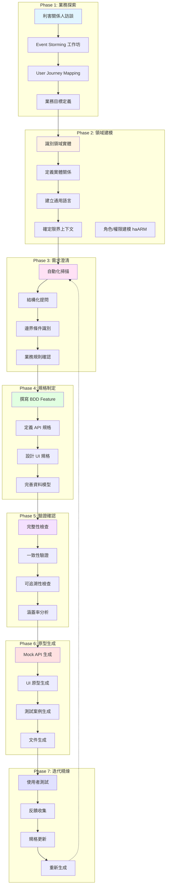

### 核心理念

本流程基於以下核心理念設計：

1. **規格即單一事實來源 (SSOT)**
   - 所有產出物（API、UI、測試）都從規格自動生成
   - 需求變更時只需更新規格，其他自動同步

2. **漸進式細化 (Progressive Refinement)**
   - 從高層次業務願景逐步細化到技術規格
   - 每個階段建立在前一階段的產出之上

3. **多方協作 (Collaborative Approach)**
   - 業務、設計、開發團隊使用共同語言
   - 透過工作坊與視覺化工具促進溝通

4. **自動化驅動 (Automation-Driven)**
   - 利用工具自動化重複性工作
   - 減少人為錯誤，提升一致性

5. **快速驗證 (Rapid Validation)**
   - 早期生成可互動原型
   - 盡早發現問題，降低修改成本

---

## 三層域架構

### 概念說明

本流程遵循 BDD (Behavior-Driven Development) 的三層域概念：

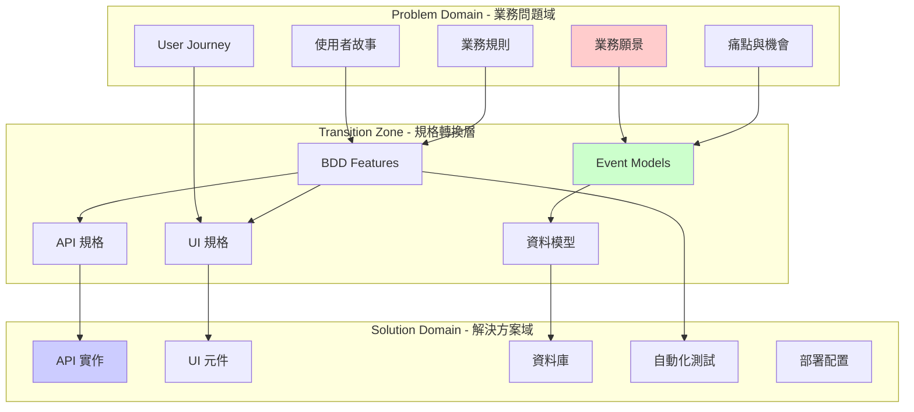

### 各域特徵

| 域 | 語言 | 工具 | 參與者 | 產出物 |
|----|------|------|--------|--------|
| **Problem Domain** | 自然語言、業務術語 | Journey Maps、Event Storming、訪談 | PO、BA、使用者、領域專家 | 需求文件、Journey Maps、Event Storming 輸出 |
| **Transition Zone** | Gherkin、DBML、TypeSpec、YAML | Cucumber、DBML 編輯器、TypeSpec | QA、BA、架構師 | BDD Features、API 規格、資料模型、UI 規格 |
| **Solution Domain** | 程式語言 (TypeScript、Python 等) | IDE、測試框架、CI/CD | 開發人員、QA、DevOps | 程式碼、測試、部署腳本 |

---

## 七階段詳細流程

### Phase 1: 業務探索 (Business Discovery)

#### 目標
深入理解業務背景、建立共同願景、識別關鍵利害關係人與使用者需求

#### 關鍵活動流程

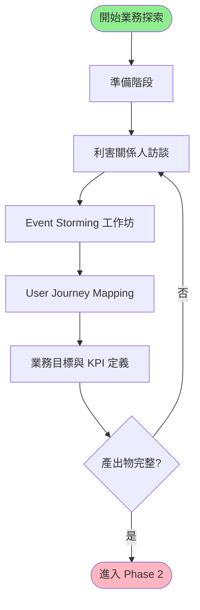

#### 輸入
- 業務需求文件 (RFI/RFP)
- 現有系統文件（如有）
- 使用者研究資料（如有）
- 競品分析（如有）

#### 產出物

| 產出物 | 格式 | 說明 |
|--------|------|------|
| 業務願景文件 | Markdown | 描述產品願景、目標、價值主張 |
| 利害關係人地圖 | RACI Matrix | 識別關鍵利害關係人與其角色 |
| User Journey Maps | 視覺化圖表 | 各個角色的完整使用者旅程 |
| Event Storming 輸出 | 照片/數位白板 | 領域事件、命令、聚合、策略 |
| 業務 KPI 定義 | 表格 | 關鍵績效指標與成功標準 |

#### 使用的技術

**1. 利害關係人訪談**
- **目的**：了解不同角色的期望與痛點
- **方法**：半結構化訪談
- **產出**：訪談記錄、痛點清單

**2. Event Storming**
- **目的**：快速探索業務流程與領域知識
- **參與者**：領域專家、開發者、設計師、PO
- **步驟**：
  1. 混亂探索：貼出所有領域事件（橘色便利貼）
  2. 時間線排序：按時間順序排列事件
  3. 識別命令：誰觸發了這些事件？（藍色便利貼）
  4. 識別角色：哪些角色參與？（黃色便利貼）
  5. 識別聚合：哪些業務概念處理命令並產生事件？（黃色大便利貼）
  6. 識別策略：有哪些自動化規則？（紫色便利貼）
  7. 劃分限界上下文：識別系統邊界

**3. User Journey Mapping**
- **目的**：理解使用者的端到端體驗與情感變化
- **元素**：
  - Persona：使用者角色
  - Stages：旅程階段
  - Actions：使用者行動
  - Touchpoints：接觸點
  - Thoughts：使用者想法
  - Emotions：情感狀態（-5 到 +5）
  - Pain Points：痛點
  - Opportunities：改善機會

**4. 業務目標定義**
- **框架**：SMART 目標（Specific、Measurable、Achievable、Relevant、Time-bound）
- **產出**：業務目標清單、KPI 定義

---

### Phase 2: 領域建模 (Domain Modeling)

#### 目標
從 Event Storming 和訪談中萃取領域知識，建立正式的領域模型

#### 關鍵活動流程

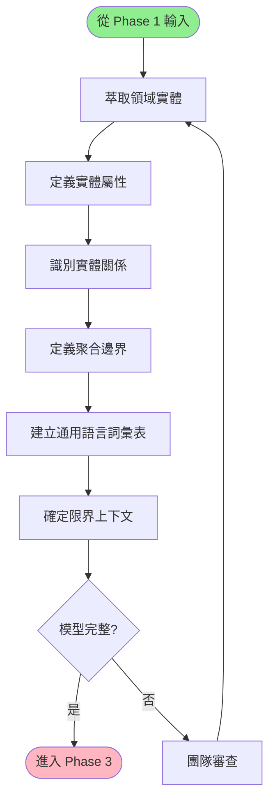

#### 輸入
- Event Storming 輸出（事件、聚合、命令）
- User Journey Maps
- 訪談記錄
- 現有系統文件

#### 產出物

| 產出物 | 格式 | 說明 |
|--------|------|------|
| 領域實體模型 | DBML | 實體、屬性、關係定義 |
| 通用語言詞彙表 | Markdown | 領域術語統一定義 |
| 聚合設計文件 | Markdown | 聚合邊界、不變條件 |
| 限界上下文圖 | Mermaid | 系統邊界與上下文劃分 |
| 角色/權限/存取控制模型 | haARM (`.haarm.yaml`) | 角色、資源、權限、存取控制規則（橫切面規格） |

#### 領域建模步驟

**1. 從 Event Storming 萃取實體**

```
Event Storming 元素 → 領域模型元素

領域事件 (橘色) → 實體狀態變化
命令 (藍色) → 實體方法/操作
聚合 (黃色大) → 領域實體 (Entity/Aggregate)
讀取模型 (綠色) → 查詢需求
策略 (紫色) → 業務規則
相關角色 → haARM actors（提取、去重、分類 type）
命令 → haARM permissions 的 action 候選
```

**範例轉換**：

```
Event: "訂單已建立"
  → 實體: Order
  → 狀態: created

Command: "建立訂單"
  → 操作: createOrder()

Aggregate: "訂單"
  → Entity: Order
  → 屬性: orderId, customerId, items[], total, status
  → 不變條件: total = sum(items.price * items.quantity)
```

**2. 定義實體屬性**

使用 DBML 語法定義：

```dbml
Table Order {
  order_id varchar(36) [pk, note: '訂單唯一識別碼']
  customer_id varchar(36) [not null, note: '客戶識別碼']
  total decimal(10,2) [not null, note: '訂單總金額，必須 >= 0']
  status varchar(20) [not null, note: '訂單狀態: pending/confirmed/shipped/delivered/cancelled']
  created_at timestamp [not null, default: `now()`]
  updated_at timestamp [not null, default: `now()`]

  Note: '''
  訂單聚合根
  不變條件:
  - total = sum(OrderItem.subtotal)
  - status 轉換必須遵循狀態機規則
  '''
}
```

**3. 識別實體關係**

```dbml
Ref: Order.customer_id > Customer.customer_id [note: '一個客戶可以有多個訂單']
Ref: OrderItem.order_id > Order.order_id [note: '一個訂單包含多個訂單項目']
Ref: OrderItem.product_id > Product.product_id [note: '訂單項目引用產品']
```

**4. 建立通用語言詞彙表**

| 術語 | 定義 | 別名 | 範例 |
|------|------|------|------|
| 訂單 (Order) | 客戶購買商品的正式記錄，包含購買的商品、數量、金額及狀態 | 訂購單 | ORD-2024-001 |
| 購物車 (Cart) | 客戶暫存待購買商品的容器，尚未正式下單 | 購物籃 | - |
| 商品 (Product) | 可供銷售的實體或虛擬物品 | 產品、貨品 | iPhone 15 Pro |
| 庫存 (Inventory) | 商品的可銷售數量 | 存貨 | 100 件 |

**5. 確定限界上下文**

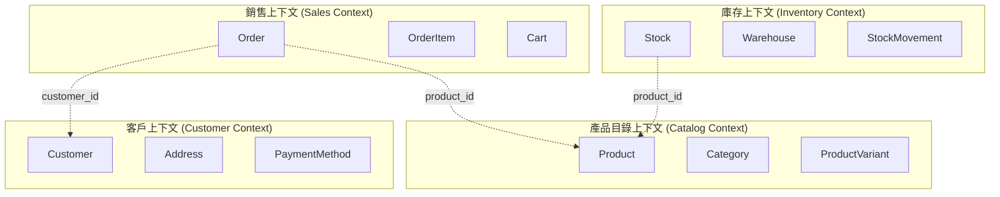

---

### Phase 3: 需求澄清 (Requirements Clarification)

#### 目標
系統化識別規格中的模糊點、缺失與歧義，透過結構化提問獲得明確答案

#### 關鍵活動流程

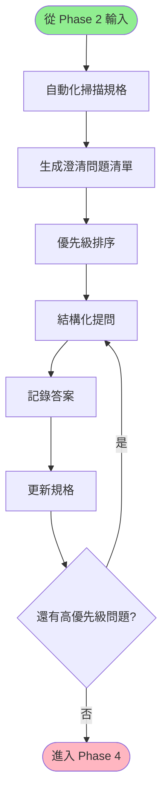

#### 輸入
- 領域實體模型 (DBML)
- 初步 Feature 草稿（如有）
- 業務規則清單

#### 產出物

| 產出物 | 格式 | 說明 |
|--------|------|------|
| 澄清問題清單 | Markdown (結構化) | `.clarify/` 目錄下的問題檔案 |
| 澄清答案記錄 | Markdown | `.clarify/resolved/` 目錄 |
| 更新後的實體模型 | DBML | 加入澄清後的約束條件 |
| 業務規則文件 | Markdown | 明確的業務規則清單 |

#### 澄清掃描檢查清單

參考 `SDD.tw/prompts/discovery.md`，系統化掃描以下面向：

**A. 資料模型檢查**

```
A1. 實體完整性
- [ ] 所有核心業務概念是否都已建模？
- [ ] 實體命名是否清晰且無歧義？
- [ ] 是否存在隱含但未明確定義的實體？

A2. 屬性定義
- [ ] 每個屬性是否都有明確的資料型別？
- [ ] 每個屬性是否都有充足的定義說明？
- [ ] 屬性命名是否清晰且無歧義？

A3. 屬性值邊界條件
- [ ] 數值屬性的範圍限制是否明確（>=、<=、=、≠）？
- [ ] 最小值/最大值是否已定義？
- [ ] 邊界情況是否已釐清（剛好達標 vs. 差一點沒達標）？
- [ ] 特殊值處理是否已定義（空值、零、負值）？

A4. 跨屬性不變條件
- [ ] 屬性間的計算關係是否明確（例如：總額 = 單價 × 數量）？
- [ ] 衍生屬性的定義公式是否清楚？
- [ ] 是否存在必須同時滿足的多屬性約束？

A5. 關係與唯一性
- [ ] 實體間的關聯關係是否完整（一對一、一對多、多對多）？
- [ ] 主鍵與唯一性規則是否明確？
- [ ] 外鍵關聯是否正確定義？

A6. 生命週期與狀態
- [ ] 具有狀態的實體是否定義了所有可能狀態？
- [ ] 狀態轉換規則是否完整（哪些轉換合法、哪些不合法）？
- [ ] 初始狀態與終止狀態是否明確？
```

**B. 功能模型檢查**

```
B1. 功能識別
- [ ] 所有使用者與系統的交互點是否都已識別為功能？
- [ ] 功能定義是否真的存在交互時機（而非只是規則）？
- [ ] 功能命名是否清晰且反映使用者意圖？
- [ ] 功能間的界線是否清楚（無重疊或遺漏）？

B2. 規則完整性
- [ ] 每個功能是否至少有一條規則？
- [ ] 規則是否已原子化（每一個 Rule 只驗證一件事）？
- [ ] 每個前置條件是否為一條獨立的 Rule？
- [ ] 每個後置條件是否為一條獨立的 Rule？
- [ ] 規則描述是否可驗證（非模糊的形容詞）？

B3. 例子覆蓋度
- [ ] 每條規則是否至少有一個 Example？
- [ ] Example 是否使用正確的 Gherkin 語法（Given-When-Then）？
- [ ] 缺少 Example 的規則是否已標記 #TODO？

B4. 邊界條件覆蓋
- [ ] 數值邊界：是否涵蓋臨界值案例（剛好達標、差一點、超過）？
- [ ] 組合邊界：多條規則並存時的交集與衝突是否已處理？
- [ ] 類別邊界：不同值域的資料分類是否都有對應 Example？
- [ ] 時間邊界：時序相關的操作是否考慮了不同時間點的情況？
- [ ] 狀態邊界：狀態切換的邊界情況是否已涵蓋？

B5. 錯誤與異常處理
- [ ] 前置條件失敗時的行為是否明確？
- [ ] 異常情況是否都有對應的規則與 Example？
- [ ] 錯誤訊息或回饋是否已定義？
```

#### 澄清問題範例

**資料模型澄清問題**：

檔案：`.clarify/data/Order_訂單金額是否允許為零.md`

```markdown
# 澄清問題

訂單金額是否允許為零？

# 定位

ERM: Order.total 屬性

# 多選題

| 選項 | 描述 |
|------|------|
| A | 允許為零（例如全額折扣訂單） |
| B | 不允許為零，最小值為 0.01 |
| C | 視訂單類型而定（某些類型允許） |
| Short | 提供其他答案（<=5 字） |

# 影響範圍

- Order 實體的 total 屬性約束
- 建立訂單的前置條件驗證
- 訂單列表的篩選邏輯
- 付款流程（零元訂單可能跳過付款）

# 優先級

High
- 阻礙核心訂單建立功能的規格定義
- 影響資料庫約束與 API 驗證邏輯
```

**功能模型澄清問題**：

檔案：`.clarify/features/建立訂單_庫存不足時的處理方式.md`

```markdown
# 澄清問題

當商品庫存不足時，建立訂單功能應如何處理？

# 定位

Feature: 建立訂單
Rule: 訂單商品數量不可超過庫存

# 多選題

| 選項 | 描述 |
|------|------|
| A | 完全拒絕訂單建立，顯示錯誤訊息 |
| B | 允許建立訂單，但標記為「待補貨」狀態 |
| C | 部分建立：庫存足夠的商品成立訂單，不足的移除 |
| D | 允許超賣，後續通知客戶延遲出貨 |
| Short | 提供其他答案（<=5 字） |

# 影響範圍

- 建立訂單 Feature 的 Rule 與 Example
- 庫存檢查邏輯
- 錯誤處理與使用者提示
- 訂單狀態定義
- 通知機制

# 優先級

High
- 影響核心購買流程的使用者體驗
- 涉及庫存管理與訂單狀態設計
```

---

### Phase 4: 規格制定 (Specification Formulation)

#### 目標
將澄清後的需求轉換為正式的、可執行的規格文件

#### 關鍵活動流程

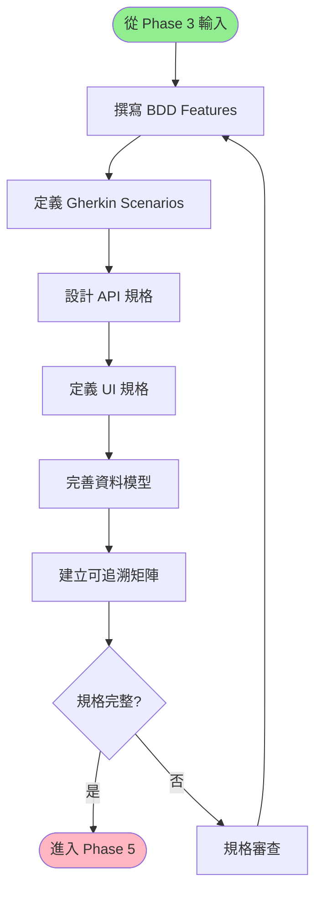

#### 輸入
- 更新後的領域實體模型 (DBML)
- 澄清答案記錄
- User Journey Maps
- Event Storming 輸出

#### 產出物

| 產出物 | 格式 | 說明 | 路徑 |
|--------|------|------|------|
| BDD Feature 文件 | Gherkin | 功能場景與規則 | `spec/features/*.feature` |
| API 規格 | TypeSpec/OpenAPI | RESTful API 定義 | `spec/api.tsp` |
| UI 頁面規格 | YAML (DSL) | 頁面結構與互動 | `spec/pages/*.yaml` |
| 資料模型規格 | DBML | 完整的實體關係模型 | `spec/erm.dbml` |
| 可追溯矩陣 | Markdown | 需求與規格的對應 | `spec/traceability.md` |

#### 規格制定步驟

**1. 撰寫 BDD Feature 文件**

從 Event Storming 和 User Journey 中識別功能 (Feature)：

```gherkin
# spec/features/order-creation.feature

Feature: 建立訂單
  作為一個已登入的客戶
  我想要建立新訂單
  以便購買我加入購物車的商品

  Background:
    Given 系統中存在以下商品:
      | product_id | name        | price | stock |
      | PROD-001   | iPhone 15   | 30000 | 10    |
      | PROD-002   | AirPods Pro | 7990  | 50    |
    And 客戶 "john@example.com" 已登入系統

  Rule: 訂單必須至少包含一件商品

    Example: 成功建立包含單一商品的訂單
      Given 客戶的購物車包含:
        | product_id | quantity |
        | PROD-001   | 1        |
      When 客戶提交訂單
      Then 應該成功建立訂單
      And 訂單狀態應為 "pending"
      And 訂單總金額應為 30000
      And 商品 "PROD-001" 的庫存應減少為 9

    Example: 嘗試建立空訂單應失敗
      Given 客戶的購物車是空的
      When 客戶提交訂單
      Then 應該顯示錯誤訊息 "訂單必須至少包含一件商品"
      And 不應建立任何訂單

  Rule: 訂單商品數量不可超過庫存

    Example: 嘗試訂購超過庫存的數量應失敗
      Given 客戶的購物車包含:
        | product_id | quantity |
        | PROD-001   | 20       |
      When 客戶提交訂單
      Then 應該顯示錯誤訊息 "商品 iPhone 15 庫存不足（可用：10，需求：20）"
      And 不應建立訂單
      And 商品 "PROD-001" 的庫存應保持為 10

    Example: 剛好等於庫存數量應成功
      Given 客戶的購物車包含:
        | product_id | quantity |
        | PROD-001   | 10       |
      When 客戶提交訂單
      Then 應該成功建立訂單
      And 商品 "PROD-001" 的庫存應減少為 0

  Rule: 訂單總金額必須正確計算

    Example: 多件商品的訂單總金額計算
      Given 客戶的購物車包含:
        | product_id | quantity |
        | PROD-001   | 2        |
        | PROD-002   | 1        |
      When 客戶提交訂單
      Then 訂單總金額應為 67990
      And 訂單明細應包含:
        | product_id | quantity | subtotal |
        | PROD-001   | 2        | 60000    |
        | PROD-002   | 1        | 7990     |
```

**2. 定義 API 規格 (TypeSpec)**

```typespec
// spec/api.tsp
import "@typespec/http";
import "@typespec/rest";

@service({
  title: "電商訂單 API",
})
namespace ECommerceOrderAPI;

using TypeSpec.Http;
using TypeSpec.Rest;

/** 訂單狀態列舉 */
enum OrderStatus {
  /** 待處理 */
  pending,
  /** 已確認 */
  confirmed,
  /** 已出貨 */
  shipped,
  /** 已送達 */
  delivered,
  /** 已取消 */
  cancelled,
}

/** 訂單模型 */
model Order {
  /** 訂單唯一識別碼 */
  @key
  orderId: string;

  /** 客戶識別碼 */
  customerId: string;

  /** 訂單項目 */
  items: OrderItem[];

  /** 訂單總金額（元） */
  @minValue(0)
  total: decimal;

  /** 訂單狀態 */
  status: OrderStatus;

  /** 建立時間 */
  createdAt: utcDateTime;

  /** 更新時間 */
  updatedAt: utcDateTime;
}

/** 訂單項目模型 */
model OrderItem {
  /** 商品識別碼 */
  productId: string;

  /** 商品名稱 */
  productName: string;

  /** 數量 */
  @minValue(1)
  quantity: int32;

  /** 單價（元） */
  @minValue(0)
  price: decimal;

  /** 小計（元） */
  @minValue(0)
  subtotal: decimal;
}

/** 建立訂單請求 */
model CreateOrderRequest {
  /** 訂單項目 */
  @minItems(1)
  items: {
    productId: string;
    quantity: int32;
  }[];
}

/** 建立訂單回應 */
model CreateOrderResponse {
  /** 訂單資訊 */
  order: Order;
}

/** 錯誤回應 */
@error
model ErrorResponse {
  /** 錯誤代碼 */
  code: string;

  /** 錯誤訊息 */
  message: string;

  /** 詳細資訊 */
  details?: string[];
}

@route("/orders")
interface OrdersService {
  /** 建立新訂單 */
  @post
  createOrder(@body request: CreateOrderRequest):
    | CreateOrderResponse
    | {@statusCode: 400, @body error: ErrorResponse}
    | {@statusCode: 409, @body error: ErrorResponse};

  /** 查詢訂單 */
  @get
  getOrder(@path orderId: string):
    | Order
    | {@statusCode: 404, @body error: ErrorResponse};

  /** 列出訂單 */
  @get
  listOrders(
    @query customerId?: string,
    @query status?: OrderStatus,
    @query page?: int32,
    @query pageSize?: int32,
  ): {
    /** 訂單列表 */
    orders: Order[];
    /** 總數量 */
    total: int32;
    /** 當前頁碼 */
    page: int32;
    /** 每頁大小 */
    pageSize: int32;
  };

  /** 更新訂單狀態 */
  @patch
  updateOrderStatus(
    @path orderId: string,
    @body request: {status: OrderStatus},
  ):
    | Order
    | {@statusCode: 404, @body error: ErrorResponse}
    | {@statusCode: 400, @body error: ErrorResponse};

  /** 取消訂單 */
  @delete
  cancelOrder(@path orderId: string):
    | {@statusCode: 204}
    | {@statusCode: 404, @body error: ErrorResponse}
    | {@statusCode: 409, @body error: ErrorResponse};
}
```

**3. 定義 UI 頁面規格 (YAML DSL)**

```yaml
# spec/pages/order-creation.yaml
page:
  id: order-creation
  name: 建立訂單頁面
  type: form
  route: /orders/new

  auth:
    required: true
    roles: [customer]

  datasource:
    cart:
      source: api
      endpoint: GET /cart
      type: Cart
    products:
      source: api
      endpoint: GET /products
      type: Product[]

  layout:
    type: two-column
    sections:
      - id: cart-items
        title: 購物車商品
        position: left
        width: 8
        components:
          - type: DataTable
            dataBinding: cart.items
            columns:
              - field: productName
                header: 商品名稱
                sortable: false
              - field: price
                header: 單價
                type: currency
                sortable: false
              - field: quantity
                header: 數量
                type: number
                editable: true
                validation:
                  - rule: required
                  - rule: min
                    value: 1
                  - rule: max
                    binding: product.stock
              - field: subtotal
                header: 小計
                type: currency
                computed: true
                expression: price * quantity

      - id: order-summary
        title: 訂單摘要
        position: right
        width: 4
        components:
          - type: Summary
            fields:
              - label: 商品總數
                value:
                  type: computed
                  expression: sum(cart.items.quantity)
              - label: 訂單金額
                value:
                  type: computed
                  expression: sum(cart.items.subtotal)
                format: currency

  actions:
    primary:
      - id: submit-order
        label: 提交訂單
        type: button
        variant: primary
        conditions:
          - expression: cart.items.length > 0
            errorMessage: 購物車不可為空
        effects:
          - type: validate
            target: all-fields
            onSuccess:
              - type: api-call
                target: POST /orders
                payload:
                  items:
                    source: cart.items
                    map:
                      productId: productId
                      quantity: quantity
                onSuccess:
                  - type: show-notification
                    message: 訂單建立成功
                    variant: success
                  - type: navigate
                    target: /orders/{order.orderId}
                onError:
                  - type: show-notification
                    message: ${error.message}
                    variant: error
            onError:
              - type: show-notification
                message: 請檢查輸入欄位
                variant: warning

    secondary:
      - id: back-to-cart
        label: 返回購物車
        type: link
        target: /cart

  validation:
    - field: cart.items[].quantity
      rule: range
      min: 1
      message: 數量必須至少為 1

    - rule: custom
      expression: cart.items.every(item => item.quantity <= item.product.stock)
      message: 商品數量不可超過庫存

  hooks:
    onMount:
      - type: api-call
        target: GET /cart
        onSuccess:
          - type: update-store
            path: cart
            value: ${response.data}

    beforeSubmit:
      - type: confirm
        message: 確定要建立此訂單嗎？
```

**4. 完善資料模型規格 (DBML)**

```dbml
// spec/erm.dbml

Table Customer {
  customer_id varchar(36) [pk, note: '客戶唯一識別碼 (UUID)']
  email varchar(255) [unique, not null, note: '電子郵件，用於登入']
  name varchar(100) [not null, note: '客戶姓名']
  phone varchar(20) [note: '聯絡電話']
  created_at timestamp [not null, default: `now()`]
  updated_at timestamp [not null, default: `now()`]

  Note: '客戶基本資料'
}

Table Product {
  product_id varchar(36) [pk, note: '商品唯一識別碼']
  name varchar(200) [not null, note: '商品名稱']
  description text [note: '商品描述']
  price decimal(10,2) [not null, note: '售價（元），必須 >= 0']
  stock int [not null, default: 0, note: '庫存數量，必須 >= 0']
  status varchar(20) [not null, default: 'active', note: '商品狀態: active/inactive/discontinued']
  created_at timestamp [not null, default: `now()`]
  updated_at timestamp [not null, default: `now()`]

  Indexes {
    status
    (name, status)
  }

  Note: '''
  商品主檔
  約束條件:
  - price >= 0
  - stock >= 0
  - status in ('active', 'inactive', 'discontinued')
  '''
}

Table Order {
  order_id varchar(36) [pk, note: '訂單唯一識別碼']
  customer_id varchar(36) [not null, ref: > Customer.customer_id, note: '客戶識別碼']
  total decimal(10,2) [not null, note: '訂單總金額（元），必須 >= 0']
  status varchar(20) [not null, default: 'pending', note: '訂單狀態']
  created_at timestamp [not null, default: `now()`]
  updated_at timestamp [not null, default: `now()`]

  Indexes {
    customer_id
    status
    created_at
    (customer_id, status)
  }

  Note: '''
  訂單主檔 (聚合根)

  狀態轉換規則:
  pending -> confirmed -> shipped -> delivered
  pending -> cancelled
  confirmed -> cancelled

  不變條件:
  - total = sum(OrderItem.subtotal)
  - total >= 0
  - 至少包含一個 OrderItem
  - status in ('pending', 'confirmed', 'shipped', 'delivered', 'cancelled')
  '''
}

Table OrderItem {
  order_item_id varchar(36) [pk, note: '訂單項目唯一識別碼']
  order_id varchar(36) [not null, ref: > Order.order_id, note: '所屬訂單']
  product_id varchar(36) [not null, ref: > Product.product_id, note: '商品識別碼']
  product_name varchar(200) [not null, note: '商品名稱（快照）']
  quantity int [not null, note: '訂購數量，必須 >= 1']
  price decimal(10,2) [not null, note: '商品單價（快照），必須 >= 0']
  subtotal decimal(10,2) [not null, note: '小計金額，必須 >= 0']

  Indexes {
    order_id
    product_id
  }

  Note: '''
  訂單項目明細

  不變條件:
  - subtotal = price * quantity
  - quantity >= 1
  - price >= 0
  - subtotal >= 0

  說明:
  - product_name 和 price 是商品的快照，避免商品主檔更新影響歷史訂單
  '''
}

Table Cart {
  cart_id varchar(36) [pk, note: '購物車唯一識別碼']
  customer_id varchar(36) [unique, not null, ref: > Customer.customer_id, note: '客戶識別碼（一個客戶一個購物車）']
  created_at timestamp [not null, default: `now()`]
  updated_at timestamp [not null, default: `now()`]

  Note: '購物車主檔'
}

Table CartItem {
  cart_item_id varchar(36) [pk, note: '購物車項目唯一識別碼']
  cart_id varchar(36) [not null, ref: > Cart.cart_id, note: '所屬購物車']
  product_id varchar(36) [not null, ref: > Product.product_id, note: '商品識別碼']
  quantity int [not null, note: '數量，必須 >= 1']
  added_at timestamp [not null, default: `now()`]

  Indexes {
    cart_id
    product_id
    (cart_id, product_id) [unique]
  }

  Note: '''
  購物車項目

  約束條件:
  - quantity >= 1
  - 同一購物車中，每個商品只能有一筆記錄（透過 unique index 保證）
  '''
}
```

**5. 建立可追溯矩陣**

```markdown
# spec/traceability.md

# 需求可追溯矩陣

## User Journey → Features

| Journey Stage | Pain Point | Feature | Priority |
|---------------|------------|---------|----------|
| 瀏覽商品 | 找不到想要的商品 | 商品搜尋與篩選 | High |
| 加入購物車 | 不知道庫存是否足夠 | 即時庫存顯示 | High |
| 建立訂單 | 擔心超賣 | 庫存檢查與扣減 | High |
| 付款 | 安全疑慮 | 安全付款機制 | High |
| 追蹤訂單 | 不知道訂單狀態 | 訂單狀態追蹤 | Medium |

## Event Storming → Entities

| Domain Event | Command | Aggregate | Entity | DBML Table |
|--------------|---------|-----------|--------|------------|
| 訂單已建立 | 建立訂單 | 訂單 | Order | Order |
| 訂單項目已加入 | 加入訂單項目 | 訂單 | OrderItem | OrderItem |
| 庫存已扣減 | 扣減庫存 | 商品 | Product | Product |
| 購物車已更新 | 更新購物車 | 購物車 | Cart | Cart |

## Features → API Endpoints

| Feature | Rule | API Endpoint | HTTP Method | TypeSpec Interface |
|---------|------|--------------|-------------|-------------------|
| 建立訂單 | 訂單必須至少包含一件商品 | /orders | POST | OrdersService.createOrder |
| 建立訂單 | 訂單商品數量不可超過庫存 | /orders | POST | OrdersService.createOrder |
| 查詢訂單 | 只能查詢自己的訂單 | /orders/{id} | GET | OrdersService.getOrder |
| 列出訂單 | 支援依狀態篩選 | /orders | GET | OrdersService.listOrders |
| 取消訂單 | 只能取消未出貨的訂單 | /orders/{id} | DELETE | OrdersService.cancelOrder |

## Features → UI Pages

| Feature | Rule | Page | Route | YAML File |
|---------|------|------|-------|-----------|
| 建立訂單 | 顯示購物車商品 | 建立訂單頁面 | /orders/new | order-creation.yaml |
| 建立訂單 | 計算訂單總金額 | 建立訂單頁面 | /orders/new | order-creation.yaml |
| 查詢訂單 | 顯示訂單詳情 | 訂單詳情頁面 | /orders/{id} | order-detail.yaml |
| 列出訂單 | 訂單列表 | 我的訂單頁面 | /orders | order-list.yaml |

## BDD Examples → Test Cases

| Feature | Example | Test Type | Tool |
|---------|---------|-----------|------|
| 建立訂單 | 成功建立包含單一商品的訂單 | E2E | Playwright |
| 建立訂單 | 嘗試建立空訂單應失敗 | E2E | Playwright |
| 建立訂單 | 嘗試訂購超過庫存的數量應失敗 | E2E | Playwright |
| 建立訂單 | 剛好等於庫存數量應成功 | E2E | Playwright |
```

---

### Phase 5: 驗證確認 (Validation & Verification)

#### 目標
確保規格完整性、一致性、正確性與可執行性

#### 關鍵活動流程

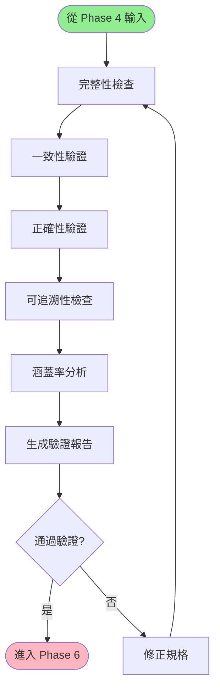

#### 驗證檢查清單

**完整性檢查**

```
1. BDD Features
- [ ] 每個 Feature 都有明確的業務價值描述
- [ ] 每個 Feature 至少有一個 Rule
- [ ] 每個 Rule 至少有一個 Example
- [ ] 所有 Example 都使用 Given-When-Then 結構

2. API 規格
- [ ] 所有 API 端點都有定義
- [ ] 所有請求/回應模型都已定義
- [ ] 所有錯誤情況都有對應的錯誤回應
- [ ] 所有驗證規則都已定義

3. 資料模型
- [ ] 所有實體都已定義
- [ ] 所有屬性都有型別與約束
- [ ] 所有關係都已建立
- [ ] 所有不變條件都已記錄

4. UI 規格
- [ ] 所有頁面都有對應的 YAML 檔案
- [ ] 所有互動都有定義的 actions
- [ ] 所有資料綁定都已定義
- [ ] 所有驗證規則都已定義

5. haARM 角色/權限模型
- [ ] 所有角色都有對應的 haARM role 定義
- [ ] 所有受保護資源都有 haARM resource 和 permission 定義
- [ ] haPDL auth.roles[] 中所有角色都在 haARM 中定義
- [ ] haAPI @useAuth() 中所有權限都在 haARM 中定義
- [ ] BDD Background 的 role 欄位都對應 haARM role.id
- [ ] 無孤兒權限、無缺防護端點
```

**一致性驗證**

```
1. 術語一致性
- [ ] 相同概念在所有規格中使用相同術語
- [ ] 通用語言詞彙表涵蓋所有核心概念
- [ ] 無同義詞混用情況

2. 資料一致性
- [ ] BDD Example 中的資料符合 DBML 約束
- [ ] API 規格的欄位與 DBML 實體對應
- [ ] UI 規格的欄位與 API 規格對應

3. 行為一致性
- [ ] API 端點的行為與 BDD Feature 一致
- [ ] UI 頁面的行為與 BDD Example 一致
- [ ] 錯誤處理在各層級保持一致
```

**可追溯性檢查**

```
- [ ] 每個 User Journey Pain Point 都有對應的 Feature
- [ ] 每個 Event Storming 聚合都有對應的 DBML 實體
- [ ] 每個 BDD Rule 都有對應的 API 驗證邏輯
- [ ] 每個 BDD Example 都有對應的測試案例
```

**涵蓋率分析**

```
1. 業務需求涵蓋率
- 已涵蓋的 User Journey Stages: X / Y (Z%)
- 已處理的 Pain Points: X / Y (Z%)
- 已實現的 Event Storming 功能: X / Y (Z%)

2. 規則涵蓋率
- 有 Example 的 Rules: X / Y (Z%)
- 涵蓋邊界條件的 Examples: X / Y (Z%)
- 涵蓋錯誤處理的 Examples: X / Y (Z%)

3. API 涵蓋率
- 定義的 API 端點數: X
- 涵蓋的 CRUD 操作: X / Y (Z%)
- 定義的錯誤回應: X / Y (Z%)

4. UI 涵蓋率
- 定義的頁面數: X
- 涵蓋的互動類型: X / Y (Z%)
- 定義的驗證規則: X / Y (Z%)
```

---

### Phase 6: 原型生成 (Prototype Generation)

#### 目標
從規格自動生成可互動的原型、Mock API 與測試案例

#### 關鍵活動流程

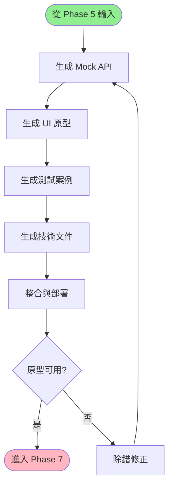

#### 生成產出物

| 產出物 | 工具/技術 | 說明 |
|--------|----------|------|
| Mock API Server | Express.js + Faker.js | 基於 TypeSpec 生成的 API Mock |
| UI 原型 | React/Vue + Ant Design | 基於 YAML DSL 生成的互動介面 |
| E2E 測試 | Playwright + Cucumber | 基於 BDD Examples 生成的測試 |
| API 文件 | TypeSpec → OpenAPI → Redoc | 互動式 API 文件 |
| 資料庫 Schema | DBML → SQL | 資料庫建表語句 |

---

### Phase 7: 迭代精煉 (Iterative Refinement)

#### 目標
收集使用者與利害關係人的反饋，持續改進規格與原型

#### 關鍵活動流程

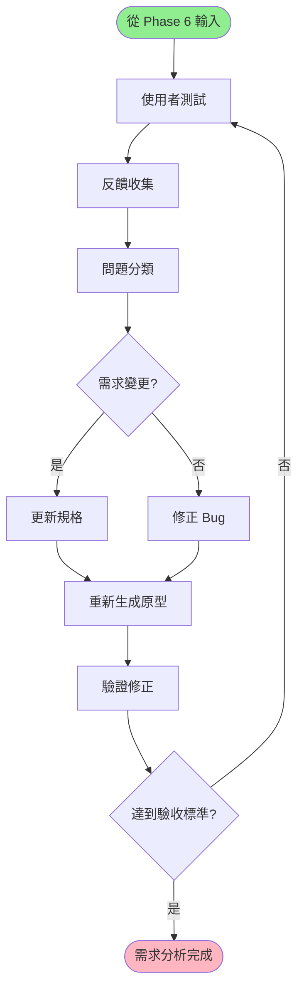

#### 反饋處理流程

**問題分類**

```
1. 需求層面
- 缺失的功能
- 不符合預期的行為
- 需要調整的業務規則

2. 規格層面
- BDD Example 不完整
- API 規格遺漏欄位
- 資料模型缺少約束

3. 原型層面
- UI 互動問題
- 效能問題
- 相容性問題
```

**修正策略**

```
需求變更 →更新 Problem Domain (Journey/Event Storming)
         → 重新執行 Phase 3 (澄清)
         → 更新規格
         → 重新生成原型

規格問題 → 直接修正規格
         → 重新生成原型

原型問題 → 調整生成器設定
         → 重新生成
```

---

## 資料流與轉換

### 完整資料流圖

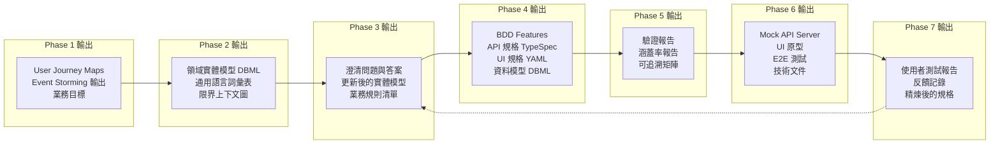

### 關鍵轉換點

| 轉換 | 輸入 | 輸出 | 轉換方法 |
|------|------|------|----------|
| Journey → Features | User Journey Stages | BDD Features | 每個關鍵階段轉為一個 Feature |
| Event → Entities | Domain Events | DBML Entities | 事件涉及的聚合轉為實體 |
| Features → API | BDD Rules | TypeSpec Endpoints | 規則轉為 API 驗證邏輯 |
| Features → UI | BDD Examples | YAML Pages | 場景轉為頁面互動 |
| TypeSpec → Mock API | API 規格 | Express.js Server | 自動生成 Mock 端點 |
| YAML → UI Prototype | UI 規格 | React/Vue 元件 | 自動生成互動介面 |
| BDD → E2E Tests | Gherkin Examples | Playwright 測試 | 自動生成測試腳本 |

---

## 角色與職責

### RACI 矩陣

| 活動 | PO | BA | UX | QA | Dev | Arch |
|------|----|----|----|----|-----|------|
| **Phase 1: 業務探索** |
| 利害關係人訪談 | A | R | C | I | I | C |
| Event Storming | A | R | C | C | R | R |
| User Journey Mapping | A | C | R | I | I | C |
| 業務目標定義 | R/A | C | C | I | I | I |
| **Phase 2: 領域建模** |
| 識別領域實體 | C | R | I | I | C | A |
| 定義實體關係 | C | R | I | I | R | A |
| 建立通用語言 | A | R | C | C | C | C |
| 確定限界上下文 | C | C | I | I | R | R/A |
| 角色/權限建模 (haARM) | A | R | I | I | C | C |
| **Phase 3: 需求澄清** |
| 自動化掃描 | I | R | I | R | C | C |
| 結構化提問 | A | R | I | C | I | C |
| 邊界條件識別 | C | R | I | R | C | C |
| 業務規則確認 | A | R | I | C | I | C |
| **Phase 4: 規格制定** |
| 撰寫 BDD Features | C | R | I | R | C | C |
| 定義 API 規格 | C | C | I | C | R | A |
| 設計 UI 規格 | C | C | R | C | C | C |
| 完善資料模型 | I | C | I | I | R | A |
| **Phase 5: 驗證確認** |
| 完整性檢查 | I | C | I | R | C | C |
| 一致性驗證 | I | C | I | R | C | R |
| 可追溯性檢查 | C | R | I | C | I | C |
| 涵蓋率分析 | C | C | I | R | C | C |
| **Phase 6: 原型生成** |
| Mock API 生成 | I | I | I | C | R | C |
| UI 原型生成 | I | I | R | C | R | C |
| 測試案例生成 | I | I | I | R | C | C |
| 文件生成 | I | C | I | C | R | C |
| **Phase 7: 迭代精煉** |
| 使用者測試 | A | C | R | R | I | I |
| 反饋收集 | R | C | R | C | I | I |
| 規格更新 | A | R | C | C | C | C |
| 重新生成 | I | I | C | C | R | C |

**圖例**：
- R: Responsible (負責執行)
- A: Accountable (最終負責)
- C: Consulted (諮詢)
- I: Informed (知會)

---

## 品質閘門

### Phase 完成檢查點

每個 Phase 完成前必須通過以下檢查：

#### Phase 1 完成標準

```
✓ 至少完成 3 次利害關係人訪談
✓ 完成 Event Storming 工作坊（至少 4 小時）
✓ 建立至少 2 個主要角色的 User Journey Map
✓ 定義至少 3 個可衡量的業務 KPI
✓ 識別至少 10 個領域事件
✓ 產出業務願景文件並獲得利害關係人簽核
```

#### Phase 2 完成標準

```
✓ 識別至少 5 個核心領域實體
✓ 所有實體都有明確定義的屬性（至少 3 個）
✓ 建立至少 5 個實體關係
✓ 通用語言詞彙表包含至少 20 個術語
✓ 確定至少 1 個限界上下文
✓ DBML 模型無語法錯誤
```

#### Phase 3 完成標準

```
✓ 掃描完成所有檢查項（A1-A6, B1-B5, C1-C2, D1-D2）
✓ 識別至少 10 個澄清問題
✓ 所有 High 優先級問題都已回答
✓ 至少 80% 的 Medium 優先級問題都已回答
✓ 更新後的 DBML 模型反映所有澄清結果
✓ 業務規則清單包含至少 15 條規則
```

#### Phase 4 完成標準

```
✓ 撰寫至少 5 個 BDD Feature 文件
✓ 每個 Feature 至少有 2 個 Rule
✓ 每個 Rule 至少有 1 個 Example
✓ 定義至少 5 個 API 端點（CRUD 為主）
✓ 定義至少 3 個 UI 頁面規格
✓ 完成可追溯矩陣
✓ 所有規格文件無語法錯誤
```

#### Phase 5 完成標準

```
✓ 完整性檢查通過率 >= 90%
✓ 一致性驗證通過率 >= 95%
✓ 可追溯性檢查通過率 >= 90%
✓ BDD 規則涵蓋率 >= 80%（有 Example 的 Rules）
✓ API 涵蓋率 >= 80%（定義的端點 / 需要的端點）
✓ 生成驗證報告並獲得團隊簽核
```

#### Phase 6 完成標準

```
✓ Mock API Server 可正常啟動並回應請求
✓ UI 原型可正常運行並展示主要流程
✓ E2E 測試可正常執行（至少 80% 通過）
✓ API 文件可正常瀏覽
✓ 資料庫 Schema 可正常建立
✓ 完成原型演示並獲得利害關係人初步反饋
```

#### Phase 7 完成標準

```
✓ 完成至少 2 輪使用者測試
✓ 收集至少 10 條有效反饋
✓ 處理至少 80% 的 High 優先級反饋
✓ 更新規格並重新生成原型
✓ 使用者滿意度 >= 80%
✓ 達成業務驗收標準
```

---

## 總結

本需求發掘與分析流程整合了多種先進的需求工程方法論，提供了一個系統化、可追溯、自動化的完整解決方案。透過七個清晰定義的階段，團隊可以從業務願景逐步細化到可執行的規格，並最終生成可互動的原型進行驗證。

### 核心優勢

1. **規格即單一事實來源**：所有產出物從規格自動生成，確保一致性
2. **可追溯性**：從業務需求到技術實作的完整追溯鏈
3. **早期驗證**：透過原型快速驗證需求正確性
4. **自動化驅動**：減少手工作業，提升效率與品質
5. **協作友好**：提供多種視覺化工具促進跨團隊協作

### 下一步

請參閱以下文件以深入了解各個階段的詳細實踐：
- [02-階段詳解.md](02-階段詳解.md)
- [03-技術與工具.md](03-技術與工具.md)
- [04-最佳實踐.md](04-最佳實踐.md)
- [05-範例：電商系統.md](05-範例：電商系統.md)
