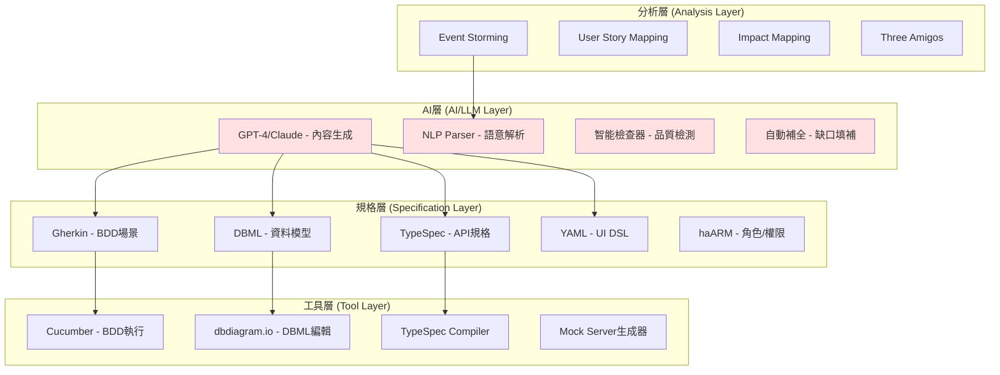
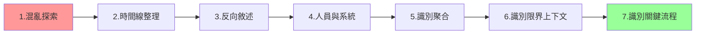
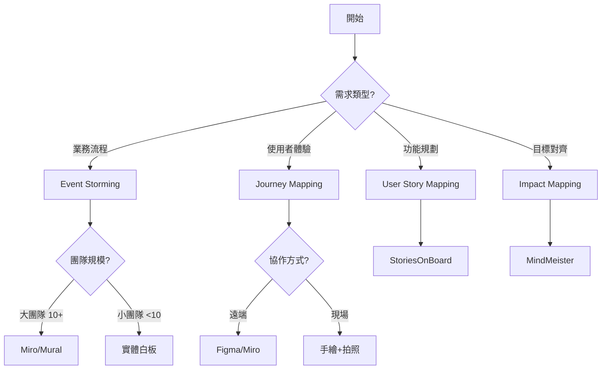
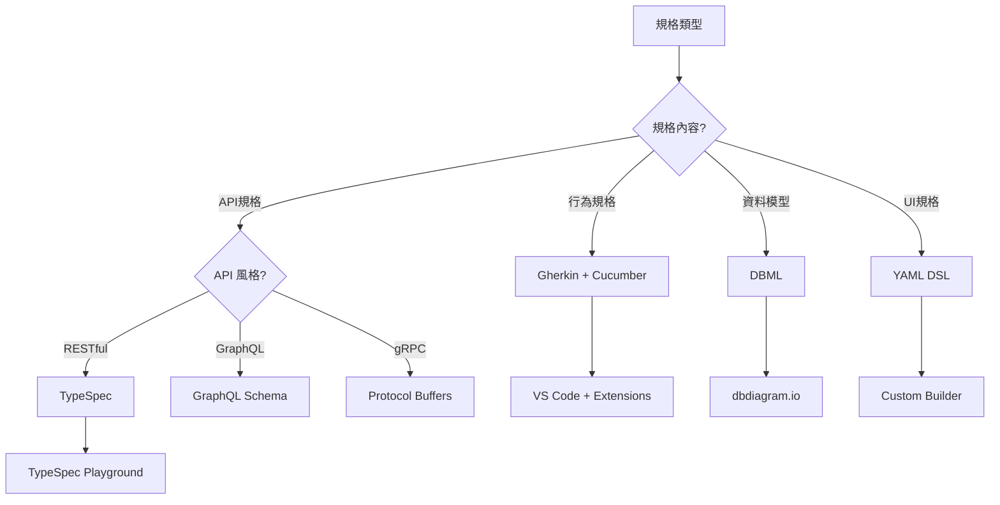
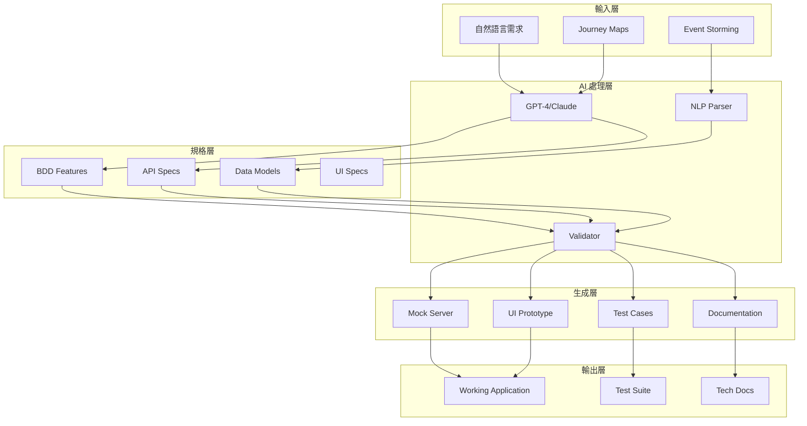

# 需求發掘與分析：技術與工具

> 本文件詳細介紹 WA-RAPTor 專案需求發掘與分析流程中使用的各項技術、工具與方法論，包含 AI 工具整合指南

## 📋 目錄
- [工具概覽地圖](#工具概覽地圖)
- [規格語言](#規格語言)
- [分析技術與方法論](#分析技術與方法論)
- [AI/LLM 工具整合](#aillm-工具整合)
- [自動化工具](#自動化工具)
- [開發與協作工具](#開發與協作工具)
- [工具選擇決策樹](#工具選擇決策樹)
- [工具整合架構](#工具整合架構)
- [實施指南](#實施指南)

---

## 工具概覽地圖

### 技術棧總覽



### 各階段工具使用矩陣

| 階段 | 主要技術 | 支援工具 | AI協助程度 |
|------|---------|---------|------------|
| Phase 1: 業務探索 | Event Storming, Journey Mapping | Miro, Figma | ★★★☆☆ |
| Phase 2: 領域建模 | DBML, UML | dbdiagram.io, PlantUML | ★★★★☆ |
| Phase 3: 需求澄清 | 結構化提問 | GPT-4, Claude | ★★★★★ |
| Phase 4: 規格制定 | Gherkin, TypeSpec | Cucumber, VS Code | ★★★★★ |
| Phase 5: 驗證確認 | 自動化檢查 | Custom Scripts, AI | ★★★★☆ |
| Phase 6: 原型生成 | Code Generation | Yeoman, Plop | ★★★★☆ |
| Phase 7: 迭代精煉 | 測試工具 | Playwright, Jest | ★★★☆☆ |

---

## 規格語言

### 1. Gherkin - BDD 場景描述語言

#### 概述
Gherkin 是一種結構化的自然語言，用於描述軟體行為而不涉及實作細節。

#### 核心語法結構

```gherkin
# language: zh-TW
Feature: 購物車管理
  作為一個線上購物者
  我希望能管理我的購物車
  以便我可以購買想要的商品

  Background:
    Given 系統中有以下商品：
      | 商品名稱 | 價格 | 庫存 |
      | iPhone 15 | 35000 | 10 |
      | AirPods | 5000 | 20 |

  Rule: 商品必須有庫存才能加入購物車

    Example: 成功加入有庫存的商品
      Given 我是登入的用戶 "alice@example.com"
      And 我的購物車是空的
      When 我將 1 個 "iPhone 15" 加入購物車
      Then 我的購物車應該包含 1 件商品
      And 購物車總金額應該是 35000 元

    Example: 無法加入無庫存的商品
      Given 商品 "iPhone 15" 的庫存是 0
      When 我嘗試將 "iPhone 15" 加入購物車
      Then 系統應該顯示錯誤 "商品暫時缺貨"
      And 購物車應該保持空的
```

#### AI 輔助撰寫

**提示詞範例**：
```
請根據以下業務需求生成 Gherkin 場景：

業務需求：
- 用戶可以使用優惠券獲得折扣
- 優惠券有最低消費門檻
- 優惠券有有效期限
- 每張優惠券只能使用一次

請生成：
1. Feature 描述
2. 至少 2 個 Rules
3. 每個 Rule 至少 2 個 Examples（正向與負向案例）
```

#### 工具支援
- **Cucumber**: BDD 測試執行框架
- **VS Code Extensions**: Cucumber (Gherkin) Full Support
- **IntelliJ IDEA**: Gherkin plugin
- **線上工具**: Cucumber Studio

### 2. DBML - 資料庫模型語言

#### 概述
DBML (Database Markup Language) 是一種簡潔的 DSL，用於定義資料庫結構。

#### 語法範例

```dbml
// 電商系統資料模型

Project ecommerce_system {
  database_type: 'PostgreSQL'
  Note: '電商訂單管理系統資料庫'
}

// 用戶表
Table users {
  id varchar(36) [pk, note: 'UUID']
  email varchar(255) [unique, not null]
  password_hash varchar(255) [not null]
  full_name varchar(100) [not null]
  phone varchar(20)
  status user_status [not null, default: 'active']
  created_at timestamp [not null, default: `now()`]
  updated_at timestamp [not null, default: `now()`]
  
  indexes {
    email [unique]
    (status, created_at) [name: 'idx_status_created']
  }
  
  Note: '系統用戶表，包含客戶和管理員'
}

// 訂單表
Table orders {
  id varchar(36) [pk]
  order_no varchar(20) [unique, not null, note: 'ORD-YYYYMMDD-XXXXX']
  user_id varchar(36) [not null]
  total_amount decimal(12,2) [not null, note: 'must be >= 0']
  discount_amount decimal(12,2) [default: 0]
  final_amount decimal(12,2) [not null]
  status order_status [not null, default: 'pending']
  payment_method varchar(20)
  shipping_address jsonb [not null]
  notes text
  created_at timestamp [not null, default: `now()`]
  updated_at timestamp [not null, default: `now()`]
  
  Note: '''
  訂單聚合根
  不變條件：
  - final_amount = total_amount - discount_amount
  - final_amount >= 0
  - 狀態轉換必須遵循狀態機規則
  '''
}

// 枚舉定義
Enum user_status {
  active
  inactive
  suspended
  deleted
}

Enum order_status {
  pending [note: '待付款']
  paid [note: '已付款']
  processing [note: '處理中']
  shipped [note: '已出貨']
  delivered [note: '已送達']
  cancelled [note: '已取消']
  refunded [note: '已退款']
}

// 關係定義
Ref: orders.user_id > users.id [delete: cascade]
Ref: order_items.order_id > orders.id [delete: cascade]
Ref: order_items.product_id > products.id
```

#### AI 輔助建模

```python
# 使用 AI 從業務描述生成 DBML

prompt = """
根據以下業務描述生成 DBML 資料模型：

業務場景：線上課程平台
- 講師可以創建多個課程
- 每個課程包含多個章節
- 每個章節包含多個課時（影片、文章、測驗）
- 學生可以購買課程
- 學生可以追蹤學習進度
- 系統需要記錄觀看歷史

請生成：
1. 完整的 DBML 表定義
2. 包含主鍵、外鍵、索引
3. 適當的枚舉類型
4. 表之間的關係
"""

# AI 會生成完整的 DBML 模型
```

#### 工具支援
- **dbdiagram.io**: 線上 DBML 編輯器與視覺化
- **dbdocs**: DBML 文件生成器
- **VS Code Extension**: DBML Language Support
- **CLI 工具**: dbml2sql, sql2dbml

### 3. TypeSpec - API 規格定義語言

#### 概述
TypeSpec 是微軟開發的 API 規格定義語言，可編譯為 OpenAPI、JSON Schema 等格式。

#### 語法範例

```typespec
import "@typespec/http";
import "@typespec/rest";
import "@typespec/openapi3";

using TypeSpec.Http;
using TypeSpec.Rest;

@service({
  title: "電商訂單管理 API",
  version: "1.0.0",
})
@server("https://api.example.com/v1", "Production server")
namespace EcommerceAPI;

// 通用錯誤模型
@error
model ApiError {
  code: string;
  message: string;
  details?: Record<unknown>;
  timestamp: utcDateTime;
  traceId: string;
}

// 分頁參數
model PaginationParams {
  @query
  @minValue(1)
  @defaultValue(1)
  page?: int32 = 1;

  @query
  @minValue(1)
  @maxValue(100)
  @defaultValue(20)
  pageSize?: int32 = 20;

  @query
  sortBy?: string;

  @query
  sortOrder?: "asc" | "desc" = "desc";
}

// 訂單模型
model Order {
  @key
  @format("uuid")
  id: string;

  @pattern("^ORD-\\d{8}-\\d{5}$")
  orderNo: string;

  @format("uuid")
  userId: string;

  @minValue(0)
  totalAmount: decimal;

  @minValue(0)
  discountAmount?: decimal = 0;

  @minValue(0)
  finalAmount: decimal;

  status: OrderStatus;
  paymentMethod?: PaymentMethod;
  shippingAddress: Address;
  notes?: string;

  @format("date-time")
  createdAt: utcDateTime;

  @format("date-time")
  updatedAt: utcDateTime;
}

enum OrderStatus {
  pending: "pending",
  paid: "paid",
  processing: "processing",
  shipped: "shipped",
  delivered: "delivered",
  cancelled: "cancelled",
  refunded: "refunded",
}

// 訂單 API 介面
@route("/orders")
@tag("Orders")
interface OrdersAPI {
  @summary("取得訂單列表")
  @get
  list(
    ...PaginationParams,
    @query status?: OrderStatus,
    @query userId?: string,
    @query fromDate?: plainDate,
    @query toDate?: plainDate,
  ): {
    @statusCode statusCode: 200;
    @body orders: {
      data: Order[];
      pagination: {
        total: int32;
        page: int32;
        pageSize: int32;
        totalPages: int32;
      };
    };
  } | {
    @statusCode statusCode: 400;
    @body error: ApiError;
  };

  @summary("建立新訂單")
  @post
  create(
    @body order: CreateOrderRequest,
  ): {
    @statusCode statusCode: 201;
    @header("Location") location: string;
    @body order: Order;
  } | {
    @statusCode statusCode: 400;
    @body error: ApiError;
  } | {
    @statusCode statusCode: 422;
    @body error: ValidationError;
  };

  @summary("取得訂單詳情")
  @get
  @route("/{id}")
  get(
    @path @format("uuid") id: string,
  ): {
    @statusCode statusCode: 200;
    @body order: Order;
  } | {
    @statusCode statusCode: 404;
    @body error: ApiError;
  };

  @summary("更新訂單狀態")
  @patch
  @route("/{id}/status")
  updateStatus(
    @path @format("uuid") id: string,
    @body request: {
      status: OrderStatus;
      reason?: string;
    },
  ): {
    @statusCode statusCode: 200;
    @body order: Order;
  } | {
    @statusCode statusCode: 404;
    @body error: ApiError;
  } | {
    @statusCode statusCode: 422;
    @body error: ApiError;
  };
}
```

#### AI 輔助 API 設計

```
提示詞範例：

根據以下 BDD Feature 生成 TypeSpec API 規格：

Feature: 用戶認證
  Rule: 用戶可以使用郵件和密碼登入
    Example: 成功登入
      Given 用戶 "user@example.com" 存在
      When 提交正確的郵件和密碼
      Then 返回 JWT token
      And token 有效期為 24 小時

  Rule: 用戶可以重設密碼
    Example: 發送重設密碼郵件
      Given 用戶 "user@example.com" 存在
      When 請求重設密碼
      Then 發送包含重設連結的郵件
      And 連結有效期為 1 小時

請生成：
1. 認證相關的 TypeSpec 模型
2. API 端點定義
3. 錯誤處理
4. 驗證規則
```

#### 工具支援
- **TypeSpec Compiler**: tsp compile
- **VS Code Extension**: TypeSpec for VS Code
- **轉換工具**: tsp-openapi3, tsp-json-schema
- **Mock Server**: Prism, Mockoon

### 4. haARM v2 - 角色/權限建模語言

#### 概述
haARM (ha Actor-Role Modeling Language) 是 WA-RAPTor 專案的橫切面規格語言，用於定義系統的角色、權限與存取控制模型。使用 YAML 格式（`.haarm.yaml`），作為跨 DSL 的共用定義被 Gherkin、haAPI、haPDL 等規格引用。

#### 核心結構

```yaml
metadata:
  name: system_name
  version: "1.0"
  spec_version: "2.0"

actors:       # 系統使用者類型
roles:        # 功能角色
resources:    # 受保護資源（對應 DBML Table）
permissions:  # 操作權限
access_control: # 角色-權限綁定
constraints:  # 安全限制條件
```

#### 關鍵特性
- **scope 欄位**：支援 `all` / `own` / `department` / `team` 等範圍限定
- **`$self` 引用**：表示「當前使用者自身的資源」
- **`context:` 前綴**：動態屬性（如 `context:ip_address`）
- **結構化約束**：`not_both`、`requires`、`max_holders`、`time_window`
- **自訂動作**：透過 pattern 語法定義（如 `approve`、`export`）

#### 跨 DSL 引用規範

| haARM 元素 | 引用方 | 對應語法 |
|-----------|--------|---------|
| `role.id` | haPDL | `auth.roles: [role_id]` |
| `permission.id` | haAPI / TypeSpec | `@useAuth("permission_id")` |
| `actor.id` + `role.id` | Gherkin | `Given 用戶角色為 role_id` |
| `resource.id` | DBML | Table 名稱 |

#### 工具支援
- **規範文件**：`haARM-Specification_v2.md`
- **JSON Schema 驗證**：內建於規範中
- **模板**：`templates/phase2-access-control.haarm.yaml`
- **未來規劃**：haarm-lint（Phase B）、跨 DSL 驗證（Phase C）

---

### 5. YAML DSL - UI 規格定義語言

#### 概述
使用 YAML 定義 UI 頁面結構、互動與資料綁定。

#### 規格範例

```yaml
# 訂單列表頁面規格
page:
  name: OrderListPage
  title: 訂單管理
  description: 顯示和管理所有訂單
  route: /orders
  
  # 頁面級權限
  permissions:
    - order.view
    - order.manage
  
  # 資料來源
  data:
    orders:
      type: api
      endpoint: GET /api/v1/orders
      params:
        page: '{{pagination.current}}'
        pageSize: '{{pagination.pageSize}}'
        status: '{{filters.status}}'
        dateRange: '{{filters.dateRange}}'
      refresh:
        - on: filters.change
        - on: pagination.change
        - interval: 30000  # 30 秒自動刷新
    
    statistics:
      type: api
      endpoint: GET /api/v1/orders/statistics
      cache: 5min

  # 狀態管理
  state:
    filters:
      status: null
      dateRange:
        start: null
        end: null
      search: ''
    
    pagination:
      current: 1
      pageSize: 20
      total: 0
    
    selection:
      selectedRows: []
      selectAll: false

  # UI 結構
  layout:
    type: container
    direction: vertical
    spacing: 16
    children:
      # 頁面標題區
      - type: header
        level: 1
        text: 訂單管理
        actions:
          - type: button
            text: 新建訂單
            icon: plus
            variant: primary
            onClick:
              action: navigate
              to: /orders/new
            permissions:
              - order.create

      # 統計卡片區
      - type: row
        gutter: 16
        children:
          - type: statistic-card
            span: 6
            title: 今日訂單
            value: '{{statistics.todayCount}}'
            prefix:
              icon: shopping-cart
            suffix: 單
            trend:
              value: '{{statistics.todayGrowth}}'
              format: percent

          - type: statistic-card
            span: 6
            title: 今日銷售額
            value: '{{statistics.todayAmount}}'
            prefix: NT$
            precision: 0
            trend:
              value: '{{statistics.amountGrowth}}'
              format: percent

          - type: statistic-card
            span: 6
            title: 待處理
            value: '{{statistics.pendingCount}}'
            valueStyle:
              color: '#ff4d4f'

          - type: statistic-card
            span: 6
            title: 已完成
            value: '{{statistics.completedCount}}'
            valueStyle:
              color: '#52c41a'

      # 篩選區
      - type: card
        title: 篩選條件
        children:
          - type: form
            layout: inline
            items:
              - type: select
                name: status
                label: 訂單狀態
                placeholder: 全部狀態
                allowClear: true
                value: '{{filters.status}}'
                options:
                  - label: 待付款
                    value: pending
                  - label: 已付款
                    value: paid
                  - label: 處理中
                    value: processing
                  - label: 已出貨
                    value: shipped
                  - label: 已完成
                    value: delivered
                  - label: 已取消
                    value: cancelled
                onChange:
                  action: updateState
                  path: filters.status
                  value: '{{$event}}'

              - type: date-range-picker
                name: dateRange
                label: 日期範圍
                format: YYYY-MM-DD
                value: '{{filters.dateRange}}'
                onChange:
                  action: updateState
                  path: filters.dateRange
                  value: '{{$event}}'

              - type: input
                name: search
                label: 搜尋
                placeholder: 訂單編號/客戶名稱
                value: '{{filters.search}}'
                allowClear: true
                onSearch:
                  action: updateState
                  path: filters.search
                  value: '{{$event}}'

              - type: button
                text: 重置
                onClick:
                  action: resetFilters

      # 資料表格
      - type: card
        children:
          - type: table
            dataSource: '{{orders.data}}'
            loading: '{{orders.loading}}'
            rowKey: id
            rowSelection:
              type: checkbox
              selectedRowKeys: '{{selection.selectedRows}}'
              onChange:
                action: updateState
                path: selection.selectedRows
                value: '{{$event}}'
            
            columns:
              - title: 訂單編號
                dataIndex: orderNo
                key: orderNo
                width: 150
                fixed: left
                render:
                  type: link
                  href: '/orders/{{record.id}}'
                  text: '{{value}}'

              - title: 客戶
                dataIndex: customerName
                key: customerName
                width: 120
                ellipsis: true

              - title: 總金額
                dataIndex: totalAmount
                key: totalAmount
                width: 120
                align: right
                render:
                  type: currency
                  prefix: NT$
                  precision: 0

              - title: 狀態
                dataIndex: status
                key: status
                width: 100
                render:
                  type: tag
                  colorMap:
                    pending: orange
                    paid: blue
                    processing: blue
                    shipped: cyan
                    delivered: green
                    cancelled: red
                  textMap:
                    pending: 待付款
                    paid: 已付款
                    processing: 處理中
                    shipped: 已出貨
                    delivered: 已完成
                    cancelled: 已取消

              - title: 建立時間
                dataIndex: createdAt
                key: createdAt
                width: 180
                render:
                  type: datetime
                  format: YYYY-MM-DD HH:mm

              - title: 操作
                key: actions
                width: 200
                fixed: right
                render:
                  type: actions
                  items:
                    - text: 檢視
                      icon: eye
                      onClick:
                        action: navigate
                        to: '/orders/{{record.id}}'

                    - text: 編輯
                      icon: edit
                      onClick:
                        action: navigate
                        to: '/orders/{{record.id}}/edit'
                      permissions:
                        - order.edit

                    - text: 更多
                      icon: more
                      dropdown:
                        - text: 列印
                          icon: printer
                          onClick:
                            action: print
                            orderId: '{{record.id}}'
                        
                        - text: 匯出
                          icon: download
                          onClick:
                            action: export
                            orderId: '{{record.id}}'
                        
                        - type: divider
                        
                        - text: 取消訂單
                          icon: close
                          danger: true
                          onClick:
                            action: cancelOrder
                            orderId: '{{record.id}}'
                          visible: '{{record.status === "pending"}}'
                          permissions:
                            - order.cancel

            # 表格分頁
            pagination:
              current: '{{pagination.current}}'
              pageSize: '{{pagination.pageSize}}'
              total: '{{orders.pagination.total}}'
              showSizeChanger: true
              showQuickJumper: true
              pageSizeOptions:
                - 10
                - 20
                - 50
                - 100
              onChange:
                action: updatePagination
                current: '{{$event.current}}'
                pageSize: '{{$event.pageSize}}'

  # 頁面動作定義
  actions:
    resetFilters:
      type: batch
      steps:
        - updateState:
            path: filters
            value:
              status: null
              dateRange:
                start: null
                end: null
              search: ''
        - updateState:
            path: pagination.current
            value: 1

    updatePagination:
      type: batch
      steps:
        - updateState:
            path: pagination.current
            value: '{{$params.current}}'
        - updateState:
            path: pagination.pageSize
            value: '{{$params.pageSize}}'

    cancelOrder:
      type: sequence
      steps:
        - confirm:
            title: 確認取消
            content: 確定要取消訂單 {{$params.orderId}} 嗎？
            okText: 確定
            cancelText: 取消
        - api:
            method: POST
            endpoint: '/api/v1/orders/{{$params.orderId}}/cancel'
        - notification:
            type: success
            message: 訂單已取消
        - refresh:
            data: orders

  # 生命週期
  lifecycle:
    onMount:
      - action: fetchData
        data: orders
      - action: fetchData
        data: statistics

    onUnmount:
      - action: clearState
```

#### AI 輔助 UI 規格生成

```
提示詞範例：

根據以下 BDD Feature 生成 UI 頁面規格：

Feature: 用戶註冊
  Rule: 新用戶可以註冊帳號
    Example: 成功註冊
      Given 我在註冊頁面
      When 我填寫以下資料：
        | 欄位 | 值 |
        | 郵箱 | new@example.com |
        | 密碼 | Password123! |
        | 確認密碼 | Password123! |
        | 姓名 | 張三 |
      And 我同意服務條款
      And 我點擊註冊按鈕
      Then 顯示註冊成功訊息
      And 跳轉到登入頁面

請生成：
1. 註冊頁面 YAML 規格
2. 包含表單驗證規則
3. 錯誤處理
4. 提交動作
```

#### 工具支援
- **JSON Schema**: 驗證 YAML 結構
- **UI 生成器**: 自訂的 React/Vue 生成器
- **Storybook**: UI 元件預覽
- **Figma Plugin**: 從設計稿生成 YAML

---

## 分析技術與方法論

### 1. Event Storming

#### 概述
Event Storming 是一種協作式的領域探索技術，透過工作坊快速建立領域模型。

#### 執行流程



#### 便利貼顏色系統

| 顏色 | 元素 | 說明 | 範例 |
|------|------|------|------|
| 橘色 | Domain Event | 已發生的業務事實 | "訂單已建立" |
| 藍色 | Command | 觸發事件的命令 | "建立訂單" |
| 黃色小 | Actor/User | 執行命令的角色 | "客戶"、"管理員" |
| 黃色大 | Aggregate | 處理命令的聚合 | "訂單"、"庫存" |
| 紫色 | Policy | 自動化業務規則 | "當庫存<10時發送補貨通知" |
| 粉紅色 | External System | 外部系統 | "支付閘道"、"物流系統" |
| 綠色 | Read Model | 查詢模型/報表 | "訂單列表"、"銷售報表" |
| 紅色 | Hot Spot | 問題點/疑問 | "如何處理併發？" |

#### 數位化工具
- **Miro**: Event Storming 模板
- **Mural**: 協作白板
- **EventStorming.com**: 專門工具
- **Lucidspark**: 即時協作

#### AI 輔助 Event Storming

```python
# 使用 AI 從會議記錄生成 Event Storming 元素

prompt = """
從以下會議記錄中識別 Event Storming 元素：

會議記錄：
討論了電商平台的退貨流程。客戶首先在網站上申請退貨，
系統會檢查是否符合退貨條件（購買後 7 天內）。
如果符合，系統發送退貨標籤給客戶。
客戶寄回商品後，倉庫人員檢查商品狀態。
如果商品完好，系統處理退款。

請識別：
1. Domain Events（橘色）
2. Commands（藍色）
3. Actors（黃色小）
4. Aggregates（黃色大）
5. Policies（紫色）
"""

# 輸出結構化的 Event Storming 元素
```

### 2. User Story Mapping

#### 概述
將使用者故事組織成二維地圖，橫軸是時間順序，縱軸是優先級。

#### 結構層次

```
┌─────────────────────────────────────────┐
│          Epic / User Activities         │  <- 史詩/活動
├─────────────────────────────────────────┤
│     User Tasks / Walking Skeleton       │  <- 用戶任務
├─────────────────────────────────────────┤
│          User Stories - Release 1       │  <- 第一版
├─────────────────────────────────────────┤
│          User Stories - Release 2       │  <- 第二版
├─────────────────────────────────────────┤
│          User Stories - Release 3       │  <- 第三版
└─────────────────────────────────────────┘
```

#### 執行步驟

1. **識別用戶活動**：大的業務目標
2. **分解為任務**：達成活動的步驟
3. **寫使用者故事**：具體的功能需求
4. **排列優先順序**：垂直排列
5. **劃分發布計劃**：橫向切割

#### 範例地圖

```
購物流程 User Story Map：

活動:     [瀏覽商品]    [管理購物車]    [結帳]       [追蹤訂單]
         
任務:     搜尋商品      加入購物車      選擇配送     查看狀態
         分類瀏覽      修改數量        填寫地址     查看物流
         查看詳情      移除商品        選擇付款     申請退貨

MVP:      基本搜尋      加入購物車      信用卡付款    查看狀態
         商品列表      查看購物車      標準配送     
         商品詳情      

R2:       進階搜尋      儲存購物車      多種付款     物流追蹤
         篩選排序      優惠券         快速配送     退貨申請
         
R3:       個人推薦      願望清單       分期付款     評價商品
         瀏覽歷史      比價功能       禮品包裝     客服對話
```

#### 工具支援
- **StoriesOnBoard**: 專門的 Story Mapping 工具
- **Jira**: Story Map 插件
- **Miro/Mural**: 使用模板
- **Azure DevOps**: 內建功能

### 3. Impact Mapping

#### 概述
將業務目標、角色、影響和功能連結的思維導圖技術。

#### 結構

```
Goal (為什麼?) 
 └── Actor (誰?)
      └── Impact (如何改變行為?)
           └── Deliverable (什麼功能?)
```

#### 範例

```
目標: 提升 30% 的用戶留存率
 ├── 新用戶
 │    ├── 簡化註冊流程
 │    │    ├── 社交媒體登入
 │    │    └── 跳過非必要欄位
 │    └── 提供新手引導
 │         ├── 互動式教程
 │         └── 獎勵機制
 ├── 活躍用戶  
 │    ├── 增加互動頻率
 │    │    ├── 個人化推薦
 │    │    └── 推送通知
 │    └── 提升滿意度
 │         ├── 快速客服
 │         └── VIP 福利
 └── 流失用戶
      └── 召回策略
           ├── 優惠券
           └── 郵件行銷
```

### 4. Three Amigos

#### 概述
業務代表（BA/PO）、開發人員、測試人員三方協作討論需求細節。

#### 會議結構

```
時間分配（1小時）：
┌────────────────────────────────────┐
│ 5分鐘  - 背景介紹                   │
│ 15分鐘 - 功能演示/說明               │
│ 25分鐘 - 問題討論                   │
│ 10分鐘 - 撰寫驗收條件               │
│ 5分鐘  - 總結與行動項目              │
└────────────────────────────────────┘
```

#### 討論清單

**業務代表關注**：
- 業務價值是什麼？
- 成功標準如何定義？
- 優先級如何？

**開發人員關注**：
- 技術可行性？
- 實作複雜度？
- 相依性有哪些？

**測試人員關注**：
- 如何驗證？
- 邊界條件？
- 錯誤情況？

#### 產出模板

```markdown
# Three Amigos Session 記錄

**日期**: 2024-01-15
**參與者**: 
- BA: 王小明
- Dev: 李大華
- QA: 張美美

**討論功能**: 優惠券系統

## 功能描述
用戶可以在結帳時使用優惠券獲得折扣

## 驗收條件
1. 優惠券代碼必須有效且未過期
2. 滿足最低消費金額要求
3. 每個訂單只能使用一張優惠券
4. 優惠券使用後立即標記為已使用

## 已識別的邊界情況
- 優惠券過期的處理
- 併發使用同一優惠券
- 優惠金額超過訂單金額

## 待釐清問題
1. 優惠券是否可以與其他促銷活動疊加？
2. 取消訂單後優惠券如何處理？

## 行動項目
- [ ] BA：確認優惠券疊加規則
- [ ] Dev：評估併發控制方案
- [ ] QA：準備測試資料集
```

---

## AI/LLM 工具整合

### 1. 內容生成類

#### GPT-4 / Claude 3 應用

**適用場景**：
- BDD Feature 生成
- API 規格撰寫
- 測試案例生成
- 文件撰寫
- 程式碼生成

**整合方式**：

```python
# 使用 OpenAI API 生成 BDD Features

import openai

class BDDFeatureGenerator:
    def __init__(self, api_key):
        openai.api_key = api_key
        
    def generate_feature(self, user_story, examples):
        prompt = f"""
        根據以下使用者故事生成 Gherkin Feature：
        
        User Story: {user_story}
        
        業務範例：
        {examples}
        
        請生成：
        1. Feature 描述
        2. 至少 2 個 Rules
        3. 每個 Rule 至少 2 個 Examples（正向與邊界案例）
        4. 使用中文，但保留 Gherkin 關鍵字
        """
        
        response = openai.ChatCompletion.create(
            model="gpt-4",
            messages=[
                {"role": "system", "content": "你是 BDD 專家"},
                {"role": "user", "content": prompt}
            ],
            temperature=0.7
        )
        
        return response.choices[0].message.content

# 使用範例
generator = BDDFeatureGenerator(api_key="your_key")
feature = generator.generate_feature(
    user_story="作為用戶，我想要重設密碼，以便在忘記時能夠重新登入",
    examples="用戶提供郵箱地址，系統發送重設連結，連結有效期1小時"
)
```

### 2. 語意解析類

#### NLP Parser 實作

**功能**：
- 從自然語言提取結構化需求
- 識別實體、動作、條件
- 生成規格骨架

```python
import spacy
from typing import List, Dict

class RequirementsParser:
    def __init__(self):
        self.nlp = spacy.load("zh_core_web_lg")
        
    def parse_requirements(self, text: str) -> Dict:
        doc = self.nlp(text)
        
        # 提取實體
        entities = self._extract_entities(doc)
        
        # 提取動作
        actions = self._extract_actions(doc)
        
        # 提取條件
        conditions = self._extract_conditions(doc)
        
        # 生成結構化需求
        return {
            "entities": entities,
            "actions": actions,
            "conditions": conditions,
            "suggested_features": self._suggest_features(entities, actions)
        }
    
    def _extract_entities(self, doc) -> List[str]:
        entities = []
        for ent in doc.ents:
            if ent.label_ in ["PERSON", "ORG", "PRODUCT"]:
                entities.append({
                    "name": ent.text,
                    "type": ent.label_,
                    "context": ent.sent.text
                })
        return entities
    
    def _extract_actions(self, doc) -> List[str]:
        actions = []
        for token in doc:
            if token.pos_ == "VERB":
                actions.append({
                    "verb": token.text,
                    "subject": [child.text for child in token.children 
                               if child.dep_ == "nsubj"],
                    "object": [child.text for child in token.children 
                              if child.dep_ == "dobj"]
                })
        return actions
    
    def _extract_conditions(self, doc) -> List[str]:
        conditions = []
        condition_markers = ["如果", "當", "只有", "除非"]
        for sent in doc.sents:
            for marker in condition_markers:
                if marker in sent.text:
                    conditions.append(sent.text)
        return conditions
    
    def _suggest_features(self, entities, actions) -> List[str]:
        features = []
        for action in actions:
            if action["verb"] and action["object"]:
                feature = f"{action['verb']}{action['object'][0] if action['object'] else ''}"
                features.append(feature)
        return features
```

### 3. 智能檢查類

#### 規格完整性檢查器

```python
class SpecificationValidator:
    def __init__(self):
        self.rules = self._load_validation_rules()
        
    def validate_bdd_feature(self, feature_text: str) -> Dict:
        issues = []
        warnings = []
        
        # 檢查必要元素
        if "Feature:" not in feature_text:
            issues.append("缺少 Feature 定義")
            
        if "Rule:" not in feature_text:
            warnings.append("建議添加至少一個 Rule")
            
        if not any(keyword in feature_text for keyword in ["Given", "When", "Then"]):
            issues.append("缺少 Given-When-Then 結構")
            
        # 檢查範例覆蓋
        examples = feature_text.count("Example:") + feature_text.count("Scenario:")
        if examples < 2:
            warnings.append(f"只有 {examples} 個範例，建議至少 2 個")
            
        # 檢查邊界條件
        boundary_keywords = ["錯誤", "失敗", "無效", "超過", "不足"]
        has_negative = any(keyword in feature_text for keyword in boundary_keywords)
        if not has_negative:
            warnings.append("缺少負面測試案例")
            
        return {
            "valid": len(issues) == 0,
            "issues": issues,
            "warnings": warnings,
            "statistics": {
                "rules": feature_text.count("Rule:"),
                "examples": examples,
                "has_negative_cases": has_negative
            }
        }
    
    def validate_api_spec(self, spec: Dict) -> Dict:
        issues = []
        
        # 檢查端點定義
        if "paths" not in spec:
            issues.append("缺少 API 路徑定義")
        else:
            for path, methods in spec["paths"].items():
                # 檢查 HTTP 方法
                for method in ["get", "post", "put", "delete"]:
                    if method in methods:
                        # 檢查回應定義
                        if "responses" not in methods[method]:
                            issues.append(f"{path} {method.upper()} 缺少回應定義")
                        else:
                            # 檢查錯誤處理
                            responses = methods[method]["responses"]
                            if "400" not in responses and method != "get":
                                issues.append(f"{path} {method.upper()} 缺少 400 錯誤處理")
                            if "404" not in responses and method in ["get", "put", "delete"]:
                                issues.append(f"{path} {method.upper()} 缺少 404 錯誤處理")
        
        return {
            "valid": len(issues) == 0,
            "issues": issues
        }
```

### 4. 自動補全類

#### 缺口填補器

```python
class GapFiller:
    def __init__(self, llm_client):
        self.llm = llm_client
        
    def fill_missing_examples(self, feature: str) -> str:
        """為缺少範例的 Rule 自動生成範例"""
        
        # 解析 Feature 結構
        rules = self._parse_rules(feature)
        
        for rule in rules:
            if not rule.has_examples():
                # 生成範例
                examples = self._generate_examples_for_rule(rule)
                feature = self._insert_examples(feature, rule, examples)
                
        return feature
    
    def _generate_examples_for_rule(self, rule) -> List[str]:
        prompt = f"""
        為以下 BDD Rule 生成測試範例：
        
        Rule: {rule.text}
        
        請生成：
        1. 一個正常情況的範例
        2. 一個邊界條件的範例
        3. 一個錯誤情況的範例
        
        使用 Given-When-Then 格式
        """
        
        response = self.llm.complete(prompt)
        return self._parse_examples(response)
    
    def suggest_missing_apis(self, features: List[str], 
                           existing_apis: Dict) -> List[Dict]:
        """根據 BDD Features 建議缺少的 API"""
        
        required_apis = self._extract_required_apis(features)
        missing = []
        
        for api in required_apis:
            if not self._api_exists(api, existing_apis):
                missing.append({
                    "method": api["method"],
                    "path": api["path"],
                    "description": api["description"],
                    "suggested_spec": self._generate_api_spec(api)
                })
                
        return missing
```

---

## 自動化工具

### 1. Mock Server 生成器

#### 基於 TypeSpec 的 Mock Server

```javascript
// mock-server-generator.js
const express = require('express');
const { faker } = require('@faker-js/faker');
const { parseTypeSpec } = require('./typespec-parser');

class MockServerGenerator {
    constructor(typespecFile) {
        this.spec = parseTypeSpec(typespecFile);
        this.app = express();
        this.setupMiddleware();
    }
    
    setupMiddleware() {
        this.app.use(express.json());
        this.app.use(this.loggingMiddleware);
        this.app.use(this.delayMiddleware);
    }
    
    loggingMiddleware(req, res, next) {
        console.log(`${new Date().toISOString()} ${req.method} ${req.path}`);
        next();
    }
    
    delayMiddleware(req, res, next) {
        // 模擬網路延遲
        const delay = Math.random() * 1000;
        setTimeout(next, delay);
    }
    
    generateRoutes() {
        for (const [path, methods] of Object.entries(this.spec.paths)) {
            for (const [method, definition] of Object.entries(methods)) {
                this.app[method](path, (req, res) => {
                    const mockData = this.generateMockData(definition);
                    
                    // 模擬錯誤情況 (10% 機率)
                    if (Math.random() < 0.1 && method !== 'get') {
                        return res.status(400).json({
                            error: "Mock error",
                            message: faker.lorem.sentence()
                        });
                    }
                    
                    res.status(definition.successCode || 200).json(mockData);
                });
            }
        }
    }
    
    generateMockData(definition) {
        const schema = definition.response.schema;
        return this.generateFromSchema(schema);
    }
    
    generateFromSchema(schema) {
        if (schema.type === 'object') {
            const obj = {};
            for (const [key, prop] of Object.entries(schema.properties)) {
                obj[key] = this.generateValue(prop);
            }
            return obj;
        } else if (schema.type === 'array') {
            const count = faker.datatype.number({ min: 1, max: 10 });
            return Array.from({ length: count }, () => 
                this.generateFromSchema(schema.items)
            );
        } else {
            return this.generateValue(schema);
        }
    }
    
    generateValue(prop) {
        switch (prop.type) {
            case 'string':
                if (prop.format === 'uuid') return faker.datatype.uuid();
                if (prop.format === 'email') return faker.internet.email();
                if (prop.format === 'date-time') return faker.date.recent();
                if (prop.pattern) return this.generateFromPattern(prop.pattern);
                return faker.lorem.word();
                
            case 'number':
            case 'integer':
                const min = prop.minimum || 0;
                const max = prop.maximum || 1000;
                return faker.datatype.number({ min, max });
                
            case 'boolean':
                return faker.datatype.boolean();
                
            default:
                return null;
        }
    }
    
    start(port = 3000) {
        this.generateRoutes();
        this.app.listen(port, () => {
            console.log(`Mock server running at http://localhost:${port}`);
            console.log('Available endpoints:');
            for (const [path, methods] of Object.entries(this.spec.paths)) {
                for (const method of Object.keys(methods)) {
                    console.log(`  ${method.toUpperCase()} ${path}`);
                }
            }
        });
    }
}

// 使用方式
const mockServer = new MockServerGenerator('./api-spec.typespec');
mockServer.start(3000);
```

### 2. UI 原型生成器

#### 從 YAML 生成 React 元件

```javascript
// ui-generator.js
const fs = require('fs');
const yaml = require('js-yaml');
const prettier = require('prettier');

class UIGenerator {
    generateComponent(yamlFile) {
        const spec = yaml.load(fs.readFileSync(yamlFile, 'utf8'));
        const componentCode = this.generateReactComponent(spec);
        
        return prettier.format(componentCode, {
            parser: 'babel',
            semi: true,
            singleQuote: true,
            tabWidth: 2
        });
    }
    
    generateReactComponent(spec) {
        const { page } = spec;
        
        return `
import React, { useState, useEffect } from 'react';
import { 
    Layout, Card, Table, Button, Form, Input, 
    Select, DatePicker, Statistic, Row, Col, Tag 
} from 'antd';
import { useNavigate } from 'react-router-dom';
import { ${this.extractIcons(page)} } from '@ant-design/icons';

const ${page.name} = () => {
    // 狀態管理
    ${this.generateState(page.state)}
    
    // 資料獲取
    ${this.generateDataFetching(page.data)}
    
    // 動作處理
    ${this.generateActions(page.actions)}
    
    // 生命週期
    ${this.generateLifecycle(page.lifecycle)}
    
    // 渲染
    return (
        <Layout>
            ${this.generateLayout(page.layout)}
        </Layout>
    );
};

export default ${page.name};
        `;
    }
    
    generateState(state) {
        if (!state) return '';
        
        return Object.entries(state).map(([key, value]) => {
            const initialValue = JSON.stringify(value);
            return `const [${key}, set${this.capitalize(key)}] = useState(${initialValue});`;
        }).join('\n    ');
    }
    
    generateDataFetching(data) {
        if (!data) return '';
        
        return Object.entries(data).map(([key, config]) => {
            return `
    const fetch${this.capitalize(key)} = async () => {
        try {
            const response = await fetch('${config.endpoint}');
            const data = await response.json();
            set${this.capitalize(key)}(data);
        } catch (error) {
            console.error('Error fetching ${key}:', error);
        }
    };`;
        }).join('\n');
    }
    
    generateLayout(layout) {
        return this.generateElement(layout);
    }
    
    generateElement(element) {
        switch (element.type) {
            case 'container':
                return `
        <div style={{ padding: '24px' }}>
            ${element.children.map(child => this.generateElement(child)).join('\n')}
        </div>`;
            
            case 'header':
                return `
        <div style={{ marginBottom: '24px' }}>
            <h${element.level}>${element.text}</h${element.level}>
            ${element.actions ? element.actions.map(action => 
                this.generateButton(action)).join('') : ''}
        </div>`;
            
            case 'row':
                return `
        <Row gutter={${element.gutter || 16}}>
            ${element.children.map(child => this.generateElement(child)).join('\n')}
        </Row>`;
            
            case 'statistic-card':
                return `
        <Col span={${element.span}}>
            <Card>
                <Statistic
                    title="${element.title}"
                    value={${element.value}}
                    prefix={${element.prefix ? `"${element.prefix}"` : 'null'}}
                    suffix="${element.suffix || ''}"
                />
            </Card>
        </Col>`;
            
            case 'table':
                return this.generateTable(element);
            
            case 'form':
                return this.generateForm(element);
            
            case 'card':
                return `
        <Card ${element.title ? `title="${element.title}"` : ''}>
            ${element.children.map(child => this.generateElement(child)).join('\n')}
        </Card>`;
            
            default:
                return '';
        }
    }
    
    generateTable(table) {
        const columns = table.columns.map(col => ({
            title: col.title,
            dataIndex: col.dataIndex,
            key: col.key,
            render: col.render ? this.generateRender(col.render) : undefined
        }));
        
        return `
        <Table
            dataSource={${table.dataSource}}
            columns={${JSON.stringify(columns)}}
            loading={${table.loading || false}}
            rowKey="${table.rowKey}"
            ${table.pagination ? `pagination={${JSON.stringify(table.pagination)}}` : ''}
        />`;
    }
    
    // ... 更多生成方法
}

// 使用方式
const generator = new UIGenerator();
const componentCode = generator.generateComponent('./order-list.yaml');
fs.writeFileSync('./OrderListPage.jsx', componentCode);
```

### 3. 測試生成器

#### 從 BDD 生成 E2E 測試

```javascript
// test-generator.js
const fs = require('fs');
const gherkin = require('@cucumber/gherkin');
const prettier = require('prettier');

class TestGenerator {
    generatePlaywrightTest(featureFile) {
        const feature = this.parseFeature(featureFile);
        const testCode = this.generateTestCode(feature);
        
        return prettier.format(testCode, {
            parser: 'typescript',
            semi: true,
            singleQuote: true
        });
    }
    
    parseFeature(file) {
        const content = fs.readFileSync(file, 'utf8');
        const parser = new gherkin.Parser();
        return parser.parse(content);
    }
    
    generateTestCode(feature) {
        return `
import { test, expect } from '@playwright/test';

test.describe('${feature.feature.name}', () => {
    ${feature.feature.children.map(child => {
        if (child.scenario) {
            return this.generateScenarioTest(child.scenario);
        } else if (child.rule) {
            return this.generateRuleTests(child.rule);
        }
    }).join('\n')}
});
        `;
    }
    
    generateRuleTests(rule) {
        return `
    test.describe('${rule.name}', () => {
        ${rule.children.map(child => {
            if (child.scenario) {
                return this.generateScenarioTest(child.scenario);
            }
        }).join('\n')}
    });
        `;
    }
    
    generateScenarioTest(scenario) {
        return `
        test('${scenario.name}', async ({ page }) => {
            ${scenario.steps.map(step => 
                this.generateStep(step)).join('\n            ')}
        });
        `;
    }
    
    generateStep(step) {
        const keyword = step.keyword.trim();
        const text = step.text;
        
        // 解析步驟並生成對應的 Playwright 程式碼
        if (keyword === 'Given') {
            return this.generateGivenStep(text, step.dataTable);
        } else if (keyword === 'When') {
            return this.generateWhenStep(text, step.dataTable);
        } else if (keyword === 'Then') {
            return this.generateThenStep(text, step.dataTable);
        } else if (keyword === 'And') {
            return `// ${text}`;
        }
    }
    
    generateGivenStep(text, dataTable) {
        // 解析常見的 Given 模式
        if (text.includes('我在') || text.includes('I am on')) {
            const page = this.extractPage(text);
            return `await page.goto('${page}');`;
        }
        if (text.includes('登入') || text.includes('logged in')) {
            const user = this.extractUser(text);
            return `await loginAs(page, '${user}');`;
        }
        if (dataTable) {
            return `// Setup data from table`;
        }
        return `// Given: ${text}`;
    }
    
    generateWhenStep(text, dataTable) {
        // 解析常見的 When 模式
        if (text.includes('點擊') || text.includes('click')) {
            const element = this.extractElement(text);
            return `await page.click('${element}');`;
        }
        if (text.includes('填寫') || text.includes('fill')) {
            if (dataTable) {
                return dataTable.rows.map(row => 
                    `await page.fill('[name="${row.cells[0].value}"]', '${row.cells[1].value}');`
                ).join('\n            ');
            }
        }
        if (text.includes('選擇') || text.includes('select')) {
            const [field, value] = this.extractFieldValue(text);
            return `await page.selectOption('[name="${field}"]', '${value}');`;
        }
        return `// When: ${text}`;
    }
    
    generateThenStep(text, dataTable) {
        // 解析常見的 Then 模式  
        if (text.includes('應該看到') || text.includes('should see')) {
            const content = this.extractContent(text);
            return `await expect(page.locator('body')).toContainText('${content}');`;
        }
        if (text.includes('應該包含') || text.includes('should contain')) {
            const count = this.extractNumber(text);
            const item = this.extractItem(text);
            return `await expect(page.locator('${item}')).toHaveCount(${count});`;
        }
        if (text.includes('應該是') || text.includes('should be')) {
            const [field, value] = this.extractFieldValue(text);
            return `await expect(page.locator('[data-testid="${field}"]')).toHaveText('${value}');`;
        }
        return `// Then: ${text}`;
    }
    
    // ... 解析輔助方法
}

// 使用方式
const generator = new TestGenerator();
const testCode = generator.generatePlaywrightTest('./shopping-cart.feature');
fs.writeFileSync('./shopping-cart.spec.ts', testCode);
```

---

## 開發與協作工具

### 1. 版本控制

#### Git 工作流程

```bash
# 規格檔案的 Git 結構
project/
├── .git/
├── specs/
│   ├── features/       # BDD Features
│   │   ├── auth.feature
│   │   └── order.feature
│   ├── api/           # API 規格
│   │   ├── auth.typespec
│   │   └── order.typespec
│   ├── models/        # 資料模型
│   │   └── schema.dbml
│   └── ui/            # UI 規格
│       ├── pages/
│       └── components/
├── docs/              # 文件
└── tests/             # 生成的測試
```

#### 分支策略

```
main
 ├── develop
 │    ├── feature/requirement-analysis
 │    ├── feature/spec-generation
 │    └── feature/prototype
 └── release/v1.0
```

### 2. CI/CD 整合

#### GitHub Actions 工作流程

```yaml
# .github/workflows/spec-validation.yml
name: Specification Validation

on:
  pull_request:
    paths:
      - 'specs/**'
      - 'docs/**'

jobs:
  validate-specs:
    runs-on: ubuntu-latest
    
    steps:
      - uses: actions/checkout@v3
      
      - name: Setup Node.js
        uses: actions/setup-node@v3
        with:
          node-version: '18'
          
      - name: Install dependencies
        run: |
          npm install -g @typespec/compiler
          npm install -g @cucumber/cucumber
          npm install -g dbml-cli
          
      - name: Validate BDD Features
        run: |
          for file in specs/features/*.feature; do
            npx cucumber-js --dry-run "$file"
          done
          
      - name: Validate TypeSpec
        run: |
          for file in specs/api/*.typespec; do
            tsp compile "$file"
          done
          
      - name: Validate DBML
        run: |
          for file in specs/models/*.dbml; do
            dbml-cli validate "$file"
          done
          
      - name: Check consistency
        run: |
          node scripts/check-consistency.js
          
      - name: Generate coverage report
        run: |
          node scripts/generate-coverage.js > coverage.md
          
      - name: Comment PR
        uses: actions/github-script@v6
        with:
          script: |
            const fs = require('fs');
            const coverage = fs.readFileSync('coverage.md', 'utf8');
            github.rest.issues.createComment({
              issue_number: context.issue.number,
              owner: context.repo.owner,
              repo: context.repo.repo,
              body: coverage
            });
```

### 3. 協作平台

#### Miro 整合

```javascript
// miro-integration.js
const axios = require('axios');

class MiroIntegration {
    constructor(apiKey, boardId) {
        this.apiKey = apiKey;
        this.boardId = boardId;
        this.apiUrl = 'https://api.miro.com/v2';
    }
    
    async exportEventStormingElements() {
        // 獲取所有便利貼
        const widgets = await this.getWidgets();
        
        // 分類 Event Storming 元素
        const elements = {
            events: [],      // 橘色
            commands: [],    // 藍色
            actors: [],      // 黃色小
            aggregates: [],  // 黃色大
            policies: [],    // 紫色
            systems: [],     // 粉紅
            hotspots: []     // 紅色
        };
        
        widgets.forEach(widget => {
            if (widget.type === 'sticky_note') {
                const category = this.categorizeByColor(widget.style.backgroundColor);
                if (category) {
                    elements[category].push({
                        text: widget.content,
                        position: widget.position,
                        id: widget.id
                    });
                }
            }
        });
        
        return elements;
    }
    
    categorizeByColor(color) {
        const colorMap = {
            '#FF9D48': 'events',      // 橘色
            '#4262FF': 'commands',    // 藍色
            '#FAD155': 'actors',      // 黃色
            '#BD7AE3': 'policies',    // 紫色
            '#F16C7F': 'systems',     // 粉紅
            '#E6646E': 'hotspots'     // 紅色
        };
        
        return colorMap[color] || null;
    }
    
    async generateDomainModel(elements) {
        // 從 Event Storming 生成 DBML
        const aggregates = elements.aggregates;
        const events = elements.events;
        
        let dbml = 'Project domain_model {\n';
        dbml += '  Note: "Generated from Event Storming"\n';
        dbml += '}\n\n';
        
        // 為每個聚合生成表
        aggregates.forEach(aggregate => {
            const tableName = this.toTableName(aggregate.text);
            const relatedEvents = this.findRelatedEvents(aggregate, events);
            
            dbml += `Table ${tableName} {\n`;
            dbml += '  id varchar(36) [pk]\n';
            
            // 從事件推斷屬性
            relatedEvents.forEach(event => {
                const attributes = this.inferAttributes(event.text);
                attributes.forEach(attr => {
                    dbml += `  ${attr.name} ${attr.type}\n`;
                });
            });
            
            dbml += '  created_at timestamp\n';
            dbml += '  updated_at timestamp\n';
            dbml += '}\n\n';
        });
        
        return dbml;
    }
    
    // ... 更多整合方法
}
```

---

## 工具選擇決策樹

### 需求階段工具選擇



### 規格階段工具選擇



---

## 工具整合架構

### 完整工具鏈



### 資料流動路徑

```yaml
data_flow:
  - source: Event Storming
    transformations:
      - tool: NLP Parser
        output: Structured Events
      - tool: Domain Modeler
        output: DBML Entities
      - tool: API Generator
        output: TypeSpec Endpoints
      
  - source: User Journey
    transformations:
      - tool: Scenario Extractor
        output: BDD Scenarios
      - tool: UI Designer
        output: Page Specs
      - tool: Test Generator
        output: E2E Tests
        
  - source: BDD Features
    transformations:
      - tool: API Mapper
        output: API Operations
      - tool: Test Compiler
        output: Executable Tests
      - tool: Doc Generator
        output: User Documentation
```

---

## 實施指南

### 階段性導入策略

#### Phase 1: 基礎工具 (第 1-2 週)

```
目標：建立基本工具環境
- [ ] Git repository 設置
- [ ] 選擇並設置協作平台 (Miro/Figma)
- [ ] 安裝規格語言工具 (Gherkin, DBML, TypeSpec)
- [ ] 團隊基礎培訓
```

#### Phase 2: 手動流程 (第 3-4 週)

```
目標：熟悉流程與規格撰寫
- [ ] 執行第一次 Event Storming
- [ ] 手動撰寫 BDD Features
- [ ] 手動建立 DBML 模型
- [ ] 手動設計 API 規格
```

#### Phase 3: AI 輔助 (第 5-6 週)

```
目標：引入 AI 工具提升效率
- [ ] 設置 GPT-4/Claude API
- [ ] 使用 AI 生成初版規格
- [ ] 使用 AI 進行規格檢查
- [ ] 收集團隊回饋
```

#### Phase 4: 自動化 (第 7-8 週)

```
目標：建立自動化管道
- [ ] 實作 Mock Server 生成
- [ ] 實作 UI 原型生成
- [ ] 實作測試生成
- [ ] CI/CD 整合
```

#### Phase 5: 優化 (持續)

```
目標：持續改進流程
- [ ] 收集使用資料
- [ ] 優化生成模板
- [ ] 客製化工具
- [ ] 建立最佳實踐
```

### 團隊技能矩陣

| 角色 | 必備技能 | 建議技能 | 培訓資源 |
|------|---------|---------|----------|
| **BA/PO** | Event Storming, BDD, User Journey | DBML, TypeSpec | Cucumber 官方文件 |
| **開發人員** | DBML, TypeSpec, Git | BDD, Mock Server | TypeSpec 教程 |
| **測試人員** | BDD, Gherkin, 測試自動化 | Playwright, API 測試 | Playwright 文件 |
| **UX設計師** | Journey Mapping, Figma | YAML DSL, 元件設計 | 內部培訓 |

### 常見問題與解決方案

#### Q1: AI 生成的規格品質不穩定

**解決方案**：
- 使用更詳細的提示詞模板
- 建立範例庫供 AI 參考
- 人工審查與修正機制
- 逐步微調 AI 模型

#### Q2: 團隊抗拒新工具

**解決方案**：
- 漸進式導入，從簡單工具開始
- 提供充足的培訓與文件
- 展示具體效益（時間節省、品質提升）
- 建立內部推廣者

#### Q3: 規格與程式碼不同步

**解決方案**：
- 建立 CI/CD 自動檢查
- 規格即程式碼原則
- 定期同步會議
- 版本控制與追蹤

#### Q4: 工具整合複雜

**解決方案**：
- 使用整合平台或中間件
- 建立統一的資料格式
- 開發客製化整合腳本
- 考慮採用一體化解決方案

### 效益評估指標

```yaml
metrics:
  efficiency:
    - metric: 需求到原型時間
      baseline: 4 週
      target: 1 週
      
    - metric: 規格撰寫時間
      baseline: 40 小時
      target: 10 小時
      
  quality:
    - metric: 需求變更率
      baseline: 30%
      target: 10%
      
    - metric: 規格缺陷率
      baseline: 15%
      target: 5%
      
  satisfaction:
    - metric: 團隊滿意度
      baseline: 60%
      target: 85%
      
    - metric: 客戶滿意度
      baseline: 70%
      target: 90%
```

---

## 總結

本文件完整介紹了 WA-RAPTor 專案中使用的技術與工具體系，涵蓋：

1. **四大規格語言**：Gherkin、DBML、TypeSpec、YAML DSL
2. **四大分析技術**：Event Storming、User Story Mapping、Impact Mapping、Three Amigos
3. **AI/LLM 深度整合**：內容生成、語意解析、智能檢查、自動補全
4. **完整自動化工具鏈**：從規格到原型的全自動生成
5. **實施指南**：階段性導入策略與最佳實踐

透過這套工具體系，團隊可以：
- 將需求分析時間縮短 75%
- 提升規格品質與一致性
- 實現快速原型驗證
- 促進跨團隊協作
- 建立可追溯的需求鏈

### 下一步行動

1. 評估團隊現狀，選擇合適的工具組合
2. 制定導入計劃，安排培訓
3. 從小專案開始試點
4. 收集反饋，持續優化
5. 擴展到更多專案

### 相關資源

- [01-整體流程架構.md](01-整體流程架構.md)
- [02-階段詳解wAI.md](02-階段詳解wAI.md)
- [04-最佳實踐.md](04-最佳實踐.md)
- [05-範例：電商系統.md](05-範例：電商系統.md)

---

**版本**：v1.0.0  
**最後更新**：2025-01-06  
**維護團隊**：WA-RAPTor 專案組