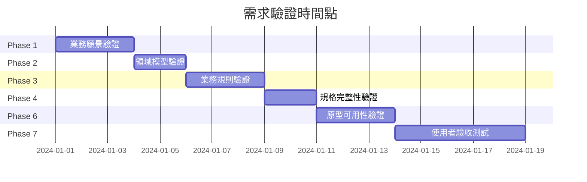

# 需求發掘與分析：最佳實踐與注意事項

## 📋 目錄
- [通用最佳實踐](#通用最佳實踐)
- [各階段注意事項](#各階段注意事項)
- [常見陷阱與解決方案](#常見陷阱與解決方案)
- [品質保證清單](#品質保證清單)
- [團隊協作建議](#團隊協作建議)

---

## 通用最佳實踐

### 1. 規格即單一事實來源 (SSOT)

**原則**：所有產出物都應從規格自動生成，避免手動維護多份文件

**最佳實踐**：
```
✅ 好的做法
- 更新需求時，先更新 BDD Feature 文件
- 從 BDD 自動生成 API 規格、UI 規格、測試
- 使用版本控制追蹤規格變更

❌ 避免的做法
- 分別維護需求文件、API 文件、測試文件
- 手動同步多份文件的內容
- 在程式碼中硬編碼業務規則而不記錄在規格中
```

**工具支援**：
- 使用 Git 進行規格版本控制
- 使用自動化腳本從規格生成程式碼
- 使用 CI/CD 確保規格與程式碼同步

### 2. 漸進式細化 (Progressive Refinement)

**原則**：從高層次抽象逐步細化到具體實作，不要一開始就陷入細節

**階段性細化策略**：

```
Level 1: 業務願景層 (Business Vision)
- 產品願景
- 核心價值主張
- 主要利害關係人

Level 2: 使用者體驗層 (User Experience)
- User Journey Maps
- 痛點與機會
- 情感曲線

Level 3: 領域概念層 (Domain Concepts)
- Event Storming
- 核心領域實體
- 限界上下文

Level 4: 業務規則層 (Business Rules)
- BDD Features 與 Rules
- 邊界條件
- 錯誤處理

Level 5: 技術規格層 (Technical Specifications)
- API 規格 (TypeSpec)
- 資料模型 (DBML)
- UI 規格 (YAML)

Level 6: 實作細節層 (Implementation Details)
- 程式碼生成
- 測試自動化
- 部署配置
```

**注意事項**：
- 不要跳過中間層級直接從願景跳到程式碼
- 確保每一層都有明確的產出物
- 下一層的細化應基於上一層的產出

### 3. 多方協作 (Collaborative Approach)

**原則**：讓業務、設計、開發團隊使用共同語言，透過工作坊促進溝通

**協作工具與時機**：

| 工具 | 參與者 | 時機 | 目的 |
|------|--------|------|------|
| Event Storming | PO, BA, Dev, QA | Phase 1-2 | 快速探索領域知識 |
| Three Amigos | PO, Dev, QA | Phase 3-4 | 釐清規格細節 |
| User Story Mapping | PO, UX, Dev | Phase 1 | 功能優先級排序 |
| Specification Workshops | BA, QA, Dev | Phase 4 | 撰寫 BDD Scenarios |
| Review Sessions | All stakeholders | 每個 Phase 結束 | 驗證產出物 |

**協作最佳實踐**：
```
✅ 好的做法
- 使用視覺化工具（便利貼、白板、Miro）
- 建立共同的術語詞彙表
- 確保所有角色都能理解規格
- 定期同步與對齊

❌ 避免的做法
- 單方面撰寫規格後丟給其他團隊
- 使用只有技術人員能懂的術語
- 跳過協作直接進入實作
- 假設每個人都理解業務邏輯
```

### 4. 早期且頻繁的驗證

**原則**：盡早生成原型，盡早獲得反饋，降低後期修改成本

**驗證時間點**：



**驗證方法**：
- **Phase 1-2**: 利害關係人審查會議
- **Phase 3-4**: 規格走查 (Specification Walkthrough)
- **Phase 5**: 自動化檢查工具
- **Phase 6-7**: 使用者測試與 A/B Testing

---

## 各階段注意事項

### Phase 1: 業務探索

**關鍵成功因素**：
1. **獲得高層支持**：確保利害關係人願意投入時間
2. **準備充分**：提前準備訪談大綱與工作坊材料
3. **多樣性**：訪談不同角色以獲得全面視角
4. **記錄完整**：使用錄音、照片、筆記多重記錄

**常見問題與解決**：

| 問題 | 解決方案 |
|------|----------|
| 利害關係人時間有限 | 分批進行短時間訪談（30 分鐘），聚焦關鍵問題 |
| Event Storming 混亂難控 | 設置明確的時間盒，由經驗豐富的引導師主持 |
| 業務願景模糊 | 使用 Vision Board 或 Impact Mapping 工具輔助 |
| 團隊對工作坊方法不熟悉 | 提前進行小型演練或培訓 |

**檢查清單**：

```
✓ 是否訪談了至少 3 種不同角色的利害關係人？
✓ Event Storming 是否識別出至少 10 個領域事件？
✓ User Journey Map 是否涵蓋了主要使用者角色？
✓ 業務目標是否使用 SMART 原則定義？
✓ 是否識別了主要的痛點與機會？
✓ 產出物是否經過利害關係人驗證？
```

### Phase 2: 領域建模

**關鍵成功因素**：
1. **以業務語言為主**：實體與屬性命名應反映業務術語
2. **聚焦核心領域**：先建模核心實體，再擴展到支援實體
3. **保持適度抽象**：不要過早陷入實作細節
4. **建立通用語言**：確保術語在團隊中統一

**DBML 撰寫最佳實踐**：

```dbml
✅ 好的做法

Table Order {
  order_id varchar(36) [pk, note: '訂單唯一識別碼']
  customer_id varchar(36) [not null, ref: > Customer.customer_id, note: '客戶識別碼']
  total decimal(10,2) [not null, note: '訂單總金額，必須 >= 0']
  status varchar(20) [not null, note: '訂單狀態: pending/confirmed/shipped/delivered/cancelled']

  Indexes {
    customer_id
    status
    created_at
  }

  Note: '''
  訂單聚合根
  不變條件:
  - total = sum(OrderItem.subtotal)
  - status 轉換必須遵循狀態機規則
  '''
}

❌ 避免的做法

Table order {  // 錯誤：小寫表名不符合慣例
  id int [pk]  // 錯誤：缺少說明
  amt float    // 錯誤：使用縮寫，不清楚
  stat int     // 錯誤：應使用列舉而非數字
  // 缺少索引定義
  // 缺少不變條件說明
}
```

**檢查清單**：

```
✓ 每個實體都有清晰的業務定義（Note）？
✓ 每個屬性都有明確的型別與約束？
✓ 關係的多重性（1:1, 1:N, M:N）是否正確？
✓ 是否定義了必要的索引？
✓ 是否記錄了不變條件？
✓ 通用語言詞彙表是否涵蓋所有核心概念？
```

### Phase 3: 需求澄清

**關鍵成功因素**：
1. **系統化掃描**：使用檢查清單確保完整性
2. **優先級排序**：先處理高影響、高不確定性的問題
3. **結構化提問**：使用多選題而非開放式問題
4. **記錄完整**：保留澄清問題與答案的完整記錄

**提問技巧**：

```
✅ 好的提問方式

問題：當商品庫存不足時，建立訂單功能應如何處理？

多選項：
A. 完全拒絕訂單建立，顯示錯誤訊息
B. 允許建立訂單，但標記為「待補貨」狀態
C. 部分建立：庫存足夠的商品成立訂單，不足的移除
D. 允許超賣，後續通知客戶延遲出貨

影響範圍：
- 建立訂單 Feature 的 Rule 與 Example
- 庫存檢查邏輯
- 訂單狀態定義

❌ 避免的提問方式

問題：訂單怎麼處理？（太模糊）
問題：是否允許負數庫存？（未說明影響範圍）
問題：請提供完整的庫存管理邏輯？（範圍太大）
```

**檢查清單**：

```
✓ 是否掃描了所有檢查項（A1-A6, B1-B5, C1-C2, D1-D2）？
✓ 所有 High 優先級的問題是否都已回答？
✓ 澄清結果是否已反映在 DBML 或 Feature 中？
✓ 是否避免了重複提問（檢查 resolved 目錄）？
✓ 每個問題是否都有明確的影響範圍？
✓ 答案是否可直接轉換為規格更新？
```

### Phase 4: 規格制定

**關鍵成功因素**：
1. **遵循 Gherkin 語法**：確保 BDD 文件可被工具解析
2. **每個 Rule 原子化**：一個 Rule 只驗證一件事
3. **Example 覆蓋充分**：涵蓋正常、邊界、錯誤情況
4. **保持可追溯性**：建立需求與規格的對應關係

**BDD Feature 撰寫最佳實踐**：

```gherkin
✅ 好的做法

Feature: 建立訂單
  作為一個已登入的客戶
  我想要建立新訂單
  以便購買我加入購物車的商品

  # 使用 Background 減少重複
  Background:
    Given 系統中存在以下商品:
      | product_id | name      | price | stock |
      | PROD-001   | iPhone 15 | 30000 | 10    |

  # 每個 Rule 原子化
  Rule: 訂單必須至少包含一件商品

    Example: 成功建立包含單一商品的訂單
      Given 客戶的購物車包含:
        | product_id | quantity |
        | PROD-001   | 1        |
      When 客戶提交訂單
      Then 應該成功建立訂單
      And 訂單狀態應為 "pending"
      And 訂單總金額應為 30000

    Example: 嘗試建立空訂單應失敗
      Given 客戶的購物車是空的
      When 客戶提交訂單
      Then 應該顯示錯誤訊息 "訂單必須至少包含一件商品"

  Rule: 訂單商品數量不可超過庫存

    Example: 剛好等於庫存數量應成功
      Given 客戶的購物車包含:
        | product_id | quantity |
        | PROD-001   | 10       |
      When 客戶提交訂單
      Then 應該成功建立訂單

    Example: 超過庫存數量應失敗
      Given 客戶的購物車包含:
        | product_id | quantity |
        | PROD-001   | 11       |
      When 客戶提交訂單
      Then 應該顯示錯誤訊息包含 "庫存不足"

❌ 避免的做法

Feature: 訂單  # 錯誤：Feature 名稱不明確

  Scenario: 測試訂單  # 錯誤：應使用 Rule + Example，且名稱太模糊
    Given 有訂單
    When 建立
    Then 成功  # 錯誤：缺少具體的驗證條件

  # 缺少 Background
  # 缺少資料表格
  # 缺少邊界條件測試
  # Rule 不原子化（混合多個驗證）
```

**TypeSpec 撰寫最佳實踐**：

```typespec
✅ 好的做法

/** 訂單模型 */
model Order {
  /** 訂單唯一識別碼 */
  @key
  orderId: string;

  /** 訂單總金額（元） */
  @minValue(0)  // 明確的驗證規則
  total: decimal;

  /** 訂單狀態 */
  status: OrderStatus;  // 使用列舉而非字串
}

/** 訂單狀態列舉 */
enum OrderStatus {
  /** 待處理 */
  pending,
  /** 已確認 */
  confirmed,
  /** 已出貨 */
  shipped,
}

@route("/orders")
interface OrdersService {
  /** 建立新訂單 */
  @post
  createOrder(@body request: CreateOrderRequest):
    | CreateOrderResponse  // 成功情況
    | {@statusCode: 400, @body error: ErrorResponse}  // 驗證錯誤
    | {@statusCode: 409, @body error: ErrorResponse};  // 衝突錯誤
}

❌ 避免的做法

model Order {
  id: string;  // 缺少說明
  amt: int;    // 錯誤：使用縮寫，型別不正確（應為 decimal）
  stat: string;  // 錯誤：應使用列舉
  // 缺少驗證規則
}

interface OrdersService {
  create(@body request: any): any;  // 錯誤：使用 any 型別
  // 缺少錯誤情況定義
  // 缺少註解說明
}
```

**檢查清單**：

```
✓ 每個 Feature 都有明確的業務價值描述（As a... I want... So that...）？
✓ 每個 Rule 是否原子化（只驗證一件事）？
✓ 每個 Rule 至少有一個 Example？
✓ Example 是否涵蓋正常、邊界、錯誤情況？
✓ API 規格是否定義了所有錯誤情況？
✓ UI 規格是否定義了所有互動與驗證？
✓ 可追溯矩陣是否建立？
```

### Phase 5: 驗證確認

**關鍵成功因素**：
1. **自動化優先**：使用工具自動檢查，減少人工錯誤
2. **多維度驗證**：完整性、一致性、正確性、可追溯性
3. **量化指標**：使用涵蓋率等量化指標
4. **及早修正**：發現問題立即修正，不要累積

**自動化檢查工具**：

```bash
# Gherkin 語法檢查
npm install -g @cucumber/gherkin-lint
gherkin-lint spec/features/**/*.feature

# DBML 語法檢查
npm install -g @dbml/cli
dbml2sql spec/erm.dbml --check-only

# TypeSpec 編譯檢查
tsp compile spec/api.tsp

# 可追溯性檢查（自定義腳本）
python scripts/check-traceability.py
```

**檢查清單**：

```
✓ 所有規格文件無語法錯誤？
✓ 完整性檢查通過率 >= 90%？
✓ 一致性驗證通過率 >= 95%？
✓ 可追溯性檢查通過率 >= 90%？
✓ BDD 規則涵蓋率 >= 80%？
✓ 驗證報告是否已生成並獲得團隊簽核？
```

### Phase 6: 原型生成

**關鍵成功因素**：
1. **先 Mock 後實作**：使用 Mock API 讓前後端並行開發
2. **快速迭代**：優先生成核心流程，再補充細節
3. **真實資料**：使用 Faker.js 生成真實感的測試資料
4. **易於演示**：確保原型可輕鬆部署與分享

**Mock API 生成範例**：

```typescript
// 從 TypeSpec 自動生成的 Express.js Mock Server
import express from 'express';
import { faker } from '@faker-js/faker';

const app = express();

// POST /orders
app.post('/orders', (req, res) => {
  const { items } = req.body;

  // 驗證：訂單必須至少包含一件商品
  if (!items || items.length === 0) {
    return res.status(400).json({
      code: 'INVALID_REQUEST',
      message: '訂單必須至少包含一件商品'
    });
  }

  // 模擬成功回應
  const order = {
    orderId: faker.string.uuid(),
    customerId: faker.string.uuid(),
    items: items.map(item => ({
      productId: item.productId,
      productName: faker.commerce.productName(),
      quantity: item.quantity,
      price: faker.number.float({ min: 100, max: 50000, precision: 0.01 }),
      subtotal: faker.number.float({ min: 100, max: 50000, precision: 0.01 })
    })),
    total: faker.number.float({ min: 100, max: 100000, precision: 0.01 }),
    status: 'pending',
    createdAt: new Date().toISOString(),
    updatedAt: new Date().toISOString()
  };

  res.status(200).json({ order });
});
```

**檢查清單**：

```
✓ Mock API Server 是否可正常啟動？
✓ 所有 API 端點是否都已實作 Mock？
✓ Mock 資料是否符合規格定義的型別與約束？
✓ UI 原型是否可正常運行？
✓ E2E 測試是否可正常執行？
✓ 原型是否已部署並可供利害關係人訪問？
```

### Phase 7: 迭代精煉

**關鍵成功因素**：
1. **結構化反饋**：使用問卷或訪談大綱收集反饋
2. **問題分類**：區分需求問題、規格問題、原型問題
3. **優先級排序**：先處理高影響、高頻率的問題
4. **快速響應**：儘快更新規格並重新生成原型

**反饋收集表單範例**：

```markdown
# 原型測試反饋表單

## 基本資訊
- 測試者：___________
- 角色：___________
- 測試日期：___________

## 功能測試

### 建立訂單功能
1. 是否能成功將商品加入購物車？
   - [ ] 是  - [ ] 否  - [ ] 部分成功
   - 問題描述：___________

2. 是否能成功提交訂單？
   - [ ] 是  - [ ] 否  - [ ] 部分成功
   - 問題描述：___________

3. 當庫存不足時，系統的處理方式是否符合預期？
   - [ ] 是  - [ ] 否  - [ ] 不確定
   - 問題描述：___________

## 使用體驗

4. 整體操作流程是否順暢？
   - [ ] 非常順暢  - [ ] 順暢  - [ ] 普通  - [ ] 不順暢  - [ ] 非常不順暢

5. 錯誤訊息是否清楚易懂？
   - [ ] 非常清楚  - [ ] 清楚  - [ ] 普通  - [ ] 不清楚  - [ ] 非常不清楚

## 開放式反饋

6. 有哪些功能缺失或不符合預期？
   ___________

7. 有哪些改進建議？
   ___________
```

**檢查清單**：

```
✓ 是否完成至少 2 輪使用者測試？
✓ 是否收集至少 10 條有效反饋？
✓ 是否處理至少 80% 的 High 優先級反饋？
✓ 規格是否已根據反饋更新？
✓ 原型是否已重新生成並驗證？
✓ 使用者滿意度是否 >= 80%？
```

---

## 常見陷阱與解決方案

### 陷阱 1: 過早進入實作細節

**症狀**：
- 在 Phase 1-2 就開始討論資料庫索引、快取策略等技術細節
- Event Storming 變成技術架構討論會

**影響**：
- 忽略業務需求的完整性
- 團隊溝通困難（業務人員無法參與）
- 可能做出錯誤的技術決策（基於不完整的需求）

**解決方案**：
```
1. 明確區分階段目標
   - Phase 1-2 聚焦業務概念，禁止討論技術實作
   - 設置「技術停車場」記錄技術問題，Phase 4 後再討論

2. 使用引導技巧
   - 當討論偏離時，引導師應及時拉回
   - 使用「這是很好的技術問題，我們先記錄下來」

3. 角色分工明確
   - Phase 1-2 由 PO/BA 主導，Dev 僅提供可行性諮詢
   - Phase 4-6 由 Dev/Arch 主導，PO/BA 確認符合業務需求
```

### 陷阱 2: 規格過於簡略或過於詳細

**症狀**：
- **過於簡略**：BDD Example 缺少具體資料，只有模糊的「應該成功」
- **過於詳細**：在規格中定義 UI 的每個 CSS 樣式、每個按鈕的位置

**影響**：
- 過於簡略：無法自動生成程式碼，測試難以執行
- 過於詳細：規格難以維護，任何小改動都需要大量更新

**解決方案**：
```
適當的抽象層級：

✅ 規格應定義的內容
- 業務規則與約束
- 資料結構與型別
- API 端點與參數
- 頁面元件與互動邏輯
- 驗證規則與錯誤訊息

❌ 規格不應定義的內容
- 具體的演算法實作
- CSS 樣式細節
- 資料庫查詢語法
- 程式語言特定的程式碼結構
- 部署環境配置

範例：
✅ 好的規格: 「訂單總金額 = sum(訂單項目.小計)」
❌ 過於詳細: 「使用 SQL 的 SUM() 函式並加上 WHERE order_id = ?」
❌ 過於簡略: 「訂單要有總金額」
```

### 陷阱 3: 忽略邊界條件與錯誤處理

**症狀**：
- BDD Example 只有「正常流程」，缺少邊界條件與錯誤情況
- API 規格只定義成功回應，缺少錯誤回應

**影響**：
- 系統在異常情況下行為不明確
- 測試涵蓋率不足
- 上線後頻繁出現未處理的錯誤

**解決方案**：
```
邊界條件檢查清單：

1. 數值邊界
- [ ] 最小值（0、1、最小有效值）
- [ ] 最大值（上限、溢位）
- [ ] 剛好達標（==）
- [ ] 差一點（邊界值 ± 1）

2. 集合邊界
- [ ] 空集合
- [ ] 單一元素
- [ ] 最大容量

3. 狀態邊界
- [ ] 初始狀態
- [ ] 中間狀態
- [ ] 終止狀態
- [ ] 非法狀態轉換

4. 時間邊界
- [ ] 同時操作（併發）
- [ ] 超時
- [ ] 順序依賴

範例：訂單數量驗證

✅ 完整的 Examples
- 數量 = 0（錯誤）
- 數量 = 1（成功）
- 數量 = 庫存（成功）
- 數量 = 庫存 + 1（錯誤）
- 數量 = 負數（錯誤）
```

### 陷阱 4: 規格與程式碼不同步

**症狀**：
- 程式碼已實作新功能，但 BDD Feature 未更新
- API 規格與實際 API 行為不一致

**影響**：
- 失去「規格即單一事實來源」的優勢
- 文件過時，誤導新團隊成員
- 無法從規格自動生成測試

**解決方案**：
```
1. 建立更新流程
   - 任何需求變更必須先更新規格
   - 規格更新後才能更新程式碼
   - 使用 Pull Request 檢查規格與程式碼是否一致

2. 自動化檢查
   - CI/CD 中加入「規格與程式碼一致性」檢查
   - 使用 Contract Testing 確保 API 實作符合規格
   - 定期執行 BDD 測試，確保規格與實作一致

3. 版本控制
   - 規格與程式碼放在同一個 Git Repository
   - 規格變更記錄在 Git History 中
   - 使用 Git Tag 標記重要的規格版本

4. 團隊文化
   - 將「規格優先」作為團隊原則
   - 在 Code Review 中檢查規格更新
   - 定期審查規格的正確性與完整性
```

### 陷阱 5: 缺少可追溯性

**症狀**：
- 無法追蹤某個 API 端點對應哪個業務需求
- 不知道某個 UI 頁面是為了解決哪個痛點

**影響**：
- 需求變更時不知道影響哪些技術元件
- 無法評估功能的業務價值
- 難以進行影響分析與風險評估

**解決方案**：
```
建立可追溯矩陣：

1. 需求層 → 規格層
   User Journey Pain Point → BDD Feature
   Event Storming Aggregate → DBML Entity

2. 規格層 → 實作層
   BDD Rule → API Validation
   BDD Example → E2E Test Case
   DBML Entity → Database Table
   YAML Page → React Component

3. 使用標籤與 ID
   - 為每個需求、規格、實作元件分配唯一 ID
   - 在規格中引用需求 ID
   - 在程式碼中引用規格 ID

範例：
# BDD Feature
Feature: 建立訂單
  @requirement: REQ-001  # 引用需求 ID
  @user-journey: UJ-002-Stage-3  # 引用 User Journey

  Rule: 訂單必須至少包含一件商品
    @rule-id: RULE-001  # 規則 ID

    Example: 成功建立訂單
      @example-id: EX-001  # 範例 ID
      @api-endpoint: POST /orders  # 對應的 API
      @ui-page: order-creation  # 對應的 UI 頁面
```

---

## 品質保證清單

### 整體品質檢查

```
文件品質：
✓ 所有文件使用統一的格式與範本？
✓ 所有術語都有在通用語言詞彙表中定義？
✓ 文件結構清晰，易於導覽？
✓ 所有圖表都可正常顯示？
✓ 無錯別字與語法錯誤？

技術品質：
✓ 所有規格文件無語法錯誤（Gherkin、DBML、TypeSpec、YAML）？
✓ 自動化檢查工具全部通過？
✓ 可追溯矩陣完整且無斷鍊？
✓ 涵蓋率達到目標（>= 80%）？

業務品質：
✓ 所有業務需求都有對應的規格？
✓ 所有主要痛點都有解決方案？
✓ 規格經過利害關係人驗證？
✓ 業務規則清晰且無歧義？

流程品質：
✓ 每個 Phase 的完成標準都已達成？
✓ 所有品質閘門都已通過？
✓ 產出物經過適當的審查？
✓ 問題與風險都有記錄與處理？
```

### 各類規格品質檢查

**BDD Feature 品質**

```
結構：
✓ Feature 有明確的業務價值描述（As a... I want... So that...）？
✓ 使用 Rule + Example 結構而非 Scenario？
✓ 使用 Background 減少重複？
✓ 使用 Data Table 提供具體資料？

內容：
✓ 每個 Rule 原子化（只驗證一件事）？
✓ 每個 Rule 至少有一個 Example？
✓ Example 涵蓋正常、邊界、錯誤情況？
✓ Step 句型一致（Given 描述狀態、When 描述動作、Then 描述結果）？
✓ 無模糊的形容詞（如「適當」「合理」）？

可執行性：
✓ 可被 Cucumber/Behave 等工具解析？
✓ Step 定義可實作（不過於抽象或過於具體）？
✓ 資料格式明確（日期、金額、狀態等）？
```

**DBML 品質**

```
結構：
✓ Table 名稱使用 PascalCase？
✓ 欄位名稱使用 snake_case？
✓ 每個 Table 都有主鍵 [pk]？
✓ 外鍵使用 Ref 定義？

內容：
✓ 每個 Table 都有 Note 說明？
✓ 每個欄位都有 note 說明？
✓ 所有約束都已定義（not null、unique、check）？
✓ 必要的索引都已定義？
✓ 不變條件都已記錄在 Note 中？

一致性：
✓ 資料型別使用一致（如統一使用 varchar(36) 為 UUID）？
✓ 命名慣例一致？
✓ 關係的多重性正確？
```

**TypeSpec 品質**

```
結構：
✓ 使用 model 定義資料模型？
✓ 使用 enum 定義列舉？
✓ 使用 interface 定義 API 端點？
✓ 使用 @route 定義路徑？

內容：
✓ 所有 model 與 enum 都有 JSDoc 註解？
✓ 所有驗證規則都已定義（@minValue、@maxValue、@minItems 等）？
✓ 所有錯誤回應都已定義？
✓ HTTP 狀態碼使用正確？

一致性：
✓ 命名風格一致（camelCase）？
✓ 錯誤回應格式統一？
✓ 與 DBML 的資料模型一致？
```

**YAML DSL 品質**

```
結構：
✓ 使用標準的頁面 DSL 結構？
✓ datasource、layout、actions、validation 都已定義？
✓ 元件巢狀結構清晰？

內容：
✓ 所有資料綁定 (dataBinding) 都已定義？
✓ 所有驗證規則都已定義？
✓ 所有使用者動作 (actions) 都已定義？
✓ 效果鏈 (effects) 完整（成功/錯誤處理）？

一致性：
✓ 與 API 規格的欄位名稱一致？
✓ 與 BDD Example 的互動邏輯一致？
✓ 驗證規則與 DBML 約束一致？
```

---

## 團隊協作建議

### 建立跨職能團隊

**理想的團隊組成**：

```
核心團隊：
- Product Owner (PO) × 1
- Business Analyst (BA) × 1-2
- UX Designer × 1
- QA Lead × 1
- Tech Lead / Architect × 1
- Senior Developer × 2-3

支援角色：
- Domain Expert（按需參與）
- DevOps Engineer（Phase 6 參與）
- End Users（Phase 1 與 Phase 7 參與）
```

**職責分工**：

| 階段 | 主導角色 | 支援角色 | 審查者 |
|------|---------|---------|--------|
| Phase 1 | PO + BA | UX, Domain Expert | All |
| Phase 2 | BA + Arch | Dev, QA | PO, Domain Expert |
| Phase 3 | BA + QA | Dev | PO |
| Phase 4 | QA + BA | Dev, Arch | PO, UX |
| Phase 5 | QA | Dev, Arch | BA, PO |
| Phase 6 | Dev | QA, UX | Arch, PO |
| Phase 7 | PO + UX | QA, Dev | All |

### 協作工作坊最佳實踐

**Event Storming 工作坊**：

```
準備（1 週前）：
- 確定參與者並發送邀請（PO, BA, Dev, QA, Domain Expert）
- 準備材料（便利貼、白板、麥克筆）
- 準備引導者腳本
- 發送行前資料（業務背景、目標）

執行（4-6 小時）：
- 開場（15 分鐘）：說明目標與規則
- 混亂探索（60 分鐘）：貼出所有領域事件
- 休息（15 分鐘）
- 時間線排序（60 分鐘）：按時間排列事件
- 午餐休息（60 分鐘）
- 識別命令與角色（60 分鐘）
- 識別聚合與策略（60 分鐘）
- 總結與下一步（30 分鐘）

追蹤（1 週內）：
- 整理工作坊照片與數位化
- 撰寫摘要報告
- 分享給所有參與者與利害關係人
- 安排 Phase 2 的領域建模會議
```

**Three Amigos 會議**：

```
目的：釐清 BDD Feature 的細節

參與者：
- Product Owner（代表業務）
- Developer（代表技術）
- QA（代表測試）

流程（每個 Feature 30-60 分鐘）：
1. PO 說明 Feature 的業務價值與使用場景
2. QA 提出澄清問題（邊界條件、錯誤處理）
3. Dev 提出技術可行性問題
4. 共同討論並更新 Feature 文件
5. 確認 Example 是否完整且可測試

產出：
- 更新後的 BDD Feature 文件
- 共識記錄
- TODO 清單（待澄清的問題）
```

### 溝通與同步機制

**每日站會 (Daily Standup)**：

```
時間：每天 15 分鐘
參與者：核心團隊

議程：
1. 昨天完成了什麼？（規格撰寫、原型生成等）
2. 今天計劃做什麼？
3. 遇到什麼阻礙？（澄清問題、技術難題等）

注意事項：
- 聚焦進度與阻礙，不深入討論技術細節
- 有需要深入討論的問題，會後另約時間
- 使用看板視覺化當前進度
```

**週同步會議 (Weekly Sync)**：

```
時間：每週 60 分鐘
參與者：核心團隊 + 利害關係人

議程：
1. 本週完成的產出物展示（15 分鐘）
2. 下週計劃與目標（10 分鐘）
3. 風險與問題討論（20 分鐘）
4. 決策事項（15 分鐘）

產出：
- 會議記錄
- 決策記錄
- 風險登記簿
- 下週行動計畫
```

**規格審查會議 (Specification Review)**：

```
時機：每個 Phase 結束前

參與者：
- Phase 負責人（主講者）
- 所有核心團隊成員
- 關鍵利害關係人

流程（60-90 分鐘）：
1. 產出物概覽（15 分鐘）
2. 逐項審查（40 分鐘）
   - BDD Features
   - API 規格
   - 資料模型
   - UI 規格
3. 問題與建議（20 分鐘）
4. 決定是否通過品質閘門（10 分鐘）

審查標準：
- 完整性：所有必要元件都已定義
- 一致性：各規格之間無衝突
- 正確性：符合業務需求
- 可執行性：可自動生成程式碼與測試
```

### 工具與平台推薦

**協作工具**：

| 用途 | 推薦工具 | 說明 |
|------|---------|------|
| Event Storming | Miro, Mural | 線上白板，支援即時協作 |
| 規格編輯 | VS Code + 外掛 | Gherkin、DBML、TypeSpec 語法高亮 |
| 版本控制 | Git + GitHub/GitLab | 追蹤規格變更歷史 |
| 文件協作 | Notion, Confluence | 共享文件與知識庫 |
| 專案管理 | Jira, Linear | 追蹤任務與進度 |
| 溝通 | Slack, Teams | 即時溝通與通知 |
| 視訊會議 | Zoom, Google Meet | 遠端工作坊與會議 |

**自動化工具**：

| 用途 | 工具 | 說明 |
|------|------|------|
| Gherkin 檢查 | gherkin-lint | 語法與風格檢查 |
| DBML 編譯 | @dbml/cli | 轉換為 SQL 或檢查語法 |
| TypeSpec 編譯 | tsp | 生成 OpenAPI 規格 |
| Mock API 生成 | Prism, json-server | 從 OpenAPI 生成 Mock Server |
| UI 原型生成 | 自定義腳本 | 從 YAML DSL 生成 React/Vue |
| 測試生成 | Cucumber.js, Behave | 從 Gherkin 執行測試 |
| CI/CD | GitHub Actions, GitLab CI | 自動化檢查與部署 |

---

## 總結

成功的需求發掘與分析需要：

1. **系統化的流程**：遵循七階段流程，不跳過任何步驟
2. **適當的抽象層級**：在每個階段維持適當的細節程度
3. **持續的驗證**：每個階段都有品質閘門與檢查
4. **有效的協作**：跨職能團隊使用共同語言
5. **自動化支援**：使用工具減少人工錯誤
6. **迭代改進**：收集反饋並持續精煉規格

遵循這些最佳實踐，您的團隊將能夠：
- 更快速地理解業務需求
- 更準確地定義系統規格
- 更早地發現問題
- 更順暢地協作
- 更高品質地交付產品

### 下一步

- 參考 [05-範例：電商系統.md](05-範例：電商系統.md) 學習完整案例
- 使用 [templates/](templates/) 中的模板開始實踐
- 在實際專案中應用此流程，並記錄經驗與改進建議

---

**持續改進**：本文件將根據團隊實踐經驗持續更新，歡迎貢獻您的最佳實踐！
