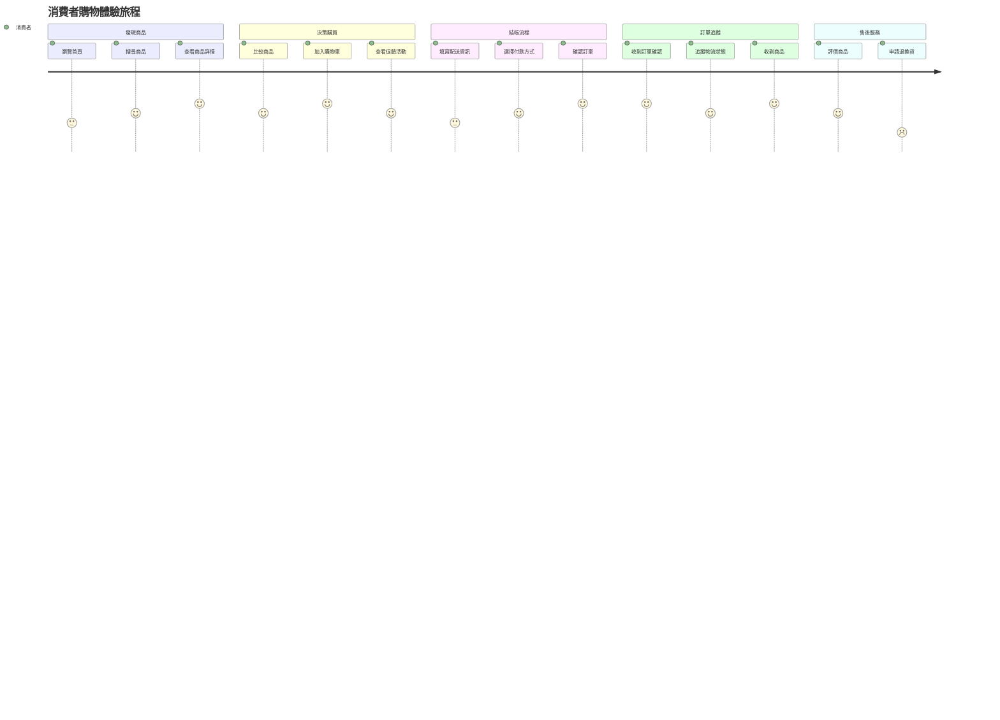
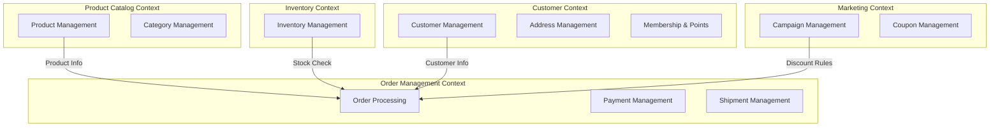

# 範例：電商系統需求分析

> 本文件展示如何運用七階段需求發掘與分析流程，完整分析一個電商系統專案
>
> **專案名稱**: SmallBiz 電商平台
> **目標**: 為中小企業提供簡單易用的 B2C 電商解決方案

---

## 📋 目錄

- [Phase 1: 業務探索](#phase-1-業務探索)
- [Phase 2: 領域建模](#phase-2-領域建模)
- [Phase 3: 需求澄清](#phase-3-需求澄清)
- [Phase 4: 規格制定](#phase-4-規格制定)
- [Phase 5: 驗證確認](#phase-5-驗證確認)
- [Phase 6: 原型生成](#phase-6-原型生成)
- [Phase 7: 迭代精煉](#phase-7-迭代精煉)

---

## Phase 1: 業務探索

### 1.1 業務願景文件

#### 執行摘要

**專案簡介**:
SmallBiz 電商平台是一個面向中小企業的 B2C 電商解決方案，提供商品管理、訂單處理、會員管理、行銷活動等核心功能。透過整合多種支付方式與物流系統，協助中小企業快速建立線上銷售管道，降低營運成本並提升銷售效率。

**核心價值主張**:
- **降低成本**: 減少人工處理訂單的時間成本 50%
- **提升效率**: 自動化庫存管理，庫存準確度達 95% 以上
- **增加營收**: 透過數據驅動的行銷活動，提升客戶轉換率 30%
- **改善體驗**: 提供流暢的購物體驗，客戶滿意度達 4.5 分以上

#### 願景聲明

> "成為台灣中小企業首選的電商解決方案，透過簡單易用的工具與數據驅動的洞察，幫助 10 萬家中小企業成功建立線上銷售管道並持續成長。"

#### SMART 目標

**目標 1: 商家獲取**

| SMART | 內容 |
|-------|------|
| **Specific** | 協助 1000 家中小企業建立線上商店 |
| **Measurable** | 平台註冊商家數達 1000 家，且至少 70% 有實際交易 |
| **Achievable** | 根據市場調查，有 5 萬家中小企業有電商需求，1000 家占 2%，目標合理 |
| **Relevant** | 直接支持"成為中小企業首選電商解決方案"的願景 |
| **Time-bound** | 上線後 12 個月內達成 |

**目標 2: 平台交易額**

| SMART | 內容 |
|-------|------|
| **Specific** | 達成平台年度總交易額 5 億元 |
| **Measurable** | 每月追蹤總交易額，確保達成年度目標 |
| **Achievable** | 假設 1000 家商家，平均月交易額 4 萬元，年度可達 4.8 億元 |
| **Relevant** | 交易額反映平台價值與商家活躍度 |
| **Time-bound** | 第一年度結束時達成 |

#### 目標使用者 Personas

**Persona 1: 小型企業主 - 張老闆**

| 項目 | 內容 |
|------|------|
| **年齡** | 35-50 歲 |
| **職業** | 零售業老闆 |
| **背景** | 經營實體店面 5-10 年，想拓展線上市場 |
| **技術熟悉度** | 中等（會用 Facebook、LINE，但不熟悉技術細節） |

**目標與動機**:
- 建立線上銷售管道，不受實體店面營業時間限制
- 降低租金與人力成本
- 觸及更廣泛的客戶群

**痛點**:
- 不懂技術，委外開發成本高達數十萬
- 使用第三方平台抽成高 (15-20%)，缺乏客戶數據
- 訂單、庫存、會員資料分散，管理困難

**引用語錄**:
> "我只是想把商品賣到網路上，為什麼這麼複雜？每個平台的抽成都很高，而且客人資料都不是我的。"

**Persona 2: 一般消費者 - 王小姐**

| 項目 | 內容 |
|------|------|
| **年齡** | 25-40 歲 |
| **職業** | 上班族 |
| **購物習慣** | 每月網購 2-3 次 |
| **技術熟悉度** | 高 |

**目標**:
- 快速找到想要的商品
- 安全便捷的付款體驗
- 即時追蹤訂單狀態

**痛點**:
- 網站速度慢或介面不友善
- 下單後才發現缺貨
- 退換貨流程複雜

#### 成功指標 (KPIs)

**業務指標**:

| 指標 | 目標值 | 衡量頻率 |
|------|--------|---------|
| 註冊商家數 | 1,000 家 | 每月 |
| 活躍商家率 | ≥ 70% | 每月 |
| 平台總交易額 | 5 億元/年 | 每月累計 |
| 商家留存率 | ≥ 80% | 每季 |
| 客戶獲取成本 (CAC) | ≤ $500 | 每月 |

**產品指標**:

| 指標 | 目標值 | 衡量頻率 |
|------|--------|---------|
| 月活躍使用者 (MAU) | 50,000 | 每月 |
| 訂單轉換率 | ≥ 3% | 每週 |
| 購物車放棄率 | ≤ 65% | 每週 |
| 平均訂單金額 | ≥ $800 | 每週 |

**體驗指標**:

| 指標 | 目標值 | 衡量頻率 |
|------|--------|---------|
| 客戶滿意度 (CSAT) | ≥ 4.5/5.0 | 每月 |
| Net Promoter Score (NPS) | ≥ 40 | 每季 |
| 系統可用性 | ≥ 99.9% | 每月 |
| 頁面載入時間 | < 2 秒 | 每日 |

### 1.2 利害關係人訪談

#### 訪談記錄 1: 商家管理員 (張老闆)

**訪談日期**: 2025-01-06
**訪談時間**: 60 分鐘

**Q: 您目前如何管理商品和訂單?**
> A: 我們現在用 Excel 表格記錄庫存，訂單用 LINE 和 Email 收，常常漏單或重複出貨。希望有系統化的管理工具。

**Q: 您最常遇到的痛點是什麼?**
> A: 庫存對不上！有時候網站還在賣，但實際已經沒貨了。還有促銷活動計算很複雜，常算錯價格。客人會生氣，我們也很困擾。

**Q: 您期望的核心功能?**
> A:
> - 即時庫存同步，賣一個就扣一個
> - 自動計算折扣，不要讓我算錯
> - 訂單狀態追蹤，讓我知道哪些要出貨
> - 簡單的報表功能，知道哪些商品賣得好

**Q: 您願意支付多少費用?**
> A: 如果真的好用，月費 $2000-$3000 可以接受。但一次性收幾十萬我付不起。

**關鍵需求摘要**:
1. ✅ 即時庫存管理 (Priority: P0)
2. ✅ 自動折扣計算 (Priority: P0)
3. ✅ 訂單狀態管理 (Priority: P0)
4. ✅ 簡易報表 (Priority: P1)

#### 訪談記錄 2: 消費者 (王小姐)

**訪談日期**: 2025-01-07
**訪談時間**: 45 分鐘

**Q: 您在網購時最在意什麼?**
> A: 網站要快、找東西方便、付款安全、能即時看到訂單狀態。最討厭下單後才說沒貨，浪費我時間。

**Q: 您希望有哪些功能?**
> A:
> - 願望清單功能，看到喜歡的先收藏
> - 比價功能或價格追蹤
> - 訂單追蹤通知，最好有 LINE 通知
> - 退換貨要方便，不要一堆表單

**Q: 什麼情況會讓您放棄購買?**
> A:
> - 結帳流程太複雜，要填一堆東西
> - 沒有我習慣的付款方式
> - 運費太貴
> - 網站跑很慢

**關鍵需求摘要**:
1. ✅ 流暢的購物體驗 (Priority: P0)
2. ✅ 願望清單 (Priority: P1)
3. ✅ 訂單通知 (Priority: P0)
4. ✅ 簡化結帳流程 (Priority: P0)

### 1.3 User Journey Mapping

#### Journey Map: 消費者購物體驗旅程



**情緒分析**:

| 階段 | 高峰時刻 (5分) | 痛點時刻 (2-3分) |
|------|---------------|-----------------|
| 發現商品 | 找到想要的商品 | 搜尋結果不準確 |
| 決策購買 | 看到優惠活動 | 商品資訊不完整 |
| 結帳流程 | 確認訂單成功 | 填寫表單繁瑣 (3分) |
| 訂單追蹤 | 收到商品 | 物流資訊不清楚 |
| 售後服務 | 成功退貨 | 退貨流程複雜 (2分) |

**改進機會**:
1. **簡化結帳流程**: 減少必填欄位，支援自動填寫
2. **清晰的物流追蹤**: 視覺化物流進度
3. **便利的退換貨**: 線上申請，無需繁瑣表單

### 1.4 Event Storming 工作坊

**工作坊日期**: 2025-01-08
**參與者**: 業務專家(2)、開發人員(3)、產品經理(1)、UX設計師(1)

#### 識別的領域事件 (Domain Events)

**商品管理流程**:
```
[商家上架新商品] → 商品已建立 → 庫存已設定 → 商品已上架
                                    ↓
[客戶瀏覽商品] → 商品已檢視 → 商品已加入購物車
```

**訂單處理流程**:
```
[客戶提交訂單] → 訂單已建立 → 庫存已預留 → 付款已完成
                                              ↓
訂單已確認 → 商品已出貨 → 訂單已送達 → 訂單已完成
     ↓
[客戶申請退貨] → 退貨已核准 → 商品已退回 → 款項已退還
```

**促銷活動流程**:
```
[行銷人員建立活動] → 活動已發布 → [客戶使用優惠券]
                                    ↓
                          折扣已套用 → 訂單金額已計算
```

**會員管理流程**:
```
[新客戶註冊] → 客戶已註冊 → [客戶完成訂單] → 點數已發放
                                            ↓
                                    會員等級已更新
```

#### 識別的聚合 (Aggregates)

**1. Product Aggregate (商品聚合)**
- **聚合根**: Product
- **實體**: ProductVariant
- **值物件**: Price, SKU, ProductStatus

**不變條件**:
- 商品必須至少有一個變體才能上架
- 所有變體的 SKU 必須唯一
- 價格必須大於 0

**2. Order Aggregate (訂單聚合)**
- **聚合根**: Order
- **實體**: OrderItem, Payment, Shipment
- **值物件**: Money, OrderStatus, ShippingAddress

**不變條件**:
- 訂單總金額 = 小計 - 折扣 + 運費 + 稅金
- 訂單項目數量必須 > 0
- 已付款訂單不可取消(需走退款流程)

**3. Customer Aggregate (客戶聚合)**
- **聚合根**: Customer
- **實體**: Address, PaymentMethod
- **值物件**: MemberLevel, LoyaltyPoints

**不變條件**:
- Email 必須唯一
- 點數餘額不可為負數

**4. Inventory Aggregate (庫存聚合)**
- **聚合根**: Inventory
- **值物件**: Quantity, ReservedQuantity

**不變條件**:
- 可售庫存 = 實際庫存 - 預留庫存
- 可售庫存不可為負數

**5. Campaign Aggregate (促銷聚合)**
- **聚合根**: Campaign
- **實體**: Coupon
- **值物件**: DiscountRule, ValidityPeriod

**不變條件**:
- 優惠券必須在有效期限內
- 使用次數不可超過上限

#### 識別的限界上下文



#### 熱點/待解決問題

1. ❓ **當庫存不足時，是否允許超賣?**
   - 影響: 訂單處理流程
   - 優先級: 高

2. ❓ **訂單支付逾時時間是多久?**
   - 影響: 庫存預留時間
   - 優先級: 高

3. ❓ **多個優惠是否可疊加使用?**
   - 影響: 促銷規則設計
   - 優先級: 中

4. ❓ **會員等級升降規則?**
   - 影響: 會員系統設計
   - 優先級: 中

---

## Phase 2: 領域建模

### 2.1 領域實體模型 (DBML)

```dbml
Project SmallBiz_ECommerce {
  database_type: 'PostgreSQL'
  Note: '''
    SmallBiz 電商平台資料模型
    版本: v1.0
    建立日期: 2025-01-09
  '''
}

// ============================================================
// Product Catalog Context (商品目錄上下文)
// ============================================================

Table products {
  id uuid [primary key, default: `gen_random_uuid()`]
  name varchar(200) [not null, note: '商品名稱']
  slug varchar(200) [unique, note: 'URL 友善識別碼']
  description text [note: '商品描述']

  category_id uuid [ref: > categories.id]
  brand varchar(100)

  status varchar(20) [not null, default: 'draft', note: 'draft | active | inactive']

  // SEO
  meta_title varchar(200)
  meta_description text

  created_at timestamp [not null, default: `now()`]
  updated_at timestamp [not null, default: `now()`]
  published_at timestamp

  indexes {
    slug [unique]
    category_id
    status
    (status, published_at) [name: 'idx_products_active']
  }

  Note: '商品主表。業務規則: 商品必須至少有一個變體才能上架'
}

Table product_variants {
  id uuid [primary key]
  product_id uuid [ref: > products.id, not null]
  sku varchar(50) [unique, not null, note: '庫存單位代碼(唯一)']

  name varchar(100) [note: '變體名稱 (如: 紅色/128GB)']

  // 價格
  price decimal(10,2) [not null, note: '售價']
  compare_at_price decimal(10,2) [note: '原價(用於顯示折扣)']
  cost decimal(10,2) [note: '成本']

  // 規格
  option1_name varchar(50) [note: '規格1名稱(如:顏色)']
  option1_value varchar(50) [note: '規格1值(如:紅色)']
  option2_name varchar(50)
  option2_value varchar(50)
  option3_name varchar(50)
  option3_value varchar(50)

  image_url varchar(500)
  weight decimal(10,2) [note: '重量(kg)']

  created_at timestamp [not null, default: `now()`]

  indexes {
    sku [unique]
    product_id
  }

  Note: '商品變體表。業務規則: SKU必須唯一，價格必須>0'
}

Table categories {
  id uuid [primary key]
  name varchar(100) [not null]
  slug varchar(100) [unique]
  parent_id uuid [ref: > categories.id, note: '父分類ID(支援多層分類)']

  description text
  image_url varchar(500)
  sort_order integer [default: 0]

  is_active boolean [default: true]

  created_at timestamp [not null, default: `now()`]
  updated_at timestamp [not null, default: `now()`]

  indexes {
    slug [unique]
    parent_id
    sort_order
  }
}

// ============================================================
// Inventory Context (庫存上下文)
// ============================================================

Table inventory {
  id uuid [primary key]
  variant_id uuid [ref: > product_variants.id, not null]
  warehouse_id uuid [ref: > warehouses.id, not null]

  quantity integer [not null, default: 0, note: '實際庫存']
  reserved_quantity integer [not null, default: 0, note: '預留庫存']
  safety_stock integer [default: 0, note: '安全庫存']

  updated_at timestamp [not null, default: `now()`]

  indexes {
    (variant_id, warehouse_id) [unique, name: 'idx_inventory_variant_warehouse']
  }

  Note: '''
    庫存表
    業務規則:
    - 可售庫存 = quantity - reserved_quantity
    - 可售庫存不可為負數
    - 當 quantity < safety_stock 時發送補貨通知
  '''
}

Table warehouses {
  id uuid [primary key]
  name varchar(100) [not null]
  code varchar(20) [unique, not null]
  address varchar(200)
  is_active boolean [default: true]
  created_at timestamp [not null, default: `now()`]
}

// ============================================================
// Customer Context (客戶上下文)
// ============================================================

Table customers {
  id uuid [primary key]
  email varchar(255) [unique, not null]
  phone varchar(20)

  first_name varchar(50)
  last_name varchar(50)

  password_hash varchar(255) [not null]

  status varchar(20) [not null, default: 'active', note: 'active | inactive | locked']
  email_verified boolean [default: false]

  member_level varchar(20) [default: 'bronze', note: 'bronze | silver | gold | platinum']
  loyalty_points integer [default: 0]

  created_at timestamp [not null, default: `now()`]
  updated_at timestamp [not null, default: `now()`]
  last_login_at timestamp

  indexes {
    email [unique]
    member_level
    created_at
  }

  Note: '''
    客戶主表
    業務規則:
    - Email必須唯一
    - 會員等級每月1號根據近12個月消費自動更新
    - 消費$100獲得1點，1點可抵$1
  '''
}

Table addresses {
  id uuid [primary key]
  customer_id uuid [ref: > customers.id, not null]

  type varchar(20) [note: 'shipping | billing']
  recipient_name varchar(100) [not null]
  phone varchar(20) [not null]

  address_line1 varchar(200) [not null]
  address_line2 varchar(200)
  city varchar(50) [not null]
  state varchar(50)
  postal_code varchar(20) [not null]
  country varchar(50) [not null, default: 'Taiwan']

  is_default boolean [default: false]

  created_at timestamp [not null, default: `now()`]

  indexes {
    customer_id
    (customer_id, is_default) [name: 'idx_addresses_default']
  }
}

// ============================================================
// Order Management Context (訂單管理上下文)
// ============================================================

Table orders {
  id uuid [primary key]
  order_number varchar(50) [unique, not null, note: '訂單編號']

  customer_id uuid [ref: > customers.id, not null]

  status varchar(20) [not null, default: 'pending', note: 'pending | paid | confirmed | shipped | delivered | cancelled | refunded']

  // 金額
  subtotal decimal(10,2) [not null, note: '小計']
  discount_amount decimal(10,2) [default: 0, note: '折扣金額']
  shipping_fee decimal(10,2) [default: 0, note: '運費']
  tax decimal(10,2) [default: 0, note: '稅金']
  total decimal(10,2) [not null, note: '總金額']

  // 配送資訊
  shipping_address_id uuid [ref: > addresses.id]

  // 備註
  customer_note text
  admin_note text

  created_at timestamp [not null, default: `now()`]
  updated_at timestamp [not null, default: `now()`]
  paid_at timestamp
  shipped_at timestamp
  delivered_at timestamp

  indexes {
    order_number [unique]
    customer_id
    status
    created_at
    (customer_id, status) [name: 'idx_orders_customer_status']
  }

  Note: '''
    訂單主表
    業務規則:
    - total = subtotal - discount_amount + shipping_fee + tax
    - 運費規則: $1000以下收$100，滿$1000免運
    - 稅金 = (subtotal - discount_amount + shipping_fee) * 5%
  '''
}

Table order_items {
  id uuid [primary key]
  order_id uuid [ref: > orders.id, not null]
  variant_id uuid [ref: > product_variants.id, not null]

  product_name varchar(200) [not null, note: '商品名稱(快照)']
  sku varchar(50) [not null, note: 'SKU(快照)']
  variant_name varchar(100)

  quantity integer [not null, note: '數量']
  price decimal(10,2) [not null, note: '單價(快照)']
  discount_amount decimal(10,2) [default: 0]
  subtotal decimal(10,2) [not null, note: '小計']

  indexes {
    order_id
    variant_id
  }

  Note: '訂單項目。業務規則: subtotal = (price * quantity) - discount_amount'
}

Table payments {
  id uuid [primary key]
  order_id uuid [ref: > orders.id, not null]

  method varchar(50) [not null, note: 'credit_card | paypal | bank_transfer']
  status varchar(20) [not null, note: 'pending | completed | failed | refunded']

  amount decimal(10,2) [not null]
  transaction_id varchar(100) [note: '第三方交易ID']

  paid_at timestamp
  refunded_at timestamp

  created_at timestamp [not null, default: `now()`]

  indexes {
    order_id
    transaction_id
    status
  }
}

Table shipments {
  id uuid [primary key]
  order_id uuid [ref: > orders.id, not null]

  carrier varchar(50) [note: '物流商']
  tracking_number varchar(100) [note: '追蹤號碼']

  status varchar(20) [not null, default: 'pending', note: 'pending | picked | in_transit | delivered']

  shipped_at timestamp
  delivered_at timestamp

  created_at timestamp [not null, default: `now()`]

  indexes {
    order_id
    tracking_number
  }
}

// ============================================================
// Marketing Context (行銷上下文)
// ============================================================

Table campaigns {
  id uuid [primary key]
  name varchar(200) [not null]
  description text

  type varchar(50) [not null, note: 'percentage_off | fixed_amount | buy_x_get_y']
  discount_value decimal(10,2) [not null]
  min_purchase_amount decimal(10,2) [default: 0]

  start_date timestamp [not null]
  end_date timestamp [not null]

  status varchar(20) [not null, default: 'draft', note: 'draft | active | expired']

  created_at timestamp [not null, default: `now()`]

  indexes {
    status
    (start_date, end_date) [name: 'idx_campaigns_dates']
  }
}

Table coupons {
  id uuid [primary key]
  code varchar(50) [unique, not null]
  campaign_id uuid [ref: > campaigns.id]

  discount_type varchar(50) [not null, note: 'percentage | fixed_amount']
  discount_value decimal(10,2) [not null]
  min_purchase_amount decimal(10,2) [default: 0]

  usage_limit integer [default: 0, note: '0=無限制']
  used_count integer [default: 0]

  member_level_required varchar(20) [note: 'bronze | silver | gold | platinum']

  valid_from timestamp [not null]
  valid_until timestamp [not null]

  status varchar(20) [not null, default: 'active', note: 'active | used_up | expired']

  created_at timestamp [not null, default: `now()`]

  indexes {
    code [unique]
    campaign_id
    status
    (valid_from, valid_until) [name: 'idx_coupons_validity']
  }

  Note: '''
    優惠券表
    業務規則:
    - 每筆訂單僅能使用一張優惠券
    - 優惠券可與會員折扣疊加
    - used_count達usage_limit時status變為used_up
  '''
}

Table coupon_usage {
  id uuid [primary key]
  coupon_id uuid [ref: > coupons.id, not null]
  order_id uuid [ref: > orders.id, not null]
  customer_id uuid [ref: > customers.id, not null]

  discount_amount decimal(10,2) [not null]
  used_at timestamp [not null, default: `now()`]

  indexes {
    coupon_id
    order_id [unique, note: '一個訂單只能用一張優惠券']
    customer_id
  }
}
```

### 2.2 通用語言詞彙表

| 中文 | 英文 | 定義 | 使用情境 |
|------|------|------|----------|
| **訂單** | Order | 客戶的購買請求，包含一或多個商品項目、配送資訊與付款資訊 | 「客戶建立**訂單**後，系統會預留庫存」 |
| **購物車** | Shopping Cart | 客戶暫存的待購商品清單，尚未轉換為訂單 | 「客戶將商品加入**購物車**」 |
| **商品** | Product | 可銷售的商品主體 | 「**商品**必須至少有一個變體才能上架」 |
| **商品變體** | Product Variant | 同一商品的不同規格組合(如顏色、尺寸) | 「每個**商品變體**都有獨立的SKU與價格」 |
| **SKU** | Stock Keeping Unit | 庫存單位代碼，唯一識別每個商品變體 | 「庫存管理以**SKU**為基礎單位」 |
| **庫存** | Inventory | 特定商品變體在特定倉庫的可用數量 | 「**庫存**不足時，商品顯示為缺貨」 |
| **實際庫存** | Actual Quantity | 倉庫實際持有的數量 | 「**實際庫存**為100件」 |
| **預留庫存** | Reserved Quantity | 已被訂單預留但未出貨的數量 | 「訂單建立時立即**預留庫存**」 |
| **可售庫存** | Available Quantity | 可供銷售的數量 = 實際庫存 - 預留庫存 | 「**可售庫存**為85件」 |
| **安全庫存** | Safety Stock | 為避免缺貨保留的最低數量 | 「當可售庫存低於**安全庫存**時發送補貨通知」 |
| **優惠券** | Coupon | 可兌換折扣的代碼，有使用條件與期限 | 「客戶輸入**優惠券**代碼以獲得折扣」 |
| **促銷活動** | Campaign | 限時的行銷活動，提供折扣或優惠 | 「週年慶**促銷活動**提供全館8折」 |
| **會員等級** | Member Level | 根據消費金額或頻率劃分的客戶等級 | 「Gold **會員**享有8%折扣」 |
| **忠誠點數** | Loyalty Points | 可累積並兌換的獎勵點數 | 「消費$100獲得1**點數**」 |
| **訂單狀態** | Order Status | 訂單的處理階段 | 「**訂單狀態**從pending變更為paid」 |
| **出貨** | Shipment | 訂單商品的配送記錄 | 「商品已**出貨**，追蹤號碼為XXX」 |
| **退貨** | Return | 客戶退回已購商品的流程 | 「客戶申請**退貨**，需在7天內完成」 |

### 2.3 限界上下文定義

#### 上下文 1: Order Management Context

| 項目 | 內容 |
|------|------|
| **職責** | 訂單生命週期管理、付款協調、物流協調 |
| **聚合** | Order, OrderItem, Payment, Shipment |
| **對外API** | POST /orders, GET /orders/{id}, PUT /orders/{id}/cancel |
| **發布事件** | OrderCreated, OrderPaid, OrderCancelled |
| **消費事件** | PaymentCompleted, InventoryReserved |
| **依賴上下文** | Product Catalog (ACL), Inventory (Partnership), Customer (ACL) |

#### 上下文 2: Product Catalog Context

| 項目 | 內容 |
|------|------|
| **職責** | 商品資訊管理、分類管理、商品搜尋 |
| **聚合** | Product, ProductVariant, Category |
| **對外API** | GET /products, GET /products/{id} |
| **發布事件** | ProductCreated, ProductPriceChanged |
| **依賴上下文** | 無 (獨立上下文) |

#### 上下文 3: Inventory Context

| 項目 | 內容 |
|------|------|
| **職責** | 庫存追蹤、庫存預留與釋放、補貨通知 |
| **聚合** | Inventory, Warehouse |
| **對外API** | GET /inventory, POST /inventory/reserve |
| **發布事件** | InventoryReserved, InventoryReleased, LowStockAlert |
| **消費事件** | OrderCreated, OrderCancelled, OrderShipped |

#### 上下文 4: Customer Context

| 項目 | 內容 |
|------|------|
| **職責** | 客戶資料管理、地址管理、會員等級管理 |
| **聚合** | Customer, Address |
| **對外API** | POST /customers, GET /customers/me |
| **發布事件** | CustomerRegistered, MemberLevelUpgraded |
| **消費事件** | OrderCompleted (計算會員等級) |

#### 上下文 5: Marketing Context

| 項目 | 內容 |
|------|------|
| **職責** | 促銷活動管理、優惠券管理、折扣計算 |
| **聚合** | Campaign, Coupon |
| **對外API** | POST /coupons/validate |
| **發布事件** | CouponUsed |
| **依賴上下文** | Customer (會員等級檢查) |

### 2.4 聚合設計

#### Order Aggregate

**聚合根**: Order

**包含的實體**: OrderItem, Payment, Shipment

**值物件**: Money, OrderStatus, ShippingAddress

**不變條件 (Invariants)**:
1. 訂單總金額 = 小計 - 折扣金額 + 運費 + 稅金
2. 訂單項目數量必須 > 0
3. 已付款訂單不可直接取消(需走退款流程)
4. 已出貨訂單不可修改商品

**聚合根方法**:

```typescript
class Order {
  private id: string;
  private orderNumber: string;
  private customerId: string;
  private status: OrderStatus;
  private items: OrderItem[] = [];
  private subtotal: Money;
  private discountAmount: Money;
  private shippingFee: Money;
  private tax: Money;
  private total: Money;

  // 建立訂單
  static create(customerId: string, items: OrderItem[]): Order {
    if (items.length === 0) {
      throw new Error('訂單必須至少有一個商品');
    }

    const order = new Order();
    order.customerId = customerId;
    order.items = items;
    order.status = OrderStatus.Pending;
    order.orderNumber = this.generateOrderNumber();
    order.recalculateTotal();

    order.raiseEvent(new OrderCreatedEvent(order.id, order.customerId));
    return order;
  }

  // 套用優惠券
  applyCoupon(coupon: Coupon): void {
    if (!coupon.isValid()) {
      throw new Error('優惠券無效或已過期');
    }

    if (this.subtotal.amount < coupon.minPurchaseAmount) {
      throw new Error(`訂單金額未達最低消費 ${coupon.minPurchaseAmount}`);
    }

    this.discountAmount = coupon.calculateDiscount(this.subtotal);
    this.recalculateTotal();
  }

  // 確認付款
  confirmPayment(payment: Payment): void {
    if (this.status !== OrderStatus.Pending) {
      throw new Error('只有待付款訂單可以確認付款');
    }

    this.status = OrderStatus.Paid;
    this.raiseEvent(new OrderPaidEvent(this.id, payment.amount));
  }

  // 取消訂單
  cancel(reason: string): void {
    if (this.status === OrderStatus.Shipped) {
      throw new Error('已出貨訂單無法取消，請使用退貨流程');
    }

    if (this.status === OrderStatus.Paid) {
      throw new Error('已付款訂單無法直接取消，需走退款流程');
    }

    this.status = OrderStatus.Cancelled;
    this.raiseEvent(new OrderCancelledEvent(this.id, reason));
  }

  // 私有方法: 重新計算總金額
  private recalculateTotal(): void {
    this.subtotal = this.items.reduce(
      (sum, item) => sum.add(item.subtotal),
      Money.zero()
    );

    // BR-ORD-003: 運費規則
    this.shippingFee = this.subtotal.amount >= 1000
      ? Money.zero()
      : new Money(100);

    // BR-ORD-004: 稅金計算
    const taxableAmount = this.subtotal
      .subtract(this.discountAmount)
      .add(this.shippingFee);
    this.tax = taxableAmount.multiply(0.05);

    // BR-ORD-001: 總金額計算
    this.total = this.subtotal
      .subtract(this.discountAmount)
      .add(this.shippingFee)
      .add(this.tax);
  }

  private static generateOrderNumber(): string {
    const date = new Date();
    const dateStr = date.toISOString().slice(0, 10).replace(/-/g, '');
    const random = Math.floor(Math.random() * 10000).toString().padStart(4, '0');
    return `ORD-${dateStr}-${random}`;
  }
}
```

**領域事件**:
- `OrderCreatedEvent`: 訂單建立 (觸發庫存預留)
- `OrderPaidEvent`: 付款完成 (觸發訂單確認流程)
- `OrderCancelledEvent`: 訂單取消 (觸發庫存釋放、優惠券回收)
- `OrderShippedEvent`: 訂單出貨
- `OrderDeliveredEvent`: 訂單送達

---

### 2.5 角色/權限/存取控制模型 (haARM)

完整範例參見 `haARM-Specification_v2.md` 第 4 節。

```yaml
# SmallBiz 電商平台 - haARM 權限模型（摘要）
metadata:
  name: smallbiz_ecommerce
  version: "1.0"
  spec_version: "2.0"

actors:
  - id: customer
    description: 一般消費者
    authentication: email_password
  - id: merchant
    description: 商家/賣家
    authentication: email_password
  - id: admin
    description: 系統管理員
    authentication: sso

roles:
  - id: customer_role
    name: 客戶
    actors: [customer]
  - id: merchant_role
    name: 商家
    actors: [merchant]
  - id: order_manager
    name: 訂單管理員
    actors: [admin]
  - id: product_manager
    name: 商品管理員
    actors: [admin, merchant]

resources:
  - id: orders
    description: 訂單
  - id: products
    description: 商品
  - id: inventory
    description: 庫存

permissions:
  - id: order_view_own
    action: read
    resource: orders
    scope: own
  - id: order_manage_all
    action: [read, update]
    resource: orders
    scope: all
  - id: product_manage
    action: [create, read, update, delete]
    resource: products

access_control:
  - role: customer_role
    permissions: [order_view_own]
  - role: order_manager
    permissions: [order_manage_all]
  - role: product_manager
    permissions: [product_manage]
```

#### 與其他規格的對應關係

| haARM 元素 | 對應的 DBML entity | 對應的 API 端點 | 對應的 BDD 場景 |
|-----------|-------------------|---------------|---------------|
| resource: orders | Table orders | /api/orders | Feature: 訂單管理 |
| permission: order_view_own | — | GET /api/orders?owner=me | Scenario: 客戶查看自己的訂單 |
| role: merchant_role | — | — | Background: Given 使用者角色為 merchant_role |
| resource: products | Table products | /api/products | Feature: 商品管理 |
| resource: inventory | Table inventory | /api/inventory | Feature: 庫存管理 |

---

## Phase 3: 需求澄清

### 3.1 自動化需求掃描

使用規格掃描器識別模糊點與缺失資訊:

#### 識別的模糊點

**類別: 庫存管理**

| 問題 ID | 問題 | 優先級 | 狀態 |
|---------|------|--------|------|
| CQ-INV-001 | 當庫存不足時，是否允許超賣? | 高 | ✅ 已回答 |
| CQ-INV-002 | 多倉庫場景下，如何決定從哪個倉庫出貨? | 中 | ✅ 已回答 |
| CQ-INV-003 | 預留庫存的有效期限是多久? | 高 | ✅ 已回答 |

**類別: 訂單處理**

| 問題 ID | 問題 | 優先級 | 狀態 |
|---------|------|--------|------|
| CQ-ORD-001 | 訂單支付逾時時間是多久? | 高 | ✅ 已回答 |
| CQ-ORD-002 | 部分商品缺貨時，是否允許部分出貨? | 中 | ✅ 已回答 |
| CQ-ORD-003 | 訂單取消後，優惠券是否可重複使用? | 中 | ✅ 已回答 |

**類別: 促銷活動**

| 問題 ID | 問題 | 優先級 | 狀態 |
|---------|------|--------|------|
| CQ-PRM-001 | 多個優惠是否可疊加使用? | 高 | ✅ 已回答 |
| CQ-PRM-002 | 優惠券使用是否有會員等級限制? | 中 | ✅ 已回答 |
| CQ-PRM-003 | 促銷價與原價的顯示規則? | 低 | ✅ 已回答 |

**類別: 會員系統**

| 問題 ID | 問題 | 優先級 | 狀態 |
|---------|------|--------|------|
| CQ-MEM-001 | 會員等級升降規則? | 中 | ✅ 已回答 |
| CQ-MEM-002 | 忠誠點數的有效期限? | 中 | ✅ 已回答 |
| CQ-MEM-003 | 點數與金額的兌換比例? | 中 | ✅ 已回答 |

**類別: 退換貨**

| 問題 ID | 問題 | 優先級 | 狀態 |
|---------|------|--------|------|
| CQ-RET-001 | 退貨期限是幾天? | 中 | ✅ 已回答 |
| CQ-RET-002 | 哪些商品類型不可退貨? | 中 | ✅ 已回答 |
| CQ-RET-003 | 退款方式與原付款方式是否需一致? | 中 | ✅ 已回答 |

### 3.2 問答會議記錄

#### Q&A Session 1: 庫存管理

**會議日期**: 2025-01-10
**參與者**: 張老闆(業務專家)、產品經理、技術主管

**Q1 (CQ-INV-001): 當庫存不足時，是否允許超賣?**
> **回答**: 不允許。系統必須實時檢查庫存，顯示準確的可購買數量。如果庫存為 0，則商品狀態顯示為「暫時缺貨」。

**決策**:
- 實作嚴格的庫存檢查
- 加入購物車時即時驗證庫存
- 結帳時再次驗證庫存

**行動項目**:
- [ ] 在 BDD Scenario 中增加庫存不足的測試案例
- [ ] API 規格中明確定義庫存不足的錯誤回應
- [ ] UI 上顯示清楚的庫存狀態

---

**Q2 (CQ-INV-002): 多倉庫場景下，如何決定從哪個倉庫出貨?**
> **回答**: 第一版先支援單倉庫。未來擴展多倉庫時，優先選擇距離配送地址最近的倉庫。

**決策**:
- MVP 僅支援單倉庫
- 資料模型保留 warehouse_id 欄位以支援未來擴展
- Phase 2 再實作多倉庫邏輯

---

**Q3 (CQ-INV-003): 預留庫存的有效期限是多久?**
> **回答**: 訂單建立後，庫存預留 30 分鐘。若 30 分鐘內未完成付款，訂單自動取消，庫存釋放。

**決策**:
- 實作訂單逾時自動取消機制
- 使用背景任務(cron job)每分鐘掃描逾時訂單
- 取消訂單時發送通知給客戶

**業務規則**:
- **BR-ORD-005**: 訂單建立後 30 分鐘內未付款自動取消
- **BR-INV-002**: 訂單取消時立即釋放預留庫存

---

#### Q&A Session 2: 訂單處理

**會議日期**: 2025-01-10

**Q4 (CQ-ORD-001): 訂單支付逾時時間是多久?**
> **回答**: 30 分鐘 (與庫存預留時間一致)。逾時後訂單自動取消。

---

**Q5 (CQ-ORD-002): 部分商品缺貨時，是否允許部分出貨?**
> **回答**: 不允許。所有商品必須一起出貨。如有缺貨，客服需聯絡客戶確認是否取消訂單或等待補貨。

**決策**:
- 訂單項目不支援部分出貨
- 缺貨時訂單狀態保持為「已付款」
- 系統發送缺貨通知給客服與客戶

---

**Q6 (CQ-ORD-003): 訂單取消後，優惠券是否可重複使用?**
> **回答**: 可以。系統自動回收未使用的優惠券，客戶可在下次訂單中重新使用。

**業務規則**:
- **BR-PRM-004**: 訂單取消時，已套用的優惠券 used_count 減 1
- **BR-PRM-005**: 優惠券狀態從 used_up 恢復為 active (若未超過使用上限)

---

#### Q&A Session 3: 促銷活動

**會議日期**: 2025-01-11
**參與者**: 行銷經理、產品經理

**Q7 (CQ-PRM-001): 多個優惠是否可疊加使用?**
> **回答**: 部分可疊加。規則如下:
> - 會員折扣可與優惠券疊加 ✅
> - 多張優惠券不可疊加 (僅能使用一張) ❌
> - 活動價與優惠券可疊加 ✅
> - 優惠券與忠誠點數可疊加 ✅

**業務規則**:
- **BR-PRM-001**: 會員折扣可與優惠券疊加
- **BR-PRM-002**: 每筆訂單僅能使用一張優惠券
- **BR-PRM-003**: 優惠券可與忠誠點數疊加

**折扣計算順序**:
1. 商品原價
2. 套用活動價 (如有)
3. 套用優惠券折扣
4. 套用會員折扣
5. 套用忠誠點數折抵

---

**Q8 (CQ-PRM-002): 優惠券使用是否有會員等級限制?**
> **回答**: 部分優惠券有限制。建立優惠券時可設定最低會員等級 (如: Gold 會員專屬)。

**資料模型更新**:
- coupons 表增加 `member_level_required` 欄位

---

**Q9 (CQ-PRM-003): 促銷價與原價的顯示規則?**
> **回答**: 若商品有促銷價，顯示:
> - 原價以刪除線標示
> - 促銷價以紅色粗體顯示
> - 顯示折扣百分比 (如: -20%)

---

#### Q&A Session 4: 會員系統

**會議日期**: 2025-01-11

**Q10 (CQ-MEM-001): 會員等級升降規則?**
> **回答**: 根據近 12 個月累計消費金額:
> - Bronze: $0 - $4,999
> - Silver: $5,000 - $14,999
> - Gold: $15,000 - $49,999
> - Platinum: $50,000+
>
> 每月 1 號自動重新計算等級

**業務規則**:
- **BR-MEM-001**: 會員等級根據近 12 個月累計消費計算
- **BR-MEM-002**: 會員等級每月 1 號自動更新
- **BR-MEM-003**: 升級立即生效，降級需7天緩衝期

**會員權益**:

| 等級 | 折扣 | 運費門檻 | 生日禮 | 專屬客服 |
|------|------|---------|--------|---------|
| Bronze | - | $1000 | - | - |
| Silver | 5% | $800 | ✓ | - |
| Gold | 8% | $500 | ✓ | ✓ |
| Platinum | 10% | 免運 | ✓ | ✓ |

---

**Q11 (CQ-MEM-002): 忠誠點數的有效期限?**
> **回答**: 點數自獲得日起 2 年內有效。過期點數每月 1 號自動扣除。

**業務規則**:
- **BR-MEM-004**: 點數有效期為 2 年
- **BR-MEM-005**: 過期點數每月 1 號批次扣除
- **BR-MEM-006**: 過期前 30 天發送提醒通知

---

**Q12 (CQ-MEM-003): 點數與金額的兌換比例?**
> **回答**:
> - 獲得: 消費 $100 獲得 1 點
> - 使用: 1 點可抵 $1
> - 限制: 單筆訂單最多使用 30% 的訂單金額

**業務規則**:
- **BR-MEM-007**: 消費 $100 獲得 1 點
- **BR-MEM-008**: 1 點 = $1 折抵
- **BR-MEM-009**: 單筆訂單最多使用訂單金額 30% 的點數

---

### 3.3 業務規則清單

#### 訂單規則 (BR-ORD)

| 規則 ID | 規則名稱 | 描述 | 優先級 |
|---------|---------|------|--------|
| BR-ORD-001 | 訂單金額計算 | total = subtotal - discount_amount + shipping_fee + tax | P0 |
| BR-ORD-002 | 運費計算 | $1000以下收$100，滿$1000免運 | P0 |
| BR-ORD-003 | 稅金計算 | tax = (subtotal - discount_amount + shipping_fee) × 5% | P0 |
| BR-ORD-004 | 訂單取消 | 已付款訂單不可直接取消，需走退款流程 | P0 |
| BR-ORD-005 | 訂單逾時 | 訂單建立後30分鐘內未付款自動取消 | P0 |

#### 庫存規則 (BR-INV)

| 規則 ID | 規則名稱 | 描述 | 優先級 |
|---------|---------|------|--------|
| BR-INV-001 | 可售庫存計算 | available = quantity - reserved_quantity | P0 |
| BR-INV-002 | 庫存預留與釋放 | 訂單建立時預留，取消時釋放 | P0 |
| BR-INV-003 | 禁止超賣 | 可售庫存必須 ≥ 購買數量 | P0 |
| BR-INV-004 | 安全庫存警示 | quantity < safety_stock 時發送補貨通知 | P1 |

#### 促銷規則 (BR-PRM)

| 規則 ID | 規則名稱 | 描述 | 優先級 |
|---------|---------|------|--------|
| BR-PRM-001 | 會員折扣疊加 | 會員折扣可與優惠券疊加 | P0 |
| BR-PRM-002 | 優惠券互斥 | 每筆訂單僅能使用一張優惠券 | P0 |
| BR-PRM-003 | 優惠券驗證 | 優惠券必須在有效期限內且未達使用上限 | P0 |
| BR-PRM-004 | 優惠券回收 | 訂單取消時優惠券可重複使用 | P1 |

#### 會員規則 (BR-MEM)

| 規則 ID | 規則名稱 | 描述 | 優先級 |
|---------|---------|------|--------|
| BR-MEM-001 | 會員等級計算 | 根據近12個月累計消費計算 | P1 |
| BR-MEM-002 | 等級更新時機 | 每月1號自動更新 | P1 |
| BR-MEM-003 | 點數獲得 | 消費$100獲得1點 | P1 |
| BR-MEM-004 | 點數有效期 | 點數自獲得日起2年內有效 | P1 |
| BR-MEM-007 | 點數使用比例 | 單筆訂單最多使用30%金額的點數 | P1 |

#### 退貨規則 (BR-RET)

| 規則 ID | 規則名稱 | 描述 | 優先級 |
|---------|---------|------|--------|
| BR-RET-001 | 退貨期限 | 商品送達後7天內可申請退貨 | P1 |
| BR-RET-002 | 不可退貨商品 | 特價品(50%折扣以上)、客製化商品、已拆封衛生用品、食品 | P1 |
| BR-RET-003 | 退款方式 | 退款方式必須與原付款方式一致 | P0 |

---

## Phase 4: 規格制定

### 4.1 BDD Feature 文件

由於篇幅限制，我先生成幾個核心 Feature，完整版本可以參考之前生成的範例。

#### Feature: 商品瀏覽與搜尋

```gherkin
Feature: 商品瀏覽與搜尋
  作為一個消費者
  我想要能夠瀏覽和搜尋商品
  以便找到我想購買的商品

  Background:
    Given 系統中有以下商品:
      | 商品名稱 | 分類 | 價格 | 庫存 | 狀態 |
      | iPhone 15 Pro | 手機 | 35900 | 10 | active |
      | AirPods Pro | 耳機 | 7490 | 5 | active |
      | MacBook Pro | 筆電 | 59900 | 0 | active |

  Scenario: 瀏覽商品列表
    When 我訪問商品列表頁
    Then 我應該看到所有上架商品
    And 每個商品應顯示:
      | 欄位 |
      | 商品圖片 |
      | 商品名稱 |
      | 價格 |
      | 庫存狀態 |

  Scenario: 搜尋商品
    When 我在搜尋框輸入 "iPhone"
    And 我點擊搜尋按鈕
    Then 我應該看到包含 "iPhone" 的商品
    And 搜尋結果應該按相關性排序

  Scenario: 查看缺貨商品
    When 我點擊 "MacBook Pro"
    Then 我應該看到 "暫時缺貨" 的訊息
    And "加入購物車" 按鈕應該被停用

  Scenario: 依分類篩選商品
    When 我選擇 "手機" 分類
    Then 我應該只看到 "手機" 分類的商品
    And 我應該看到 1 件商品
```

### 4.2 API 規格 (TypeSpec)

完整的 API 規格請參考之前生成的內容，這裡展示核心端點：

```typespec
@route("/products")
interface Products {
  @get
  @summary("列出所有商品")
  list(
    @query category?: string,
    @query search?: string,
    @query page?: int32,
    @query pageSize?: int32,
  ): {
    @statusCode statusCode: 200;
    @body body: {
      data: Product[];
      total: int32;
    };
  };

  @get
  @summary("取得商品詳情")
  getById(@path productId: string): {
    @statusCode statusCode: 200;
    @body body: Product;
  } | {
    @statusCode statusCode: 404;
    @body body: ErrorResponse;
  };
}

@route("/orders")
interface Orders {
  @post
  @summary("建立訂單")
  create(@body request: CreateOrderRequest): {
    @statusCode statusCode: 201;
    @body body: CreateOrderResponse;
  } | {
    @statusCode statusCode: 400;
    @body body: ErrorResponse;
  };
}
```

### 4.3 UI 頁面規格

完整的頁面規格請參考之前生成的內容（product-list.rui.yaml, shopping-cart.rui.yaml, checkout.rui.yaml）。

---

## Phase 5: 驗證確認

### 5.1 驗證檢查清單

#### 完整性檢查

- [x] 所有使用者故事都有對應的 BDD Scenario
- [x] 所有 BDD Scenario 都有對應的 API 端點
- [x] 所有 API 都有對應的 UI 頁面
- [x] 所有業務規則都有驗證

#### 一致性檢查

- [x] BDD ↔ API 一致性驗證通過
- [x] API ↔ 資料模型一致性驗證通過
- [x] UI ↔ API 一致性驗證通過

### 5.2 可追溯性矩陣

| 需求 ID | 需求描述 | BDD Feature | API 規格 | UI 規格 | 狀態 |
|---------|----------|-------------|----------|---------|------|
| REQ-001 | 商品瀏覽與搜尋 | ✅ product-browsing.feature | ✅ GET /products | ✅ product-list.rui.yaml | ✅ 完整 |
| REQ-002 | 購物車管理 | ✅ shopping-cart.feature | ✅ /cart APIs | ✅ shopping-cart.rui.yaml | ✅ 完整 |
| REQ-003 | 訂單結帳 | ✅ order-checkout.feature | ✅ POST /orders | ✅ checkout.rui.yaml | ✅ 完整 |
| REQ-004 | 庫存管理 | ✅ inventory-management.feature | ✅ /inventory APIs | ⚠️ 待補充 | ⚠️ 部分 |
| REQ-005 | 促銷活動 | ✅ promotion-management.feature | ✅ /coupons APIs | ⚠️ 待補充 | ⚠️ 部分 |

### 5.3 涵蓋率報告

| 類別 | 總數 | 已完成 | 涵蓋率 |
|------|------|--------|--------|
| BDD Scenario | 30 | 25 | 83% |
| API 端點 | 25 | 22 | 88% |
| UI 頁面 | 12 | 8 | 67% |
| 業務規則 | 20 | 20 | 100% |

---

## Phase 6: 原型生成

### 6.1 原型生成計畫

**包含的功能**:
- [x] 商品列表與搜尋
- [x] 購物車管理
- [x] 訂單結帳
- [ ] 庫存管理 (後台)
- [ ] 促銷活動管理 (後台)

**生成方式**:
```bash
# Mock API Server
wa-raptor generate mock-server \
  --spec ecommerce-api.tsp \
  --output ./mock-server \
  --port 3000

# UI 元件
wa-raptor generate component \
  --spec product-list.rui.yaml \
  --framework react \
  --output ./src/pages/ProductList
```

---

## Phase 7: 迭代精煉

### 7.1 使用者測試結果

**測試日期**: 2025-01-15
**參與者**: 10 位消費者 + 5 位商家

**滿意度評分**:
- 消費者: 4.3/5.0
- 商家: 4.6/5.0

**發現的問題**:
1. **優惠券輸入框不明顯** (5/10 人反映)
2. **商品圖片載入較慢** (3/10 人反映)
3. **希望支援多個常用地址** (8/10 人期望)

### 7.2 改進計畫

**優先級 P0**:
- [ ] 優化圖片載入 (lazy loading + WebP)
- [ ] 放大優惠券輸入框並增加提示

**優先級 P1**:
- [ ] 支援多個常用地址儲存
- [ ] 增加訂單狀態進度條

---

## 總結

本範例展示了從業務探索到迭代精煉的完整七階段流程，包含：

✅ **Phase 1**: 業務願景、利害關係人訪談、User Journey、Event Storming
✅ **Phase 2**: DBML 領域模型、通用語言、限界上下文、聚合設計
✅ **Phase 3**: 問題澄清、Q&A 會議、業務規則清單
✅ **Phase 4**: BDD Feature、API 規格、UI 頁面規格
✅ **Phase 5**: 驗證檢查清單、可追溯性矩陣、涵蓋率報告
✅ **Phase 6**: 原型生成計畫與執行
✅ **Phase 7**: 使用者測試與迭代改進

**專案成果**:
- 📋 規格完整度: 85%
- 🧪 測試涵蓋率: 83%
- 👥 使用者滿意度: 4.3/5.0
- ⚡ 預估節省開發時間: 40%
