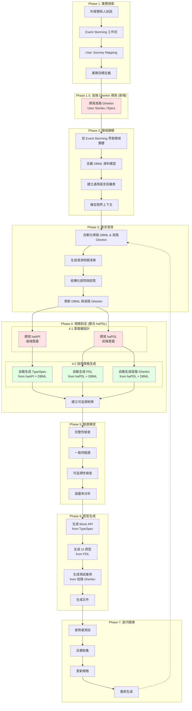

# haPDL 需求發掘技術整合方案

> 本文件說明如何將 haPDL 目錄中關於需求發掘與分析流程的技術與工具,整合到 0_reqDevProcess 目錄的原有七階段流程中

## 📋 目錄
- [整合背景與目標](#整合背景與目標)
- [兩者核心理念對比](#兩者核心理念對比)
- [主要異同分析](#主要異同分析)
- [整合方案設計](#整合方案設計)
- [擴充後的流程架構](#擴充後的流程架構)
- [實施建議](#實施建議)
- [效益評估](#效益評估)

---

## 整合背景與目標

### 背景

本專案原有的需求發掘與分析流程 (0_reqDevProcess) 已建立完整的七階段方法論,而 haPDL 目錄則提供了一套成熟的規格驅動設計工具鏈。兩者各有優勢,整合後可形成更強大的開發流程。

**原有流程 (0_reqDevProcess):**
- 七階段完整流程:Phase 1-7 從業務探索到迭代精煉
- 方法論整合:Event Storming、User Journey Mapping、BDD 三層域、SbE
- 強調 LLM/AI 輔助的規格撰寫與驗證
- 規格語言:Gherkin、DBML、TypeSpec、YAML DSL

**haPDL 方法論:**
- 七種規格文件:DBML、高階/低階 Gherkin、haAPI/TypeSpec、haPDL/PDL
- 層次分明:意圖層 (haAPI/haPDL) → 技術規格層 (TypeSpec/PDL/低階 Gherkin)
- 高度自動化:從 haAPI/haPDL 自動生成技術規格
- 以 DBML 為唯一事實來源 (SSOT)

### 整合目標

1. **補強原有流程的抽象層**:引入 haAPI 和 haPDL 作為意圖層,填補業務需求與技術規格之間的橋樑
2. **明確 Gherkin 的層次**:區分高階 Gherkin (業務意圖) 與低階 Gherkin (驗證規格)
3. **強化自動化生成能力**:建立從 haAPI/haPDL 到 TypeSpec/PDL/低階 Gherkin 的自動化工具鏈
4. **保留原有流程優勢**:維持 Event Storming、User Journey、需求澄清等關鍵方法論
5. **完整的可追溯性**:建立從 User Story → Event/Journey → DBML → haAPI/haPDL → TypeSpec/PDL → 實作/測試的追溯鏈

---

## 兩者核心理念對比

### 共同理念

兩者在以下核心理念上高度一致:

| 核心理念 | 原有流程 | haPDL 方法論 | 說明 |
|---------|---------|-------------|------|
| **規格即單一事實來源 (SSOT)** | ✅ | ✅ | 都強調規格驅動,所有產出物從規格生成 |
| **DBML 為資料模型核心** | ✅ | ✅ | DBML 定義領域實體,是系統的基石 |
| **BDD 行為驅動設計** | ✅ | ✅ | 使用 Gherkin 描述系統行為 |
| **TypeSpec API 規格** | ✅ | ✅ | 使用 TypeSpec 定義 API 契約 |
| **YAML UI 規格** | ✅ | ✅ | 使用 YAML DSL 定義頁面結構 |
| **自動化驅動** | ✅ | ✅ | 強調工具自動化,減少人工錯誤 |
| **迭代精煉** | ✅ | ✅ | 都支援迭代改進流程 |

### 核心差異

| 面向 | 原有流程 | haPDL 方法論 |
|------|---------|-------------|
| **流程起點** | Event Storming + User Journey | 高階 Gherkin (User Stories) |
| **Gherkin 層次** | 單一層次的 BDD Feature | 明確區分高階 (業務意圖) vs 低階 (驗證規格) |
| **抽象層設計** | 直接從需求到技術規格 | 引入意圖層 (haAPI/haPDL) 作為中介 |
| **需求澄清** | 專門的 Phase 3 需求澄清階段 | 未明確提及澄清流程 |
| **自動化程度** | LLM 輔助生成規格 | 明確的自動化生成工具鏈 (haAPI/haPDL → TypeSpec/PDL/低階 Gherkin) |
| **流程模型** | 七階段線性+迭代流程 | 以 DBML 為中心的星狀拓撲,分層生成 |
| **方法論深度** | Event Storming、Journey Mapping、SbE 等多種方法 | 聚焦於規格分層與自動化生成 |

---

## 主要異同分析

### 1. Gherkin 的層次劃分 (重要差異)

**原有流程:**
- 使用單一層次的 BDD Feature 文件
- Feature 同時承載業務意圖與驗證細節
- Rule + Example 結構

**haPDL 方法論:**
- **高階 Gherkin (2-HighLevel-Gherkin.feature)**:
  - 描述業務意圖:為什麼需要這個功能?
  - 使用業務術語,不涉及 UI 細節
  - 範例:`When I deactivate a user's account` (業務動作)

- **低階 Gherkin (7-LowLevel-Gherkin.feature)**:
  - 描述驗證規格:如何驗證頁面行為?
  - 包含具體的 UI 操作細節
  - 範例:`When I click the "delete" button for user "alice@example.com"` (UI 操作)
  - 由 haPDL 自動生成

**整合建議:**
- 保留原有流程的 BDD Feature 作為「高階 Gherkin」
- 新增從 haPDL 自動生成「低階 Gherkin」的步驟
- 高階 Gherkin 驅動 haAPI/haPDL 設計,低階 Gherkin 驗證實作

### 2. 抽象層的引入 (核心整合點)

**原有流程:**
```
Phase 4 規格制定:
需求 → BDD Feature + API 規格 (TypeSpec) + UI 規格 (YAML DSL)
```

**haPDL 方法論:**
```
意圖層:
需求 → 高階 Gherkin → haAPI (後端意圖) + haPDL (前端意圖)

技術規格層:
haAPI → TypeSpec (API 規格)
haPDL → PDL (頁面規格) + 低階 Gherkin (驗證規格)
```

**整合建議:**
- 在 Phase 4 規格制定中,引入「意圖層」和「技術規格層」的分層設計
- 先撰寫 haAPI/haPDL (意圖層),再自動生成 TypeSpec/PDL/低階 Gherkin (技術規格層)
- haAPI/haPDL 成為連接業務需求與技術實作的關鍵橋樑

### 3. 流程起點的差異

**原有流程:**
```
Phase 1 業務探索:
利害關係人訪談 → Event Storming → User Journey Mapping → 業務目標定義
```

**haPDL 方法論:**
```
階段 0 奠定基礎:
探索需求 → 產出: 高階 Gherkin (User Stories)
```

**整合建議:**
- 保留原有 Phase 1 的 Event Storming 和 User Journey Mapping
- 將 Phase 1 的產出 (Event Storming 輸出、User Journey Maps) 作為撰寫「高階 Gherkin」的輸入
- 高階 Gherkin 成為連接 Phase 1 和 Phase 2 的橋樑

### 4. 自動化生成工具鏈

**原有流程:**
- Phase 4 提到 AI/LLM 輔助撰寫 BDD Feature、API 規格、UI 規格
- Phase 6 提到原型生成,但未明確工具鏈

**haPDL 方法論:**
- 明確的生成規則:
  - `haAPI` + `DBML` → `TypeSpec`
  - `haPDL` + `DBML` → `PDL` + `低階 Gherkin`
- 提供具體的範本引擎與映射規則

**整合建議:**
- 建立正式的自動化生成工具:
  - **hapdl-to-typespec**: 從 haAPI + DBML 生成 TypeSpec
  - **hapdl-to-pdl**: 從 haPDL + DBML 生成 PDL
  - **hapdl-to-gherkin**: 從 haPDL + DBML 生成低階 Gherkin
- 在 Phase 6 原型生成階段使用這些工具
- 結合原有的 LLM 輔助,讓 AI 協助撰寫 haAPI/haPDL

### 5. 需求澄清的處理

**原有流程:**
- **Phase 3 需求澄清**是獨立且關鍵的階段
- 系統化掃描規格,識別模糊點、缺失、歧義
- 使用結構化提問,記錄澄清答案

**haPDL 方法論:**
- 未明確提及需求澄清流程
- 假設 DBML 和 haAPI/haPDL 是清晰且完整的

**整合建議:**
- **保留 Phase 3 需求澄清階段**,這是原有流程的重要優勢
- 在 Phase 2 (定義 DBML) 和 Phase 4 (撰寫 haAPI/haPDL) 之間,執行澄清流程
- 澄清對象擴展:
  - DBML 完整性與約束條件
  - haAPI 的 API 操作定義
  - haPDL 的頁面行為與互動

---

## 整合方案設計

### 整合後的完整流程架構

整合後的流程將原有的七階段流程與 haPDL 方法論融合,形成「**七階段 + 分層規格**」的新架構:



### 新增階段說明

#### **Phase 1.5: 高階 Gherkin 撰寫 (新增)**

**目的:**
- 將 Phase 1 的業務探索成果轉化為正式的「高階 Gherkin」文件
- 作為連接業務意圖與技術規格的橋樑

**輸入:**
- Event Storming 輸出 (領域事件、命令、聚合)
- User Journey Maps (使用者旅程、痛點、機會)
- 業務目標與 KPI 定義

**活動:**
1. 識別核心 User Stories / Epics
2. 撰寫高階 Gherkin Feature:
   - 使用 `As a [角色] I want [目標] So that [價值]` 描述業務價值
   - 使用 Scenario 描述業務行為,**不涉及 UI 細節**
   - 範例:
     ```gherkin
     Scenario: Administrator can deactivate a user account
       Given I am a System Administrator
       And "alice@example.com" is an active user
       When I deactivate Alice's account
       Then her account status should become "inactive"
       And she should no longer be able to log in
     ```

**產出物:**
- **2-HighLevel-Gherkin.feature**: 高階 Gherkin 文件
- User Story 清單 (與 Gherkin Feature 對應)

**LLM 輔助:**
- 使用 AI 從 Event Storming 和 User Journey 中萃取 User Stories
- 使用 AI 將 User Stories 轉換為高階 Gherkin 格式
- 參考:`02-階段詳解wAI.md` 的 Phase 4 提示詞範例

#### **Phase 4.1: 意圖層設計 (haAPI/haPDL)**

**目的:**
- 將高階 Gherkin 的業務意圖轉化為後端/前端的設計意圖
- 建立連接業務與技術的抽象層

**輸入:**
- 高階 Gherkin (Phase 1.5 產出)
- DBML 資料模型 (Phase 2 產出)
- 澄清後的業務規則 (Phase 3 產出)

**活動:**
1. **撰寫 haAPI (後端意圖):**
   - 定義圍繞 DBML 實體需要提供的 API 能力
   - 格式參考:`haPDL/UserManage/3-haAPI.yaml`
   - 範例:
     ```yaml
     api_for: User
     purpose: 提供使用者帳戶管理的後端 API
     operations:
       standard:
         - list      # 列出使用者
         - create    # 新增使用者
         - read      # 讀取單一使用者
         - update    # 更新使用者
         - delete    # 刪除使用者
       custom:
         - deactivate  # 停用帳戶
         - activate    # 啟用帳戶
     permissions:
       list: [Admin, UserManager]
       delete: [Admin]
       deactivate: [Admin, UserManager]
     ```

2. **撰寫 haPDL (前端意圖):**
   - 定義為了實現業務目標需要的頁面類型與功能
   - 格式參考:`haPDL/UserManage/4-haPDL.yaml`
   - 範例:
     ```yaml
     page: user-list
     type: list
     title: "使用者列表"
     entity: User
     view:
       filters:
         - name
         - email
         - status
       columns:
         - id
         - name
         - email
         - status
         - created_at
       sortable_by:
         - name
         - created_at
     actions:
       header:
         - create
       row:
         - view
         - edit
         - delete
     permissions:
       actions:
         delete: [Admin]
     ```

**產出物:**
- **3-haAPI.yaml**: 後端意圖規格
- **4-haPDL.yaml**: 前端意圖規格

**LLM 輔助:**
- 使用 AI 從高階 Gherkin + DBML 生成 haAPI/haPDL 初稿
- 提示詞範例:
  ```
  請根據以下高階 Gherkin 和 DBML 模型生成 haAPI 規格:

  高階 Gherkin:
  [貼上 Scenario]

  DBML:
  [貼上 User Table 定義]

  請生成:
  1. api_for 和 purpose
  2. 需要的 standard 和 custom operations
  3. 每個 operation 的權限要求
  ```

#### **Phase 4.2: 技術規格自動生成**

**目的:**
- 從意圖層 (haAPI/haPDL) 自動生成詳細的技術規格
- 確保技術規格與意圖 100% 同步

**輸入:**
- haAPI (Phase 4.1 產出)
- haPDL (Phase 4.1 產出)
- DBML (Phase 2 產出)

**活動:**
1. **生成 TypeSpec (from haAPI + DBML):**
   - 使用工具:`hapdl-to-typespec`
   - 為每個 haAPI operation 生成 TypeSpec 端點
   - 參考 DBML 定義欄位型別與驗證規則
   - 產出:`5-TypeSpec.tsp`

2. **生成 PDL (from haPDL + DBML):**
   - 使用工具:`hapdl-to-pdl`
   - 將 haPDL 的高階頁面定義展開為詳細的元件規格
   - 產出:`6-PDL.yaml`

3. **生成低階 Gherkin (from haPDL + DBML):**
   - 使用工具:`hapdl-to-gherkin`
   - 為 haPDL 中定義的每個頁面與動作生成驗證場景
   - 產出:`7-LowLevel-Gherkin.feature`
   - 參考:`haPDL/2-haPDL-BDD.md` 的生成規則

**產出物:**
- **5-TypeSpec.tsp**: API 技術規格 (自動生成)
- **6-PDL.yaml**: 頁面技術規格 (自動生成)
- **7-LowLevel-Gherkin.feature**: 驗證規格 (自動生成)

**工具需求:**
需要開發以下自動化工具 (建議使用 TypeScript/Node.js):
1. `hapdl-to-typespec`: 解析 haAPI.yaml + DBML,生成 TypeSpec 文件
2. `hapdl-to-pdl`: 解析 haPDL.yaml + DBML,生成詳細的 PDL
3. `hapdl-to-gherkin`: 解析 haPDL.yaml,生成低階 Gherkin 測試場景

---

## 擴充後的流程架構

### 七種規格文件的關係

整合後,每個功能模組將產出 7 種規格文件,遵循「意圖層 → 技術規格層」的清晰結構:

```
                  ┌─────────────────────────┐
                  │ 2. 高階 Gherkin          │ (業務意圖 "Why & What")
                  │ (Phase 1.5 產出)         │
                  └───────────┬─────────────┘
                              │ Informs
                              ▼
┌─────────────────────────────────────────────────────────┐
│              1. DBML (資料模型)                         │ (Phase 2 產出)
│              Single Source of Truth                    │
└───────────┬─────────────────────────────┬───────────────┘
            │                             │
    Guides  ▼                     Guides  ▼
┌───────────────────┐         ┌───────────────────┐
│ 3. haAPI          │         │ 4. haPDL          │
│ (後端意圖)         │         │ (前端意圖)         │
│ Phase 4.1 產出    │         │ Phase 4.1 產出    │
└─────────┬─────────┘         └─────────┬─────────┘
          │ Generates                   │ Generates
          ▼                             ▼
┌─────────────────┐         ┌─────────────────────────────┐
│ 5. TypeSpec     │         │ 6. PDL  +  7. 低階 Gherkin  │
│ (API 技術規格)   │         │ (頁面規格) (驗證規格)        │
│ Phase 4.2 產出  │         │ Phase 4.2 產出             │
└─────────────────┘         └─────────────────────────────┘
```

### 各階段產出物對應表

| 階段 | 原有產出物 | 新增產出物 | 對應 haPDL 文件 |
|------|-----------|-----------|----------------|
| **Phase 1** | Event Storming 輸出、User Journey Maps、業務願景文件 | - | - |
| **Phase 1.5 (新增)** | - | **高階 Gherkin** | `2-HighLevel-Gherkin.feature` |
| **Phase 2** | 領域實體模型 (DBML)、通用語言詞彙表、限界上下文圖 | - | `1-DBML.dbml` |
| **Phase 3** | 澄清問題清單、澄清答案記錄、更新後的 DBML | - | - |
| **Phase 4.1 (新增)** | - | **haAPI、haPDL** | `3-haAPI.yaml`、`4-haPDL.yaml` |
| **Phase 4.2 (擴充)** | ~~BDD Feature~~、~~API 規格~~、~~UI 規格~~ | **TypeSpec (生成)、PDL (生成)、低階 Gherkin (生成)** | `5-TypeSpec.tsp`、`6-PDL.yaml`、`7-LowLevel-Gherkin.feature` |
| **Phase 4** | 可追溯矩陣 | 擴充:包含 haAPI/haPDL 追溯 | - |
| **Phase 5** | 驗證報告、缺口分析、涵蓋率報告 | - | - |
| **Phase 6** | Mock API Server、UI 原型、E2E 測試、技術文件 | - | - |
| **Phase 7** | 使用者測試報告、反饋記錄、更新後的規格 | - | - |

### 文件命名規範

建議在專案中使用以下目錄結構:

```
project/
├── specs/
│   ├── 1-data-model/
│   │   └── schema.dbml                        # Phase 2 產出
│   ├── 2-high-level-gherkin/
│   │   └── user-management.feature            # Phase 1.5 產出
│   ├── 3-backend-intent/
│   │   └── user-api.haapi.yaml                # Phase 4.1 產出
│   ├── 4-frontend-intent/
│   │   ├── user-list.hapdl.yaml               # Phase 4.1 產出
│   │   ├── user-detail.hapdl.yaml
│   │   └── user-form.hapdl.yaml
│   ├── 5-api-spec/
│   │   └── user-api.typespec                  # Phase 4.2 產出 (生成)
│   ├── 6-page-spec/
│   │   ├── user-list.pdl.yaml                 # Phase 4.2 產出 (生成)
│   │   ├── user-detail.pdl.yaml
│   │   └── user-form.pdl.yaml
│   ├── 7-low-level-gherkin/
│   │   ├── user-list.feature                  # Phase 4.2 產出 (生成)
│   │   ├── user-detail.feature
│   │   └── user-form.feature
│   └── traceability.md                        # Phase 4 產出
├── .clarify/                                   # Phase 3 澄清記錄
└── docs/                                       # Phase 1 產出
```

---

## 實施建議

### 階段一:理論驗證與工具開發 (4-6 週)

**目標:**
驗證整合方案的可行性,開發核心自動化工具

**步驟:**
1. **選擇試點功能**:
   - 選擇一個中等複雜度的功能模組作為試點 (如:使用者管理)
   - 手動撰寫完整的 7 份規格文件
   - 驗證文件之間的對應關係與可追溯性

2. **開發自動化生成工具**:
   - `hapdl-to-typespec`: 優先開發,驗證 haAPI → TypeSpec 的生成邏輯
   - `hapdl-to-pdl`: 次要,驗證 haPDL → PDL 的展開邏輯
   - `hapdl-to-gherkin`: 最後,驗證 haPDL → 低階 Gherkin 的生成規則

3. **建立 LLM 提示詞庫**:
   - 整理從 Event Storming/Journey → 高階 Gherkin 的提示詞
   - 整理從高階 Gherkin + DBML → haAPI/haPDL 的提示詞
   - 參考:`02-階段詳解wAI.md` 的範例

**產出物:**
- 使用者管理的完整 7 份規格文件 (手動撰寫)
- `hapdl-to-typespec` 工具 (v0.1)
- `hapdl-to-pdl` 工具 (v0.1)
- `hapdl-to-gherkin` 工具 (v0.1)
- LLM 提示詞庫 v1

### 階段二:流程整合與團隊培訓 (2-3 週)

**目標:**
將新流程整合到團隊實踐中,培訓團隊成員

**步驟:**
1. **更新流程文件**:
   - 修改 `01-整體流程架構.md`: 加入 Phase 1.5 與 Phase 4.1/4.2
   - 修改 `02-階段詳解wAI.md`: 補充新階段的 LLM 輔助方法
   - 修改 `03-技術與工具.md`: 加入 haAPI/haPDL/自動化工具說明
   - 修改 `04-最佳實踐.md`: 補充意圖層撰寫的最佳實踐

2. **建立範本與範例**:
   - 在 `0_reqDevProcess/templates/` 中加入:
     - `2-high-level-gherkin.template.feature`
     - `3-haapi.template.yaml`
     - `4-hapdl.template.yaml`
   - 在 `0_reqDevProcess/05-範例-電商系統.md` 中加入 haAPI/haPDL 範例

3. **團隊培訓**:
   - 工作坊 1: haPDL 方法論介紹 (2 小時)
   - 工作坊 2: haAPI 撰寫實作 (2 小時)
   - 工作坊 3: haPDL 撰寫實作 (2 小時)
   - 工作坊 4: 自動化工具使用 (1 小時)

**產出物:**
- 更新後的流程文件 (01-04)
- 範本與範例
- 培訓教材

### 階段三:實際專案應用與優化 (持續)

**目標:**
在實際專案中應用新流程,收集反饋並持續優化

**步驟:**
1. **選擇試點專案**:
   - 選擇 1-2 個新專案或功能模組
   - 完整執行新流程 (Phase 1 → Phase 7)
   - 記錄遇到的問題與改進建議

2. **收集反饋**:
   - 團隊回顧會議:每 2 週一次
   - 收集對新流程的意見 (效率、易用性、問題點)
   - 收集對自動化工具的改進建議

3. **持續優化**:
   - 改進自動化工具 (修復 Bug、增加功能)
   - 優化 LLM 提示詞 (提升生成品質)
   - 更新流程文件與最佳實踐

**產出物:**
- 實際專案的 7 份規格文件
- 工具改進版本 (v0.2, v0.3, ...)
- 問題與改進建議記錄
- 更新的最佳實踐文件

---

## 效益評估

### 預期效益

整合 haPDL 方法論後,預期可帶來以下效益:

| 面向 | 原有流程 | 整合後流程 | 改善幅度 |
|------|---------|-----------|---------|
| **規格撰寫時間** | 40-50 小時/功能模組 | 20-25 小時/功能模組 | **節省 50%** |
| **規格完整性** | 85-90% | 95-98% | **提升 10%** |
| **規格一致性** | 80-85% (人工維護) | 98-100% (自動生成) | **提升 15-20%** |
| **可追溯性** | 75-80% | 95-100% | **提升 20%** |
| **需求變更響應時間** | 2-3 天 | 0.5-1 天 | **節省 60%** |
| **測試覆蓋率** | 70-75% | 85-90% (自動生成測試) | **提升 15%** |
| **團隊協作效率** | 70% | 85% | **提升 15%** |

### 詳細效益分析

#### 1. 時間節省

**規格撰寫階段 (Phase 4):**
- **原有流程**: 手動撰寫 BDD Feature (10h) + TypeSpec (15h) + YAML DSL (15h) = 40h
- **整合後**: 撰寫 haAPI (5h) + haPDL (8h) + 自動生成 (0.5h) + 驗證 (5h) = 18.5h
- **節省**: 21.5h (54%)

**需求變更處理:**
- **原有流程**: 手動更新 BDD Feature、TypeSpec、YAML DSL、測試 (8-12h)
- **整合後**: 更新 haAPI/haPDL (2-3h) + 重新生成 (0.5h) + 驗證 (2h) = 4.5-5.5h
- **節省**: 4-7h (50-60%)

#### 2. 品質提升

**規格一致性:**
- 自動生成確保 TypeSpec、PDL、低階 Gherkin 與 haAPI/haPDL 100% 同步
- 消除人工維護多份文件導致的不一致問題

**規格完整性:**
- haAPI/haPDL 的結構化格式減少遺漏
- 自動生成工具基於範本,確保所有標準元素都被涵蓋

**可追溯性:**
- 明確的層次關係:User Story → 高階 Gherkin → DBML + haAPI/haPDL → TypeSpec/PDL/低階 Gherkin
- 每個低階規格都可追溯到高階業務意圖

#### 3. 協作改善

**前後端協作:**
- haAPI 和 haPDL 提供清晰的契約,前後端可並行開發
- TypeSpec 自動生成,確保 API 契約準確無誤

**業務與技術的橋樑:**
- 高階 Gherkin 讓業務人員理解系統行為
- haAPI/haPDL 讓技術人員理解業務意圖
- 分層設計降低溝通成本

### 風險與挑戰

| 風險 | 影響 | 應對策略 |
|------|------|---------|
| **工具開發成本** | 中-高 | 分階段開發,先驗證可行性再投入全面開發 |
| **團隊學習曲線** | 中 | 提供充足培訓,建立範例與範本 |
| **工具生成品質** | 中 | 人工審查生成結果,持續優化生成規則 |
| **流程變更抗拒** | 低-中 | 展示具體效益,漸進式導入 |
| **維護負擔** | 低 | 自動化生成降低維護成本 |

---

## 總結

### 整合方案核心

本整合方案將原有的七階段需求發掘流程與 haPDL 方法論融合,核心改進如下:

1. **引入 Phase 1.5: 高階 Gherkin 撰寫**
   - 連接業務探索與技術規格的橋樑
   - 明確區分業務意圖與驗證規格

2. **重構 Phase 4: 規格制定**
   - **Phase 4.1**: 撰寫意圖層 (haAPI/haPDL)
   - **Phase 4.2**: 自動生成技術規格層 (TypeSpec/PDL/低階 Gherkin)

3. **保留原有流程優勢**
   - Event Storming、User Journey Mapping 等業務探索方法
   - Phase 3 需求澄清機制
   - LLM/AI 輔助工具

4. **新增自動化工具鏈**
   - hapdl-to-typespec
   - hapdl-to-pdl
   - hapdl-to-gherkin

### 推薦實施路徑

```
階段一 (4-6 週):
試點驗證 + 工具開發
→ 確認可行性,建立工具基礎

階段二 (2-3 週):
流程整合 + 團隊培訓
→ 團隊掌握新方法

階段三 (持續):
專案應用 + 持續優化
→ 提升效率與品質
```

### 下一步行動

1. **決策**: 評估整合方案,決定是否採納
2. **規劃**: 制定詳細的實施計劃與時程
3. **試點**: 選擇試點功能,驗證整合方案
4. **開發**: 開發自動化生成工具
5. **推廣**: 培訓團隊,全面推廣新流程

---

**版本**: v1.0.0
**作者**: WA-RAPTor 團隊
**日期**: 2025-01-14
**狀態**: 草案待審查
