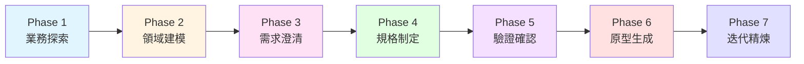

# 需求發掘與分析流程 (Requirements Discovery & Analysis Process)

> 本目錄包含 WA-RAPTor 專案的完整需求發掘與分析流程文件

## 📚 文件索引

### 核心流程文件
- **[01-整體流程架構.md](01-整體流程架構.md)** - 完整流程概覽與架構設計
- **[02-階段詳解wAI.md](02-階段詳解wAI.md)** - 各階段與AI共構的詳細說明與實踐指南
- **[03-技術與工具.md](03-技術與工具.md)** - 使用的技術、工具與方法論(含AI工具)
- **[04-最佳實踐.md](04-最佳實踐.md)** - 注意事項與最佳實踐指南
- **[06-haPDL整合方案.md](06-haPDL整合方案.md)** - haPDL 七規格檔案體系的整合方案與擴展架構

### 範例與模板
- **[05-範例：電商系統.md](05-範例-電商系統.md)** - 完整的電商系統需求分析範例
- **[templates/](templates/)** - 各階段的模板檔案


## 🎯 流程概述

本需求發掘與分析流程整合了以下方法論：

1. **BDD 三層域分析** - Problem Domain、Transition Zone、Solution Domain
2. **Specification by Example (SBE)** - 以具體範例驅動規格化
3. **Event Storming** - 協作式領域探索與事件建模
4. **User Journey Mapping** - 使用者體驗與情感旅程分析
5. **User Flow Analysis** - 使用者流程與決策路徑分析
6. **API-First Design** - API 優先設計方法論
7. **Semantic Parsing** - 語意解析與自動化轉換

## 🔄 七大階段流程



### Phase 1: 業務探索 (Business Discovery)
**目標**：理解業務願景、識別利害關係人、收集初步需求

**關鍵活動**：
- 利害關係人訪談
- 業務目標定義
- User Journey Mapping
- Event Storming 工作坊

**產出物**：
- 業務願景文件
- 利害關係人地圖 (RACI)
- User Journey Maps
- Event Storming 輸出

### Phase 2: 領域建模 (Domain Modeling)
**目標**：建立領域知識模型、識別核心實體與關係

**關鍵活動**：
- 從 Event Storming 萃取領域實體
- 定義實體關係
- 建立通用語言詞彙表
- 識別聚合與限界上下文
- 角色/權限/存取控制建模 (haARM)

**產出物**：
- 領域實體模型 (DBML)
- 通用語言詞彙表
- 限界上下文圖
- 聚合設計文件
- 角色/權限/存取控制模型 (haARM)

### Phase 3: 需求澄清 (Requirements Clarification)
**目標**：識別模糊點、解決歧義、補全缺失資訊

**關鍵活動**：
- 自動化需求掃描 (Discovery)
- 結構化提問與回答
- 邊界條件識別
- 業務規則確認

**產出物**：
- 澄清問題列表
- 澄清答案記錄
- 更新後的領域模型
- 業務規則清單

### Phase 4: 規格制定 (Specification Formulation)
**目標**：將需求轉換為正式、可執行的規格文件

**關鍵活動**：
- 撰寫 BDD Feature 文件
- 定義 Gherkin Scenarios
- 設計 API 規格 (TypeSpec/OpenAPI)
- 定義 UI/UX 規格

**產出物**：
- BDD Feature 文件 (Gherkin)
- API 規格 (TypeSpec/OpenAPI)
- UI 頁面規格 (DSL)
- 資料模型規格 (DBML)

### Phase 5: 驗證確認 (Validation & Verification)
**目標**：確保規格完整性、一致性與可執行性

**關鍵活動**：
- 規格完整性檢查
- 一致性驗證
- 可追溯性檢查
- 涵蓋率分析

**產出物**：
- 驗證報告
- 缺口分析
- 修正建議
- 涵蓋率報告

### Phase 6: 原型生成 (Prototype Generation)
**目標**：從規格自動生成可互動原型與測試

**關鍵活動**：
- API Mock Server 生成
- UI 原型生成
- 測試案例生成
- 文件生成

**產出物**：
- 互動式原型
- Mock API Server
- 自動化測試
- 技術文件

### Phase 7: 迭代精煉 (Iterative Refinement)
**目標**：收集反饋、持續改進規格與原型

**關鍵活動**：
- 使用者測試
- 反饋收集
- 規格更新
- 原型重新生成

**產出物**：
- 使用者測試報告
- 反饋記錄
- 更新後的規格
- 精煉後的原型

## 🛠️ 核心工具與技術

### 規格語言
- **Gherkin** - BDD 場景描述
- **DBML** - 資料庫模型定義
- **TypeSpec** - API 規格定義
- **YAML** - 頁面 DSL 定義
- **haARM** - 角色/權限/存取控制建模（橫切面規格，`.haarm.yaml`）

### 分析技術
- **Event Storming** - 協作式領域探索
- **User Story Mapping** - 功能優先級排序
- **Impact Mapping** - 目標與功能對應
- **Three Amigos** - 跨角色協作討論

### 自動化工具
- **NLP 語意解析器** - 自動需求萃取
- **規格掃描器** - 自動缺口偵測
- **程式碼生成器** - 從規格生成程式碼
- **原型生成器** - 自動化原型建立

## 📊 三層域架構

本流程遵循 BDD 的三層域架構：

```
┌─────────────────────────────────────┐
│   Problem Domain (業務問題域)      │
│   • 業務願景與目標                  │
│   • User Journey                    │
│   • 利害關係人需求                  │
└─────────────────────────────────────┘
                 ↓
┌─────────────────────────────────────┐
│   Transition Zone (規格轉換層)     │
│   • BDD Scenarios (Gherkin)        │
│   • API 規格 (TypeSpec)             │
│   • 資料模型 (DBML)                 │
│   • UI 規格 (DSL)                   │
│   • 角色/權限模型 (haARM) ←橫切面   │
└─────────────────────────────────────┘
                 ↓
┌─────────────────────────────────────┐
│   Solution Domain (解決方案域)     │
│   • 程式碼實作                      │
│   • 自動化測試                      │
│   • 部署配置                        │
└─────────────────────────────────────┘
```

## 🎓 學習路徑

**初學者**：
1. 閱讀 [01-整體流程架構.md](01-整體流程架構.md) 了解完整流程
2. 參考 [05-範例：電商系統.md](05-範例：電商系統.md) 學習實際應用
3. 使用 templates/ 中的模板開始實踐

**進階使用者**：
1. 深入研究 [02-階段詳解.md](02-階段詳解.md) 各階段細節
2. 學習 [03-技術與工具.md](03-技術與工具.md) 的進階技術
3. 參考 [04-最佳實踐.md](04-最佳實踐.md) 優化流程

**團隊負責人**：
1. 了解完整流程以規劃團隊工作
2. 根據專案特性客製化流程
3. 建立團隊的標準化模板與檢查清單

## 🔗 相關資源

### WA-RAPTor 專案文件
- [BDD 三層域視覺化分析](../BDD/BDD-三层域可视化分析.md)
- [BDD 流程拆解與三層域分類](../BDD/BDD-流程拆解与三层域分类.md)
- [Specification by Example](../BDD/SbE.md)
- [Journey Flow 整合架構](../Journey_Flow_Integration_Architecture.md)
- [BDD 驅動的規格生成架構](../BDD_Driven_Specification_Architecture.md)
- [API-First 方法論](../API1st.md)
- [WA-RAPTor 2.0 PRD](../WA-RAPTor_2.0_PRD.md)
- [haARM v2 規範](haARM-Specification_v2.md)
- [haARM 整合方案](07-haARM整合方案.md)

### 外部參考
- [Event Storming 官方網站](https://www.eventstorming.com/)
- [Cucumber BDD 文件](https://cucumber.io/docs/bdd/)
- [TypeSpec 官方文件](https://typespec.io/)
- [DBML 語法指南](https://www.dbml.org/)

## 📝 變更記錄

### v1.2.0 (2026-04-11)
- 新增 haARM v2 橫切面規格整合
- Phase 2 新增角色/權限/存取控制建模為標準產出物
- 擴展 Phase 4/5 模板以支援 haARM 引用驗證
- 建立從 Phase 1 角色識別 → Phase 2 haARM 建模 → Phase 4 規格引用 → Phase 5 一致性驗證的完整追溯鏈

### v1.1.0 (2025-11-14)
- 新增 haPDL 七規格檔案體系整合方案
- 引入 Phase 1.5：High-level Gherkin 撰寫階段
- 擴展 Phase 4：新增 Intent Layer 設計子階段（haAPI + haPDL）
- 建立七規格檔案架構：DBML → High-level Gherkin → haAPI/haPDL → TypeSpec/PDL/Low-level Gherkin
- 提供自動化工具鏈建議與實施路線圖

### v1.0.0 (2025-10-06)
- 初始版本
- 整合 BDD、Event Storming、User Journey、API-First 等方法論
- 建立完整的七階段流程
- 提供範例與模板

## 🤝 貢獻指南

本流程文件持續演進，歡迎貢獻改進建議：
1. 在專案中實踐此流程
2. 記錄遇到的問題與解決方案
3. 提出改進建議或新增最佳實踐
4. 分享成功案例

## 📧 聯絡方式

如有問題或建議，請透過專案 Issue 系統回報。

---

**版權聲明**：本文件屬於 WA-RAPTor 專案，採用 Apache 2.0 授權。
