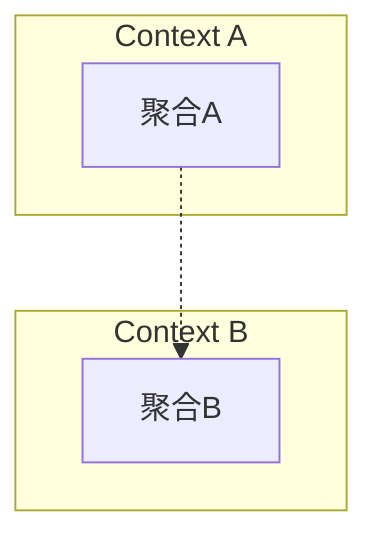
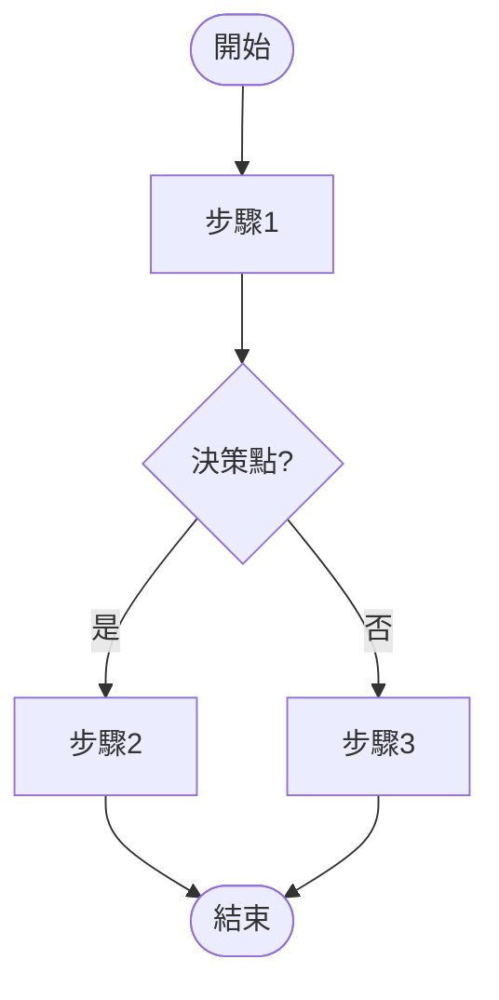
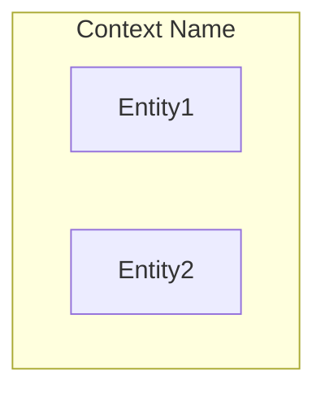

# 需求規格文件標準架構 (Requirements Specification Standard Template)

> 本文件定義各專案執行時需求規格文件的標準章節結構，  
> 依據 0_reqDevProcess 七階段流程 + haPDL 整合方案設計。

---

## 📋 目錄

- [0. 文件控制](#0-文件控制)
- [1. 專案概覽 (Project Overview)](#1-專案概覽-project-overview)
- [2. 業務探索產出 (Phase 1 — Business Discovery)](#2-業務探索產出-phase-1--business-discovery)
- [3. 高階行為規格 (Phase 1.5 — High-Level Gherkin)](#3-高階行為規格-phase-15--high-level-gherkin)
- [4. 領域建模 (Phase 2 — Domain Modeling)](#4-領域建模-phase-2--domain-modeling)
- [5. 需求澄清記錄 (Phase 3 — Requirements Clarification)](#5-需求澄清記錄-phase-3--requirements-clarification)
- [6. 規格制定 (Phase 4 — Specification Formulation)](#6-規格制定-phase-4--specification-formulation)
- [7. 驗證確認 (Phase 5 — Validation & Verification)](#7-驗證確認-phase-5--validation--verification)
- [8. 原型生成 (Phase 6 — Prototype Generation)](#8-原型生成-phase-6--prototype-generation)
- [9. 迭代精煉 (Phase 7 — Iterative Refinement)](#9-迭代精煉-phase-7--iterative-refinement)
- [附錄 A：目錄結構規範](#附錄-a目錄結構規範)
- [附錄 B：品質閘門檢查清單](#附錄-b品質閘門檢查清單)
- [附錄 C：RACI 角色與職責矩陣](#附錄-c-raci-角色與職責矩陣)

---

## 0. 文件控制

### 0.1 基本資訊

| 項目 | 內容 |
|------|------|
| 專案名稱 | `<專案名稱>` |
| 文件版本 | `v0.1.0` |
| 建立日期 | `YYYY-MM-DD` |
| 最後更新 | `YYYY-MM-DD` |
| 負責人 | `<姓名 / 角色>` |
| 狀態 | 草稿 / 審查中 / 已核定 |

### 0.2 變更記錄

| 版本 | 日期 | 變更摘要 | 作者 |
|------|------|----------|------|
| v0.1.0 | YYYY-MM-DD | 初始版本 | |

### 0.3 審核與簽核

| 角色 | 姓名 | 狀態 | 日期 |
|------|------|------|------|
| PO | | ☐ | |
| BA | | ☐ | |
| 架構師 | | ☐ | |
| QA | | ☐ | |

### 0.4 參考文件

| 文件名稱 | 位置 | 說明 |
|----------|------|------|
| | | |

---

## 1. 專案概覽 (Project Overview)

### 1.1 專案願景 (Vision)

> 一段話描述本專案要解決的核心問題與願景。

### 1.2 專案目標 (Goals)

> 使用 SMART 框架，列出具體、可衡量的業務目標。

| 目標編號 | 目標描述 | 衡量指標 (KPI) | 目標值 | 期限 |
|---------|---------|---------------|-------|------|
| G-001 | | | | |
| G-002 | | | | |

### 1.3 價值主張 (Value Proposition)

> 說明本專案對使用者、業務與組織的核心價值。

### 1.4 專案範圍 (Scope)

#### 1.4.1 在範圍內 (In Scope)

- 

#### 1.4.2 不在範圍內 (Out of Scope)

- 

### 1.5 關鍵成功標準 (Success Criteria)

| 標準編號 | 標準描述 | 驗證方法 |
|---------|---------|---------|
| SC-001 | | |

### 1.6 假設與限制 (Assumptions & Constraints)

#### 假設
- 

#### 限制
- 

---

## 2. 業務探索產出 (Phase 1 — Business Discovery)

### 2.1 利害關係人地圖 (Stakeholder Map)

#### 2.1.1 角色識別

| 角色名稱 | 類型 | 關注點 | 影響力 |
|---------|------|-------|--------|
| | 內部/外部 | | 高/中/低 |

#### 2.1.2 RACI 矩陣

> 參見 [附錄 C](#附錄-c-raci-角色與職責矩陣) 的完整 RACI 矩陣。

### 2.2 利害關係人訪談記錄

> 每位受訪者產出一份訪談記錄，格式如下：

#### 訪談 #N — `<受訪者角色>`

| 項目 | 內容 |
|------|------|
| 受訪者 | |
| 訪談日期 | |
| 訪談者 | |

**訪談摘要：**

- 

**痛點清單（依影響程度排序）：**

| 痛點 | 影響程度 | 頻率 | 相關流程 |
|------|---------|------|---------|
| | 高/中/低 | | |

**待澄清事項：**

- 

### 2.3 Event Storming 輸出

#### 2.3.1 領域事件清單

| 事件名稱 (過去式) | 觸發命令 | 觸發角色 | 聚合 | 分類 |
|------------------|---------|---------|------|------|
| | | | | 核心流程/例外處理/通知 |

#### 2.3.2 聚合識別

| 聚合名稱 | 包含事件 | 相關命令 | 不變條件 |
|---------|---------|---------|---------|
| | | | |

#### 2.3.3 策略/自動化規則

| 策略名稱 | 觸發事件 | 產生事件 | 規則描述 |
|---------|---------|---------|---------|
| | | | |

#### 2.3.4 限界上下文 (初步)

> 使用 Mermaid 圖表呈現初步識別的系統邊界。



### 2.4 User Journey Maps

> 每個主要角色 (Persona) 建立一份 User Journey Map。

#### Journey Map #N — `<Persona 名稱>`

**Persona 描述：**
- 角色：
- 目標：
- 行為特徵：

| Stage | Actions | Thoughts | Emotions (-5~+5) | Pain Points | Opportunities |
|-------|---------|----------|-------------------|-------------|---------------|
| | | | | | |

### 2.5 User Flow Analysis

> 分析使用者在系統中的操作路徑與決策點。

#### User Flow #N — `<流程名稱>`

> 使用 Mermaid flowchart 描繪使用者流程。



### 2.6 業務 KPI 定義

| KPI 編號 | 名稱 | 定義 | 當前值 | 目標值 | 衡量方式 |
|---------|------|------|-------|-------|---------|
| KPI-001 | | | | | |

---

## 3. 高階行為規格 (Phase 1.5 — High-Level Gherkin)

> 將業務探索成果轉化為正式的高階 Gherkin 文件。  
> **重點**：描述業務意圖 (Why & What)，不涉及 UI 操作細節。

### 3.1 Epic / User Story 清單

| Story ID | Epic | User Story | 優先級 | 對應 Journey Stage |
|----------|------|-----------|--------|-------------------|
| US-001 | | As a `<角色>` I want `<目標>` So that `<價值>` | MoSCoW | |

### 3.2 高階 Gherkin Feature 文件

> 每個核心功能模組產出一份 `.feature` 檔案。  
> 存放路徑：`specs/2-high-level-gherkin/<feature-name>.feature`

**範例結構：**

```gherkin
Feature: <功能名稱>
  As a <角色>
  I want <目標>
  So that <業務價值>

  Scenario: <業務場景描述>
    Given <前置條件 — 業務狀態>
    When <業務動作>
    Then <預期結果 — 業務結果>
```

> [!NOTE]
> 高階 Gherkin 使用業務語言，不涉及按鈕、頁面等 UI 細節。  
> 低階 Gherkin（含 UI 操作）將在 Phase 4.2 自動生成。

---

## 4. 領域建模 (Phase 2 — Domain Modeling)

### 4.1 領域實體模型 (DBML — Single Source of Truth)

> DBML 作為唯一事實來源 (SSOT)，定義所有實體、屬性、關係與約束。  
> 存放路徑：`specs/1-data-model/schema.dbml`

**範例結構：**

```dbml
Table <EntityName> {
  <field_name> <type> [constraints, note: '說明']

  Indexes {
    <field_name>
  }

  Note: '''
  <實體說明>
  不變條件:
  - <invariant 1>
  - <invariant 2>
  '''
}

Ref: <Table1>.<field> > <Table2>.<field> [note: '關係說明']
```

### 4.2 通用語言詞彙表 (Ubiquitous Language)

| 術語 | 英文 | 定義 | 別名 | 範例 |
|------|------|------|------|------|
| | | | | |

### 4.3 聚合設計 (Aggregate Design)

| 聚合根 | 子實體 | 不變條件 | 備註 |
|--------|--------|---------|------|
| | | | |

### 4.4 限界上下文 (Bounded Contexts)

> 使用 Mermaid 圖表呈現最終的限界上下文劃分及上下文間關係。



| 上下文 | 包含實體 | 依賴的上下文 | 說明 |
|--------|---------|-------------|------|
| | | | |

---

## 5. 需求澄清記錄 (Phase 3 — Requirements Clarification)

### 5.1 澄清掃描報告

#### 5.1.1 資料模型檢查結果

| 檢查項 | 狀態 | 說明 |
|--------|------|------|
| A1 — 實體完整性 | ✅/❌ | |
| A2 — 屬性定義 | ✅/❌ | |
| A3 — 屬性值邊界條件 | ✅/❌ | |
| A4 — 跨屬性不變條件 | ✅/❌ | |
| A5 — 關係與唯一性 | ✅/❌ | |
| A6 — 生命週期與狀態 | ✅/❌ | |

#### 5.1.2 功能模型檢查結果

| 檢查項 | 狀態 | 說明 |
|--------|------|------|
| B1 — 功能識別 | ✅/❌ | |
| B2 — 規則完整性 | ✅/❌ | |
| B3 — 例子覆蓋度 | ✅/❌ | |
| B4 — 邊界條件覆蓋 | ✅/❌ | |
| B5 — 錯誤與異常處理 | ✅/❌ | |

### 5.2 澄清問題清單

> 存放路徑：`.clarify/` 目錄

| 問題編號 | 問題描述 | 定位 | 優先級 | 狀態 | 回答 |
|---------|---------|------|--------|------|------|
| CQ-001 | | ERM/Feature | High/Med/Low | 已解決/待解決 | |

#### 問題詳情格式

每個問題使用獨立 Markdown 檔案記錄：

```markdown
# 澄清問題
<問題描述>

# 定位
<ERM / Feature 中的定位>

# 多選題
| 選項 | 描述 |
|------|------|
| A | |
| B | |
| C | |
| Short | 提供其他答案（<=5 字） |

# 影響範圍
- <受影響的元件或規格>

# 優先級
<High/Medium/Low>
- <理由>
```

### 5.3 業務規則清單

| 規則編號 | 規則描述 | 所屬 Feature | 類型 | 約束條件 |
|---------|---------|-------------|------|---------|
| BR-001 | | | 前置條件/後置條件/不變條件 | |

### 5.4 澄清後更新摘要

> 記錄因澄清而導致的 DBML、Gherkin 或業務規則的具體變更。

---

## 6. 規格制定 (Phase 4 — Specification Formulation)

### 6.1 意圖層規格 (Phase 4.1 — Intent Layer)

#### 6.1.1 後端意圖 — haAPI

> 定義圍繞 DBML 實體需要提供的 API 能力。  
> 存放路徑：`specs/3-backend-intent/<entity>-api.haapi.yaml`

**範例結構：**

```yaml
api_for: <EntityName>
purpose: <提供什麼後端能力>
operations:
  standard:
    - list
    - create
    - read
    - update
    - delete
  custom:
    - <自訂操作>
permissions:
  <operation>: [<Role1>, <Role2>]
```

#### 6.1.2 前端意圖 — haPDL

> 定義為實現業務目標所需的頁面類型與功能。  
> 存放路徑：`specs/4-frontend-intent/<page-name>.hapdl.yaml`

**範例結構：**

```yaml
page: <page-id>
type: list | detail | form
title: "<頁面標題>"
entity: <EntityName>
view:
  filters: [<field1>, <field2>]
  columns: [<field1>, <field2>]
  sortable_by: [<field1>]
actions:
  header: [create]
  row: [view, edit, delete]
permissions:
  actions:
    <action>: [<Role>]
```

### 6.2 技術規格層 (Phase 4.2 — Technical Specifications)

> [!IMPORTANT]
> 技術規格層可從意圖層 + DBML 自動生成，也可手動撰寫。  
> 生成路徑：`haAPI + DBML → TypeSpec`，`haPDL + DBML → PDL + 低階 Gherkin`

#### 6.2.1 BDD Feature 文件 (Gherkin)

> 存放路徑：`specs/features/<feature-name>.feature`（手動撰寫或從高階 Gherkin 精煉）

**格式要求：**
- 使用 `Rule` + `Example` 結構（非 Scenario）
- 每個 Rule 至少 2 個 Example（成功 + 失敗/邊界）
- 使用 `Background` 減少重複
- 使用 `Data Table` 提供測試資料

```gherkin
Feature: <功能名稱>
  <業務價值描述>

  Background:
    Given <共用前置條件>

  Rule: <業務規則描述>

    Example: <成功案例>
      Given <前置條件>
      When <操作>
      Then <預期結果>

    Example: <失敗/邊界案例>
      Given <前置條件>
      When <操作>
      Then <預期錯誤>
```

#### 6.2.2 API 規格 (TypeSpec / OpenAPI)

> 存放路徑：`specs/5-api-spec/<api-name>.tsp`（自動生成或手動撰寫）

**必備內容：**
- Model 定義（與 DBML 實體對應）
- 請求/回應模型
- 端點定義（含 HTTP Method）
- 驗證規則（`@minValue`, `@maxLength` 等）
- 錯誤回應定義
- 分頁查詢參數

#### 6.2.3 UI 頁面規格 (PDL / YAML DSL)

> 存放路徑：`specs/6-page-spec/<page-name>.pdl.yaml`（自動生成或手動撰寫）

**必備內容：**
- 頁面基本資訊（id, name, type, route）
- 認證/授權需求
- 資料來源綁定
- 版面配置（Layout）
- 元件定義（DataTable, Form, Summary 等）
- 操作行為（Actions & Effects）
- 驗證規則（Validation）
- 生命週期鉤子（Hooks）

#### 6.2.4 低階 Gherkin (驗證規格)

> 存放路徑：`specs/7-low-level-gherkin/<page-name>.feature`（自動生成）

**說明：**
- 包含具體 UI 操作細節（按鈕點擊、表單輸入等）
- 從 haPDL + DBML 自動生成
- 用於 E2E 測試自動化

#### 6.2.5 資料模型規格 (完善後的 DBML)

> DBML 在各階段持續精煉，Phase 4 完成後應包含：
> - 所有實體與屬性（含型別、約束、預設值）
> - 所有關係（Ref）
> - 所有索引（Indexes）
> - 所有不變條件與狀態轉換規則（Note）

### 6.3 可追溯矩陣 (Traceability Matrix)

> 存放路徑：`specs/traceability.md`

#### 6.3.1 User Journey → Features

| Journey Stage | Pain Point | Feature | Priority |
|---------------|------------|---------|----------|
| | | | |

#### 6.3.2 Event Storming → Entities

| Domain Event | Command | Aggregate | Entity | DBML Table |
|--------------|---------|-----------|--------|------------|
| | | | | |

#### 6.3.3 Features → API Endpoints

| Feature | Rule | API Endpoint | Method | TypeSpec Interface |
|---------|------|--------------|--------|--------------------|
| | | | | |

#### 6.3.4 Features → UI Pages

| Feature | Rule | Page | Route | YAML File |
|---------|------|------|-------|-----------|
| | | | | |

#### 6.3.5 BDD Examples → Test Cases

| Feature | Example | Test Type | Tool |
|---------|---------|-----------|------|
| | | E2E/Unit/Integration | |

---

## 7. 驗證確認 (Phase 5 — Validation & Verification)

### 7.1 完整性檢查

#### 7.1.1 BDD Features 完整性

- [ ] 每個 Feature 都有明確的業務價值描述
- [ ] 每個 Feature 至少有一個 Rule
- [ ] 每個 Rule 至少有一個 Example
- [ ] 所有 Example 都使用 Given-When-Then 結構

#### 7.1.2 API 規格完整性

- [ ] 所有 API 端點都有定義
- [ ] 所有請求/回應模型都已定義
- [ ] 所有錯誤情況都有對應的錯誤回應
- [ ] 所有驗證規則都已定義

#### 7.1.3 資料模型完整性

- [ ] 所有實體都已定義
- [ ] 所有屬性都有型別與約束
- [ ] 所有關係都已建立
- [ ] 所有不變條件都已記錄

#### 7.1.4 UI 規格完整性

- [ ] 所有頁面都有對應的規格檔案
- [ ] 所有互動都有定義的 Actions
- [ ] 所有資料綁定都已定義
- [ ] 所有驗證規則都已定義

### 7.2 一致性驗證

#### 7.2.1 術語一致性

- [ ] 相同概念在所有規格中使用相同術語
- [ ] 通用語言詞彙表涵蓋所有核心概念

#### 7.2.2 資料一致性

- [ ] BDD Example 中的資料符合 DBML 約束
- [ ] API 規格的欄位與 DBML 實體對應
- [ ] UI 規格的欄位與 API 規格對應

#### 7.2.3 行為一致性

- [ ] API 端點的行為與 BDD Feature 一致
- [ ] UI 頁面的行為與 BDD Example 一致
- [ ] 錯誤處理在各層級保持一致

### 7.3 可追溯性檢查

- [ ] 每個 User Journey Pain Point 都有對應的 Feature
- [ ] 每個 Event Storming 聚合都有對應的 DBML 實體
- [ ] 每個 BDD Rule 都有對應的 API 驗證邏輯
- [ ] 每個 BDD Example 都有對應的測試案例

### 7.4 涵蓋率分析

| 指標 | 已涵蓋 | 總數 | 涵蓋率 | 目標 |
|------|--------|------|-------|------|
| User Journey Stages | | | | ≥ 90% |
| Pain Points 處理 | | | | ≥ 80% |
| Rules 有 Example | | | | ≥ 80% |
| 邊界條件 Examples | | | | ≥ 70% |
| API 端點定義 | | | | ≥ 80% |
| 錯誤回應定義 | | | | ≥ 80% |

### 7.5 驗證報告

| 驗證項目 | 通過率 | 未解決問題數 | 備註 |
|---------|--------|------------|------|
| 完整性 | | | 門檻 ≥ 90% |
| 一致性 | | | 門檻 ≥ 95% |
| 可追溯性 | | | 門檻 ≥ 90% |
| 涵蓋率 | | | 門檻 ≥ 80% |

---

## 8. 原型生成 (Phase 6 — Prototype Generation)

### 8.1 生成產出物清單

| 產出物 | 來源規格 | 生成工具 | 存放路徑 | 狀態 |
|--------|---------|---------|---------|------|
| Mock API Server | TypeSpec | Express.js + Faker.js | | |
| UI 原型 | PDL (YAML DSL) | React/Vue + UI Framework | | |
| E2E 測試 | 低階 Gherkin | Playwright + Cucumber | | |
| API 文件 | TypeSpec → OpenAPI | Redoc / Swagger UI | | |
| 資料庫 Schema | DBML | DBML → SQL | | |

### 8.2 原型驗證結果

| 驗證項目 | 結果 | 備註 |
|---------|------|------|
| Mock API Server 可正常啟動 | ✅/❌ | |
| UI 原型可正常運行 | ✅/❌ | |
| E2E 測試通過率 ≥ 80% | ✅/❌ | |
| API 文件可正常瀏覽 | ✅/❌ | |
| DB Schema 可正常建立 | ✅/❌ | |

### 8.3 原型展示紀錄

| 展示日期 | 參與者 | 展示內容 | 初步反饋 |
|---------|--------|---------|---------|
| | | | |

---

## 9. 迭代精煉 (Phase 7 — Iterative Refinement)

### 9.1 使用者測試計畫

| 輪次 | 日期 | 測試對象 | 範圍 | 方法 |
|------|------|---------|------|------|
| Round 1 | | | | |

### 9.2 反饋記錄

| 反饋編號 | 類別 | 描述 | 優先級 | 狀態 | 處理方式 |
|---------|------|------|--------|------|---------|
| FB-001 | 需求/規格/原型 | | High/Med/Low | 待處理/處理中/已完成 | |

### 9.3 規格更新記錄

| 更新日期 | 更新範圍 | 變更描述 | 觸發反饋 |
|---------|---------|---------|---------|
| | DBML/Feature/API/UI | | FB-XXX |

### 9.4 迭代達成狀態

| 指標 | 目標 | 實際 | 達成 |
|------|------|------|------|
| 使用者測試輪數 | ≥ 2 | | |
| 有效反饋收集數 | ≥ 10 | | |
| High 優先級反饋處理率 | ≥ 80% | | |
| 使用者滿意度 | ≥ 80% | | |

---

## 附錄 A：目錄結構規範

```
project/
├── docs/                                    # Phase 1 產出
│   ├── vision.md                            # 業務願景文件
│   ├── stakeholder-map.md                   # 利害關係人地圖
│   ├── interview/                           # 訪談記錄
│   ├── event-storming/                      # Event Storming 輸出
│   ├── journey-maps/                        # User Journey Maps
│   └── kpi-definition.md                    # KPI 定義
│
├── specs/
│   ├── 1-data-model/
│   │   └── schema.dbml                      # DBML (SSOT) — Phase 2
│   ├── 2-high-level-gherkin/
│   │   └── <feature>.feature                # 高階 Gherkin — Phase 1.5
│   ├── 3-backend-intent/
│   │   └── <entity>-api.haapi.yaml          # haAPI — Phase 4.1
│   ├── 4-frontend-intent/
│   │   └── <page>.hapdl.yaml                # haPDL — Phase 4.1
│   ├── 5-api-spec/
│   │   └── <api>.tsp                        # TypeSpec — Phase 4.2 (生成)
│   ├── 6-page-spec/
│   │   └── <page>.pdl.yaml                  # PDL — Phase 4.2 (生成)
│   ├── 7-low-level-gherkin/
│   │   └── <page>.feature                   # 低階 Gherkin — Phase 4.2 (生成)
│   ├── features/
│   │   └── <feature>.feature                # BDD Features — Phase 4
│   ├── traceability.md                      # 可追溯矩陣
│   └── glossary.md                          # 通用語言詞彙表
│
├── .clarify/                                # Phase 3 澄清記錄
│   ├── data/                                # 資料模型澄清問題
│   ├── features/                            # 功能模型澄清問題
│   └── resolved/                            # 已解決的澄清問題
│
├── prototype/                               # Phase 6 原型產出
│   ├── mock-api/
│   ├── ui/
│   └── tests/
│
└── reports/                                 # Phase 5 & 7 報告
    ├── validation-report.md
    ├── coverage-report.md
    ├── user-testing/
    └── feedback-log.md
```

---

## 附錄 B：品質閘門檢查清單

### Phase 1 完成標準

- [ ] 至少完成 3 次利害關係人訪談
- [ ] 完成 Event Storming 工作坊（至少 4 小時）
- [ ] 建立至少 2 個主要角色的 User Journey Map
- [ ] 定義至少 3 個可衡量的業務 KPI
- [ ] 識別至少 10 個領域事件
- [ ] 產出業務願景文件並獲得簽核

### Phase 1.5 完成標準

- [ ] 識別所有核心 User Stories / Epics
- [ ] 每個 User Story 撰寫高階 Gherkin Feature
- [ ] 高階 Gherkin 僅使用業務語言，不涉及 UI 細節
- [ ] User Story 清單與 Gherkin Feature 對應完成

### Phase 2 完成標準

- [ ] 識別至少 5 個核心領域實體
- [ ] 所有實體都有明確定義的屬性（至少 3 個）
- [ ] 建立至少 5 個實體關係
- [ ] 通用語言詞彙表包含至少 20 個術語
- [ ] 確定至少 1 個限界上下文
- [ ] DBML 模型無語法錯誤

### Phase 3 完成標準

- [ ] 掃描完成所有檢查項（A1-A6, B1-B5）
- [ ] 識別至少 10 個澄清問題
- [ ] 所有 High 優先級問題都已回答
- [ ] 至少 80% 的 Medium 優先級問題都已回答
- [ ] 更新後的 DBML 反映所有澄清結果
- [ ] 業務規則清單包含至少 15 條規則

### Phase 4 完成標準

- [ ] 撰寫至少 5 個 BDD Feature 文件
- [ ] 每個 Feature 至少有 2 個 Rule
- [ ] 每個 Rule 至少有 1 個 Example
- [ ] 完成 haAPI 意圖層設計
- [ ] 完成 haPDL 意圖層設計
- [ ] 定義至少 5 個 API 端點
- [ ] 定義至少 3 個 UI 頁面規格
- [ ] 完成可追溯矩陣
- [ ] 所有規格文件無語法錯誤

### Phase 5 完成標準

- [ ] 完整性檢查通過率 ≥ 90%
- [ ] 一致性驗證通過率 ≥ 95%
- [ ] 可追溯性檢查通過率 ≥ 90%
- [ ] BDD 規則涵蓋率 ≥ 80%
- [ ] API 涵蓋率 ≥ 80%
- [ ] 生成驗證報告並獲得簽核

### Phase 6 完成標準

- [ ] Mock API Server 可正常啟動並回應請求
- [ ] UI 原型可正常運行並展示主要流程
- [ ] E2E 測試可正常執行（至少 80% 通過）
- [ ] API 文件可正常瀏覽
- [ ] 資料庫 Schema 可正常建立
- [ ] 完成原型演示並獲得初步反饋

### Phase 7 完成標準

- [ ] 完成至少 2 輪使用者測試
- [ ] 收集至少 10 條有效反饋
- [ ] 處理至少 80% 的 High 優先級反饋
- [ ] 更新規格並重新生成原型
- [ ] 使用者滿意度 ≥ 80%
- [ ] 達成業務驗收標準

---

## 附錄 C: RACI 角色與職責矩陣

> R = Responsible（負責執行）| A = Accountable（最終負責）| C = Consulted（諮詢）| I = Informed（知會）

| 活動 | PO | BA | UX | QA | Dev | Arch |
|------|----|----|----|----|-----|------|
| **Phase 1: 業務探索** |
| 利害關係人訪談 | A | R | C | I | I | C |
| Event Storming | A | R | C | C | R | R |
| User Journey Mapping | A | C | R | I | I | C |
| 業務目標定義 | R/A | C | C | I | I | I |
| **Phase 1.5: 高階 Gherkin** |
| 撰寫高階 Gherkin | A | R | C | C | C | C |
| **Phase 2: 領域建模** |
| 識別領域實體 | C | R | I | I | C | A |
| 定義實體關係 | C | R | I | I | R | A |
| 建立通用語言 | A | R | C | C | C | C |
| 確定限界上下文 | C | C | I | I | R | R/A |
| **Phase 3: 需求澄清** |
| 自動化掃描 | I | R | I | R | C | C |
| 結構化提問 | A | R | I | C | I | C |
| 邊界條件識別 | C | R | I | R | C | C |
| **Phase 4: 規格制定** |
| 撰寫 haAPI | C | C | I | C | R | A |
| 撰寫 haPDL | C | C | R | C | C | A |
| 撰寫 BDD Features | C | R | I | R | C | C |
| API 規格 (TypeSpec) | C | C | I | C | R | A |
| UI 規格 (PDL) | C | C | R | C | C | C |
| **Phase 5: 驗證確認** |
| 完整性 / 一致性檢查 | I | C | I | R | C | R |
| 可追溯性 / 涵蓋率 | C | R | I | R | C | C |
| **Phase 6: 原型生成** |
| Mock API 生成 | I | I | I | C | R | C |
| UI 原型生成 | I | I | R | C | R | C |
| 測試案例生成 | I | I | I | R | C | C |
| **Phase 7: 迭代精煉** |
| 使用者測試 | A | C | R | R | I | I |
| 反饋收集與規格更新 | A | R | C | C | C | C |

---

## 附錄 D：七種規格文件關係圖

```
                  ┌─────────────────────────┐
                  │ 2. 高階 Gherkin          │ (業務意圖 "Why & What")
                  │ (Phase 1.5 產出)         │
                  └───────────┬─────────────┘
                              │ Informs
                              ▼
┌─────────────────────────────────────────────────────────┐
│              1. DBML (資料模型)                         │ (Phase 2 產出)
│              Single Source of Truth                    │
└───────────┬─────────────────────────────┬───────────────┘
            │                             │
    Guides  ▼                     Guides  ▼
┌───────────────────┐         ┌───────────────────┐
│ 3. haAPI          │         │ 4. haPDL          │
│ (後端意圖)         │         │ (前端意圖)         │
│ Phase 4.1 產出    │         │ Phase 4.1 產出    │
└─────────┬─────────┘         └─────────┬─────────┘
          │ Generates                   │ Generates
          ▼                             ▼
┌─────────────────┐         ┌─────────────────────────────┐
│ 5. TypeSpec     │         │ 6. PDL  +  7. 低階 Gherkin  │
│ (API 技術規格)   │         │ (頁面規格) (驗證規格)        │
│ Phase 4.2 產出  │         │ Phase 4.2 產出             │
└─────────────────┘         └─────────────────────────────┘
```

---

> **版權聲明**：本文件屬於 WA-RAPTor 專案標準架構，適用於所有依循本流程的專案。
