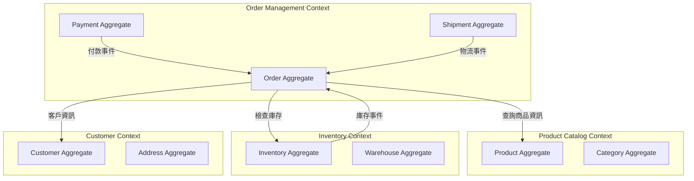

# Event Storming 工作坊模板

> **階段**: Phase 1 - 業務探索
> **目的**: 協作式領域探索,識別領域事件、命令、聚合與限界上下文
> **產出**: Event Storming 圖、領域事件列表、初步聚合識別

---

## 工作坊基本資訊

| 項目 | 內容 |
|------|------|
| **工作坊日期** | YYYY-MM-DD |
| **時間** | HH:MM - HH:MM (建議 2-4 小時) |
| **地點** | [實體地點或線上會議連結] |
| **引導者 (Facilitator)** | [姓名] |
| **參與者** | [列出所有參與者及其角色] |
| **目標領域** | [要探索的業務領域,如: 訂單處理流程] |

---

## 參與者角色

| 姓名 | 角色 | 領域專業 | 技術背景 |
|------|------|---------|----------|
| [姓名] | 業務專家 | [專精領域] | □ 有 □ 無 |
| [姓名] | 開發人員 | [技術專長] | ✓ |
| [姓名] | UX 設計師 | [專精領域] | □ 有 □ 無 |
| [姓名] | 產品經理 | [專精領域] | □ 有 □ 無 |

---

## 工作坊準備

### 需要的材料
- [ ] 大白板或牆面空間 (至少 3-4 公尺寬)
- [ ] 便利貼 (多種顏色):
  - [ ] 橙色 - 領域事件 (Domain Events)
  - [ ] 藍色 - 命令 (Commands)
  - [ ] 黃色 - 聚合/實體 (Aggregates/Entities)
  - [ ] 淡紫色 - 政策/業務規則 (Policies)
  - [ ] 粉紅色 - 外部系統 (External Systems)
  - [ ] 綠色 - 讀取模型/視圖 (Read Models)
  - [ ] 紅色 - 熱點/問題 (Hot Spots)
- [ ] 白板筆
- [ ] 計時器
- [ ] 相機 (記錄工作坊成果)

### 線上工作坊工具 (如適用)
- [ ] Miro / Mural / FigJam
- [ ] 視訊會議工具 (Zoom/Teams)
- [ ] 協作白板已預先設定好顏色分類

---

## Event Storming 流程

### Phase 1: 發散 - 識別領域事件 (30-45 分鐘)

**目標**: 識別業務流程中發生的所有重要事件

**規則**:
- 事件使用**過去式**描述 (如: "訂單已建立", "付款已完成")
- 事件代表**業務上重要的事情發生了**
- 每個人獨立寫,不討論
- 按時間順序由左到右排列

#### 識別的領域事件

| 事件名稱 | 描述 | 觸發條件 | 相關角色 | 備註 |
|---------|------|---------|----------|------|
| [訂單已建立] | [客戶完成結帳流程] | [客戶點擊"確認訂單"] | [客戶] | [橙色便利貼] |
| [付款已完成] | [付款交易成功] | [收到支付商回調] | [客戶, 系統] |  |
| [庫存已預留] | [為訂單預留商品庫存] | [訂單已建立] | [系統] |  |
| [訂單已確認] | [商家確認接單] | [商家點擊確認] | [商家] |  |
| [商品已出貨] | [訂單商品已寄出] | [商家更新物流資訊] | [商家] |  |

**熱點/問題** (紅色便利貼):
- ❓ [如果付款失敗怎麼辦?]
- ❓ [庫存不足時如何處理?]
- ❓ [訂單可以取消到什麼階段?]

---

### Phase 2: 探索 - 找出流程與分支 (30-45 分鐘)

**目標**: 整理事件順序,識別平行流程、循環、分支

#### 主流程 (Happy Path)

```
[客戶瀏覽商品] → [商品已加入購物車] → [訂單已建立] → [付款已完成]
    → [庫存已預留] → [訂單已確認] → [商品已出貨] → [訂單已送達]
    → [訂單已完成]
```

#### 替代流程與異常處理

**流程分支 1: 付款失敗**
```
[訂單已建立] → [付款已失敗] → [訂單已取消] → [庫存已釋放]
```

**流程分支 2: 退貨流程**
```
[訂單已完成] → [客戶申請退貨] → [退貨已核准] → [商品已退回]
    → [款項已退還] → [訂單已關閉]
```

**流程分支 3: 缺貨處理**
```
[訂單已建立] → [庫存檢查失敗] → [客戶已通知] → [訂單已取消]
```

#### 平行流程

```
[訂單已確認]
    ├─→ [庫存已扣減]
    ├─→ [發票已產生]
    └─→ [客戶已通知]
```

---

### Phase 3: 命令與觸發者 (20-30 分鐘)

**目標**: 識別觸發事件的命令以及執行命令的角色

#### 命令列表 (藍色便利貼)

| 命令 (Command) | 觸發者 (Actor) | 產生的事件 | 前置條件 |
|---------------|---------------|-----------|----------|
| [建立訂單] | 客戶 | [訂單已建立] | 購物車有商品 |
| [提交付款] | 客戶 | [付款已完成] 或 [付款已失敗] | 訂單已建立 |
| [確認訂單] | 商家 | [訂單已確認] | 付款已完成 |
| [更新物流資訊] | 商家 | [商品已出貨] | 訂單已確認 |
| [取消訂單] | 客戶 或 系統 | [訂單已取消] | 訂單未出貨 |

**Actor (角色) 列表**:
- 👤 客戶
- 👤 商家
- 👤 客服人員
- 🤖 系統 (自動化流程)
- 🌐 外部系統 (支付閘道, 物流系統)

---

### Phase 4: 聚合與實體 (20-30 分鐘)

**目標**: 識別管理狀態的聚合與實體

#### 聚合識別 (黃色便利貼)

| 聚合名稱 | 負責的事件 | 包含的實體/值物件 | 不變條件 (Invariants) |
|---------|-----------|-------------------|----------------------|
| **Order** | 訂單已建立<br>訂單已確認<br>訂單已取消 | - Order (聚合根)<br>- OrderItem<br>- Payment<br>- Shipment | - 訂單總金額必須正確<br>- 已付款訂單不可直接取消<br>- 已出貨訂單不可修改 |
| **Product** | 商品已上架<br>商品已下架 | - Product (聚合根)<br>- ProductVariant<br>- Price | - 上架商品必須有庫存<br>- 價格必須 > 0 |
| **Inventory** | 庫存已預留<br>庫存已扣減<br>庫存已釋放 | - Inventory (聚合根)<br>- StockLevel | - 可售庫存 = 實際庫存 - 預留庫存<br>- 可售庫存不可為負數 |
| **Customer** | 客戶已註冊<br>會員等級已更新 | - Customer (聚合根)<br>- Address<br>- LoyaltyPoints | - Email 必須唯一<br>- 點數餘額不可為負 |

---

### Phase 5: 限界上下文 (20-30 分鐘)

**目標**: 將聚合群組化,識別限界上下文

#### 限界上下文圖



#### 限界上下文定義

| 上下文名稱 | 核心職責 | 包含的聚合 | 對外介面 | 依賴的上下文 |
|-----------|---------|-----------|---------|-------------|
| **Order Management** | 訂單生命週期管理 | Order, Payment, Shipment | REST API, Events | Product Catalog, Inventory, Customer |
| **Product Catalog** | 商品資訊管理 | Product, Category | REST API | - |
| **Inventory** | 庫存管理與追蹤 | Inventory, Warehouse | REST API, Events | - |
| **Customer** | 客戶資料與會員管理 | Customer, Address, LoyaltyPoints | REST API | - |

---

### Phase 6: 政策與業務規則 (15-20 分鐘)

**目標**: 識別自動化的業務規則與政策

#### 政策列表 (淡紫色便利貼)

| 政策名稱 | 觸發事件 | 執行的命令 | 業務規則 |
|---------|---------|-----------|---------|
| **訂單逾時取消** | 訂單已建立 + 30分鐘未付款 | 取消訂單 | 超過30分鐘未付款的訂單自動取消 |
| **會員升級** | 訂單已完成 | 更新會員等級 | 近12個月消費滿額自動升級 |
| **庫存警示** | 庫存已扣減 | 發送補貨通知 | 庫存低於安全水位時通知採購 |
| **自動確認訂單** | 付款已完成 | 確認訂單 | 預購商品付款後自動確認 |

---

### Phase 7: 外部系統 (15-20 分鐘)

**目標**: 識別與外部系統的整合點

#### 外部系統列表 (粉紅色便利貼)

| 外部系統 | 用途 | 整合事件 | 整合方式 | 備註 |
|---------|------|---------|---------|------|
| **支付閘道** | 處理線上付款 | 付款已完成, 付款已失敗 | API 回調 | 需處理非同步回調 |
| **物流系統** | 物流追蹤 | 商品已出貨, 訂單已送達 | API 輪詢 | 每小時更新一次 |
| **Email 服務** | 發送通知信 | 訂單已建立, 訂單已確認等 | SMTP / API | 第三方服務 |
| **簡訊服務** | 發送簡訊通知 | 商品已出貨 | API | 第三方服務 |
| **會計系統** | 財務記帳 | 訂單已完成 | 批次匯出 | 每日同步 |

---

## 工作坊成果

### 識別的限界上下文數量
- **總數**: [如: 4 個]
- **核心上下文**: [列出核心業務上下文]
- **支援上下文**: [列出支援性上下文]

### 識別的聚合數量
- **總數**: [如: 8 個]
- **平均每個上下文**: [如: 2 個]

### 識別的領域事件數量
- **總數**: [如: 35 個]
- **關鍵事件**: [列出最重要的 5-10 個事件]

### 熱點/待解決問題
1. ❓ [問題描述]
   - 影響範圍: [哪些流程受影響]
   - 優先級: □ 高 □ 中 □ 低
   - 建議: [如何解決]

2. ❓ [問題描述]
   - 影響範圍:
   - 優先級:
   - 建議:

---

## 視覺化記錄

### Event Storming 全景照片
> [插入工作坊白板/Miro板的照片]

### 關鍵流程特寫
> [插入重要流程的特寫照片]

---

## 下一步行動

### 需要進一步探索的領域
- [ ] [領域名稱] - [原因]
- [ ] [領域名稱] - [原因]

### 需要澄清的問題
- [ ] [問題描述] - [負責人]
- [ ] [問題描述] - [負責人]

### 產出物轉換
- [ ] 整理領域事件列表 → 輸入到 Phase 2 領域建模
- [ ] 識別的聚合 → 定義為 DBML 實體
- [ ] 限界上下文 → 繪製上下文地圖
- [ ] 政策與規則 → 撰寫為業務規則文件
- [ ] 熱點問題 → 建立澄清問題列表 (Phase 3)

---

## 參與者反饋

### 工作坊評價
| 參與者 | 有效性 (1-5) | 參與度 (1-5) | 建議 |
|--------|-------------|-------------|------|
| [姓名] | ⭐⭐⭐⭐⭐ | ⭐⭐⭐⭐ | [反饋意見] |

### 改進建議
- [建議 1]
- [建議 2]

---

## 附錄

### Event Storming 便利貼顏色指南

| 顏色 | 用途 | 描述格式 | 範例 |
|------|------|---------|------|
| 🟠 橙色 | 領域事件 | 過去式 | "訂單已建立" |
| 🔵 藍色 | 命令 | 動詞 | "建立訂單" |
| 🟡 黃色 | 聚合/實體 | 名詞 | "Order" |
| 🟣 淡紫色 | 政策/規則 | "當...則..." | "當訂單逾時則取消" |
| 🩷 粉紅色 | 外部系統 | 名詞 | "支付閘道" |
| 🟢 綠色 | 讀取模型 | 名詞 | "訂單清單視圖" |
| 🔴 紅色 | 熱點/問題 | 疑問句 | "庫存不足怎麼辦?" |

### 參考資料
- [Event Storming 官方網站](https://www.eventstorming.com/)
- [Alberto Brandolini - Introducing Event Storming](https://leanpub.com/introducing_eventstorming)

---

**引導者提示**:

1. **開場 (10分鐘)**:
   - 說明 Event Storming 的目的與規則
   - 介紹便利貼顏色系統
   - 設定工作坊範圍與目標

2. **保持節奏**:
   - 使用計時器控制每個階段時間
   - 避免過早陷入細節討論
   - 先發散再收斂

3. **鼓勵參與**:
   - 確保每個人都有發言機會
   - 特別邀請安靜的成員分享
   - 尊重不同觀點

4. **處理衝突**:
   - 如有爭議,先記錄為熱點
   - 避免在工作坊中深入辯論
   - 會後安排專門會議討論

5. **視覺化管理**:
   - 使用不同顏色區分不同流程
   - 保持便利貼排列整齊
   - 適時拍照記錄進度

6. **結尾總結 (15分鐘)**:
   - 回顧識別的關鍵發現
   - 確認下一步行動
   - 感謝參與者貢獻
