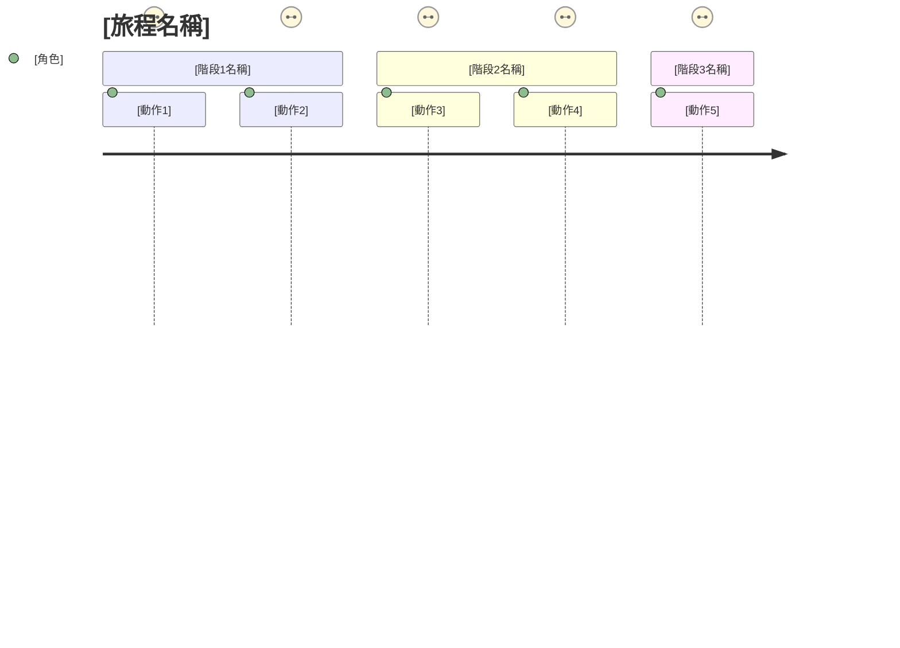

# User Journey Map 模板

> **階段**: Phase 1 - 業務探索
> **目的**: 視覺化使用者體驗旅程,識別痛點與機會點
> **產出**: User Journey Map、情緒曲線、觸點分析

---

## Journey Map 基本資訊

| 項目 | 內容 |
|------|------|
| **Journey 名稱** | [如: 線上購物旅程] |
| **目標使用者** | [Persona 名稱與描述] |
| **使用情境** | [什麼情況下會發生此旅程] |
| **業務目標** | [此旅程要達成什麼業務目標] |
| **建立日期** | YYYY-MM-DD |
| **建立者** | [姓名] |

---

## Persona (使用者輪廓)

### 基本資訊
- **姓名**: [虛構名稱,如: 王小明]
- **年齡**: [年齡範圍]
- **職業**: [職業]
- **科技熟悉度**: □ 高 □ 中 □ 低

### 背景描述
> [2-3 句話描述此 Persona 的背景、生活型態、價值觀]

### 目標與動機
- **主要目標**: [想要達成什麼]
- **次要目標**: [其他期望]
- **動機**: [為什麼想要完成此目標]

### 挫折與痛點
- [現有解決方案的問題 1]
- [現有解決方案的問題 2]
- [現有解決方案的問題 3]

### 行為特徵
- **偏好管道**: □ 網頁 □ 行動 App □ 實體店面 □ 電話
- **使用時間**: [通常何時使用]
- **決策風格**: □ 衝動型 □ 理性型 □ 比較型

---

## Journey Stages (旅程階段)



### 階段 1: [階段名稱,如: 認知需求]

#### 使用者行為
| 步驟 | 使用者動作 | 使用者想法 | 情緒 (1-5) |
|------|-----------|-----------|-----------|
| 1 | [具體動作,如: 搜尋商品] | [心理活動,如: 希望找到價格實惠的商品] | ⭐⭐⭐ (3分) |
| 2 |  |  |  |

#### 觸點 (Touchpoints)
| 觸點類型 | 具體觸點 | 管道 | 負責部門 |
|---------|---------|------|----------|
| 數位 | [如: 官網首頁] | 網頁 | 行銷部 |
| 人員 | [如: 客服專線] | 電話 | 客服部 |
| 實體 | [如: 門市] | 線下 | 營運部 |

#### 痛點 (Pain Points)
1. **[痛點名稱]**
   - 嚴重程度: □ 高 □ 中 □ 低
   - 發生頻率: □ 總是 □ 經常 □ 偶爾
   - 描述: [詳細說明]
   - 影響: [對使用者體驗的影響]

2. **[痛點名稱]**
   - 嚴重程度:
   - 發生頻率:
   - 描述:
   - 影響:

#### 機會點 (Opportunities)
1. **[機會點名稱]**
   - 潛在價值: □ 高 □ 中 □ 低
   - 實現難度: □ 高 □ 中 □ 低
   - 描述: [如何改善體驗]
   - 預期效果: [改善後的預期成果]

2. **[機會點名稱]**
   - 潛在價值:
   - 實現難度:
   - 描述:
   - 預期效果:

---

### 階段 2: [階段名稱]

#### 使用者行為
| 步驟 | 使用者動作 | 使用者想法 | 情緒 (1-5) |
|------|-----------|-----------|-----------|
| 1 |  |  |  |
| 2 |  |  |  |

#### 觸點 (Touchpoints)
| 觸點類型 | 具體觸點 | 管道 | 負責部門 |
|---------|---------|------|----------|
|  |  |  |  |

#### 痛點 (Pain Points)
1. **[痛點名稱]**
   - 嚴重程度:
   - 發生頻率:
   - 描述:
   - 影響:

#### 機會點 (Opportunities)
1. **[機會點名稱]**
   - 潛在價值:
   - 實現難度:
   - 描述:
   - 預期效果:

---

### 階段 3: [階段名稱]

#### 使用者行為
| 步驟 | 使用者動作 | 使用者想法 | 情緒 (1-5) |
|------|-----------|-----------|-----------|
| 1 |  |  |  |

#### 觸點 (Touchpoints)
| 觸點類型 | 具體觸點 | 管道 | 負責部門 |
|---------|---------|------|----------|
|  |  |  |  |

#### 痛點 (Pain Points)
1. **[痛點名稱]**
   - 嚴重程度:
   - 發生頻率:
   - 描述:
   - 影響:

#### 機會點 (Opportunities)
1. **[機會點名稱]**
   - 潛在價值:
   - 實現難度:
   - 描述:
   - 預期效果:

---

### [根據需要新增更多階段...]

---

## 情緒曲線分析

```
情緒指數 (1-5)
5 |               ●
4 |         ●           ●
3 |   ●                       ●
2 |                               ●
1 |
  +----------------------------------
    [階段1] [階段2] [階段3] [階段4] [階段5]
```

### 情緒高峰 (Peak Moments)
| 階段 | 動作 | 情緒分數 | 原因 |
|------|------|---------|------|
| [階段名稱] | [具體動作] | 5 | [為什麼情緒高昂] |

### 情緒低谷 (Pain Moments)
| 階段 | 動作 | 情緒分數 | 原因 |
|------|------|---------|------|
| [階段名稱] | [具體動作] | 1-2 | [為什麼感到挫折] |

---

## 支援系統與資源

### 前台系統 (Front-stage)
> 使用者可見的系統、介面、服務

| 系統/介面 | 功能 | 現狀評估 |
|----------|------|----------|
| [如: 官網] | [提供的功能] | □ 優秀 □ 良好 □ 需改進 |

### 後台系統 (Back-stage)
> 使用者不可見但支援服務運作的系統

| 系統 | 功能 | 現狀評估 |
|------|------|----------|
| [如: CRM系統] | [提供的功能] | □ 優秀 □ 良好 □ 需改進 |

### 內部流程
| 流程名稱 | 負責部門 | 效率評估 |
|---------|---------|---------|
| [如: 訂單處理流程] | [部門名稱] | □ 高效 □ 一般 □ 低效 |

---

## 關鍵指標 (KPIs)

### 量化指標
| 指標 | 現況 | 目標 | 衡量方式 |
|------|------|------|----------|
| [如: 轉換率] | [%] | [%] | [如何測量] |
| [如: 完成時間] | [分鐘] | [分鐘] | [如何測量] |
| [如: 客戶滿意度] | [分數] | [分數] | [如何測量] |

### 質化指標
| 指標 | 衡量方式 | 目標狀態 |
|------|---------|---------|
| [如: 使用者信任度] | [訪談、問卷] | [描述目標狀態] |

---

## 改進機會優先級

### 優先級矩陣

```
影響力
高 |  [機會2]     |  [機會1]
   |              |  [機會4]
   |--------------|-------------
   |  [機會5]     |  [機會3]
低 |              |
   +---------------------------
     低            高
           實現難度
```

### 改進建議列表

| 優先級 | 機會點 | 預期效果 | 實現難度 | 建議行動 | 負責團隊 |
|--------|-------|---------|---------|---------|----------|
| P0 | [Quick Win] | 高 | 低 | [具體行動] | [團隊] |
| P1 | [Major Project] | 高 | 高 | [具體行動] | [團隊] |
| P2 | [Fill In] | 低 | 低 | [具體行動] | [團隊] |
| P3 | [Thankless Task] | 低 | 高 | [考慮捨棄] | [團隊] |

---

## 下一步行動

### 短期行動 (1-3個月)
- [ ] [行動項目 1]
- [ ] [行動項目 2]
- [ ] [行動項目 3]

### 中期行動 (3-6個月)
- [ ] [行動項目 1]
- [ ] [行動項目 2]

### 長期行動 (6-12個月)
- [ ] [行動項目 1]
- [ ] [行動項目 2]

---

## 附錄

### 研究方法
- [ ] 使用者訪談 (訪談 __ 位)
- [ ] 問卷調查 (收集 __ 份)
- [ ] 觀察研究
- [ ] 資料分析
- [ ] 其他: ___________

### 參考資料
- [列出參考的資料來源]

### 相關文件
- [連結到相關的需求文件、設計文件等]

---

## 檢查清單

- [ ] Persona 定義清晰且基於真實數據
- [ ] 旅程階段完整涵蓋從開始到結束
- [ ] 每個階段的痛點都有明確識別
- [ ] 機會點有優先級排序
- [ ] 情緒曲線反映真實使用者感受
- [ ] 觸點分析完整
- [ ] KPIs 可衡量且與業務目標對齊
- [ ] 改進建議具體可行
- [ ] 已與利害關係人驗證

---

**填寫指南**:

1. **Persona 建立**: 基於真實使用者研究,避免憑空想像
2. **情緒評分**: 1=非常挫折, 2=有點不滿, 3=中性, 4=滿意, 5=非常愉快
3. **痛點識別**: 使用"5個為什麼"深入挖掘根本原因
4. **機會點**: 聚焦在高影響、可實現的改進
5. **觸點分析**: 包含線上、線下、人員接觸等所有互動點

**常見錯誤**:
- ❌ 過於樂觀,忽略真實痛點
- ❌ 階段劃分過細或過粗
- ❌ 缺乏數據支撐,僅憑假設
- ❌ 改進建議過於籠統,缺乏可執行性
- ❌ 忽略後台流程對前台體驗的影響

**最佳實踐**:
- ✅ 與真實使用者共創 Journey Map
- ✅ 使用便利貼進行協作工作坊
- ✅ 定期更新,隨著產品演進調整
- ✅ 與團隊成員共享,建立共同理解
- ✅ 連結到具體的功能需求與設計決策
