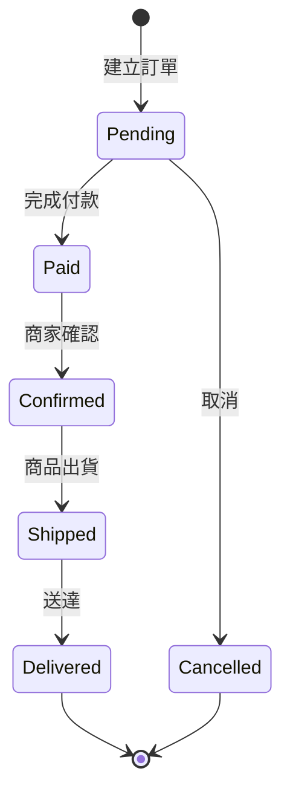

# 聚合設計模板 (Aggregate Design)

> **階段**: Phase 2 - 領域建模
> **目的**: 定義聚合根、實體、值物件與不變條件
> **產出**: 聚合設計文件

---

## 聚合 1: [聚合名稱, 如: Order]

### 基本資訊
- **聚合根**: Order
- **所屬上下文**: Order Management Context
- **負責人**: [姓名]

### 聚合邊界

**包含的實體**:
- Order (聚合根)
- OrderItem
- Payment
- Shipment

**包含的值物件**:
- Money (金額)
- Address (地址)
- OrderStatus (訂單狀態)

**不包含** (通過 ID 引用):
- Customer (引用 customerId)
- Product (引用 productId)

### 不變條件 (Invariants)

聚合必須始終維持的業務規則:

1. **訂單總金額正確性**
   ```
   order.total = order.subtotal - order.discountAmount + order.shippingFee + order.tax
   ```

2. **訂單項目一致性**
   - 訂單必須至少有一個訂單項目
   - 所有訂單項目的 orderId 必須與訂單 ID 一致

3. **狀態轉換合法性**
   - 已付款訂單不可直接取消 (需走退款流程)
   - 已出貨訂單不可修改商品

4. **金額非負性**
   - 所有金額欄位不可為負數

### 聚合根方法

```typescript
class Order {
  // 建立訂單
  static create(customerId: string, items: OrderItem[]): Order {
    // 驗證不變條件
    if (items.length === 0) {
      throw new Error('訂單必須至少有一個商品');
    }
    // ...
  }

  // 加入商品
  addItem(item: OrderItem): void {
    this.items.push(item);
    this.recalculateTotal();
  }

  // 套用優惠券
  applyCoupon(coupon: Coupon): void {
    // 驗證優惠券可用性
    // 計算折扣
    this.discountAmount = ...;
    this.recalculateTotal();
  }

  // 確認付款
  confirmPayment(payment: Payment): void {
    if (this.status !== OrderStatus.Pending) {
      throw new Error('只有待付款訂單可以確認付款');
    }
    this.status = OrderStatus.Paid;
    this.payment = payment;
    this.raiseEvent(new OrderPaidEvent(this.id));
  }

  // 取消訂單
  cancel(reason: string): void {
    if (this.status === OrderStatus.Shipped) {
      throw new Error('已出貨訂單無法取消');
    }
    this.status = OrderStatus.Cancelled;
    this.raiseEvent(new OrderCancelledEvent(this.id, reason));
  }

  // 私有方法: 重新計算總金額
  private recalculateTotal(): void {
    this.subtotal = this.items.reduce((sum, item) => sum + item.subtotal, 0);
    this.total = this.subtotal - this.discountAmount + this.shippingFee + this.tax;
  }
}
```

### 領域事件

- **OrderCreated**: 訂單建立
- **OrderPaid**: 付款完成
- **OrderCancelled**: 訂單取消
- **OrderShipped**: 訂單出貨
- **OrderDelivered**: 訂單送達

### 生命週期



---

## 檢查清單

- [ ] 聚合根明確識別
- [ ] 聚合邊界清楚定義
- [ ] 不變條件完整列出
- [ ] 所有業務邏輯封裝在聚合內
- [ ] 聚合大小適中 (非過大或過小)
- [ ] 領域事件已定義
- [ ] 聚合根的存取權限已在 haARM 中定義
- [ ] 聚合的不變條件中涉及權限的規則已反映在 haARM constraints 中
