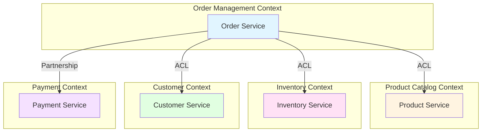

# 限界上下文模板 (Bounded Contexts)

> **階段**: Phase 2 - 領域建模
> **目的**: 定義限界上下文邊界,明確各上下文的職責與關係
> **產出**: 上下文地圖、上下文關係定義、整合策略

---

## 專案資訊

| 項目 | 內容 |
|------|------|
| **專案名稱** | [專案名稱] |
| **建立日期** | YYYY-MM-DD |
| **維護者** | [姓名] |
| **版本** | v1.0 |

---

## 什麼是限界上下文?

**限界上下文 (Bounded Context)** 是領域驅動設計 (DDD) 的核心概念,代表一個**明確的邊界**,在此邊界內:
- 通用語言有一致的含義
- 模型有明確的職責
- 團隊有清晰的所有權

### 為什麼需要限界上下文?

✅ **避免模型混亂**: 同一個詞在不同上下文可能有不同含義
✅ **團隊自主性**: 每個團隊可獨立開發自己的上下文
✅ **降低耦合**: 上下文間透過明確介面整合
✅ **擴展性**: 可獨立擴展特定上下文

---

## 上下文地圖 (Context Map)



**圖例**:
- **ACL** (Anti-Corruption Layer): 防腐層,保護上下文不受外部影響
- **Partnership**: 合作關係,雙方共同演進
- **Shared Kernel**: 共享核心,共用部分模型
- **Customer-Supplier**: 上下游關係,下游依賴上游

---

## 限界上下文清單

### 上下文 1: [Order Management Context]

#### 基本資訊

| 項目 | 內容 |
|------|------|
| **上下文名稱** | Order Management (訂單管理) |
| **簡稱** | OrderMgmt |
| **類型** | 核心域 (Core Domain) |
| **負責團隊** | [團隊名稱] |
| **技術棧** | [如: Node.js, PostgreSQL] |

#### 職責範圍

**核心職責**:
- 訂單生命週期管理
- 訂單狀態轉換
- 付款流程協調
- 物流流程協調

**包含的聚合**:
- Order (訂單)
- OrderItem (訂單項目)
- Payment (付款)
- Shipment (出貨)

**不包含**:
- ❌ 商品資訊管理 (屬於 Product Catalog Context)
- ❌ 庫存實際扣減 (屬於 Inventory Context)
- ❌ 客戶資料維護 (屬於 Customer Context)

#### 對外介面

**提供的 API**:
| 端點 | 用途 | 消費者 |
|------|------|--------|
| POST /orders | 建立訂單 | Frontend, Mobile App |
| GET /orders/{id} | 查詢訂單 | Frontend, Customer Service |
| PUT /orders/{id}/cancel | 取消訂單 | Frontend, Customer Service |

**發布的事件**:
| 事件名稱 | 觸發時機 | 訂閱者 |
|---------|---------|--------|
| OrderCreated | 訂單建立 | Inventory, Notification |
| OrderPaid | 付款完成 | Inventory, Fulfillment |
| OrderCancelled | 訂單取消 | Inventory, Notification |

**消費的事件**:
| 事件名稱 | 來源 | 用途 |
|---------|------|------|
| PaymentCompleted | Payment Context | 更新訂單狀態為已付款 |
| InventoryReserved | Inventory Context | 確認庫存已預留 |

#### 依賴的上下文

| 上下文 | 關係類型 | 整合方式 | 依賴內容 |
|--------|---------|---------|---------|
| Product Catalog | Customer-Supplier (ACL) | REST API | 商品資訊、價格 |
| Inventory | Partnership | Events | 庫存檢查、預留 |
| Customer | Customer-Supplier (ACL) | REST API | 客戶資訊、地址 |
| Payment | Partnership | Events | 付款處理 |

#### 通用語言

**此上下文中的關鍵術語**:
- **Order** (訂單): 客戶的購買請求
- **Order Status**: pending | paid | confirmed | shipped | delivered | cancelled
- **Subtotal** (小計): 商品總金額
- **Total** (總金額): 最終應付金額

---

### 上下文 2: [Product Catalog Context]

#### 基本資訊

| 項目 | 內容 |
|------|------|
| **上下文名稱** | Product Catalog (商品目錄) |
| **簡稱** | ProductCatalog |
| **類型** | 核心域 (Core Domain) |
| **負責團隊** | [團隊名稱] |

#### 職責範圍

**核心職責**:
- 商品資訊管理
- 商品分類管理
- 商品搜尋與篩選
- 商品 SEO 優化

**包含的聚合**:
- Product (商品)
- ProductVariant (商品變體)
- Category (分類)

#### 對外介面

**提供的 API**:
| 端點 | 用途 |
|------|------|
| GET /products | 列出商品 |
| GET /products/{id} | 商品詳情 |
| GET /categories | 列出分類 |

**發布的事件**:
| 事件名稱 | 觸發時機 |
|---------|---------|
| ProductCreated | 商品建立 |
| ProductPriceChanged | 價格變更 |
| ProductDiscontinued | 商品下架 |

---

### 上下文 3: [Inventory Context]

#### 基本資訊

| 項目 | 內容 |
|------|------|
| **上下文名稱** | Inventory (庫存) |
| **類型** | 支援域 (Supporting Domain) |

#### 職責範圍

**核心職責**:
- 庫存數量追蹤
- 庫存預留與釋放
- 庫存盤點
- 補貨通知

**包含的聚合**:
- Inventory (庫存)
- Warehouse (倉庫)
- StockMovement (庫存異動)

---

## 上下文關係模式

### Pattern 1: Partnership (合作關係)

**定義**: 兩個上下文共同演進,需要協調彼此的變更

**範例**: Order Management ↔ Payment
- 雙方需緊密協調訂單與付款流程
- 共同定義整合介面
- 變更需雙方同意

**整合方式**:
- 使用事件驅動架構
- 定期同步會議討論整合

---

### Pattern 2: Customer-Supplier (上下游)

**定義**: 下游 (Customer) 依賴上游 (Supplier),但上游不依賴下游

**範例**: Order Management (Customer) ← Product Catalog (Supplier)
- Order Management 需要商品資訊
- Product Catalog 不知道 Order Management 的存在

**整合方式**:
- Supplier 提供穩定的 API
- Customer 使用 ACL 保護自己

---

### Pattern 3: Anti-Corruption Layer (ACL, 防腐層)

**定義**: 在上下文邊界建立翻譯層,防止外部模型汙染內部模型

**實作範例**:

```typescript
// Order Management 的 ACL
class ProductAdapter {
  private productCatalogApi: ProductCatalogAPI;

  async getProductPrice(productId: string): Promise<Money> {
    // 呼叫外部 API
    const externalProduct = await this.productCatalogApi.getProduct(productId);

    // 翻譯為內部模型
    return new Money(
      externalProduct.price.amount,
      externalProduct.price.currency
    );
  }
}
```

**好處**:
- 內部模型不受外部影響
- 外部 API 變更時只需修改 ACL
- 保持上下文獨立性

---

### Pattern 4: Shared Kernel (共享核心)

**定義**: 兩個上下文共享部分模型

**範例**: Money, Address 等值物件

**注意事項**:
- 謹慎使用,避免過度耦合
- 共享的部分需雙方協調變更
- 建議僅共享簡單的值物件

---

## 整合策略

### 同步整合 (Synchronous)

**方式**: REST API, gRPC

**適用情境**:
- 需要即時回應
- 資料一致性要求高

**範例**:
- Order Management 呼叫 Product Catalog 查詢商品價格

**優點**:
- 簡單直接
- 即時回饋

**缺點**:
- 可用性耦合(上游掛掉影響下游)
- 效能瓶頸

---

### 非同步整合 (Asynchronous)

**方式**: Message Queue, Event Bus

**適用情境**:
- 可容忍延遲
- 需要解耦
- 高吞吐量

**範例**:
- Order Management 發布 OrderCreated 事件
- Inventory Context 訂閱並預留庫存

**優點**:
- 解耦
- 高可用性
- 易擴展

**缺點**:
- 最終一致性
- 除錯困難

---

## 上下文演進策略

### 階段 1: 單體應用

```
┌─────────────────────────────────────┐
│                                     │
│         Monolithic App              │
│  (所有上下文在同一個應用中)          │
│                                     │
└─────────────────────────────────────┘
```

### 階段 2: 模組化單體

```
┌─────────────────────────────────────┐
│         Modular Monolith            │
│  ┌────────┐  ┌────────┐  ┌────────┐│
│  │ Order  │  │Product │  │Customer││
│  │ Module │  │ Module │  │ Module ││
│  └────────┘  └────────┘  └────────┘│
└─────────────────────────────────────┘
```

### 階段 3: 微服務

```
┌─────────┐  ┌──────────┐  ┌─────────┐
│ Order   │  │ Product  │  │Customer │
│ Service │  │ Service  │  │ Service │
└─────────┘  └──────────┘  └─────────┘
     ↕             ↕             ↕
  ┌─────────────────────────────────┐
  │       Event Bus / API Gateway    │
  └─────────────────────────────────┘
```

---

## 檢查清單

- [ ] 每個上下文都有明確的職責
- [ ] 上下文邊界清楚定義
- [ ] 上下文間的關係已識別
- [ ] 整合方式已定義
- [ ] ACL 在適當的地方使用
- [ ] 事件定義清楚
- [ ] 通用語言在上下文內一致
- [ ] 負責團隊已分配

---

**最佳實踐**:

1. **從業務能力出發**: 上下文應對應業務能力,非技術劃分
2. **團隊自主**: 一個團隊負責一個上下文
3. **鬆耦合**: 減少上下文間的依賴
4. **明確邊界**: 清楚定義什麼在內、什麼在外
5. **演進式**: 從模組化單體開始,逐步演進至微服務
