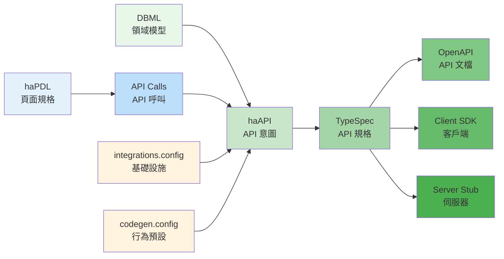

# haAPI (High-level Abstract API Definition) 語法規格 v3.3

> **版本**: v3.3.0 (Release Candidate, 2026-05-13)
> **前版**: v3.2（見 `archive/haAPI-specification_v3.2.md`）
> **v3.3 重點**: (1) 跟隨 haARM v3.3 升版互鎖；(2) Access v2 雙軌結構（A.1 已於 v3.2 完工）持續沿用；(3) §6 文件化 Convention 來源（智慧推斷 + codegen.config.yaml 四層級聯）；(4) §7 新增 hycms-ht002 跨 DSL 端對端範例
> **SSoT 主手冊**: `haAPIdoc.md`

update 2026/03/10:
- 增加 sql_hint/logic 實作邏輯定義 (2.2.4 實作邏輯 (Implementation Logic))

update 2026/04/02 (v1.2 → v3.2 版本號對齊):
- `action: external` 升級為 `ext.<service>.<method>` 命名空間語法 (2.2.4)
- 新增 `proxy` 操作原語，簡化純代理 API 定義 (2.2.3)
- 新增根層級 `integrations` 宣告外部服務依賴 (2.1, 2.6)
- 新增三層級聯 Resilience 預設機制 (2.7)
- Step 級別輸入統一使用 `input`，輸出統一使用 `result` (2.2.4)
- 新增 `advanced.external_resilience` API 級覆蓋 (2.5)
- 版本號由 v1.2 對齊至 v3.2，與 haPDL v3.2、PDL v3.2、Annotated DBML v3.2 統一


## 一、設計理念與定位

### 1.1 核心理念

haAPI 是一套**意圖導向**的 API 定義語言，專注於描述「業務能力」而非「技術實現」。

```
業務需求 → haAPI（What） → TypeSpec（How） → OpenAPI/程式碼
```

### 1.2 與現有工具的關係

| 工具 | 層級 | 關注點 | 產出物 |
|------|------|--------|--------|
| **haAPI** | 意圖層 | 業務能力、領域操作 | API 意圖規格 |
| **TypeSpec** | 規格層 | 型別、路由、協定 | API 技術規格 |
| **OpenAPI** | 文檔層 | 端點、參數、範例 | API 文檔 |
| **程式碼** | 實作層 | 邏輯、效能、安全 | 可執行程式 |

### 1.3 設計原則

1. **領域驅動** - 基於 DBML 定義的領域模型
2. **慣例優於配置** - 自動推斷 RESTful 最佳實踐
3. **前後端一致** - 與 haPDL 頁面規格對應
4. **漸進式細化** - 從簡單 CRUD 到複雜業務邏輯
5. **可生成性** - 能自動轉換為 TypeSpec/OpenAPI
6. **職責分離** - 意圖歸 haAPI、基礎設施歸 infra config、行為預設歸 codegen.config

## 二、語法規格

### 2.1 基本結構

```yaml
# API 識別與元資料
api: <api-identifier>           # kebab-case 格式
title: <api-title>              # API 顯示名稱
version: <version>              # 版本號
entity: <EntityName>            # 主要領域實體（來自 DBML）

# 選擇性元資料
description: <description>      # API 用途說明
tags: [tag1, tag2]             # 分類標籤
deprecated: false               # 是否已棄用

# 外部服務依賴宣告 (v1.2 新增)
integrations:
  <integration-declarations>

# 業務能力定義
exposes:
  <capability-definitions>

# 存取控制
access:
  <access-controls>

# 前端關聯
consumers:
  <consumer-definitions>

# 進階配置
advanced:
  <advanced-settings>
```

### 2.2 業務能力定義 (exposes)

#### 2.2.1 標準 CRUD 能力

```yaml
exposes:
  # 聲明標準能力（自動生成對應端點）
  standard:
    - list      # GET    /entities
    - create    # POST   /entities
    - read      # GET    /entities/{id}
    - update    # PUT    /entities/{id}
    - patch     # PATCH  /entities/{id}
    - delete    # DELETE /entities/{id}
    - exists    # HEAD   /entities/{id}
    
  # 或使用簡寫
  standard: crud  # 等同於 [create, read, update, delete]
  standard: all   # 等同於所有標準操作
```

#### 2.2.2 查詢能力配置

```yaml
exposes:
  # 列表查詢的詳細配置
  list:
    # 篩選能力
    filters:
      - field: status
        operators: [eq, ne, in]      # 支援的操作符
        
      - field: created_at
        operators: [gt, gte, lt, lte, between]
        
      - field: name
        operators: [contains, starts_with, ends_with]

    # operators 使用方式
    # 這表示在同一個屬性上允許多種查詢模式，但單次查詢請求需指定具體 operator。
    # 例如：
    # - apcatId[eq]=ABC      -> 精準相等查詢
    # - apcatId[contains]=ABC -> 部分匹配查詢
    # 不應該同時對同一條件一併傳 eq + contains（由後端根據條件決議一種），
    # 如果想強制僅允許一種，請在 haAPI 定義中只填一個 operator。
    # 如果需要同時支持多種，則前端在發出查詢時必須明確指定 operator。
    # 預設語意: 下拉選單（eq）或模糊搜尋（contains）

    # 排序能力
    sorting:
      fields: [id, name, created_at, updated_at]
      default: created_at:desc
    
    # 分頁能力
    pagination:
      style: offset           # offset | cursor | page
      default_size: 20
      max_size: 100
    
    # 搜尋能力
    search:
      fields: [name, email, description]
      type: fulltext         # fulltext | simple
    # fulltext：用資料庫/引擎的全文索引機制（CONTAINS/MATCH、分詞、詞幹、語意優先等）
    # simple：一般字串匹配（LIKE '%xxx%' 或 basic 包含邏輯），不要求建立全文索引
    
    # 聚合能力
    aggregations:
      - count_by_status
      - avg_age
      - sum_amount
    
    # 包含關聯
    includes:
      - department
      - roles
      - manager
```

#### 2.2.3 自訂業務操作

```yaml
exposes:
  # 業務操作（非 CRUD）
  operations:
    # 簡單操作（使用預設慣例）
    - activate              # POST /entities/{id}/activate
    - deactivate           # POST /entities/{id}/deactivate
    - archive              # POST /entities/{id}/archive
    - restore              # POST /entities/{id}/restore
    
    # 詳細操作定義
    - name: bulk_import
      method: POST
      path: /import         # 相對路徑
      batch: true           # 批次操作
      async: true           # 非同步處理
      
    - name: export
      method: GET
      path: /export
      formats: [csv, excel, pdf]
      
    - name: transfer_ownership
      method: POST
      path: /{id}/transfer
      params:
        - new_owner_id: user_id
        - reason: string?   # 選擇性參數
      
    - name: calculate_metrics
      method: GET
      path: /{id}/metrics
      cache: 300           # 快取秒數
      
    - name: approve
      method: POST
      path: /{id}/approve
      workflow: true       # 工作流程操作
      require_reason: true
```

##### `proxy` — 純代理操作原語 (v1.2 新增)

當一個 operation 純粹是轉發至外部服務（前端需要一個端點，後端只做認證或參數補全），可使用 `proxy` 簡寫取代完整的 `logic.steps` 定義：

```yaml
exposes:
  operations:
    - name: verify_captcha
      method: POST
      path: /verify-captcha
      proxy:
        target: ext.captcha.validate        # 轉發目標（ext.* 語法）
        enrich: { complexity: high, ttl: 300 }  # 自動補入的請求參數
        pick: [id, score, success]              # 只回傳這些欄位

    - name: get_captcha
      method: GET
      path: /captcha
      proxy:
        target: ext.captcha.generate
        pick: [id, image_data]
```

**語意**：看到 `proxy` 就知道這個 operation 沒有本地業務邏輯，CodeGen 只需產生轉發程式碼。

| 屬性 | 說明 | 必要 |
|------|------|------|
| `target` | 轉發目標，使用 `ext.<service>.<method>` 語法 | 是 |
| `enrich` | 自動補入的額外請求參數 | 否 |
| `pick` | 從外部回應中只擷取的欄位列表 | 否 |

#### 2.2.4 實作邏輯 (Implementation Logic)

操作可附帶實作邏輯提示，讓 CodeGen 引擎能產生包含 SQL 和業務邏輯的完整實作程式碼。提供兩種機制：

##### `sql_hint` — 單行 SQL 提示

適用於單一 SQL 即可完成的簡單操作：

```yaml
operations:
  - name: activate
    description: 啟用帳號
    method: POST
    path: /{id}/activate
    sql_hint: "UPDATE InfoUser SET userType='A' WHERE userId=@userId"

  - name: deactivate
    description: 停用帳號
    method: POST
    path: /{id}/deactivate
    params:
      - reason: string
    sql_hint: "UPDATE InfoUser SET userType='D' WHERE userId=@userId"
```

##### `logic` — 結構化步驟定義

適用於多步驟、有分支、需要跨表操作的複雜操作：

```yaml
operations:
  - name: change_password
    description: 變更密碼
    method: POST
    path: /{id}/change-password
    params:
      - old_password: string
      - new_password: string
    logic:
      steps:
        # Step 1: 查詢
        - action: query
          sql: "SELECT password FROM InfoUser WHERE userId = @userId"
          result: currentUser

        # Step 2: 驗證
        - action: validate
          rule: "decrypt(currentUser.password, 'Rijndael') == old_password"
          on_fail:
            status: 401
            message: "舊密碼不正確"

        # Step 3: 更新
        - action: update
          sql: |
            UPDATE InfoUser
            SET password = encrypt(@new_password, 'Rijndael'),
                modify_time = GETDATE()
            WHERE userId = @userId

        # Step 4: 記錄
        - action: insert
          sql: |
            INSERT INTO userPWlog (userId, changeTime, password)
            VALUES (@userId, GETDATE(), encrypt(@new_password, 'Rijndael'))

      returns: { success: true, message: "密碼變更成功" }
```

##### Action Types

所有 `logic.steps[].action` 支援的型別：

| Action | 說明 | 必要屬性 |
|--------|------|----------|
| `query` | SELECT 查詢 | `sql`, `result` |
| `update` | UPDATE 語句 | `sql` |
| `insert` | INSERT 語句 | `sql` |
| `upsert` | MERGE/UPSERT | `sql` |
| `validate` | 條件驗證 | `rule`, `on_fail` |
| `ext.<service>.<method>` | 呼叫外部服務 (v1.2) | `input` |
| `foreach` | 迴圈處理 | `items`, `steps` |
| `create_job` | 建立非同步任務 | `returns` |
| `parse_file` | 解析上傳檔案 | `format`, `result` |
| `update_job` | 更新任務狀態 | `status`, `returns` |

> **v1.2 變更**：`action: external`（需搭配 `service` + `method`）已改為 `action: ext.<service>.<method>` 命名空間語法。一個 action 欄位就完整表達「呼叫哪個外部服務的哪個方法」，不再需要額外的 `service` 和 `method` 屬性。

##### `ext.*` 命名空間語法 (v1.2 新增)

外部服務呼叫使用 `ext.<service>.<method>` 格式：

```yaml
logic:
  steps:
    # v1.1 寫法（已棄用）:
    # - action: external
    #   service: captcha
    #   method: validate
    #   params: { id: "@captcha_id", code: "@captcha_code" }
    #   result: captcha_result

    # v1.2 寫法:
    - action: ext.captcha.validate
      input: { id: "@captcha_id", code: "@captcha_code" }
      result: captcha_result
      on_fail: { status: 403, message: "驗證碼錯誤" }

    - action: ext.smtp.send_email
      input: { to: "@user.email", template: "welcome" }
      result: email_sent

    - action: ext.llm.invoke
      input: { prompt: "@generated_prompt", max_tokens: 500 }
      result: ai_response
      resilience: { timeout: 60s }    # step 級覆蓋（例外情況）
```

**命名空間規則**：
- `ext` 前綴表示外部服務呼叫
- `<service>` 必須在 `integrations` 中有宣告（Linter 可驗證）
- `<method>` 必須在該 service 的 `capabilities` 中列出

**欄位慣例**：
- `input`：step 級傳入值（區分於 operation-level 的 `params`）
- `result`：step 級回傳值（統一命名，不混用 `output`）
- `resilience`：選擇性，僅在需要覆蓋預設值時使用
- `on_fail`：錯誤處理

##### 錯誤處理

每個 step 可附帶錯誤處理：

```yaml
- action: query
  sql: "SELECT * FROM InfoUser WHERE userId = @userId"
  result: user
  on_empty:                    # 查詢無結果時
    status: 404
    message: "使用者不存在"

- action: validate
  rule: "user.status != 'D'"
  on_fail:                     # 驗證失敗時
    status: 403
    message: "此帳號已被停用"
    side_effect:               # 失敗時的副作用
      sql: |
        INSERT INTO ApiLog (action, userId, message)
        VALUES ('login_failed', @userId, '帳號已停用')
```

##### 執行模式

```yaml
logic:
  mode: sync          # 預設：同步執行
  # 或
  mode: async_job     # 非同步任務模式（搭配 create_job / update_job）
```

##### 迴圈處理

```yaml
- action: foreach
  items: rows               # 來自前一步驟的 result
  steps:
    - action: validate
      rule: "row.field matches '^[A-Z]+$'"
    - action: upsert
      sql: "MERGE INTO ... "
      on_fail:
        action: log_error
        continue: true       # 失敗後繼續處理下一筆
```

##### 回傳結構

```yaml
logic:
  steps: [...]
  returns:                   # 自訂回傳結構
    token: "@newToken"
    user:
      userId: "user.userId"
      userName: "user.userName"
  # 或簡單回傳
  returns: { success: true, message: "操作完成" }
  # 或回傳實體（預設）
  returns: InfoUser
```

##### 設計原則

| 複雜度 | 用什麼 | 範例 |
|--------|--------|------|
| 單一 SQL | `sql_hint: "..."` | activate, deactivate |
| 多步驟、線性流 | `logic.steps: [...]` | assign_groups, change_password |
| 有分支/失敗處理 | `steps` + `on_fail` | login |
| 非同步/批次 | `logic.mode: async_job` + `foreach` | bulk_import |
| 外部整合 | `action: ext.<service>.<method>` | captcha 驗證, email 寄送 |
| 純代理轉發 | `proxy: { target: ext.*.* }` | captcha 代理, 檔案上傳代理 |

> **備註**：標準 CRUD 操作（list, create, read, update, delete）不需要 `sql_hint` 或 `logic`，CodeGen 引擎會從 DBML 模型自動推導出對應的 SQL。

### 2.3 存取控制 (access)

```yaml
access:
  # 認證方式
  authentication:
    type: bearer         # bearer | api_key | oauth2 | custom
    required: true       # 是否必須認證
  
  # 角色權限（簡單模式）
  roles:
    # 使用預設權限
    admin: all           # 所有操作
    manager: [list, read, create, update]
    user: [list, read]
    guest: [list]
  
  # 角色權限（詳細模式）
  permissions:
    list:
      roles: [admin, manager, user, guest]
      conditions:
        - owner_only: false
        - department_only: true
    
    create:
      roles: [admin, manager]
      rate_limit: 100/hour
    
    update:
      roles: [admin, manager, owner]
      fields:              # 欄位級權限
        restricted: [salary, ssn]
        readonly: [id, created_at]
    
    delete:
      roles: [admin]
      require_confirmation: true
      soft_delete: true    # 軟刪除
    
    # 自訂操作權限
    operations:
      activate: [admin, manager]
      deactivate: [admin]
      export: [admin, manager, user]
```

#### 2.3.1 Access v2 — 與 haARM v2 對齊的雙軌結構 ⭐ NEW (2026-05-11)

> **背景**：v3.1 的 `access.permissions.{op}.roles[]` 命名容易誤導（看似宣告 permission，實則只列出 role 字串），且 `scopes`、`field_restrictions`、`rate_limit` 等欄位散落各處、未被任一 codegen 管線完整消費（dead-letter）。Access v2 將「角色（粗粒度）」與「權限（細粒度）」分軌，並以 haARM v2 為 SSoT，所有 `required_roles` / `required_permissions` 必須引用 `.haarm.yaml` 中已定義的 `role.id` / `permission.id`。
>
> 此節由 `0_reqDevProcess/haARM-Specification_v2.md`、`8specDSLs/auth-ir.schema.json`、`ccwLog/0510-haARMv2_align_toDo.md §A.1` 推導，做為 whyAPI / haPDL2PDL / Pdl2whyVue 三條 codegen 管線的統一語彙來源。

```yaml
access:
  # 認證方式（與 v3.1 相同）
  authentication:
    type: bearer
    required: true

  # ── Access v2 新結構：以端點為單位描述授權 ──
  endpoints:
    list:
      required_roles: [admin, manager]              # 粗粒度 — 引用 haARM role.id（OR 語意）
      required_permissions:                         # 細粒度 — 引用 haARM permission.id（AND 語意）
        - id: user_list
      scope: all                                    # all | own | department | team
      # conditions 可省略；若需附加條件，引用 haARM constraint.id（不在此展開）

    read:
      required_roles: [admin, manager, self]
      required_permissions:
        - id: user_read_own
      scope: own
      conditions:
        - haarm_constraint: user_self_access        # 對應 haARM constraints[].id

    update:
      required_roles: [admin, manager, self]
      required_permissions:
        - id: user_update_own
      scope: own
      conditions:
        - haarm_constraint: user_self_access

    delete:
      required_roles: [admin]
      required_permissions:
        - id: user_delete
      scope: all

  # ── 自訂業務操作（與 endpoints 同結構） ──
  operations:
    activate:
      required_roles: [admin, manager]
      required_permissions:
        - id: user_activate
      scope: all
```

**核心規則：**

| 欄位 | 角色 | 引用對象 | Codegen 處理層級 |
|------|------|---------|---------------------|
| `required_roles[]` | 粗粒度 RBAC | `haARM roles[].id` | static-decidable，前端 v-if、後端 `hasAnyRole(...)` |
| `required_permissions[].id` | 細粒度 ABAC | `haARM permissions[].id` | static + runtime（含 scope/condition） |
| `scope` | 資料範圍 | enum: `all / own / department / team` | runtime-decidable（whyAPI WHERE 子句） |
| `conditions[].haarm_constraint` | 附加約束 | `haARM constraints[].id` | opaque ref，**projection 層不得展開** |

**多重 required_permissions 的語意**：陣列內所有 permission 必須 *全數通過*（AND）；單一 permission 在 haARM 內的 role-permission 對應仍為 OR。

**Deprecation Timeline：**

| 版本 | v3.1（舊） | Access v2（新） | 行為 |
|------|-----------|----------------|------|
| **v3.2 (current)** | ✅ 接受 | ✅ 接受 | Parser 雙軌：偵測新結構走新路徑；偵測舊結構透過 transformer 自動轉換並 emit deprecation warning（不阻擋 build） |
| **v3.3** | ⚠️ 接受 | ✅ 接受 | 舊結構在新建檔案中觸發 `HAAPI-DEPRECATION-001` warning（lint 級別）；既有檔案維持向後相容 |
| **v3.4** | ❌ 不接受 | ✅ 必用 | 移除舊結構支援；parser 對舊結構直接報 error |

**遷移對照表（v3.1 → Access v2）：**

| 舊欄位（access.permissions.{op}） | 新欄位 | 備註 |
|----------------------------------|-------|------|
| `roles: [admin, manager]` | `required_roles: [admin, manager]` | 1:1 改名 |
| （無對應；隱含於 `roles`） | `required_permissions[].id` | 需在 haARM 新增對應 permission |
| `scopes: [users.read]` | 遷至 haARM `permissions[].id`（建議命名 `<resource>_<action>` 或 `<resource>_<action>_<scope>`） | dead-letter 遷移，見 §A.3 |
| `field_restrictions.{role}` | 遷至 haARM `permissions[].fields` + `access_control.conditions` | dead-letter 遷移 |
| `rate_limit: 100/hour` | 保留為 `access.endpoints.{op}.rate_limit` | 不屬於 haARM 範疇 |
| `soft_delete: true` | 移至 `advanced.policies.soft_delete` | 與授權無關 |
| `require_confirmation: true` | 保留為 `access.endpoints.{op}.require_confirmation` | 仍屬 UX 範疇 |
| `require_mfa: true` | 保留為 `access.endpoints.{op}.require_mfa` | 仍屬 UX 範疇 |
| `conditions: [{owner_only: ...}]` | 遷至 haARM `permissions[].conditions` 並透過 `conditions[].haarm_constraint` 引用 | 不再 inline |

**禁止項目：**

1. ❌ 在 `required_permissions[].id` 引用 haARM 中未定義的 permission ID（CI lint 報 error）
2. ❌ 在 `required_roles[]` 引用 haARM 中未定義的 role ID（CI lint 報 error）
3. ❌ 在 Access v2 結構中同時寫 `scopes:`（舊）與 `scope:`（新）— parser 報 error 並要求二擇一
4. ❌ projection 層（haPDL2PDL phase5、Pdl2whyVue plan）將帶 conditions 的 permission 扁平化為純 role 集合（見 `0510-haARMv2_align_toDo.md §C.4`）

#### 2.3.2 Dead-letter 欄位遷移對照表（A.3 落地）

> **背景**：v3.1 在 `access.permissions.{op}` 中存在多個 *沒有任一 codegen 管線完整消費* 的欄位（俗稱 dead-letter）。本節對每個欄位明確指定遷移歸屬，作為 parser transformer 與 lint 規則的依據。

| v3.1 dead-letter 欄位 | 遷移目的地 | 語意映射 | Codegen 管線 |
|------------------------|-----------|----------|------|
| `access.permissions.{op}.scopes: [<resource>.<action>]` | haARM `permissions[].id`（命名建議 `<resource>_<action>` 或 `<resource>_<action>_<scope>`） | scopes 字串對應 1:1 一個 haARM permission；haAPI 端透過 `required_permissions[].id` 引用 | whyAPI / haPDL2PDL / Pdl2whyVue |
| `access.permissions.{op}.field_restrictions.{role}: [<f1>, <f2>]` (黑名單) | haARM `permissions[].fields: [<resource.fields \\ blacklist>]`（轉為白名單） | 「role 禁止寫的欄位」⇄「role 准許寫的欄位」對偶轉換；轉換時取 `resource.fields - field_restrictions.{role}` | whyAPI（後端 enforce）、Pdl2whyVue（前端 readonly hint） |
| `access.permissions.{op}.field_restrictions.{role}: none` | 不需遷移 | 「無限制」= 不對該 role 加 `fields` 白名單 | — |
| `access.permissions.{op}.conditions: [{type:..., applies_to:[...]}]` | haARM `permissions[].conditions[]` + `constraints[]`，haAPI 透過 `access.endpoints.{op}.conditions[].haarm_constraint` 引用 | inline condition 抽取為 haARM constraint，opaque ref | whyAPI（PolicyEvaluator）|
| `access.permissions.{op}.rate_limit: 100/hour` | `access.endpoints.{op}.rate_limit`（保留為 endpoint 級欄位） | 非 haARM 範疇，落地至 API gateway / Spring rate limiter | whyAPI 後端基礎設施 |
| `access.permissions.delete.soft_delete: true` | `advanced.policies.soft_delete: true`（新建子區段） | 與授權無關，屬於資料生命週期策略 | whyAPI Repository 層 |
| `access.permissions.delete.require_confirmation: true` | `access.endpoints.delete.require_confirmation` | 屬於 UX hint | Pdl2whyVue（產生確認對話框） |
| `access.permissions.delete.require_mfa: true` | `access.endpoints.delete.require_mfa` | 屬於 UX + auth gateway | Pdl2whyVue + whyAPI auth filter |
| `access.permissions.{op}.require_reason: true` | `access.endpoints.{op}.require_reason`（保留） | 屬於 UX，前端強制要求填理由 | Pdl2whyVue（form field） |

**遷移範例（info-user.haapi.yaml v3.1 → Access v2 + haARM）：**

```yaml
# === v3.1（舊） ===
access:
  permissions:
    update:
      roles: [admin, manager, self]
      scopes: [users.write]
      field_restrictions:
        admin: none
        manager: [password, ugrpId]
        self: [userName, email, telephone]    # 注意：原 v3.1 spec 為黑名單；
                                              # 此例可解讀為「self 不可改這些」或筆誤
                                              # 遷移時統一為白名單語意（取補集）

# === Access v2 + aisystem.haarm.yaml（新） ===
# benchmarks/haARM/aisystem.haarm.yaml:
#   permissions:
#     - id: user_update_own
#       resource: users
#       action: update
#       scope: own
#       fields: [userName, email, telephone]   # 白名單（A.3 dead-letter 遷移）
#       conditions:
#         - field: userId
#           operator: ==
#           value: $self.userId
#     - id: user_update_managed
#       resource: users
#       action: update
#       scope: department
#       fields: [userId, userName, email, telephone, deptId, status, jobName]
#                                              # = users.fields \ [password, ugrpId]
#       conditions:
#         - field: deptId
#           operator: in
#           value: $self.managed_dept_ids

# benchmarks/haAPI/info-user.haapi.yaml:
access:
  endpoints:
    update:
      required_roles: [admin, manager, self]
      required_permissions:
        - id: user_update_own                  # haARM 已含 fields 白名單
        # 或：- id: user_update_managed         # 視呼叫者角色而異
      scope: own
      conditions:
        - haarm_constraint: user_self_access
```

**haARM permission.fields 擴充說明（v2 規格的最小擴充）：**

原 haARM v2 §3.6 中 `permission.fields` 並未列為標準欄位，但 §3.5 resource 級已支援 `fields`。為承接 dead-letter 遷移，permission 級新增 `fields[]`（白名單）作為**最小擴充**：

| 層級 | 欄位 | 語意 |
|------|------|------|
| `resources[].fields` | resource 擁有的全部欄位 | 用於 lint 檢查 permission 引用 |
| `permissions[].fields` | 此 permission 允許操作的欄位子集 | 預設為 resource.fields 全集；codegen 用於產生欄位級檢查 |

### 2.4 前端關聯 (consumers)

```yaml
consumers:
  # 關聯的頁面（與 haPDL 對應）
  pages:
    - page: user-list
      operations: [list, create]
      
    - page: user-detail
      operations: [read, update, delete]
      
    - page: user-edit
      operations: [read, update]
      
    - page: user-dashboard
      operations: [aggregations, metrics]
  
  # 關聯的應用程式
  applications:
    - name: web-app
      type: spa
      operations: all
      
    - name: mobile-app
      type: native
      operations: [list, read]
      
    - name: admin-portal
      type: web
      operations: all
  
  # 事件發布
  events:
    - operation: create
      event: user.created
      channel: users
      
    - operation: update
      event: user.updated
      channel: users
      
    - operation: delete
      event: user.deleted
      channel: users
```

### 2.5 進階配置 (advanced)

```yaml
advanced:
  # 外部服務韌性覆蓋 (v1.2 新增)
  # 覆蓋此 API 所有 ext.* 呼叫的 resilience 預設值
  external_resilience:
    timeout: 15s
    retry: { attempts: 5 }

  # 資料來源
  datasource:
    type: database       # database | microservice | external
    name: primary_db
    schema: public
    table: users
  
  # 快取策略
  caching:
    enabled: true
    strategy: redis
    ttl:
      list: 60          # 秒
      read: 300
      aggregations: 600
  
  # 版本控制
  versioning:
    strategy: uri       # uri | header | query
    supported: [v1, v2]
    deprecated: [v1]
    sunset: 2025-12-31
  
  # 審計與日誌
  audit:
    enabled: true
    operations: [create, update, delete]
    fields: [user_id, timestamp, ip_address, changes]
  
  # 限流配置
  rate_limiting:
    enabled: true
    default: 1000/hour
    by_operation:
      list: 100/minute
      create: 50/hour
      bulk_import: 10/day
  
  # 驗證規則
  validation:
    strict: true         # 嚴格模式
    rules:
      - field: email
        pattern: email
        unique: true
        
      - field: age
        min: 18
        max: 120
        
      - field: status
        enum: [active, inactive, pending]
  
  # 回應格式
  response:
    format: json        # json | xml | protobuf
    envelope: true      # 是否包裝回應
    pagination_style: offset  # offset | cursor | page
    error_format: problem+json
  
  # 文檔配置
  documentation:
    auto_generate: true
    examples: true
    try_it_out: true
    
  # 健康檢查
  health:
    enabled: true
    path: /health
    include_details: true
```

### 2.6 外部服務依賴宣告 (integrations) — v1.2 新增

`integrations` 宣告此 API 依賴的外部服務，只描述「名稱 + 能力」，不涉及基礎設施細節。

```yaml
integrations:
  - name: captcha
    capabilities: [generate, validate]

  - name: smtp
    capabilities: [send_email]

  - name: file_storage
    capabilities: [upload, download, delete]

  - name: llm
    capabilities: [invoke]
```

**設計原則**：

| 檔案 | 負責什麼（What） | 不負責什麼（Not） |
|------|------------------|-------------------|
| `*.haapi.yaml` | 「我需要呼叫 smtp 的 send_email」 | smtp 的連線位址、帳密、protocol |
| `integrations.config.yaml` | smtp 用 SendGrid、端點在哪、用什麼認證 | 哪支 API 會用到 smtp |
| `codegen.config.yaml` | 全域 resilience 預設（timeout/retry） | 個別服務的基礎設施細節 |

**作用**：
1. CodeGen 根據 `integrations` 自動產生 client stub 和 DI 配置
2. Linter 驗證 `ext.<service>.<method>` 中的 `service` 是否已宣告、`method` 是否在 `capabilities` 列表中
3. 支援 IDE auto-complete：打 `ext.` 列出已宣告的服務，打 `ext.smtp.` 列出該服務的能力
4. 支援架構圖自動生成（外部依賴可視化）

**與 infra config 的關係**：

```
haAPI (意圖宣告)          infra config (基礎設施)        codegen.config (行為預設)
┌──────────────────┐     ┌──────────────────────┐      ┌──────────────────────┐
│ integrations:    │     │ services:            │      │ external_defaults:   │
│   - name: smtp   │────▶│   smtp:              │      │   resilience:        │
│     capabilities:│     │     provider: sendgrid│      │     timeout: 10s     │
│       - send_email│    │     endpoint: ...     │      │   by_service:        │
│   - name: llm    │────▶│   llm:               │      │     smtp:            │
│     capabilities:│     │     provider: openai  │      │       timeout: 30s   │
│       - invoke   │     │     model: gpt-4      │      └──────────────────────┘
└──────────────────┘     └──────────────────────┘
         │                        │                              │
         └────────────────────────┼──────────────────────────────┘
                                  ▼
                          CodeGen 引擎 (merge 三者)
                                  │
                                  ▼
                          生成的程式碼 (含完整設定)
```

### 2.7 三層級聯 Resilience 預設機制 — v1.2 新增

外部服務呼叫的韌性屬性（timeout、retry 等）採用**級聯預設值 (Cascading Defaults)** 機制，解析優先順序為：

```
Step-level (最高優先) → API-level (advanced) → Project-level (codegen.config) → 框架內建預設
```

#### 第一層：`codegen.config.yaml`（專案級預設）

獨立於 haAPI 檔案的全域設定，定義整個專案對所有外部呼叫的預設行為。**實作細節（backoff 策略、觸發狀態碼等）放在這裡，不污染 haAPI。**

```yaml
# codegen.config.yaml（整個專案共用一份）
external_defaults:
  resilience:
    timeout: 10s
    retry:
      attempts: 3
      backoff: exponential        # 實作細節
      on_status: [502, 503, 504]
    circuit_breaker:
      enabled: true
      threshold: 5
      
  # 可以按服務類型設定不同預設
  by_service:
    smtp:
      resilience:
        timeout: 30s              # 寄信通常比較慢
        retry: { attempts: 2 }
    llm:
      resilience:
        timeout: 60s              # LLM 推論更慢
        retry: { attempts: 1 }    # LLM 通常不適合自動重試
    captcha:
      resilience:
        timeout: 3s               # 驗證碼要求快速
```

#### 第二層：haAPI `advanced.external_resilience`（API 級覆蓋）

當某支 API 的所有外部呼叫需要不同於專案預設的行為時，在該 API 的 `advanced` 區塊覆蓋：

```yaml
# user-management.haapi.yaml
advanced:
  external_resilience:            # 覆蓋此 API 所有 ext.* 呼叫的預設
    timeout: 15s
    retry: { attempts: 5 }        # 此 API 的外部呼叫更重要，多重試幾次
```

#### 第三層：Step 級內聯覆蓋（僅用於例外情況）

只有當某個「特定步驟」確實需要不同於 API 級和專案級預設時，才在 step 裡直接寫。**這應該是例外，不是常態。**

```yaml
logic:
  steps:
    # 範例：這一步特別需要更長的逾時（因為是大檔案上傳）
    - action: ext.file_storage.upload
      input: { files: "@files" }
      result: uploaded
      resilience: { timeout: 120s }    # 只覆蓋需要調整的部分，其餘繼承

    # 範例：這一步沒寫 resilience，自動繼承 API-level 或 project-level 預設
    - action: ext.smtp.send_email
      input: { to: "@user.email" }
      result: sent
```

#### 級聯核心原則

| 原則 | 說明 |
|------|------|
| **沒寫就繼承** | Step 沒寫 → 用 API 的 `advanced` → 沒寫 → 用 `codegen.config` → 沒寫 → 用框架內建值 |
| **寫了就覆蓋** | 任何一層明確指定的值，會覆蓋上一層的對應值（部分覆蓋，非全量取代） |
| **意圖歸 haAPI** | haAPI（第二、三層）只寫「我要什麼」：timeout 多久、重試幾次 |
| **實作歸 config** | `codegen.config`（第一層）負責「怎麼做」：backoff 策略、哪些 HTTP 狀態碼觸發重試 |

## 三、簡化語法與智慧推斷

### 3.1 最簡版本

```yaml
# user-api.haapi.yaml (最簡版)
api: user-api
entity: User

exposes:
  standard: crud
  
access:
  roles:
    admin: all
    user: [list, read]
```

這個最簡版本會自動推斷：
- 標題：User API
- 路徑：/users
- 標準 CRUD 端點
- 基本認證要求
- 預設分頁、排序

### 3.2 標準版本

```yaml
# user-api.haapi.yaml (標準版)
api: user-api
title: 使用者管理 API
entity: User
version: 1.0

exposes:
  standard: [list, create, read, update, delete]
  
  list:
    filters: [name~, email@, status=, created_at>]
    sorting: [name, created_at]
    pagination: 20
    search: [name, email]
    
  operations:
    - activate
    - deactivate
    - reset_password

access:
  roles:
    admin: all
    manager: [list, read, update, activate, deactivate]
    user: [list, read]

consumers:
  pages: [user-list, user-detail, user-edit]
```

### 3.3 符號簡寫系統

```yaml
# 使用符號表示能力特徵
exposes:
  list:
    filters:
      - name~          # 模糊搜尋
      - email@         # Email 格式驗證
      - status=        # 精確匹配
      - amount>        # 大於
      - amount<        # 小於
      - tags[]         # 陣列包含
      - created_at><   # 範圍（between）
      
    sorting:
      - name           # 可排序
      - created_at!    # 預設排序欄位
      
    includes:
      - department?    # 選擇性包含
      - roles!         # 總是包含
```

## 四、轉換規則：haAPI → TypeSpec

### 4.1 自動轉換邏輯

```typescript
// 轉換器核心邏輯
interface HaAPITransformer {
  transform(haapi: HaAPIDocument): TypeSpecDocument {
    return {
      service: this.generateService(haapi),
      models: this.generateModels(haapi),
      operations: this.generateOperations(haapi),
      errors: this.generateErrors(haapi)
    };
  }
  
  generateOperations(haapi: HaAPIDocument): Operations {
    const ops = [];
    
    // 標準 CRUD 操作
    if (haapi.exposes.standard.includes('list')) {
      ops.push(this.generateListOperation(haapi));
    }
    
    // 自訂業務操作
    haapi.exposes.operations?.forEach(op => {
      ops.push(this.generateCustomOperation(op, haapi));
    });
    
    return ops;
  }
}
```

### 4.2 路由慣例

```yaml
慣例映射:
  standard:
    list:   "GET    /entities"
    create: "POST   /entities"
    read:   "GET    /entities/{id}"
    update: "PUT    /entities/{id}"
    patch:  "PATCH  /entities/{id}"
    delete: "DELETE /entities/{id}"
    
  operations:
    # 動詞型操作
    activate:   "POST /entities/{id}/activate"
    deactivate: "POST /entities/{id}/deactivate"
    
    # 資源型操作
    metrics:    "GET  /entities/{id}/metrics"
    history:    "GET  /entities/{id}/history"
    
    # 批次操作
    bulk_*:     "POST /entities/bulk-{action}"
    
    # 匯入匯出
    import:     "POST /entities/import"
    export:     "GET  /entities/export"
```

## 五、完整範例：使用者管理 API

### 5.1 haAPI 定義

```yaml
# user-management.haapi.yaml
api: user-management
title: 使用者管理 API
entity: User
version: 2.0
description: 組織使用者帳號管理，提供完整的 CRUD 操作與進階管理功能

# 外部服務依賴 (v1.2 新增)
integrations:
  - name: captcha
    capabilities: [generate, validate]
  - name: smtp
    capabilities: [send_email]

# 業務能力
exposes:
  # 標準操作
  standard: [list, create, read, update, delete]
  
  # 查詢配置
  list:
    # 篩選條件
    filters:
      - field: name
        operators: [contains, starts_with]
        
      - field: email
        operators: [eq, contains]
        
      - field: department_id
        operators: [eq, in]
        
      - field: status
        operators: [eq, ne, in]
        enum: [active, inactive, pending]
        
      - field: created_at
        operators: [gt, gte, lt, lte, between]
        
      - field: role
        operators: [has, has_any, has_all]
    
    # 排序選項
    sorting:
      fields: [id, name, email, created_at, last_login]
      default: created_at:desc
    
    # 分頁設定
    pagination:
      style: offset
      default_size: 20
      max_size: 100
      
    # 全文搜尋
    search:
      fields: [name, email, bio]
      type: fulltext
      min_length: 2
      
    # 關聯載入
    includes:
      - field: department
        type: object
        default: false
        
      - field: roles
        type: array
        default: true
        
      - field: manager
        type: object
        default: false
        
      - field: direct_reports
        type: array
        default: false
        max_depth: 2
    
    # 聚合查詢
    aggregations:
      - name: count_by_status
        type: group_by
        field: status
        
      - name: count_by_department
        type: group_by
        field: department_id
        
      - name: avg_age
        type: avg
        field: age
        
      - name: last_login_stats
        type: date_histogram
        field: last_login
        interval: day
  
  # 業務操作
  operations:
    # 帳號管理
    - name: activate
      description: 啟用使用者帳號
      method: POST
      path: /{id}/activate
      
    - name: deactivate
      description: 停用使用者帳號
      method: POST
      path: /{id}/deactivate
      params:
        - reason: string
        - effective_date: date?
      
    - name: reset_password
      description: 重設密碼
      method: POST
      path: /{id}/reset-password
      params:
        - temporary_password: string?
        - send_email: boolean
      logic:
        steps:
          # 使用 ext.* 命名空間呼叫外部服務
          - action: ext.smtp.send_email
            input: { to: "@user.email", template: "password_reset" }
            result: email_sent
            on_fail: { status: 502, message: "寄送重設密碼信件失敗" }
      
    # 角色管理
    - name: assign_roles
      description: 指派角色
      method: POST
      path: /{id}/roles
      params:
        - role_ids: string[]
        
    - name: revoke_roles
      description: 撤銷角色
      method: DELETE
      path: /{id}/roles
      params:
        - role_ids: string[]
    
    # 驗證碼代理 (v1.2 proxy 原語)
    - name: get_captcha
      description: 取得驗證碼
      method: GET
      path: /captcha
      proxy:
        target: ext.captcha.generate
        pick: [id, image_data]

    - name: verify_captcha
      description: 驗證驗證碼
      method: POST
      path: /verify-captcha
      proxy:
        target: ext.captcha.validate
        pick: [success, score]

    # 批次操作
    - name: bulk_import
      description: 批次匯入使用者
      method: POST
      path: /import
      batch: true
      async: true
      params:
        - file: binary
        - format: enum[csv, excel]
        - dry_run: boolean
      
    - name: bulk_update
      description: 批次更新
      method: PATCH
      path: /bulk
      batch: true
      params:
        - ids: string[]
        - updates: object
      
    # 匯出與報表
    - name: export
      description: 匯出使用者資料
      method: GET
      path: /export
      params:
        - format: enum[csv, excel, pdf]
        - fields: string[]?
        - filters: object?
      
    - name: generate_report
      description: 產生使用者報表
      method: POST
      path: /reports
      async: true
      params:
        - type: enum[activity, permissions, audit]
        - date_range: date_range
        - format: enum[pdf, html]
    
    # 審計與歷史
    - name: get_audit_log
      description: 取得審計日誌
      method: GET
      path: /{id}/audit-log
      pagination: true
      
    - name: get_login_history
      description: 取得登入歷史
      method: GET  
      path: /{id}/login-history
      pagination: true

# 存取控制
access:
  authentication:
    type: bearer
    required: true
    
  permissions:
    # 查詢權限
    list:
      roles: [admin, manager, user]
      scopes: [users.read]
      conditions:
        - type: department_only
          applies_to: [manager]
        - type: self_only
          applies_to: [user]
    
    read:
      roles: [admin, manager, user, self]
      scopes: [users.read]
      
    # 寫入權限
    create:
      roles: [admin, manager]
      scopes: [users.write]
      rate_limit: 100/hour
      
    update:
      roles: [admin, manager, self]
      scopes: [users.write]
      field_restrictions:
        admin: none
        manager: [salary, ssn]
        self: [name, email, password]
      
    delete:
      roles: [admin]
      scopes: [users.delete]
      require_mfa: true
      soft_delete: true
      
    # 業務操作權限
    operations:
      activate:
        roles: [admin, manager]
        scopes: [users.manage]
        
      deactivate:
        roles: [admin]
        scopes: [users.manage]
        require_reason: true
        
      reset_password:
        roles: [admin, manager, self]
        scopes: [users.password]
        
      bulk_import:
        roles: [admin]
        scopes: [users.import]
        rate_limit: 10/day
        
      export:
        roles: [admin, manager]
        scopes: [users.export]
        rate_limit: 100/day

# 前端關聯
consumers:
  pages:
    - page: user-list
      operations: [list, create, export]
      
    - page: user-detail
      operations: [read, update, delete, activate, deactivate]
      
    - page: user-edit
      operations: [read, update, reset_password]
      
    - page: user-dashboard
      operations: [aggregations, generate_report]
      
    - page: user-import
      operations: [bulk_import]
  
  applications:
    - name: admin-portal
      type: web
      operations: all
      
    - name: mobile-app
      type: native
      operations: [list, read, update, reset_password]
      
    - name: hr-system
      type: service
      operations: [list, read, bulk_import, export]
  
  webhooks:
    - event: user.created
      operations: [create]
      
    - event: user.updated
      operations: [update, activate, deactivate]
      
    - event: user.deleted
      operations: [delete]

# 進階配置
advanced:
  # 外部服務韌性覆蓋 (v1.2)
  external_resilience:
    timeout: 15s
    retry: { attempts: 3 }

  # 資料模型增強
  model_enhancements:
    computed_fields:
      - name: full_name
        expression: "${first_name} ${last_name}"
        
      - name: age
        expression: "YEAR(NOW()) - YEAR(birth_date)"
        
      - name: is_active
        expression: "status == 'active'"
    
    virtual_relations:
      - name: subordinates
        type: one_to_many
        foreign_key: manager_id
        
  # 效能優化
  performance:
    query_optimization:
      - use_index: [email, department_id]
      - eager_load: [roles]
      - lazy_load: [direct_reports]
      
    caching:
      list: 60
      read: 300
      aggregations: 600
      
  # 安全性增強
  security:
    data_masking:
      - field: ssn
        mask: "XXX-XX-####"
        
      - field: email
        mask: "a***@***.com"
        
    encryption:
      fields: [ssn, salary]
      algorithm: AES-256
      
    audit_trail:
      enabled: true
      events: [create, update, delete, login, export]
      retention: 90 # days
      
  # API 治理
  governance:
    deprecation:
      notice_period: 90  # days
      sunset_date: 2025-12-31
      migration_guide: /docs/migration-v2
      
    compliance:
      - GDPR
      - CCPA
      - HIPAA
      
    sla:
      availability: 99.9
      response_time: 200  # ms
      throughput: 10000  # req/min
```

### 5.2 自動生成的 TypeSpec

```typescript
// generated/user-management.tsp
// 自動從 user-management.haapi.yaml 生成
// 生成時間：2024-11-14

import "@typespec/http";
import "@typespec/rest";
import "@typespec/openapi";
import "@typespec/versioning";

using TypeSpec.Http;
using TypeSpec.Rest;
using TypeSpec.OpenAPI;
using TypeSpec.Versioning;

@service({
  title: "使用者管理 API",
  version: "2.0"
})
@server("https://api.example.com", "Production")
@server("https://staging-api.example.com", "Staging")
namespace UserManagement;

// ==================== 模型定義 ====================

@doc("使用者實體")
model User {
  @key
  @doc("使用者唯一識別碼")
  id: string;
  
  @doc("使用者姓名")
  name: string;
  
  @doc("電子郵件")
  @format("email")
  email: string;
  
  @doc("所屬部門")
  department?: Department;
  
  @doc("使用者角色")
  roles: Role[];
  
  @doc("帳號狀態")
  status: UserStatus;
  
  @doc("最後登入時間")
  last_login?: utcDateTime;
  
  @doc("建立時間")
  @visibility("read")
  created_at: utcDateTime;
  
  @doc("更新時間")
  @visibility("read")
  updated_at: utcDateTime;
}

@doc("使用者狀態")
enum UserStatus {
  active: "active",
  inactive: "inactive",
  pending: "pending"
}

@doc("建立使用者請求")
model CreateUserRequest {
  name: string;
  email: string;
  department_id?: string;
  role_ids: string[];
  status?: UserStatus = UserStatus.pending;
}

@doc("更新使用者請求")
model UpdateUserRequest {
  name?: string;
  email?: string;
  department_id?: string;
  role_ids?: string[];
  status?: UserStatus;
}

@doc("使用者列表回應")
model UserListResponse {
  @doc("使用者資料")
  items: User[];
  
  @doc("總筆數")
  total: int32;
  
  @doc("目前頁碼")
  page: int32;
  
  @doc("每頁筆數")
  page_size: int32;
  
  @doc("是否有下一頁")
  has_next: boolean;
  
  @doc("是否有上一頁")  
  has_previous: boolean;
}

// ==================== 查詢參數 ====================

@doc("列表查詢參數")
model ListQueryParams {
  @query
  @doc("篩選條件（OData 格式）")
  filter?: string;
  
  @query
  @doc("排序欄位")
  sort?: string = "created_at:desc";
  
  @query
  @doc("頁碼")
  page?: int32 = 1;
  
  @query
  @doc("每頁筆數")
  page_size?: int32 = 20;
  
  @query
  @doc("搜尋關鍵字")
  search?: string;
  
  @query
  @doc("包含關聯")
  include?: string[];
}

// ==================== API 端點 ====================

@route("/users")
@tag("Users")
interface Users {
  
  // ========== 標準 CRUD ==========
  
  @doc("取得使用者列表")
  @get
  list(...ListQueryParams): UserListResponse | BadRequest | Unauthorized;
  
  @doc("建立使用者")
  @post
  create(@body body: CreateUserRequest): User | BadRequest | Conflict | Unauthorized;
  
  @doc("取得單一使用者")
  @get
  @route("{id}")
  read(@path id: string): User | NotFound | Unauthorized;
  
  @doc("更新使用者")
  @put
  @route("{id}")
  update(
    @path id: string,
    @body body: UpdateUserRequest
  ): User | BadRequest | NotFound | Unauthorized;
  
  @doc("刪除使用者")
  @delete
  @route("{id}")
  delete(@path id: string): NoContent | NotFound | Unauthorized;
  
  // ========== 業務操作 ==========
  
  @doc("啟用使用者帳號")
  @post
  @route("{id}/activate")
  activate(@path id: string): User | NotFound | Conflict | Unauthorized;
  
  @doc("停用使用者帳號")
  @post
  @route("{id}/deactivate")
  deactivate(
    @path id: string,
    @body body: {
      reason: string;
      effective_date?: plainDate;
    }
  ): User | NotFound | Conflict | Unauthorized;
  
  @doc("重設密碼")
  @post
  @route("{id}/reset-password")
  resetPassword(
    @path id: string,
    @body body: {
      temporary_password?: string;
      send_email: boolean;
    }
  ): {
    success: boolean;
    message: string;
  } | NotFound | Unauthorized;
  
  // ========== 角色管理 ==========
  
  @doc("指派角色")
  @post
  @route("{id}/roles")
  assignRoles(
    @path id: string,
    @body body: {
      role_ids: string[];
    }
  ): User | NotFound | BadRequest | Unauthorized;
  
  @doc("撤銷角色")
  @delete
  @route("{id}/roles")
  revokeRoles(
    @path id: string,
    @body body: {
      role_ids: string[];
    }
  ): User | NotFound | BadRequest | Unauthorized;
  
  // ========== 驗證碼代理 (v1.2 proxy) ==========

  @doc("取得驗證碼")
  @get
  @route("captcha")
  getCaptcha(): {
    id: string;
    image_data: string;
  } | BadRequest | Unauthorized;

  @doc("驗證驗證碼")
  @post
  @route("verify-captcha")
  verifyCaptcha(
    @body body: {
      id: string;
      code: string;
    }
  ): {
    success: boolean;
    score?: float32;
  } | BadRequest | Unauthorized;

  // ========== 批次操作 ==========
  
  @doc("批次匯入使用者")
  @post
  @route("import")
  bulkImport(
    @header("Content-Type") contentType: "multipart/form-data",
    @body body: {
      file: bytes;
      format: "csv" | "excel";
      dry_run?: boolean = false;
    }
  ): {
    job_id: string;
    status: "pending" | "processing" | "completed" | "failed";
    message: string;
  } | BadRequest | Unauthorized;
  
  @doc("批次更新使用者")
  @patch
  @route("bulk")
  bulkUpdate(
    @body body: {
      ids: string[];
      updates: Record<unknown>;
    }
  ): {
    updated: int32;
    failed: int32;
    errors?: string[];
  } | BadRequest | Unauthorized;
  
  // ========== 匯出與報表 ==========
  
  @doc("匯出使用者資料")
  @get
  @route("export")
  export(
    @query format: "csv" | "excel" | "pdf",
    @query fields?: string[],
    @query filter?: string
  ): bytes | BadRequest | Unauthorized;
  
  @doc("產生使用者報表")
  @post
  @route("reports")
  generateReport(
    @body body: {
      type: "activity" | "permissions" | "audit";
      date_range: {
        start: plainDate;
        end: plainDate;
      };
      format: "pdf" | "html";
    }
  ): {
    report_id: string;
    status: "generating" | "completed" | "failed";
    url?: string;
  } | BadRequest | Unauthorized;
  
  // ========== 審計與歷史 ==========
  
  @doc("取得審計日誌")
  @get
  @route("{id}/audit-log")
  getAuditLog(
    @path id: string,
    @query page?: int32 = 1,
    @query page_size?: int32 = 50
  ): {
    entries: AuditEntry[];
    total: int32;
    page: int32;
    page_size: int32;
  } | NotFound | Unauthorized;
  
  @doc("取得登入歷史")
  @get
  @route("{id}/login-history")
  getLoginHistory(
    @path id: string,
    @query page?: int32 = 1,
    @query page_size?: int32 = 50
  ): {
    entries: LoginEntry[];
    total: int32;
    page: int32;
    page_size: int32;
  } | NotFound | Unauthorized;
  
  // ========== 聚合查詢 ==========
  
  @doc("取得使用者統計")
  @get
  @route("stats")
  getStats(
    @query group_by?: "status" | "department" | "role"
  ): {
    total: int32;
    active: int32;
    inactive: int32;
    pending: int32;
    by_group?: Record<int32>;
  } | Unauthorized;
}

// ==================== 錯誤模型 ====================

@error
model BadRequest {
  @statusCode statusCode: 400;
  message: string;
  errors?: Record<string[]>;
}

@error
model Unauthorized {
  @statusCode statusCode: 401;
  message: string;
}

@error
model NotFound {
  @statusCode statusCode: 404;
  message: string;
}

@error
model Conflict {
  @statusCode statusCode: 409;
  message: string;
  conflicting_field?: string;
}

@error
model NoContent {
  @statusCode statusCode: 204;
}
```

### 5.3 專案配套檔案結構 (v1.2 新增)

搭配 v1.2 的外部服務機制，完整的專案目錄結構如下：

```
project/
├── codegen.config.yaml              # 全域行為預設 (resilience, response format...)
├── integrations.config.yaml         # 所有外部服務的基礎設施設定
├── integrations/                    # (選用) 拆分出的複雜服務設定
│   └── llm.config.yaml
├── models/
│   └── schema.dbml                  # 領域模型
├── api/
│   ├── user-management.haapi.yaml   # API 意圖定義 (含 integrations 宣告)
│   ├── order-management.haapi.yaml
│   └── ...
└── generated/                       # CodeGen 產出物
    ├── user-management.tsp
    └── ...
```

**CodeGen 讀取流程**：

```
1. 讀取 *.haapi.yaml
   → 發現 integrations: [captcha, smtp]

2. 讀取 integrations.config.yaml
   → 找到 captcha 和 smtp 的 provider/config
   → 驗證 haAPI 宣告的 capabilities 是否被 provider 支援

3. 讀取 codegen.config.yaml
   → 取得 resilience 預設值
   → 與 haAPI 內的 advanced / step-level 覆蓋做 merge

4. 生成程式碼
   → 產出含 DI 配置、Client Stub、retry 邏輯的完整實作
```

## 六、工具鏈整合

### 6.1 完整流程



### 6.2 CLI 工具

```bash
# 驗證 haAPI 規格
$ haapi validate user-management.haapi.yaml
✓ Validation passed
✓ integrations: captcha, smtp — all declared services found in integrations.config.yaml

# 生成 TypeSpec
$ haapi generate \
    --input user-management.haapi.yaml \
    --dbml schema.dbml \
    --output generated/user-management.tsp
✓ Generated TypeSpec: user-management.tsp

# 生成 OpenAPI
$ tsp compile generated/user-management.tsp \
    --emit @typespec/openapi3
✓ Generated OpenAPI: user-management.openapi.yaml

# 生成客戶端 SDK
$ haapi generate-sdk \
    --input user-management.haapi.yaml \
    --language typescript \
    --output sdk/
✓ Generated TypeScript SDK

# 生成伺服器骨架
$ haapi generate-server \
    --input user-management.haapi.yaml \
    --framework express \
    --output server/
✓ Generated Express server

# 檢查前後端同步
$ haapi sync-check \
    --api user-management.haapi.yaml \
    --pages user-list.hapdl.yaml
✓ API and Pages are in sync

# 檢查外部服務依賴完整性 (v1.2 新增)
$ haapi check-integrations \
    --api user-management.haapi.yaml \
    --config integrations.config.yaml
✓ All ext.* references resolve to declared integrations
✓ All capabilities match provider support
```

### 6.3 VS Code 擴充功能

```json
// .vscode/settings.json
{
  "haapi.validation.enabled": true,
  "haapi.autoGenerate": true,
  "haapi.generateOnSave": true,
  "haapi.targetLanguage": "typespec",
  "haapi.dbmlPath": "./models/schema.dbml",
  "haapi.outputPath": "./generated/api/",
  "haapi.integrationsConfig": "./integrations.config.yaml",
  "haapi.codegenConfig": "./codegen.config.yaml",
  "files.associations": {
    "*.haapi.yaml": "yaml",
    "*.haapi.yml": "yaml"
  }
}
```

## 七、最佳實踐

### 7.1 命名慣例

```yaml
命名規範:
  api: kebab-case         # user-management
  entity: PascalCase      # User, UserRole
  operations: snake_case  # reset_password, bulk_import
  paths: kebab-case       # /reset-password, /bulk-import
  parameters: snake_case  # user_id, created_at
  models: PascalCase      # CreateUserRequest
  ext_namespace: ext.<service>.<method>  # ext.smtp.send_email (v1.2)
```

### 7.2 版本管理策略

```yaml
版本策略:
  # 主版本：重大變更
  v1 → v2: 
    - 移除端點
    - 改變回應結構
    - 修改認證方式
  
  # 次版本：向後相容的新功能
  v1.0 → v1.1:
    - 新增端點
    - 新增選擇性參數
    - 新增回應欄位

  v1.1 → v1.2:
    - external → ext.* 命名空間化
    - 新增 proxy 原語
    - 新增 integrations 宣告
    - 新增 resilience 級聯機制
  
  # 修訂版本：錯誤修正
  v1.1.0 → v1.1.1:
    - 修正錯誤
    - 效能改善
    - 文檔更新
```

### 7.3 錯誤處理原則

```yaml
錯誤處理:
  # 使用標準 HTTP 狀態碼
  2xx: 成功
  4xx: 客戶端錯誤
  5xx: 伺服器錯誤
  
  # 提供結構化錯誤訊息
  error_response:
    type: "https://example.com/errors/validation"
    title: "Validation Error"
    status: 400
    detail: "The request contains invalid fields"
    instance: "/users/123"
    errors:
      - field: "email"
        message: "Invalid email format"
```

### 7.4 外部服務整合最佳實踐 (v1.2 新增)

```yaml
外部服務原則:
  # 1. integrations 只宣告名稱和能力，不放基礎設施細節
  正確:
    integrations:
      - name: smtp
        capabilities: [send_email]
  錯誤:
    integrations:
      - name: smtp
        provider: sendgrid          # ← 這屬於 infra config
        api_key: "${ENV.KEY}"       # ← 這屬於 infra config

  # 2. resilience 大多數情況不需要寫——讓 codegen.config 預設處理
  正確:
    - action: ext.smtp.send_email
      input: { to: "@user.email" }
      result: sent
      # 不寫 resilience，繼承專案預設
  
  過度指定:
    - action: ext.smtp.send_email
      input: { to: "@user.email" }
      result: sent
      resilience:                   # ← 除非真的有特殊需求，否則不需要
        timeout: 30s
        retry: { attempts: 3 }

  # 3. 純代理用 proxy，有邏輯用 logic.steps
  純代理:
    - name: get_captcha
      proxy: { target: ext.captcha.generate, pick: [id, image_data] }
  
  有邏輯:
    - name: login
      logic:
        steps:
          - action: ext.captcha.validate
            input: { ... }
          - action: query
            sql: "SELECT * FROM users WHERE ..."
```

## 八、從 v1.1 遷移至 v1.2

### 8.1 遷移清單

| 變更項目 | v1.1 | v1.2 | 向後相容 |
|----------|------|------|----------|
| 外部呼叫 action | `action: external` + `service` + `method` | `action: ext.<service>.<method>` | 否 |
| 外部呼叫傳入值 | `params: { ... }` (step 級) | `input: { ... }` | 否 |
| 外部呼叫回傳值 | `result` | `result`（不變） | 是 |
| 純代理操作 | 需完整 `logic.steps` | `proxy: { target, enrich, pick }` | 新增語法 |
| 外部服務宣告 | 無 | `integrations: [...]` | 新增區塊 |
| 韌性設定 | 無標準機制 | 三層級聯（step → advanced → codegen.config） | 新增機制 |
| 其他 action | `query`, `validate`, `foreach` 等 | 不變 | 是 |

### 8.2 遷移範例

```yaml
# v1.1
- action: external
  service: smtp
  method: send_email
  params: { to: "@user.email", subject: "Welcome" }
  result: email_sent

# v1.2
- action: ext.smtp.send_email
  input: { to: "@user.email", subject: "Welcome" }
  result: email_sent
```

## 九、總結

### 9.1 核心價值

1. **意圖導向**：專注於業務能力而非技術細節
2. **模型驅動**：基於 DBML 自動推斷結構
3. **前後端一致**：與 haPDL 無縫整合
4. **自動化生成**：減少重複工作
5. **標準化**：遵循 RESTful 最佳實踐
6. **職責分離**：意圖、基礎設施、行為預設各司其職 (v1.2)

### 9.2 實施建議

```yaml
實施階段:
  第一階段（1-2 週）:
    - 定義核心實體的 haAPI
    - 實作簡單的轉換器
    - 生成基本的 TypeSpec
    
  第二階段（3-4 週）:
    - 加入查詢能力配置
    - 實作權限控制
    - 整合前端關聯
    
  第三階段（5-6 週）:
    - 完善業務操作
    - 加入進階配置
    - 優化生成品質

  第四階段（7-8 週）:
    - 導入 ext.* 命名空間與 integrations 宣告
    - 建立 codegen.config / integrations.config 配套
    - 實作 proxy 原語的 CodeGen 支援
    
  第五階段（持續）:
    - 收集回饋改進
    - 擴展到微服務
    - 建立 API 治理
    - 視需求評估全面 namespace 化（db.*, core.*, job.* — v1.3+）
```

這套 haAPI 規格為您的 WA-RAPTor 專案提供了完整的 API 抽象層，實現了從領域模型到 API 實作的自動化流程。v1.2 的外部服務整合機制讓 haAPI 在保持意圖層純粹性的同時，也能完整描述跨系統的業務流程。

---

## TODO（待辦事項）

### [2026-04-23] `update` 操作需支援 `field_overrides` 明文標示選填欄位

**來源**：`ccwLog/0423-UiTest_UserEdit-password.md`（密碼選填欄位驗證豁免問題）

**議題**：
目前 `exposes.standard: [update]` 預設從 DBML 推導欄位 required/optional，但 PATCH 語境下常見「某欄位在 update 時為選填（空值 = 不修改）」的需求（如 password、computed 欄位）。haAPI 缺乏明文表達此語義的欄位，導致 haAPI → whaAPI（DTO、Validator）生成時，後端可能硬性拒絕空值。

**行動項**：
- [ ] 在 `operations` 或 `standard.update` 新增 `field_overrides` 陣列，範例：
  ```yaml
  update:
    method: PATCH
    field_overrides:
      - field: password
        required: false
        skip_if_empty: true
        description: "空值或未傳遞時不更新密碼；若有值則須符合密碼強度規則"
  ```
- [ ] 規範 `skip_if_empty` 的語義：空字串/undefined/null 皆視為「不修改」
- [ ] 與 haPDL 的 `*?` 符號、PDL 的 `validation.condition: not_empty` 對齊
- [ ] 更新 haAPI → whaAPI 轉換器（`8codeGens/haAPI2whaAPI.md`）以生成尊重 `field_overrides` 的 Jackson `@JsonInclude(NON_EMPTY)` 與條件式 validator

**優先度**：P1（阻擋前端正常送出 update 請求；需同步 haAPI2whaAPI 配合）
