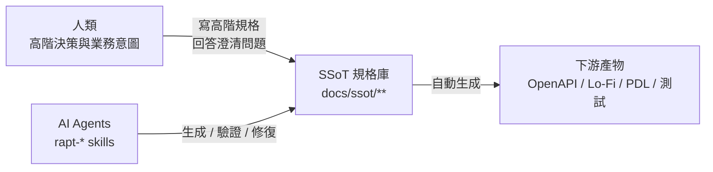
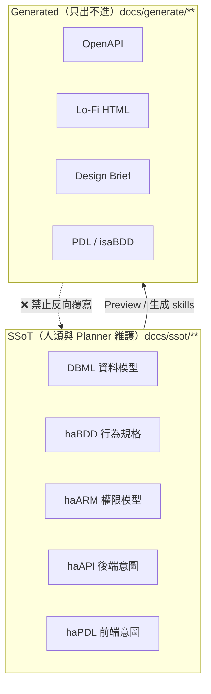
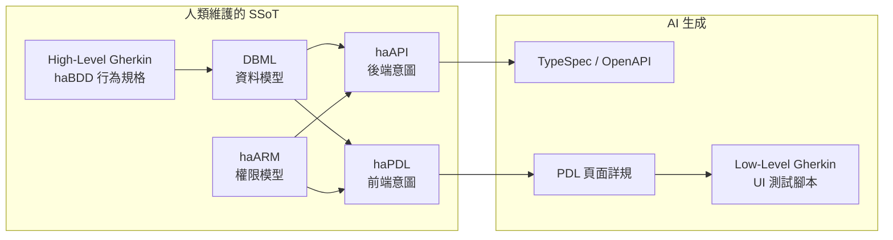
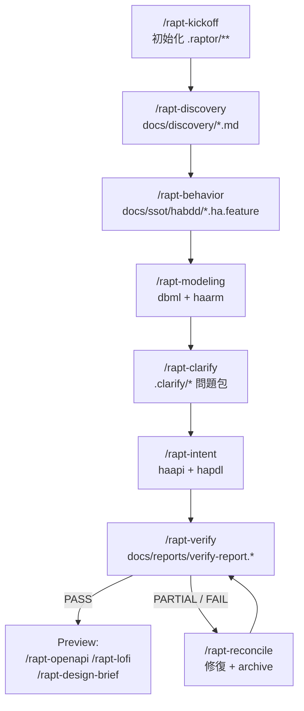

# RAPTor 新進同仁學習教材

> 版本：2026-07-19（by Claude Fable 5）
> 適用對象：第一次接觸 RAPTor 的新進同仁（SA / RD / PM 皆適用）
> 預估學習時間：核心章節約 2～3 小時；含練習題約半天
> 權威順位聲明：本教材為導讀性質。若內容與 `RAPTor/.agents/skills/README.md`、各 skill 的 `SKILL.md` 或 `RAPTor/DSLspec/**` 衝突，**一律以後者為準**。

---

## 目錄

1. [RAPTor 是什麼？為什麼需要它？](#1-raptor-是什麼為什麼需要它)
2. [設計理念與原則](#2-設計理念與原則)
3. [架構與模組介紹](#3-架構與模組介紹)
4. [七劍規格體系（DSL 導覽與真實範例）](#4-七劍規格體系dsl-導覽與真實範例)
5. [使用方式：從零開始跑一次完整流程](#5-使用方式從零開始跑一次完整流程)
6. [開發流程與最佳實踐](#6-開發流程與最佳實踐)
7. [常見問題與解決方案（FAQ）](#7-常見問題與解決方案faq)
8. [資源與參考資料](#8-資源與參考資料)
9. [練習題](#9-練習題)

---

## 1. RAPTor 是什麼？為什麼需要它？

**RAPTor（Requirements Analysis & Prototype Tools）** 是一套結合 BDD（Behavior-Driven Development）、自定 DSL（Domain-Specific Language）與 AI Agent 技術的「**規格即程式碼（Specification-as-Code）**」開發體系與工具集。

### 1.1 它要解決的問題

傳統開發流程中，需求文件與程式碼是兩個世界：

- 需求寫在 Word / Confluence，程式寫在 repo，兩邊各自演化、逐漸脫節。
- 需求變更時，API 文件、UI 稿、測試案例要人工逐一同步，遺漏是常態。
- AI 生成程式碼很快，但**輸入的需求品質不穩定**，導致生成結果隨機發散。

RAPTor 的答案是：把需求本身變成**結構化、可驗證、可追溯**的規格檔案（放進 git、當作 Single Source of Truth），再讓 AI Agent 依規格生成下游產物（OpenAPI、Lo-Fi 原型、測試腳本……）。需求變了，只改規格，其餘重新生成。

### 1.2 三個核心主張

| 主張 | 意義 |
|---|---|
| **以終為始** (Start with the End in Mind) | 先寫好規格，原型、UI、測試由規格自動生成 |
| **人類中心** (Human-centric) | 高階規格語言（haPDL、haAPI、High-Level Gherkin）為人類易讀易寫而設計，降低溝通門檻 |
| **AIxBDD 共構** | 將 BDD 的嚴謹流程與結構化語意，內化為 AI Agent 的操作規範（SOP）與驗證機制 |

### 1.3 分工哲學：人管意圖，AI 管一致性



人類負責「這個系統要做什麼、為誰做、規則是什麼」；AI 負責「規格之間有沒有矛盾、有沒有漏、格式對不對」，以及機械性的生成與修復工作。

---

## 2. 設計理念與原則

### 2.1 SSoT：單一事實來源

RAPTor 專案中的每一種知識都有**唯一的權威檔案**：

- 實體與欄位 → 只認 `docs/ssot/dbml/*.dbml`
- 角色與權限 → 只認 `docs/ssot/haarm/*.haarm.yaml`
- 業務行為 → 只認 `docs/ssot/habdd/*.ha.feature`
- API 意圖 → 只認 `docs/ssot/haapi/*.haapi.yaml`
- 頁面意圖 → 只認 `docs/ssot/hapdl/*.hapdl.yaml`

**任何下游規格不得自行發明上游概念**：haAPI/haPDL 不能憑空造一個 DBML 沒有的 entity，也不能憑空造一個 haARM 沒有的 permission——只能「引用」。這條規則是整套體系一致性的基石，也是 `rapt-verify` 主要檢查的內容。

### 2.2 SSoT 與 Generated 的單向邊界



Preview 產物（`docs/generate/**`）**永遠不可以**拿來反向修改 SSoT。若 preview 過程發現 SSoT 有問題，要走 verify → reconcile → clarify 的正規管道。

### 2.3 五項核心執行原則

所有 `rapt-*` skill 共用（全文見 `rapt-core/references/principles.md`），理解它們就理解了 skill 的行為邏輯：

| # | 原則 | 一句話說明 |
|---|---|---|
| 1 | **CWD 為產出錨點** | 所有產物落在當前工作目錄的專案樹內，相對路徑以 CWD 解析；嚴禁寫到專案外 |
| 2 | **Artifact Output Contract** | 每步 SOP 只能寫入明確標注 CREATE/WRITE/UPDATE 的檔案；「順手」建立其他檔案是違規 |
| 3 | **STRICT SOP** | 依序不漏步、不得自行增步；遇障礙記 CiC 便條或交使用者決定，不得繞過 |
| 4 | **長流程待辦（Tier 0/1）** | 用待辦工具追蹤 phase 與細項進度，跨對話 compact 後仍可還原位置 |
| 5 | **Deny-by-Default 寫入** | 預設禁止寫入任何路徑，只有 contract 明確授權的才能寫；跨 skill 委派不繼承授權 |

### 2.4 Planner / Worker / Verifier / Preview 分權

skill family 內部有嚴格的角色分工：

- **Planner**（如 `rapt-modeling`、`rapt-intent`）：讀取上游素材、做分析與切分決策，然後把「渲染指令（payload）」委派（DELEGATE）給 Worker。
- **Worker**（`rapt-form-*`）：純粹的 DSL 渲染器。只接受 Planner payload，**不自行詢問使用者、不推斷、不填補 payload 以外的內容**；失敗必須回傳明確的 `failure_kind`（如 `invalid_payload`、`missing_evidence`、`dsl_lint_failed`）。
- **Verifier**（`rapt-verify`）：**只報告、不修復**。修復交給 `rapt-reconcile` 或 owner skill。
- **Preview**（`rapt-openapi`、`rapt-lofi`、`rapt-design-brief`）：只寫 `docs/generate/**`，不碰 SSoT。

這種分權讓每個環節的責任可稽核：出錯時能明確定位是「決策錯」（Planner）、「渲染錯」（Worker）還是「驗證漏」（Verifier）。

---

## 3. 架構與模組介紹

### 3.1 工作區目錄地圖

```text
rapt/                          ← 工作區根目錄
├── README.md                  ← 入口導覽
├── RAPTor/                    ← 核心流程與工具庫
│   ├── README.md              ← 核心理念與七劍規格體系
│   ├── 0_reqDevProcess/       ← 七階段需求發掘流程指南（人類方法論文件）
│   ├── DSLspec/               ← 各 DSL v3.3 正式規格與 QUICK-REFERENCE
│   ├── .agents/skills/        ← rapt-* AI 技能庫（本體系的引擎）
│   │   ├── README.md          ← ★ skill family 權威文件
│   │   └── UserGuide.md       ← ★ 使用手冊（每個指令怎麼下、輸入輸出）
│   ├── course_script.md       ← 新手村旅程（以終為始的規格驅動開發）
│   ├── requirements_discovery_course.md ← 需求發掘旅程（從混沌到秩序）
│   └── references/            ← 論文（TCSE 2026）、簡報
├── Projects/                  ← 示範與實際專案
│   ├── smallBiz/              ← 只有 raw-input 的起點狀態
│   ├── smallBiz-Fable/        ← ★ 跑完整套流程的完整示範專案
│   └── BTutor/                ← 另一個專案案例
└── ccwLog/                    ← 工作日誌與討論紀錄（本教材所在）
```

新人建議閱讀順序：`README.md` → `RAPTor/README.md` → `RAPTor/.agents/skills/UserGuide.md` → 打開 `Projects/smallBiz-Fable/` 對照真實產物。

### 3.2 rapt-* Skill Family 全覽

共 21 個 skill，分五類：

| 類型 | Skill | 用途 |
|---|---|---|
| Utility | `rapt-core` | 共用 reference、schema、script、template hub（所有 skill 的基礎建設） |
| Planner | `rapt-kickoff` | 專案初始化：`.raptor/arguments.yml`、`KICKOFF_PLAN.md`、`session.md` |
| Planner | `rapt-discovery` | Phase 1：整理來源需求、stakeholder、journey、event、vision/KPI/scope |
| Planner | `rapt-behavior` | Phase 1.5：產生高階 haBDD / Gherkin 行為規格 |
| Planner | `rapt-modeling` | Phase 2：產生 DBML（資料模型）與 haARM（權限模型） |
| Planner | `rapt-clarify` | Phase 3：掃描不確定性、產生問題包、套用已確認決策 |
| Planner | `rapt-intent` | Phase 4：產生 haAPI 與 haPDL intent |
| Verifier | `rapt-verify` | Phase 5：完整性/一致性/可追溯性/覆蓋率四項驗證，輸出報告 |
| Planner | `rapt-reconcile` | 依 verify findings 修復可修項、建 archive、轉交需澄清項 |
| Worker | `rapt-form-dbml` / `-gherkin` / `-haarm` / `-haapi` / `-hapdl` | 五種 DSL 的渲染器，只接受 Planner payload |
| Utility | `rapt-clarify-loop` | 澄清問題的批次呈現與使用者互動（主要的 ASK 執行者） |
| Utility | `rapt-RAscore` | advisory-only 品質評分：scorecard、findings、action map |
| Utility | `rapt-human-sync` | 偵測人工直接修改的 SSoT，登錄 `manual_change` 到 impact matrix |
| Utility | `rapt-impact` | 變更**事前**影響分析（advisory-only、唯讀） |
| Preview | `rapt-openapi` | haAPI + DBML + haARM → OpenAPI 3.0.3 |
| Preview | `rapt-lofi` | haPDL + DBML + haARM → Lo-Fi wireframe HTML |
| Preview | `rapt-design-brief` | haPDL + DBML + haARM → Design Brief（供 AI 設計工具生成 Hi-Fi UI） |

### 3.3 標準專案佈局

每個 RAPTor 專案（如 `Projects/smallBiz-Fable/`）長這樣：

```text
my-project/
├── raw-input/                 ← 原始需求（PRD、訪談記錄、RFP…）
├── .raptor/                   ← RAPTor 狀態與設定（機器管理）
│   ├── KICKOFF_PLAN.md
│   ├── arguments.yml          ← ★ 路徑設定的 SSoT（schema v2）
│   ├── session.md             ← 跨對話的進度記錄
│   ├── traceability.md        ← 需求 → 規格的追溯矩陣
│   ├── impact-matrix.yml      ← 變更影響登錄
│   └── reconcile/{sessions,archive}/
├── .clarify/                  ← 澄清問題包與決策紀錄
└── docs/
    ├── discovery/             ← Phase 1 產出（supporting SSoT）
    ├── ssot/                  ← ★ 五類 first-class SSoT
    │   ├── dbml/  habdd/  haarm/  haapi/  hapdl/
    ├── reports/               ← verify / RAscore / impact 報告
    └── generate/              ← 生成產物（openapi / lofi / designbrief / pdl / isabdd）
```

**`.raptor/arguments.yml` 是所有路徑的 SSoT**——每個 skill 都從這裡解析路徑，不得自帶一份設定。想知道某類產物該放哪，查這個檔案（或用 `resolve_args.py`）就對了。

### 3.4 rapt-core 關鍵腳本

| Script | 用途 |
|---|---|
| `rapt-core/scripts/resolve_args.py` | 解析 `arguments.yml`，輸出 `KEY=value` |
| `rapt-core/scripts/manage_impact_matrix.py` | validate / query / upsert impact matrix |
| `rapt-core/scripts/migrate_docs_layout.py` | v1 → v2 docs layout 遷移（先 dry-run） |
| `rapt-core/scripts/analyze_skill_family.py` | 檢查 skill family 一致性 |
| `rapt-verify/references/dsl-lint.py` | DSL lint（含 `--habdd` 單檔 lint） |
| `rapt-human-sync/scripts/detect_unsynced.py` | 唯讀偵測人工 SSoT 變更 |

---

## 4. 七劍規格體系（DSL 導覽與真實範例）

RAPTor 建立了一條從「業務意圖」到「技術實作」的規格轉換鏈，戲稱「七劍下天山」。前四把由人類（協同 AI）撰寫維護，後三把由 AI 自動生成：



以下範例全部取自本工作區真實檔案 `Projects/smallBiz-Fable/`（一個電商平台示範專案）。

### 4.1 haBDD（High-Level Gherkin）— 業務行為 SSoT

檔案：`docs/ssot/habdd/shopping-cart.ha.feature`

```gherkin
# language: zh-TW
# source: docs/discovery/02-user-journeys.md#consumer的主要旅程1
# stories: US-003
# feature-id: F-003
Feature: 購物車
  In order to 彙整想買的商品並隨時湊單
  As a 消費者
  I want to 將商品加入購物車並管理內容

  # scenario_id: SCN-CART-004
  # entities: 購物車, 商品
  Scenario: 已下架商品無法加入購物車
    Given 某商品已被商家下架
    When 消費者將該商品加入購物車
    Then 加入不成立
    And 消費者收到商品已下架的提示
```

注意兩件事：

1. **header 註解是必要的追溯資訊**：`source`（來自哪份 discovery 文件）、`feature-id`、`scenario_id`、`entities`。verify 靠這些做追溯檢查。
2. **haBDD 只講業務語言**。以下內容一律禁止出現：CSS selector（`#submit`）、`data-testid`、URL / API path（`/api/cases`）、HTTP method（`GET`/`POST`）、response status、JSON body、database setup。這些屬於下游的 Low-Level Gherkin。

### 4.2 Annotated DBML — 資料模型 SSoT

檔案：`docs/ssot/dbml/schema.dbml`（節錄）

```dbml
// DSL: annotated DBML v3.3.0

// TableGroups 對齊 Bounded Context（DDD 限界上下文）
TableGroup Shopping {
  Cart
  CartItem
}

TableGroup OrderContext {
  Order
  OrderItem
}

TableGroup MembershipLoyalty {
  Member
  MemberAddress
  PointLedger
  Wishlist
}
```

DBML 目錄下還有三個配套檔案：`glossary.md`（通用語言詞彙表）、`constraints.md`（業務約束，如 `CON-AUD-001`）、`seeds.md`（種子資料）。實體與欄位的唯一權威就在這裡。

### 4.3 haARM — 權限模型 SSoT

檔案：`docs/ssot/haarm/smallBiz.haarm.yaml`（節錄）

```yaml
# DSL: haARM v3.3.0
actors:
  - id: consumer
    name: 消費者
    type: user
  - id: payment-gateway
    name: 金流服務商
    type: external

roles:
  - id: public
    name: 公開訪客
    implicit: true
    permissions:
      - product_list
      - product_read
  - id: consumer
    name: 消費者
    permissions:
      - member_read_own
      - member_update_own
```

Actor（誰）、Role（什麼身分）、Permission（能做什麼）在此一次定義。下游的 haAPI / haPDL **只能引用這裡的 permission id**，不得自創。

### 4.4 haAPI — 後端意圖 SSoT

檔案：`docs/ssot/haapi/cart.haapi.yaml`（節錄）

```yaml
# DSL: haAPI v3.3.0
api: cart
entity: Cart              # ← 必須是 DBML 中存在的 Table
title: 購物車 API

exposes:
  standard: [read]
  operations:
    - name: add_item
      method: POST
      path: /{id}/items

access:
  authentication: {type: bearer, required: true}
  operations:
    add_item:
      required_roles: [consumer]          # ← 引用 haARM 的 role
      required_permissions:
        - id: cart_item_create_own        # ← 引用 haARM 的 permission

source_evidence:                          # ← 每份 intent 都要附證據鏈
  - "docs/ssot/habdd/shopping-cart.ha.feature#Scenario:將上架商品加入購物車"
  - "docs/ssot/dbml/schema.dbml#Table:Cart"
  - "docs/ssot/haarm/smallBiz.haarm.yaml#roles"
```

`source_evidence` 是 RAPTor 的招牌設計：每一份 intent 規格都要指回它的上游依據，verify 據此檢查追溯鏈。注意舊版的 `access.permissions` / `security.permissions` 扁平寫法是 legacy 欄位，v3.3 起不可再用。

### 4.5 haPDL — 前端意圖 SSoT

檔案：`docs/ssot/hapdl/audit-log-list.hapdl.yaml`（節錄）

```yaml
# DSL: haPDL v3.3.0
page: audit-log-list
type: list                # 頁面類型：list / form / detail…
entity: AuditLog          # ← 引用 DBML
api: audit-log            # ← 引用 haAPI
title: 稽核紀錄

auth:
  roles: [merchant, platform-admin]

view:
  filters:
    - {field: actorType, label: 操作者類型, type: eq, ref_code: AuditActorType}
  columns:
    - {field: auditId, label: 稽核編號}
    - {field: createdAt, label: 操作時間, format: date, sortable: true}

security:
  permission_refs:
    view:
      - {id: audit_log_read_store}       # ← 引用 haARM
  datasource_scope: own
```

haPDL 描述「這個頁面給誰看、呈現什麼欄位、能做什麼操作」的**意圖**，不描述像素與元件實作——那是下游 PDL 與 Lo-Fi 的事。

### 4.6 引用鏈總結

一條完整的追溯鏈長這樣（以購物車為例）：

```text
raw-input/2-meetUsers.md（訪談）
  → docs/discovery/02-user-journeys.md（US-003）
    → docs/ssot/habdd/shopping-cart.ha.feature（F-003 / SCN-CART-001..004）
      → docs/ssot/dbml/schema.dbml（Cart, CartItem）
      → docs/ssot/haarm/smallBiz.haarm.yaml（consumer / cart_*_own）
        → docs/ssot/haapi/cart.haapi.yaml
        → docs/ssot/hapdl/cart-detail.hapdl.yaml
          → docs/generate/openapi/openapi.yaml（生成）
          → docs/generate/lofi/index.html（生成）
```

`.raptor/traceability.md` 用矩陣記錄這些對應（L1：需求→feature；L2/L3：scenario→intent→資料表）。

---

## 5. 使用方式：從零開始跑一次完整流程

### 5.1 建立自己的專案

```powershell
# 1. 在 Projects/ 下建立專案資料夾與原始需求
mkdir Projects\my-app\raw-input
# 把 PRD、訪談記錄等放進 raw-input/

# 2. 連結 AI 技能庫（Windows Junction，不要用複製！）
cd Projects\my-app
mkdir .agents
cmd /c mklink /J .agents\skills ..\..\RAPTor\.agents\skills
# 若使用 Claude Code，把 .agents 目錄改名為 .claude
```

> 為什麼用 junction 不用複製？因為 skill 庫會持續演進，複製出去的副本會過期脫節——這本身就違反 SSoT 精神。

### 5.2 標準流程（Happy Path）



逐步說明（指令都在專案根目錄下的 AI 對話中執行）：

| 步驟 | 指令 | 你要做的事 |
|---|---|---|
| 1 | `/rapt-kickoff` | 回答專案名稱、描述、語言（預設 zh-hant）、模式（預設 greenfield） |
| 2 | `/rapt-discovery` | 確認它整理出的 stakeholder、user story、journey 是否符合認知 |
| 3 | `/rapt-behavior` | 審閱生成的 haBDD：情境是否完整？業務語言是否準確？ |
| 4 | `/rapt-modeling` | 審閱 DBML 實體切分與 haARM 角色權限 |
| 5 | `/rapt-clarify` | **重頭戲**：回答 AI 掃出的 GAP/ASM/BDY/CON 問題，決策會套用回 SSoT |
| 6 | `/rapt-intent` | 審閱 haAPI / haPDL 切分 |
| 7 | `/rapt-verify` | 讀報告：`can_continue` 是否為 true、有無 NEED_TO_FIX |
| 8 | （視結果）`/rapt-reconcile` | 讓 AI 修可修項，需決策項會轉成新的 clarify 問題 |
| 9 | `/rapt-lofi` 等 | 打開 Lo-Fi 原型給利害關係人看，收集回饋進入下一輪迭代 |

### 5.3 讀懂 verify 報告

`docs/reports/verify-report.md`（人讀）與 `.yml`(機讀）成對輸出。以 smallBiz-Fable 的真實報告為例：

```text
整體結果：PARTIAL（可繼續；6 筆 NOTE_ONLY，0 blocker）

| 驗證面向                  | 結果    |
| 完整性 Completeness      | PASS    |
| 跨 DSL 一致性 Consistency | PASS    |
| 可追蹤性 Traceability     | PARTIAL |
| 覆蓋率 Coverage           | PASS    |

can_continue: true
```

每筆 finding 有三種分流（route），決定後續動作：

| Route | 意義 | 誰處理 |
|---|---|---|
| `NEED_TO_FIX` | 證據足夠、可機械修復 | `/rapt-reconcile` 或 owner skill |
| `NEED_TO_CLARIFY` | 需要業務決策 | 轉 clarify 問題包，由人回答 |
| `NOTE_ONLY` | 不阻擋流程，留紀錄供下輪迭代 | 記錄即可 |

**PARTIAL 不代表失敗**——smallBiz-Fable 的 PARTIAL 只是有 6 筆 NOTE_ONLY（例如「報表 feature 是讀模型、無獨立 haAPI」），phase gate 照樣通過。

### 5.4 兩個常用的治理指令

**人工改了 SSoT 之後**（例如你直接用編輯器改了 `.dbml`）：

```text
/rapt-human-sync     ← 掃 git diff，登錄 manual_change 到 impact matrix
/rapt-verify         ← 再驗一次
```

**要加新功能 / 改需求之前**（brownfield 尤其重要）：

```text
/rapt-impact         ← 唯讀分析：這個變更會牽動哪些規格？
                       產出 IA-*.md 報告與 accept/defer/reject 建議
```

兩者都是「先登錄、先分析，不直接動 SSoT」的設計——治理靠流程，不靠自律。

---

## 6. 開發流程與最佳實踐

### 6.1 心法：順序有理由，不要跳關

- **先行為後模型**：haBDD 寫在 DBML 之前，確保資料模型是為了支撐行為而生，不是憑空設計。
- **先澄清後意圖**：`/rapt-clarify` 在 `/rapt-intent` 之前，讓 API/頁面切分建立在已決策的規則上，避免把模糊需求「編譯」進下游。
- **verify 是閘門不是句點**：每次 SSoT 有實質變動（reconcile 修復後、human-sync 登錄後、clarify 套用決策後），都要再跑一次 `/rapt-verify`。

### 6.2 CiC 便條：讓不確定性留下痕跡

流程中遇到的缺口與疑問，不能默默略過，要以 CiC（Clarify-in-Context）便條記在產物中，供 `/rapt-clarify` 掃描打包：

| 標記 | 意義 | 例子 |
|---|---|---|
| `GAP` | 需求缺口 | 付款期限值未定（GAP #006） |
| `ASM` | 暫定假設 | 狀態機觸發者假設為商家（ASM #008） |
| `BDY` | 邊界條件 | 點數折抵上限？ |
| `CON` | 業務約束待確認 | 會員升級門檻金額（CON-MBR-003） |

**只有已確認的決策才能套用回 SSoT**——假設要標明是假設。

### 6.3 規格撰寫 checklist

寫（或審閱）SSoT 時自查：

- [ ] haBDD：有 `source` / `feature-id` / `scenario_id` header？沒有混入 UI/API 技術細節？
- [ ] DBML：新實體有進對應 TableGroup（bounded context）？glossary 有同步詞彙？
- [ ] haARM：新權限有掛到 role？external actor 與 user actor 有區分？
- [ ] haAPI / haPDL：`entity` 存在於 DBML？permission 存在於 haARM？`source_evidence` 完整？
- [ ] 有不確定的地方都留了 CiC 便條，而不是自行腦補？

### 6.4 工程紀律

- **不要手動仿製 skill 產物格式**。要新增規格，走對應 skill；skill 產不出來，代表上游素材不足（這正是 worker 回 `missing_evidence` 的意義）。
- **修改 SSoT 前先想影響**：brownfield 動手前跑 `/rapt-impact`；動完手（若是手改）跑 `/rapt-human-sync`。
- **reconcile 有保險絲**：它修改任何 SSoT 前必建 `archive` snapshot，改壞了可回溯。
- **編碼一律 UTF-8**：本 repo 曾發生過中文亂碼修復（見 git log「skill 亂碼修復」）。在 Windows 上用 PowerShell 寫檔要顯式 `-Encoding utf8`；詳見 `rapt-core/references/encoding-policy.md`。
- **advisory 工具不是 gate**：`rapt-RAscore` 與 `rapt-impact` 都是 advisory-only，提供決策參考，不阻擋 phase；別把它們的 findings 當成必須清零的錯誤清單。

### 6.5 迭代模式

RAPTor 是迭代流程，不是瀑布。Phase 7（迭代精煉）的迴圈是：

```text
Lo-Fi / OpenAPI 給利害關係人看 → 收集回饋 → 回饋轉為需求變更
  → /rapt-impact 評估 → 更新 SSoT（走 skill 或手改+human-sync）
    → /rapt-verify → （必要時 /rapt-reconcile）→ 重新生成 preview
```

改的永遠是規格，生成物永遠重生——這就是 Spec-as-Code。

---

## 7. 常見問題與解決方案（FAQ）

**Q1：`/rapt-kickoff` 跑完沒有 `docs/discovery/`，是不是失敗了？**
不是。kickoff 只建立 `.raptor/**`（設定與 session）。各 phase 目錄由對應 skill 在寫入 artifact 時才建立。

**Q2：可以直接呼叫 `rapt-form-*`（Worker）嗎？**
不建議。Worker 只接受 Planner 的 payload；缺 payload 或 source evidence 時它會依 failure contract 回報錯誤（如 `invalid_payload`、`missing_evidence`），不會「幫你想辦法」。請呼叫對應的 Planner（如要產 DBML 就跑 `/rapt-modeling`）。

**Q3：Worker 回傳 `missing_evidence` 怎麼辦？**
這代表上游素材不足以支撐要渲染的內容。回頭補上游：可能是 discovery 少了某段故事、haBDD 少了情境、或 DBML 少了實體。不要繞過 Worker 手寫產物。

**Q4：我直接用編輯器改了 `docs/ssot/**` 的檔案，會怎樣？**
不會爆炸，但會留下治理缺口。改完請跑 `/rapt-human-sync`（登錄 manual_change）再 `/rapt-verify`。沒登錄的手改在下次 verify/reconcile 時可能被視為不一致來源。

**Q5：Lo-Fi / OpenAPI 生成結果不滿意，可以直接改 `docs/generate/**` 嗎？**
可以改著玩，但沒有意義——它們是生成物，下次重跑就被覆蓋。正確做法是改上游 SSoT（haPDL/haAPI/DBML/haARM）再重新生成。**絕對不要**把 generate 的內容反向搬回 SSoT。

**Q6：verify 結果是 PARTIAL，我可以繼續嗎？**
看 `can_continue` 與 finding 分流。PARTIAL + 全部 NOTE_ONLY + `can_continue: true` 可以繼續；有 `NEED_TO_FIX` 先跑 `/rapt-reconcile`；有 `NEED_TO_CLARIFY` 先回答問題。

**Q7：haBDD 想寫「點擊送出按鈕後 API 回 200」可以嗎？**
不行。haBDD 是業務行為層，禁止 selector、URL、HTTP method、status code。改寫成業務語言：「當消費者送出訂單，則訂單成立」。技術細節屬於自動生成的 Low-Level Gherkin。lint 會擋：`python .../dsl-lint.py --habdd docs/ssot/habdd`。

**Q8：舊專案的 `docs/01-discovery` 佈局還能用嗎？**
既有專案有 legacy fallback 可讀，但新專案一律用 v2 佈局（`docs/discovery/`、`docs/ssot/**`）。遷移用 `migrate_docs_layout.py` 先跑 dry-run。

**Q9：haAPI 想加一個 haARM 沒有的權限（例如 `cart_export`），直接寫進 haAPI 可以嗎？**
不行，verify 會抓（permission 引用不存在）。正確順序：先在 haARM 補權限（走 `/rapt-modeling` 或手改+human-sync），再讓 haAPI 引用。

**Q10：skill 庫可以複製一份到我的專案裡嗎？**
不要。用 junction（`mklink /J`）連結 `RAPTor/.agents/skills`，讓所有專案共用同一份會演進的 skill 庫。複製出去的副本會過期。

**Q11：對話太長被 compact 了，AI 忘記做到哪，怎麼辦？**
這正是 `.raptor/session.md` 與 Tier 0/1 待辦（PRINCIPLE 4）存在的目的。新對話開始時請 AI 先讀 `.raptor/session.md` 還原進度。

**Q12：RAscore 分數不高，需要修到滿分嗎？**
不需要。RAscore 是 advisory-only 的品質參考，findings 會經 action map 分流成 NEED_TO_FIX / NEED_TO_CLARIFY / NOTE_ONLY，按分流處理即可，不是考試成績。

---

## 8. 資源與參考資料

### 8.1 必讀（依序）

1. `README.md` — 工作區入口與快速開始
2. `RAPTor/README.md` — 核心理念、七劍規格體系、工作流程
3. `RAPTor/.agents/skills/UserGuide.md` — **使用手冊**：每個指令的輸入輸出與一頁流程表
4. `RAPTor/.agents/skills/README.md` — **skill family 權威文件**：核心原則、arguments.yml v2、SSoT 邊界
5. `RAPTor/.agents/skills/rapt-core/references/principles.md` — 五項核心執行原則

### 8.2 DSL 規格（要寫規格時查）

- 快速參考：`RAPTor/DSLspec/haPDL-QUICK-REFERENCE.md`、`haAPI-QUICK-REFERENCE.md`、`haARM-QUICK-REFERENCE.md`、`DBML-QUICK-REFERENCE.md`
- 完整規格：`RAPTor/DSLspec/*-v3.3.md`（haPDL / haAPI / haARM / annotated DBML / PDL / haPDL2PDL）
- 跨 DSL 引用規則：`RAPTor/DSLspec/CROSS-DSL-GUIDE.md`

### 8.3 方法論與教學

- `RAPTor/course_script.md` — 新手村旅程：以終為始的規格驅動開發
- `RAPTor/requirements_discovery_course.md` — 需求發掘旅程：從混沌到秩序
- `RAPTor/0_reqDevProcess/01-整體流程架構.md` ～ `07-haARM整合方案.md` — 七階段流程詳解與範本（`templates/` 含各 phase 工作坊模板）

### 8.4 研究成果與簡報

- TCSE 2026 論文：《AI 產力左移與 Spec-as-Source 工程框架》— `RAPTor/references/TCSE_2026_paper_14_v2.pdf`（Markdown 版 `2026TCSE.md`）
- RAPTor 30 分鐘導覽簡報 — `RAPTor/references/0612-RAPTor簡報-30min導覽.md`
- rapt-human-sync 專題簡報 — `RAPTor/references/0613plan-rapt-human-sync_presentation_cc-Opus48.md`

### 8.5 實例專案（對照學習最有效）

- `Projects/smallBiz/` — 起點狀態：只有 `raw-input/` 三份需求文件
- `Projects/smallBiz-Fable/` — **完整終點狀態**：五類 SSoT、verify/RAscore/impact 報告、clarify 決策紀錄、三種 preview 產物俱全。本教材第 4 章範例全部出自此處
- `Projects/BTutor/` — 另一個真實題材（橋牌教學）的案例

---

## 9. 練習題

> 建議在讀完第 4、5 章後動手。前三題唯讀、零風險；後兩題要動手跑流程。

### 練習 1：追溯鏈尋寶（唯讀，15 分鐘）

在 `Projects/smallBiz-Fable/` 中，追出「優惠券（coupon）」功能的完整追溯鏈：

1. 在 `docs/discovery/02-user-journeys.md` 找到對應的 US 編號。
2. 找到對應的 `*.ha.feature` 檔與 `feature-id`。
3. 在 `schema.dbml` 找到 Coupon 相關 Table 與所屬 TableGroup。
4. 在 `coupon.haapi.yaml` 的 `source_evidence` 驗證上述三者都被引用。
5. 在 `.raptor/traceability.md` 的 L1 表找到這條鏈的登錄列。

### 練習 2：verify 報告判讀（唯讀，10 分鐘）

打開 `Projects/smallBiz-Fable/docs/reports/verify-report.md`，回答：

1. 整體結果是什麼？為什麼仍然 `can_continue: true`？
2. FIND-004（願望清單 feature 待撰寫）的 owner skill 是誰？若要處理，該執行哪個指令？
3. 四個驗證面向中哪一個是 PARTIAL？原因為何？

<details>
<summary>參考答案</summary>

1. PARTIAL；因為 6 筆 finding 全是 NOTE_ONLY（0 個 blocker、0 個 NEED_TO_FIX / NEED_TO_CLARIFY），phase gate 條件全數通過。
2. owner 是 `rapt-behavior`；執行 `/rapt-behavior` 補寫 wishlist feature（Wishlist 實體、haAPI、haPDL 已存在）。
3. 可追蹤性（Traceability）：L2/L3 中少數讀取/報表型 scenario 沒有獨立 intent 對應（由 list/read 承接）。

</details>

### 練習 3：finding 分流判斷（10 分鐘）

以下三個情境，分別該分流為 `NEED_TO_FIX`、`NEED_TO_CLARIFY` 還是 `NOTE_ONLY`？

- (a) `order.haapi.yaml` 引用了 permission `order_cancel_own`，但 haARM 中沒有這個 permission，而 haBDD 明確有「消費者取消未出貨訂單」的 scenario。
- (b) 退貨期限在 PRD 寫 7 天、訪談記錄寫 10 天，haBDD 目前寫 7 天並帶有 `# CiC GAP` 便條。
- (c) `merchant-reporting` feature 沒有獨立 haAPI，因為報表是既有資料的讀模型 view。

<details>
<summary>參考答案</summary>

- (a) `NEED_TO_FIX`——證據充分（haBDD 有場景支撐），機械性補 haARM permission 即可，owner 為 rapt-modeling/rapt-reconcile。
- (b) `NEED_TO_CLARIFY`——兩個來源矛盾，7 天 vs 10 天是業務決策，AI 不能代答。
- (c) `NOTE_ONLY`——設計取捨的說明，不阻擋流程（這正是真實報告中的 FIND-001）。

</details>

### 練習 4：跑一次迷你流程（動手，60～90 分鐘）

用 `Projects/smallBiz/raw-input/` 的三份文件當素材（或自己準備一份小需求）：

1. 建立 `Projects/my-練習/`，放入 raw-input，依 5.1 節建立 skills junction。
2. 依序執行 `/rapt-kickoff` → `/rapt-discovery` → `/rapt-behavior`。
3. 檢查產出的 `.ha.feature` 是否符合 haBDD 規則，並跑 lint：
   `python RAPTor/.agents/skills/rapt-verify/references/dsl-lint.py --habdd docs/ssot/habdd`
4. 對照 `Projects/smallBiz-Fable/` 的同名產物，比較你的版本與示範版本的差異。

### 練習 5：human-sync 體驗（動手，30 分鐘）

在練習 4 的專案（或 smallBiz-Fable 的**副本**——不要動原始示範專案）中：

1. 手動在某個 `.ha.feature` 加一個新 Scenario。
2. 執行唯讀偵測：`python RAPTor/.agents/skills/rapt-human-sync/scripts/detect_unsynced.py --root .`，觀察輸出。
3. 執行 `/rapt-human-sync`，檢視產生的 `HSYNC-*.yml` 與 impact matrix 的 `manual_change` entry。
4. 再跑 `/rapt-verify`，觀察新 Scenario 是否引發覆蓋率或追溯 finding。

---

## 附錄：一頁速查表

| 我想…… | 指令 / 檔案 |
|---|---|
| 初始化新專案 | `/rapt-kickoff` |
| 整理原始需求 | `/rapt-discovery` |
| 產生行為規格 | `/rapt-behavior` → `docs/ssot/habdd/` |
| 產生資料/權限模型 | `/rapt-modeling` → `docs/ssot/dbml/`、`docs/ssot/haarm/` |
| 澄清模糊需求 | `/rapt-clarify` → `.clarify/` |
| 產生 API/頁面意圖 | `/rapt-intent` → `docs/ssot/haapi/`、`docs/ssot/hapdl/` |
| 驗證規格一致性 | `/rapt-verify` → `docs/reports/verify-report.*` |
| 修復 verify findings | `/rapt-reconcile` |
| 評估變更影響（事前） | `/rapt-impact` |
| 登錄手改 SSoT（事後） | `/rapt-human-sync` |
| 品質評分 | `/rapt-RAscore` |
| 看 API 長相 | `/rapt-openapi` → Swagger UI |
| 看頁面長相 | `/rapt-lofi` → `python -m http.server 8089 --directory docs/generate/lofi` |
| 出設計稿需求 | `/rapt-design-brief` |
| 查某路徑設定 | `python .../rapt-core/scripts/resolve_args.py --key paths.<key>` |

> 本教材內容若與 `RAPTor/.agents/skills/README.md` 及各 `SKILL.md` 衝突，以後者為準。
