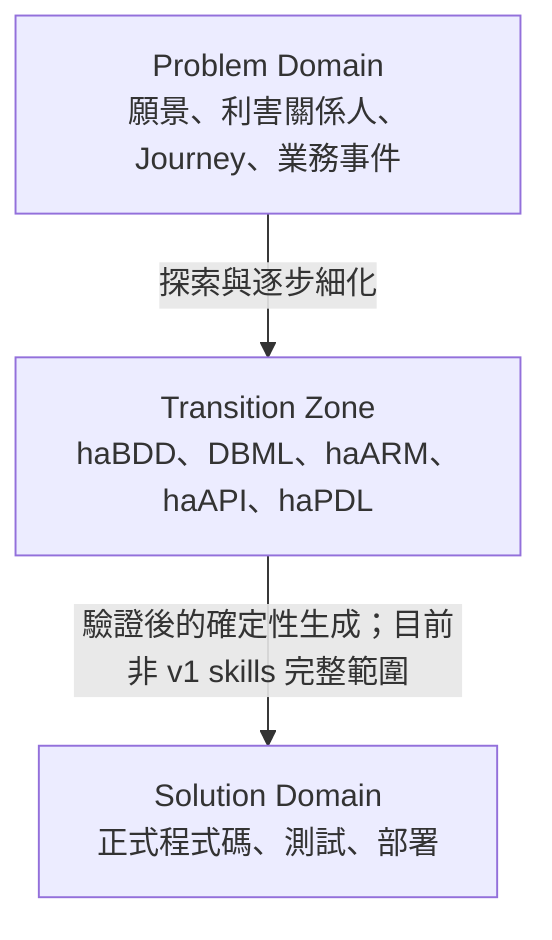
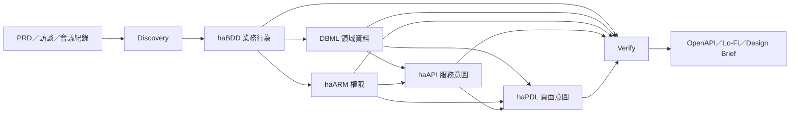
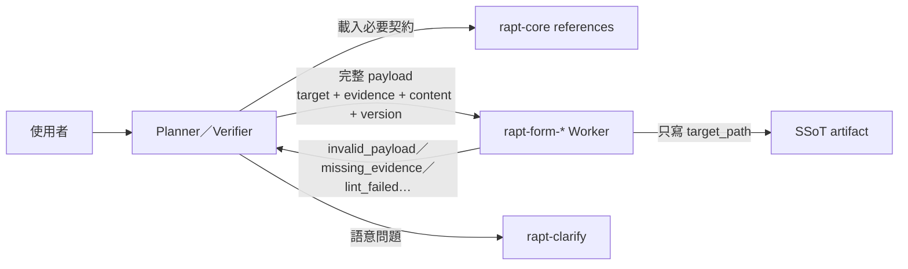
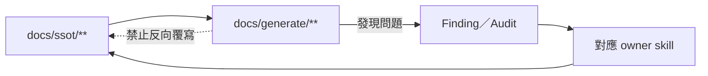
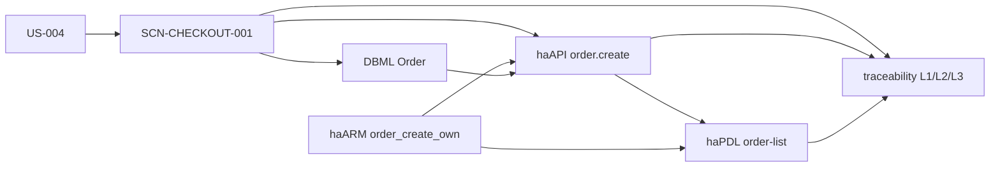
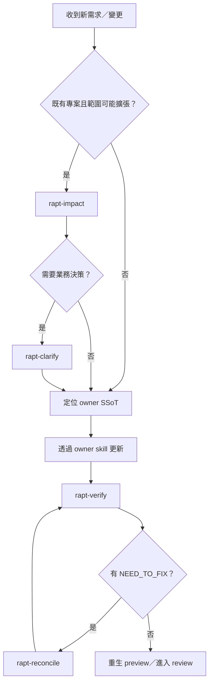

# RAPTor 新進同仁學習教材

> **適用版本**：本工作區截至 2026-07-19 的 `rapt-*` skill family、`.raptor/arguments.yml` v2 與 DSL v3.3
>
> **適用對象**：需求分析師、系統分析師、產品經理、架構師、開發者、測試人員，以及維護 RAPTor skills 的工程師
>
> **學習目標**：能說明 RAPTor 的架構與設計理念、在正確的專案目錄執行標準流程、閱讀與追蹤五類 SSoT、判斷問題應交給哪個 skill，並安全地修改與驗證 RAPTor 本身。

---

## 0. 先建立正確心智模型

RAPTor（Requirements Analysis & Prototype Tools）目前不是一個供應用程式 `import` 的函式庫，也不是「輸入一句需求便直接生成正式系統」的程式碼生成器。它是一套由 AI skills、結構化 DSL、品質閘門與輔助腳本組成的**需求到意圖規格工作流**。

一句話記住它：

> 讓 AI 在需求與規格層協助發散，再用 SSoT、可追溯引用、DSL lint、人工決策與單向生成邊界把結果收斂。

### 0.1 90 分鐘快速入門路線

| 時間 | 任務 | 完成標準 |
|---:|---|---|
| 0–15 分 | 閱讀第 1、2 章 | 能畫出「來源 → 五類 SSoT → preview」資料流 |
| 15–30 分 | 閱讀第 3 章 | 能解釋 SSoT、deny-by-default、Planner/Worker 與 CiC |
| 30–50 分 | 依第 4 章檢視 `smallBiz-Fable` | 找到 arguments、session、五類 SSoT 與 verify report |
| 50–70 分 | 依第 5 章追蹤一條訂單規格鏈 | 能從 haBDD 追到 DBML、haARM、haAPI、haPDL |
| 70–90 分 | 完成練習 1～3 | 可正確執行唯讀工具，並解讀 lint 結果 |

如果工作職責只使用 RAPTor，先讀到第 6 章即可；需要維護 skills 或腳本，再讀第 7 章。

### 0.2 文件權威順位

RAPTor 同時保留現行 skill 契約、方法論文件與歷史設計資料。內容不一致時，依下列順位判讀：

1. 各 skill 的 `SKILL.md` 與它明確載入的 reference／SOP。
2. `RAPTor/.agents/skills/rapt-core/references/**` 共用契約。
3. `RAPTor/.agents/skills/README.md`、`UserGuide.md`。
4. `RAPTor/DSLspec/**` 的 DSL v3.3 規格。
5. `RAPTor/0_reqDevProcess/**`、課程、論文與簡報等背景資料。
6. `ccwLog/**` 工作紀錄。

第 5、6 順位很適合理解「為什麼」，但不可用來覆蓋現行 `SKILL.md` 的寫入邊界與輸出契約。

---

## 1. RAPTor 解決什麼問題

直接請生成式 AI 寫交付程式碼，常見風險是需求追溯斷裂、不同回合產生的契約漂移，以及模糊需求被悄悄補成看似合理的實作。RAPTor 把 AI 的主要作用點左移到需求與規格層，先建立可審查、可 diff、可 lint 的文字規格，再產生只讀的預覽產物。

### 1.1 三層域



目前可操作的 `rapt-*` skills 主要涵蓋 Problem Domain、Transition Zone、驗證、調和與 preview。歷史七階段方法論中的完整 Prototype／codegen 是目標架構，不應誤認為本版已提供正式交付碼生成。

### 1.2 從高熵輸入到低熵規格



這條管線不是一次完成。每一階段都有品質閘門；資訊不足時留下結構化問題，跨規格不一致時先報告，再由對應 owner 修復。

---

## 2. 架構與模組

### 2.1 工作區地圖

```text
rapt/
├── RAPTor/
│   ├── .agents/skills/       # 21 個 rapt-* skills 的唯一正式來源
│   ├── DSLspec/              # DBML、haBDD、haARM、haAPI、haPDL v3.3 規格
│   ├── 0_reqDevProcess/      # 方法論、七階段流程、模板與背景資料
│   └── references/           # 論文、簡報、課程資料
├── Projects/                 # 實例與練習專案
│   ├── smallBiz-Fable/       # 完整流程與 preview 範例
│   ├── smallBiz-codex/       # Codex 執行範例
│   └── BTutor/               # 橋牌認知家教範例
├── ccwLog/                   # 工作日誌，不是正式 SSoT
└── sync-skills.ps1           # 既有範例專案的 skill junction 同步工具
```

`RAPTor/.agents/skills/` 是 canonical source。專案內的 `.agents/skills`、`.claude/skills` 或 `skills` 應連到這裡；不要複製出另一份再各自修改。

### 2.2 目標專案的標準佈局

```text
my-project/
├── raw-input/                    # PRD、訪談、RFP 等原始材料
├── .agents/skills/               # 指向 canonical skills 的 junction（Codex）
├── .raptor/
│   ├── KICKOFF_PLAN.md
│   ├── arguments.yml             # 路徑設定 SSoT
│   ├── session.md                # 階段狀態與摘要
│   ├── traceability.md           # L1/L2/L3 與決策追蹤
│   ├── impact-matrix.yml
│   ├── human-sync/
│   └── reconcile/
├── .clarify/                     # 澄清 backlog、問題批次與決策紀錄
└── docs/
    ├── discovery/                # Supporting SSoT
    ├── reports/                  # verify、RAscore、impact 報告
    ├── ssot/
    │   ├── habdd/                # 業務行為
    │   ├── dbml/                 # 資料模型、詞彙、值域、限制
    │   ├── haarm/                # 角色、權限與政策
    │   ├── haapi/                # 後端服務意圖
    │   └── hapdl/                # 前端頁面意圖
    └── generate/                 # 可重生的 preview／衍生物
        ├── openapi/
        ├── lofi/
        ├── designbrief/
        ├── pdl/
        └── isabdd/
```

路徑的唯一設定來源是 `.raptor/arguments.yml`，不是 README、skill 內的 hardcode，也不是個人習慣。

### 2.3 三種 artifact 層級

| 層級 | 內容 | 能否作為決策來源 | 能否手動反向覆寫 SSoT |
|---|---|---:|---:|
| First-class SSoT | DBML、haBDD、haARM、haAPI、haPDL | 是 | 不適用，本身就是規格來源 |
| Supporting SSoT | Discovery、glossary、seeds、constraints、traceability、impact matrix | 是 | 需依 owner 與契約更新 |
| Downstream Generated | OpenAPI、Lo-Fi、Design Brief、PDL、isaBDD | 否 | 否；應回到 SSoT 修正後重生 |

五類 first-class SSoT 的職責：

| DSL | 回答的問題 | 唯一性規則 |
|---|---|---|
| haBDD (`*.ha.feature`) | 系統對業務情境應有什麼行為？ | 不放 selector、HTTP、URL、JSON 或 DB setup |
| Annotated DBML (`*.dbml`) | 有哪些 entity、field、關係、值域與敏感欄位？ | entity／field 的唯一 SSoT |
| haARM (`*.haarm.yaml`) | 誰能對什麼資源做什麼？條件為何？ | role／permission／policy 的唯一 SSoT |
| haAPI (`*.haapi.yaml`) | 後端要暴露哪些能力、操作與授權引用？ | 只能引用 DBML entity 與 haARM 權限 |
| haPDL (`*.hapdl.yaml`) | 頁面呈現、互動、狀態與 API 綁定為何？ | 只能引用既有 DBML、haAPI、haARM |

### 2.4 21 個 skill 模組

| 類型 | Skill | 主要責任 | 可由使用者直接呼叫 |
|---|---|---|:---:|
| 共用核心 | `rapt-core` | 共用原則、schema、reference、script、template hub | 否 |
| 流程 | `rapt-kickoff` | 建立 arguments、session 與 kickoff plan | 是 |
| 流程 | `rapt-discovery` | 整理來源、stakeholder、journey、event、vision/KPI/scope | 是 |
| 流程 | `rapt-behavior` | 將 discovery 轉為高階 haBDD | 是 |
| 流程 | `rapt-modeling` | 產生 DBML、glossary、seeds、constraints、haARM | 是 |
| 流程 | `rapt-clarify` | 收集 CiC、詢問、記錄決策並授權回寫 | 是 |
| 流程 | `rapt-intent` | 產生 haAPI、haPDL 並補 L2/L3 追蹤 | 是 |
| 驗證 | `rapt-verify` | 完整性、一致性、追蹤與覆蓋率；只寫報告 | 是 |
| 調和 | `rapt-reconcile` | 按 finding 修復機械性問題；語意問題轉 clarify | 是 |
| Worker | `rapt-form-gherkin` | 依 payload 渲染 haBDD | 否 |
| Worker | `rapt-form-dbml` | 依 payload 渲染 annotated DBML | 否 |
| Worker | `rapt-form-haarm` | 依 payload 渲染 haARM | 否 |
| Worker | `rapt-form-haapi` | 依 payload 渲染 haAPI | 否 |
| Worker | `rapt-form-hapdl` | 依 payload 渲染 haPDL | 否 |
| 互動工具 | `rapt-clarify-loop` | 呈現問題批次並記錄回答 | 否 |
| 品質工具 | `rapt-RAscore` | advisory-only 需求分析品質評分 | 是 |
| 變更治理 | `rapt-human-sync` | 登錄人工直接修改 SSoT 的變更 | 是 |
| 變更治理 | `rapt-impact` | 變更前唯讀影響分析與建議 | 是 |
| Preview | `rapt-openapi` | haAPI + DBML + haARM → OpenAPI | 是 |
| Preview | `rapt-lofi` | haPDL + DBML + haARM → Lo-Fi HTML | 是 |
| Preview | `rapt-design-brief` | haPDL + DBML + haARM → Design Brief | 是 |

### 2.5 Planner／Worker／Core 的執行關係



Planner 可以分析、推導、提問與組裝 payload；Worker 只渲染，禁止自行補需求、提問或寫入 payload 以外的路徑。這個分權讓「語意決策」和「格式產生」能分別驗證。

---

## 3. 設計理念與原則

### 3.1 Spec-as-Source，而非文件裝飾

規格不是寫完就封存的附件，而是後續意圖、預覽、驗證與未來生成管線的來源。修改需求時先改正確的 owner SSoT，再沿 traceability 與 impact matrix 傳播；不要只修畫面或生成檔。

### 3.2 漸進式細化與品質閘門

RAPTor 從願景、行為、領域模型、澄清、系統意圖逐步增加細節。每階段只有在 gate 通過後才進下一階段，避免把上游模糊性放大成大量下游檔案。

現行可操作主線如下：

```text
Kickoff → Discovery → Behavior (Phase 1.5) → Modeling
        → Clarify → Intent → Verify
                         ↘ Reconcile／Clarify → Verify（迴圈）
                         ↘ RAscore（advisory）
                         ↘ Preview tools
```

注意：歷史方法論將 Phase 6 稱為 Prototype；現行 kickoff session 模板又把 Reconcile 列為第 6 列。新人應以 skill 名稱與輸入／輸出理解流程，不要把 Reconcile 當成完整 Prototype codegen。

### 3.3 五項硬原則

1. **CWD 是產出錨點**：所有相對路徑與 `arguments.yml` 均以目前專案根目錄解析。
2. **Artifact Output Contract**：每個 skill 只能寫它明確授權的 artifact。
3. **Strict SOP**：依序執行，不漏步、不擅自新增未授權步驟。
4. **長流程待辦**：以 phase／phase 內步驟保存可恢復進度。
5. **Deny-by-default**：沒有明確 CREATE／UPDATE 授權即不可寫入。

### 3.4 Source evidence 與可追溯性

任何由 Planner 交給 Worker 的內容都要有 `source_evidence`。找不到來源時，不可把常識或猜測 hardcode 成規格，而要留下 CiC。

追蹤層級可用這樣理解：

| 層級 | 典型關係 |
|---|---|
| L1 | 業務目標／User Story → Feature |
| L2 | Feature／Scenario → entity、constraint、permission |
| L3 | Scenario → haAPI operation／haPDL page intent |
| Decision | CiC／問題 → 人工決策 → 被更新的 artifact |

### 3.5 CiC：遇到未知，不偷偷猜

| 類型 | 意義 | 下一步 |
|---|---|---|
| `GAP` | 資訊缺失 | 交 `rapt-clarify` 詢問 |
| `ASM` | 做了尚待確認的假設 | 請 domain owner 確認或否決 |
| `BDY` | 所需動作超出目前 skill 邊界 | 機械性走 reconcile；語意性走 clarify |
| `CON` | 來源互相衝突 | 先記錄、驗證影響，再由人裁決 |

CiC 的生命週期是 EMIT → COLLECT → PACKAGE → SESSION → APPLY → CLOSE。只有已確認的 decision 才能回寫 SSoT。

### 3.6 Finding 必須可分流

`rapt-verify` 不只說「有問題」，每筆 finding 必須包含 evidence、location、owner、suggested action，並分成：

| Route | 判斷 | 動作 |
|---|---|---|
| `NEED_TO_FIX` | 證據足夠，修正不改變業務語意 | 交 `rapt-reconcile` 或 owner skill |
| `NEED_TO_CLARIFY` | 需要業務／設計決策或來源衝突 | 交 `rapt-clarify` |
| `NOTE_ONLY` | 不阻擋，但值得留下 | 保留於報告與後續 backlog |

### 3.7 單向生成邊界

Preview 是 inspection artifact，不是新的需求來源。



---

## 4. 安裝、初始化與標準使用方式

### 4.1 前置條件

- Git：追蹤 SSoT、baseline、人工變更與 review。
- Python 3：執行 lint、preview converter 與治理腳本；核心腳本多以標準函式庫為主。
- 支援 project-level skills 的 AI 開發環境。
- Windows 範例使用 PowerShell；文件與 YAML 請以 UTF-8 儲存。

### 4.2 建立練習專案與 skill junction

從工作區根目錄執行：

```powershell
New-Item -ItemType Directory -Path Projects\my-rapt-lab
New-Item -ItemType Directory -Path Projects\my-rapt-lab\raw-input
New-Item -ItemType Directory -Path Projects\my-rapt-lab\.agents
Set-Location Projects\my-rapt-lab
cmd /c mklink /J ".agents\skills" "..\..\RAPTor\.agents\skills"
```

驗證連結：

```powershell
Test-Path .agents\skills\rapt-core\SKILL.md
```

應得到 `True`。Claude 類環境可將目的地改成 `.claude\skills`。現有三個範例專案可在工作區根目錄執行 `./sync-skills.ps1` 維護既有 junction；新專案仍需加入腳本的 `$projects` 清單，或手動建立。

### 4.3 放入原始需求

例如建立 `raw-input/prd.md`：

```markdown
# 會議室預約系統

- 員工可以查看空閒會議室並預約。
- 預約人可以取消自己的預約。
- 行政人員可以停用維修中的會議室。
- 同一會議室不可有時間重疊的有效預約。
```

原始輸入可以放在 `raw-input/` 或你明確指定的位置；正式產物路徑則由 arguments 控制。

### 4.4 從專案根目錄開始

確認 CWD：

```powershell
Get-Location
Test-Path raw-input
```

接著在 AI skill 介面依序執行：

```text
/rapt-kickoff
/rapt-discovery
/rapt-behavior
/rapt-modeling
/rapt-clarify
/rapt-intent
/rapt-verify
```

`/rapt-kickoff` 會詢問專案名稱、描述、語言、模式與 `docs_dir`，並建立 `.raptor/KICKOFF_PLAN.md`、`.raptor/arguments.yml`、`.raptor/session.md`。它**不會**一次建立所有 phase artifact，這是正常行為。

### 4.5 `arguments.yml` v2 最小範例

```yaml
arguments_schema_version: 2

project:
  name: meeting-room
  description: 公司內部會議室預約系統
  language: zh-hant
  mode: greenfield

paths:
  docs_dir: docs/
  discovery_dir: docs/discovery/
  reports_dir: docs/reports/
  clarify_dir: .clarify/
  traceability_file: .raptor/traceability.md
  impact_matrix_file: .raptor/impact-matrix.yml
  ssot_dir: docs/ssot/
  data_model_dir: docs/ssot/dbml/
  high_gherkin_dir: docs/ssot/habdd/
  access_control_dir: docs/ssot/haarm/
  backend_intent_dir: docs/ssot/haapi/
  frontend_intent_dir: docs/ssot/hapdl/

generated:
  status: deferred
  generated_dir: docs/generate/
  openapi_dir: docs/generate/openapi/
  lofi_dir: docs/generate/lofi/
  designbrief_dir: docs/generate/designbrief/

policy:
  write_mode: deny-by-default
  clarify_batch_size: 5
  cic_notes_enabled: true
```

不要直接照抄到每個 skill；這一份檔案就是路徑 SSoT。

### 4.6 各步驟的輸入與輸出

| 步驟 | 主要輸入 | 主要輸出 | Gate／下一步 |
|---|---|---|---|
| `/rapt-kickoff` | 使用者設定 | `.raptor/{KICKOFF_PLAN,arguments,session}` | 下一步 Discovery |
| `/rapt-discovery` | 原始需求 | `docs/discovery/*.md` | stakeholder、event、vision、KPI、scope 完整 |
| `/rapt-behavior` | Discovery story／journey | `docs/ssot/habdd/*.ha.feature`、L1/L2 草稿 | 業務語言、source、scenario 完整 |
| `/rapt-modeling` | Discovery + haBDD | DBML、glossary、seeds、constraints、haARM | 核心 entity、值域、角色權限完整 |
| `/rapt-clarify` | 全部 CiC 與衝突 | `.clarify/*`、decision log、授權後的 SSoT 更新 | OPEN GAP／CON 清空或明確 deferred |
| `/rapt-intent` | haBDD + DBML + haARM + decision | haAPI、haPDL、L2/L3 | 引用一致，主要行為有 intent |
| `/rapt-verify` | 全部 SSoT | `verify-report.md` + `.yml` | PASS／PARTIAL／FAIL 與可執行分流 |
| `/rapt-reconcile` | machine-readable findings | archive、session、impact matrix、授權修復 | 再跑 Verify |
| `/rapt-RAscore` | Discovery + SSoT + verify | scorecard、report、findings | advisory-only，不是 gate |

### 4.7 常見的三條支線

#### 新需求或變更前：Impact

```text
/rapt-impact
```

它讀取 what-if 文件、行內需求或指定 SSoT，產生 `docs/reports/impact/IA-*.md`、`.yml` 與 impact graph。它只提出 `accept`／`defer`／`reject`／`needs_clarification` 建議，不修改 SSoT 或 impact matrix。

#### 人工直接修改 SSoT 後：Human Sync

```text
/rapt-human-sync
/rapt-verify
```

Human Sync 以 Git baseline 登錄 `.raptor/human-sync/HSYNC-*.yml` 與 `manual_change` impact entries；它只登錄、不修復。沒有 SSoT 變更時不應建立空紀錄。

#### 驗證失敗：Reconcile loop

```text
/rapt-verify
/rapt-reconcile
/rapt-verify
```

Reconcile 修改前必須建立 archive。若 finding 會改變業務語意，不能自動修，而要轉給 Clarify。

### 4.8 產生 Preview

```text
/rapt-openapi
/rapt-lofi
/rapt-design-brief
```

本機檢視 Lo-Fi：

```powershell
python -m http.server 8089 --directory docs/generate/lofi
```

瀏覽 `http://localhost:8089/`。Preview skill 同時產生 audit YAML；audit 若指出 SSoT 問題，回到 owner skill 修正後重生。

---

## 5. 真實範例：追蹤「訂單成立」

本章節錄自 [`Projects/smallBiz-Fable`](../Projects/smallBiz-Fable/)。目標不是背語法，而是看懂同一個業務意圖如何跨規格保持一致。

### 5.1 haBDD：先說清楚可觀察的業務行為

來源：`docs/ssot/habdd/checkout-order.ha.feature`

```gherkin
# source: docs/discovery/02-user-journeys.md#consumer的主要旅程1
# stories: US-004
# feature-id: F-004
Feature: 結帳與訂單成立

  # scenario_id: SCN-CHECKOUT-001
  # entities: 訂單, 商品快照, 庫存
  Scenario: 成功提交訂單
    Given 購物車中有上架且庫存充足的商品
    And 消費者已選擇收件資訊與付款方式
    When 消費者提交訂單
    Then 系統建立一筆「待付款」訂單並給予唯一訂單編號
    And 訂單記錄當下的商品名稱、SKU 與單價快照
```

這裡沒有 `POST /orders`、按鈕 selector 或 JSON body。haBDD 固定在業務層，技術意圖留給下游。

### 5.2 DBML：把 entity 與欄位變成唯一來源

簡化示意：

```dbml
Table Order {
  orderId    nvarchar(60) [pk, label: '訂單編號', group: 'basic']
  memberId   nvarchar(60) [not null, label: '會員', group: 'basic']
  storeId    nvarchar(60) [not null, label: '店面', group: 'basic']
  status     nchar(1) [not null, ref_code: 'OrderStatus', label: '訂單狀態']
  totalAmount decimal(12,2) [not null, label: '訂單總額']
}
```

haAPI 與 haPDL 若需要 `Order.status`，只能引用這裡已存在的 entity／field；值域則由 `seeds.md` 承接。

### 5.3 haARM：角色與權限只定義一次

簡化自 `smallBiz.haarm.yaml`：

```yaml
roles:
  - id: consumer
    permissions:
      - order_create_own
      - order_list_own
      - order_read_own

  - id: merchant
    permissions:
      - order_list_store
      - order_read_store
      - order_update_store
```

`consumer`、`merchant` 與 `order_*` 權限不能由 haAPI 或頁面自行發明。

### 5.4 haAPI：描述服務能力並引用授權

來源：`docs/ssot/haapi/order.haapi.yaml`

```yaml
api: order
schema_version: "3.3"
entity: Order

exposes:
  standard: [list, read, create]
  operations:
    - name: cancel
      method: POST
      path: /{id}/cancel

access:
  authentication: {type: bearer, required: true}
  endpoints:
    create:
      required_roles: [consumer]
      required_permissions:
        - id: order_create_own
```

`entity: Order` 必須對應 DBML Table；`consumer` 與 `order_create_own` 必須存在於 haARM。

### 5.5 haPDL：頁面引用 API、欄位與權限

來源：`docs/ssot/hapdl/order-list.hapdl.yaml`

```yaml
page: order-list
schema_version: "3.3"
type: list
entity: Order
api: order

auth:
  roles: [consumer, merchant]

view:
  columns:
    - {field: orderId, label: 訂單編號, link: true}
    - {field: status, label: 狀態, format: badge, ref_code: OrderStatus}

security:
  permission_refs:
    view:
      - {id: order_list_own}
      - {id: order_list_store}
```

`api: order` 對應 haAPI，`Order.orderId/status` 對應 DBML，角色與 permission refs 對應 haARM。

### 5.6 一條完整引用鏈



### 5.7 解讀 Verify 報告

`smallBiz-Fable` 的範例結果是 `PARTIAL`，但 `can_continue: true`：完整性與跨 DSL 一致性 PASS、must-have 覆蓋 100%、feature→haAPI 93%，只有 6 筆 `NOTE_ONLY`，沒有 `NEED_TO_FIX` 或 `NEED_TO_CLARIFY`。

因此：

- `PARTIAL` 不等於必然停止；要看 blocker、route、coverage 與 `can_continue`。
- 沒有可修或需問項時，不必為了「讓字面變 PASS」盲跑 Reconcile。
- 人類可讀 `.md` 用來 review；自動流程與 Reconcile 優先讀 `.yml`。

---

## 6. 團隊開發流程與最佳實踐

本章分成「使用 RAPTor 開發產品規格」與「開發 RAPTor 本身」兩條路線。

### 6.1 規格變更的建議流程



若團隊成員手動修改 `docs/ssot/**`，在 Verify 前插入 `rapt-human-sync`。

### 6.2 規格側最佳實踐

- 開始前讀 `.raptor/session.md`，確認前一 gate、已知 deferred 與下一步。
- 一次處理可 review 的小範圍；每項變更都有 source evidence。
- haBDD 維持業務語言，不把 UI／HTTP／資料庫細節上推。
- entity／field 只在 DBML 定義；role／permission 只在 haARM 定義。
- haAPI／haPDL 以 ID 引用，不複製規則內容。
- 不確定就記 CiC；不要用 AI 的「合理猜測」替代 domain owner 決策。
- 先 lint 單檔，再做 L4 cross-DSL；越早失敗，修復成本越低。
- 修改 SSoT 後同步 traceability 與必要的 impact entry。
- 永遠把 `docs/generate/**` 視為可刪除重生的產物。
- 報告中的每個 finding 都要有 owner、route、evidence 與下一步。

### 6.3 修改 skill 的建議流程

1. 只修改 canonical `RAPTor/.agents/skills/<skill>/`。
2. 先讀該 `SKILL.md`，再讀它列出的必要 rapt-core reference；不要無差別載入全部 reference。
3. 先確認 `TRIGGER`、`SKIP`、Artifact Output Contract 與 skill type。
4. 改 Planner 時檢查 payload 是否完整；改 Worker 時保持「不推斷、不 ASK、只寫 target」。
5. 新規則應盡量下沉到共用 reference、schema 或 lint，而不是複製到多個 skill。
6. 修改腳本時新增／更新對應測試與 `--help`。
7. 執行 family analyzer、單元測試與實例專案 lint。
8. 以 Git diff 確認沒有生成檔、備份目錄或其他專案的非預期修改。

### 6.4 常用唯讀／驗證工具

以下命令假設 CWD 是目標專案，且 `.agents/skills` junction 已建立：

```powershell
$RaptSkillRoot = ".agents\skills"

# 解析 arguments 路徑
python "$RaptSkillRoot\rapt-core\scripts\resolve_args.py" `
  --strict-v2 `
  --key paths.data_model_dir `
  --key generated.lofi_dir

# 全量跨 DSL lint
python "$RaptSkillRoot\rapt-verify\references\dsl-lint.py" `
  --habdd docs\ssot\habdd `
  --haapi docs\ssot\haapi `
  --hapdl docs\ssot\hapdl `
  --dbml docs\ssot\dbml\schema.dbml `
  --haarm docs\ssot\haarm\smallBiz.haarm.yaml `
  --levels all

# 人工變更偵測；唯讀模式
python "$RaptSkillRoot\rapt-human-sync\scripts\detect_unsynced.py" --root .

# 驗證 impact matrix
python "$RaptSkillRoot\rapt-core\scripts\manage_impact_matrix.py" validate
```

修改 skill family 時，從工作區根目錄執行：

```powershell
python RAPTor\.agents\skills\rapt-core\scripts\analyze_skill_family.py

# dsl-lint 測試使用 pytest；環境需先具備 pytest
python -m pytest RAPTor\.agents\skills\rapt-verify\references\tests\test_dsl_lint.py -q

# impact extractor 使用 unittest
python RAPTor\.agents\skills\rapt-impact\scripts\tests\test_extract_impact_graph.py
```

截至本教材版本，family analyzer 會回報 `rapt-human-sync` 與 `rapt-impact` 的 `skill-type` 為 utility、analyzer 預期 planner 的兩筆 `MEDIUM` 既知警告。它們不是 DSL artifact 錯誤，但非零 exit code 仍應被 CI 顯式處理，不能靜默忽略所有 analyzer 失敗。

### 6.5 Pull request／交付檢查表

#### 規格 PR

- [ ] 變更來源與業務決策可追溯。
- [ ] 沒有手改 `docs/generate/**` 來掩蓋 SSoT 問題。
- [ ] DBML／haARM 的 ID 變更已檢查所有下游引用。
- [ ] 單檔與 cross-DSL lint 通過。
- [ ] Verify `.md` 與 `.yml` 同時更新。
- [ ] `NEED_TO_FIX`／`NEED_TO_CLARIFY`／`NOTE_ONLY` 已分流。
- [ ] 人工 SSoT 變更已有 HSYNC 或能說明為何不需要。
- [ ] Preview 已由最新 SSoT 重生，audit 已 review。

#### Skill／工具 PR

- [ ] Front matter 的 name、description、user-invocable、skill-type 正確。
- [ ] TRIGGER／SKIP 與 description 一致。
- [ ] Artifact Output Contract 採 deny-by-default。
- [ ] Markdown code fence 配對，SOP 標題未誤放進 code block。
- [ ] Planner／Worker 邊界沒有被弱化。
- [ ] 共用規則沒有 copy-paste 成多份事實來源。
- [ ] Analyzer、測試、`--help` 與真實專案 smoke test 已執行。

---

## 7. 常見問題與解決方案

### Q1：Kickoff 後沒有 `docs/discovery/`，是不是失敗？

不是。Kickoff 只建立 `.raptor/**` 設定與 session；對應 phase 第一次寫 artifact 時才建立目錄。下一步執行 `/rapt-discovery`。

### Q2：AI 找不到 `/rapt-*` 指令或 skill？

先檢查 CWD 是否為目標專案根目錄，再檢查 skill junction：

```powershell
Test-Path .agents\skills\rapt-core\SKILL.md
Get-Item .agents\skills | Select-Object LinkType,Target
```

不要在工作區根目錄執行本應寫入某個 `Projects/<name>` 的 phase。

### Q3：可以直接呼叫 `rapt-form-*` Worker 嗎？

不建議。Worker 需要 Planner 提供完整 payload、source evidence、DSL version 與唯一 target。缺少時應回傳 `invalid_payload` 或 `missing_evidence`，而不是自行猜測。

### Q4：需求沒有說折扣順序，但 AI 看起來能推一個合理答案，能直接寫嗎？

不能。這是 `GAP` 或 `ASM`，應交 `/rapt-clarify` 讓 domain owner 決定。合理不等於可追溯。

### Q5：`verify` 是 `PARTIAL`，是否一律要跑 Reconcile？

否。先看 `can_continue`、blocker 與 route。只有 `NEED_TO_FIX` 才適合 Reconcile；`NEED_TO_CLARIFY` 走 Clarify；只有 `NOTE_ONLY` 時可記錄後繼續。

### Q6：Preview 畫面不對，可以直接改 `index.html` 或 OpenAPI 嗎？

不可以把這種修改當正式修復。先看 audit／finding，定位 haPDL、haAPI、DBML 或 haARM 的 owner，修正 SSoT 後重新生成。

### Q7：手動改了 DBML，要做什麼？

執行 `/rapt-human-sync` 登錄 who／when／why 與變更 fingerprint，再執行 `/rapt-verify`。若 baseline 無法解析，明確指定 `--baseline <commit>`。

### Q8：何時用 Impact，何時用 Human Sync？

- Impact：**變更前**回答「改下去會牽動什麼」，advisory-only。
- Human Sync：**人工改後**補上治理紀錄與 impact matrix entry。

兩者都不代替 Verify。

### Q9：`arguments.yml` 沒有版本，或仍是 `docs/01-discovery` 舊佈局？

它會被視為 v1 legacy。先做 dry-run：

```powershell
python .agents\skills\rapt-core\scripts\migrate_docs_layout.py --root .
```

review 遷移計畫後才考慮 apply；不要在未 review 前搬動整棵規格樹。

### Q10：PowerShell 顯示中文亂碼？

檔案應使用 UTF-8，讀取時明確指定：

```powershell
Get-Content -Encoding UTF8 -Path .raptor\session.md
```

不要因終端顯示錯誤就用錯誤編碼重存整批文件。

### Q11：`python -m pytest` 顯示 `No module named pytest`？

這代表目前 Python 環境未安裝開發測試相依套件，不代表 DSL lint 本身不能執行。依團隊的環境管理方式安裝 pytest 後再跑測試；不要把直接執行 pytest-style 測試檔誤當成已跑測試。

### Q12：Family analyzer 為何回傳兩筆 MEDIUM 並以 exit code 1 結束？

目前 `rapt-human-sync`、`rapt-impact` 的 metadata 是 utility，而 analyzer 的角色推定預期 planner。這是已知分類待決，不是可以忽略任意 analyzer error 的理由；若出現新的 HIGH／MEDIUM，仍需逐筆調查。

### Q13：為什麼 haAPI 的 entity 或 haPDL 的 permission lint 失敗？

依引用方向檢查：

```text
haAPI.entity              → DBML Table（大小寫需符合規則）
haARM resource fields     → DBML fields
haAPI role／permission    → haARM role／permission
haPDL.api                 → haAPI.api
haPDL entity／field       → DBML
haPDL role／permission    → haARM
```

修正 owner SSoT，不要在每個引用端各造一個新 ID。

### Q14：RAPTor 是否已能生成正式後端、前端與測試碼？

現行 repo 的 skills 提供需求、意圖規格、驗證、OpenAPI／Lo-Fi／Design Brief preview，以及若干治理工具。方法論文件描述的完整確定性 codegen 管線是更大的目標架構；本版不可把 preview 當 production codegen。

### Q15：用瀏覽器直接開 Lo-Fi HTML 空白或資源載入失敗？

從專案根目錄啟動本機 HTTP server，再用 `http://localhost:8089/` 開啟，不要只依賴 `file://`：

```powershell
python -m http.server 8089 --directory docs/generate/lofi
```

---

## 8. 練習題

所有練習優先使用 `Projects/smallBiz-Fable`，除非題目要求建立自己的 lab。先做題，再展開參考答案。

### 練習 1：Artifact 分類

將下列檔案分成 First-class SSoT、Supporting SSoT、Downstream Generated：

1. `docs/ssot/haapi/order.haapi.yaml`
2. `docs/generate/openapi/openapi.yaml`
3. `.raptor/traceability.md`
4. `docs/ssot/dbml/seeds.md`
5. `docs/ssot/habdd/checkout-order.ha.feature`
6. `docs/generate/lofi/index.html`

驗收：六項全對，並能說明哪些檔案禁止反向覆寫 SSoT。

<details>
<summary>參考答案</summary>

- First-class：1、5。
- Supporting：3、4。
- Downstream Generated：2、6；不得拿它們反向覆寫 SSoT。

</details>

### 練習 2：追一條訂單引用鏈（唯讀）

在 `smallBiz-Fable` 找出：

1. `SCN-CHECKOUT-001` 的來源 story。
2. haAPI `order` 對應的 DBML entity。
3. `create` 所需 role 與 permission。
4. 至少一個引用 `api: order` 的 haPDL page。
5. permission 的 haARM 定義。

可使用：

```powershell
rg -n "SCN-CHECKOUT-001|api: order|order_create_own|Table Order" docs .raptor
```

驗收：用五行 `來源 → 行為 → 模型／授權 → API → 頁面` 摘要結果。

<details>
<summary>參考答案摘要</summary>

- Story 是 `US-004`。
- Entity 是 `Order`。
- `create` 需要 role `consumer` 與 permission `order_create_own`。
- 例如 `order-list.hapdl.yaml` 使用 `api: order`（另有其他訂單頁面）。
- `order_create_own` 由 `smallBiz.haarm.yaml` 定義並授予 consumer。

</details>

### 練習 3：執行唯讀驗證

在 `Projects/smallBiz-Fable` 執行：

```powershell
python skills\rapt-core\scripts\resolve_args.py `
  --strict-v2 `
  --key paths.data_model_dir `
  --key generated.lofi_dir

python skills\rapt-verify\references\dsl-lint.py `
  --habdd docs\ssot\habdd `
  --haapi docs\ssot\haapi `
  --hapdl docs\ssot\hapdl `
  --dbml docs\ssot\dbml\schema.dbml `
  --haarm docs\ssot\haarm\smallBiz.haarm.yaml `
  --levels all
```

驗收：能解釋兩個 resolved path，並看到 `0 ERROR, 0 WARN`。本例的 `skills` 是專案內既有 junction；自己的 Codex lab 可改用 `.agents\skills`。

### 練習 4：Finding 分流

判斷 route 與 owner：

1. haPDL 引用拼錯的既有 permission ID，haARM 中可找到正確 ID。
2. 需求未定義取消訂單是否退回折價券。
3. 一個非 MVP 報表沒有獨立 haAPI，但 must-have coverage 已達 gate。

<details>
<summary>參考答案</summary>

1. `NEED_TO_FIX`；由 reconcile 或 haPDL owner 按 evidence 修正。
2. `NEED_TO_CLARIFY`；交 rapt-clarify，不能自行決定。
3. 視專案 scope 通常是 `NOTE_ONLY`；若報表已被承諾為 must-have，則需重新評估為 fix／clarify。

</details>

### 練習 5：設計一個 what-if 影響分析

替 smallBiz 提出「消費者可對已完成訂單的商品留下 1～5 星評論」。不修改任何 SSoT，先列出預期受影響的：

- DBML entity／relationship
- haBDD scenario
- haARM permissions
- haAPI operations
- haPDL pages
- 至少三個需澄清的政策問題

再與既有 `Projects/smallBiz-Fable/what-if/0619-addComment.md` 及 `docs/reports/impact/` 比較。

驗收：能說明為什麼 Impact 是 advisory-only，以及什麼決策完成後才能交給 owner skills 實作。

### 練習 6：建立最小 lab

依第 4 章建立 `Projects/my-rapt-lab`，放入會議室預約 PRD，完成 Kickoff、Discovery 與 Behavior。

驗收：

- `.raptor/arguments.yml` 是 schema v2。
- `.raptor/session.md` 正確記錄 phase 狀態。
- Discovery 有 stakeholder、event、vision、至少兩個 KPI、in/out scope。
- 至少一個 `*.ha.feature`，有 source、feature-id、scenario-id、entities。
- haBDD 沒有 URL、HTTP method、selector 或 database setup。

### 練習 7（維護者）：檢查一個 skill contract

任選一個 `rapt-*` skill，回答：

1. 何時 TRIGGER、何時 SKIP？
2. 能讀什麼、能寫什麼、明確 DENY 什麼？
3. 它是 Planner、Worker、Verifier、Preview 還是 Utility？
4. 若失敗，如何讓 caller 採取下一步？
5. 是否有共用規則被重複複製、可能造成漂移？

驗收：提交一頁 review，所有判斷都引用 `SKILL.md` 或 rapt-core reference，而不是只憑 skill 名稱推測。

---

## 9. 一頁速查

### 9.1 主流程

```text
/rapt-kickoff
  → /rapt-discovery
  → /rapt-behavior
  → /rapt-modeling
  → /rapt-clarify
  → /rapt-intent
  → /rapt-verify
      ├─ NEED_TO_FIX → /rapt-reconcile → /rapt-verify
      ├─ NEED_TO_CLARIFY → /rapt-clarify → owner → /rapt-verify
      └─ NOTE_ONLY → 記錄後可依 gate 決定是否繼續
```

### 9.2 變更與預覽

```text
變更前：/rapt-impact
人工改 SSoT 後：/rapt-human-sync → /rapt-verify
品質評分：/rapt-RAscore（advisory-only）
預覽：/rapt-openapi、/rapt-lofi、/rapt-design-brief
```

### 9.3 三句治理規則

1. 找不到 evidence，就不要猜；記 CiC。
2. 發現跨 DSL 問題，先報告與分流；Verify 不直接修 SSoT。
3. Preview 有錯，回 owner SSoT 修正；不反向 patch generated artifact。

---

## 10. 資源與參考資料

### 10.1 新人必讀

- [RAPTor Skills README](../RAPTor/.agents/skills/README.md)：現行 skill family、目錄、標準流程。
- [RAPTor Skills 使用手冊](../RAPTor/.agents/skills/UserGuide.md)：逐 phase 使用方式與工具。
- [核心原則](../RAPTor/.agents/skills/rapt-core/references/principles.md)：CWD、contract、Strict SOP、deny-by-default。
- [SSoT 定義](../RAPTor/.agents/skills/rapt-core/references/ssot-definition.md)：三層 artifact 邊界。
- [Planner／Worker 合約](../RAPTor/.agents/skills/rapt-core/references/planner-worker-contract.md)：payload、evidence 與失敗契約。
- [Phase Gates](../RAPTor/.agents/skills/rapt-core/references/phase-gates.md)：各階段完成條件。
- [Finding Taxonomy](../RAPTor/.agents/skills/rapt-core/references/finding-taxonomy.md)：三種 route。
- [CiC 政策](../RAPTor/.agents/skills/rapt-core/references/cic-note-policy.md)：GAP／ASM／BDY／CON。

### 10.2 DSL 規格與速查

- [跨 DSL 整合導覽](../RAPTor/DSLspec/CROSS-DSL-GUIDE.md)
- [DBML 速查](../RAPTor/DSLspec/DBML-QUICK-REFERENCE.md)
- [haARM 速查](../RAPTor/DSLspec/haARM-QUICK-REFERENCE.md)
- [haAPI 速查](../RAPTor/DSLspec/haAPI-QUICK-REFERENCE.md)
- [haPDL 速查](../RAPTor/DSLspec/haPDL-QUICK-REFERENCE.md)
- [haPDL v3.3 規格](../RAPTor/DSLspec/haPDL-specification-v3.3.md)
- [haAPI v3.3 規格](../RAPTor/DSLspec/haAPI-specification_v3.3.md)
- [haARM v3.3 規格](../RAPTor/DSLspec/haARM-Specification_v3.3.md)

### 10.3 方法論與案例

- [需求發掘與分析流程](../RAPTor/0_reqDevProcess/README.md)：七階段方法論背景；需配合現行 skills 判讀。
- [整體流程架構](../RAPTor/0_reqDevProcess/01-整體流程架構.md)
- [最佳實踐](../RAPTor/0_reqDevProcess/04-最佳實踐.md)
- [smallBiz-Fable 完整案例](../Projects/smallBiz-Fable/)
- [smallBiz-codex 案例](../Projects/smallBiz-codex/)
- [BTutor 案例](../Projects/BTutor/)
- [TCSE 2026 論文 Markdown](../RAPTor/references/2026TCSE.md)：AI 產力左移與 Spec-as-Source 的研究背景。

### 10.4 授權與來源

本專案採 [Apache License 2.0](../LICENSE)，並包含或衍生自 AIxBDD Workflow 的 skills 與工作流概念；詳見 [NOTICE](../NOTICE)。

---

## 11. 結業自我檢核

完成教材後，你應能對以下問題回答「是」：

- [ ] 我能用兩分鐘說明 RAPTor 的問題域、Transition Zone 與現行能力邊界。
- [ ] 我能區分五類 first-class SSoT、supporting SSoT 與 generated artifact。
- [ ] 我知道所有路徑來自 `.raptor/arguments.yml`，且 CWD 必須是目標專案根目錄。
- [ ] 我能依序執行 Kickoff 到 Verify，並知道每一步的主要輸出。
- [ ] 我能判斷問題應走 `NEED_TO_FIX`、`NEED_TO_CLARIFY` 或 `NOTE_ONLY`。
- [ ] 我知道何時用 Impact、Human Sync、Reconcile 與 RAscore。
- [ ] 我能從 haBDD 追到 DBML、haARM、haAPI、haPDL。
- [ ] 我不會直接用 preview 覆寫 SSoT，也不會直接呼叫 Worker 要它猜需求。
- [ ] 我能執行 arguments resolver 與 cross-DSL lint，並解讀錯誤的 owner。
- [ ] 若要修改 RAPTor，我會改 canonical skill、遵守 contract、補測試並檢查 Git diff。

若其中任何一項仍不確定，回到對應章節並以 `smallBiz-Fable` 做一次唯讀追蹤；能在真實 artifact 中指出 evidence，才算真正掌握。
